# 警惕，同一艘船，做的不是同一个项目

> 来源：[https://gd7vhxq16l.feishu.cn/docx/IJWTdJ5bAoefzcxfXyKcsm0WnBd](https://gd7vhxq16l.feishu.cn/docx/IJWTdJ5bAoefzcxfXyKcsm0WnBd)

刷生财的帖子，无意间刷到@澄哥的帖子

#航海好事# @澄歌

一时间陷入了回忆，我参与生财志愿者的工作，历历在目。

从加上这个男人开始，我这几年的志愿者工作都与他有关。

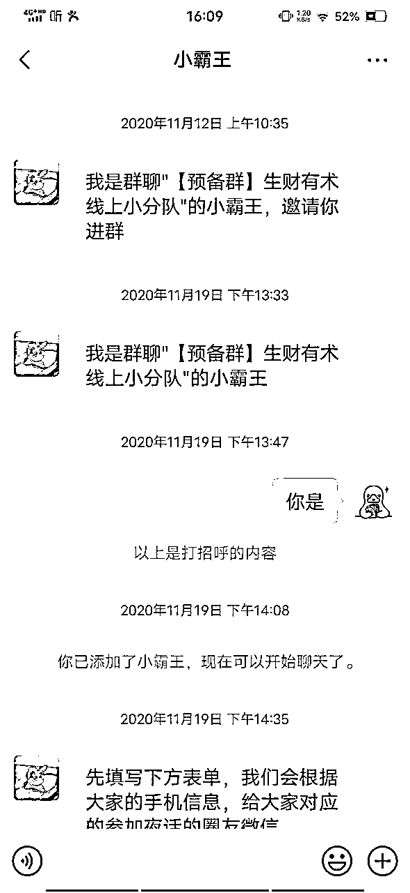

也许后来人只知道参与航海志愿者才是志愿工作，其实，这只是一部分，看看这些你们听过没？

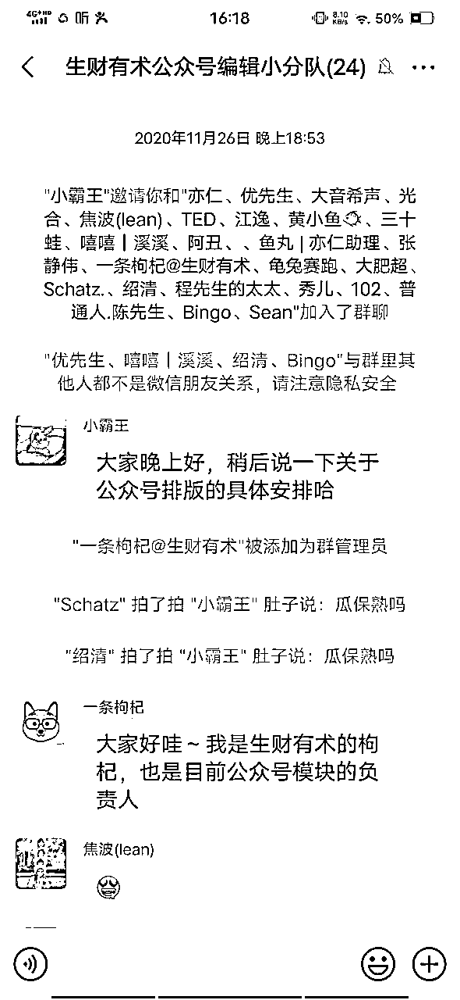

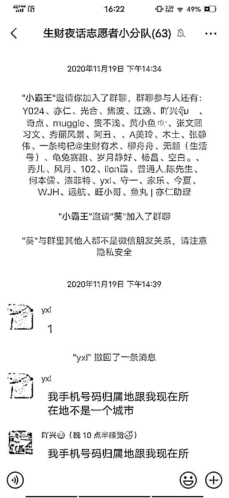

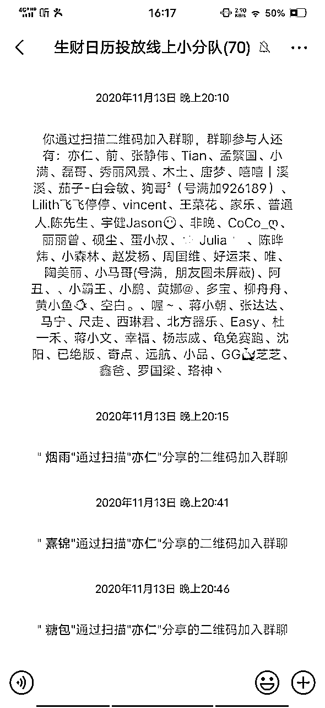

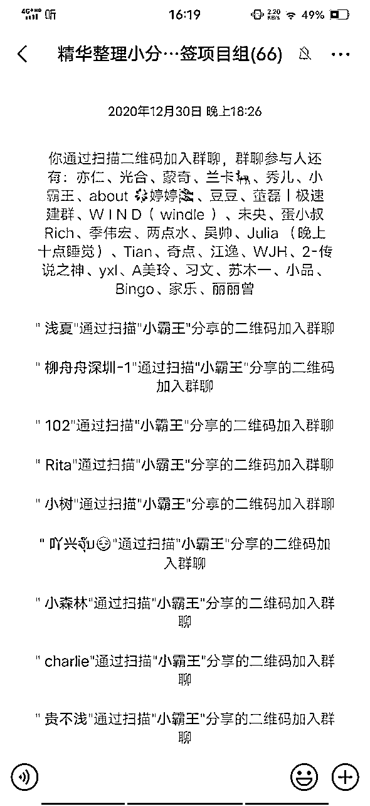

我是第一批参与生财志愿者工作的，当时就是想在做项目之余，多深层了解生财的运作机制及学习社群运营。

慢慢的进入大航海（视频号大航海）、现在的21天机制及续航，还有Mini航海，航海志愿者的工作多起来了，多视角下看看别人如何去做项目，也是一个补充。

慢慢从7-8次志愿者到做了两次领队，都是A以上，就开始成为公众号爆款写作船上的教练了，目前一共参与6期教练志愿工作，收获颇丰。

关于生财志愿者工作的成长体系，蛮有趣的，之前一直没有，我是红利收益者，从最开始的志愿者到领队，再到现在的教练，这本身就是两次的跳跃，成长。

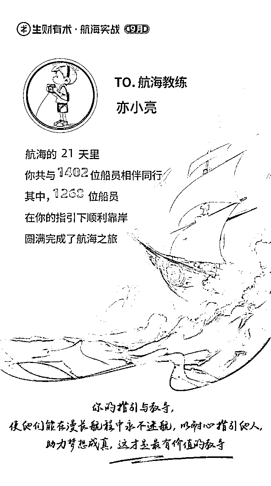

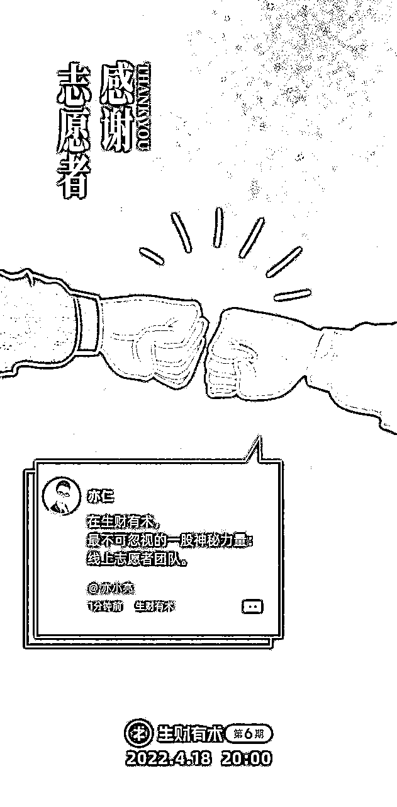

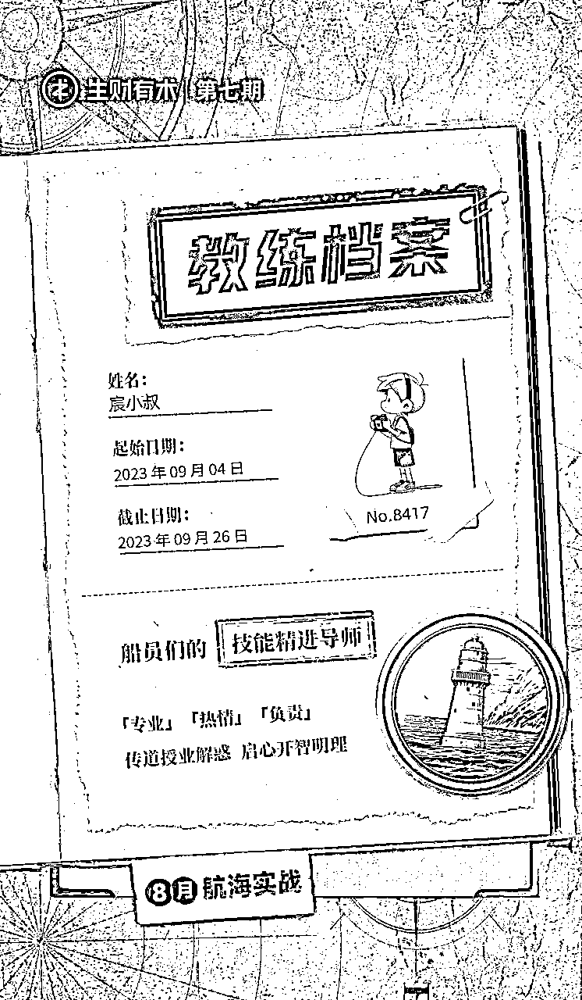

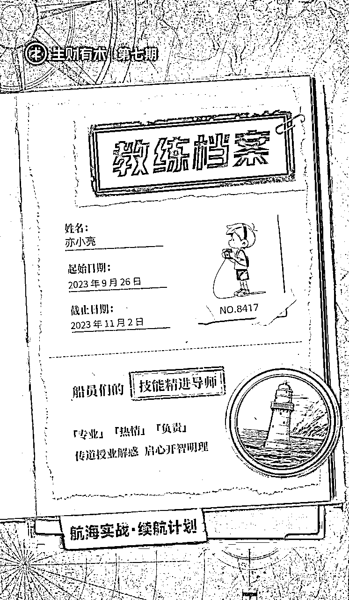

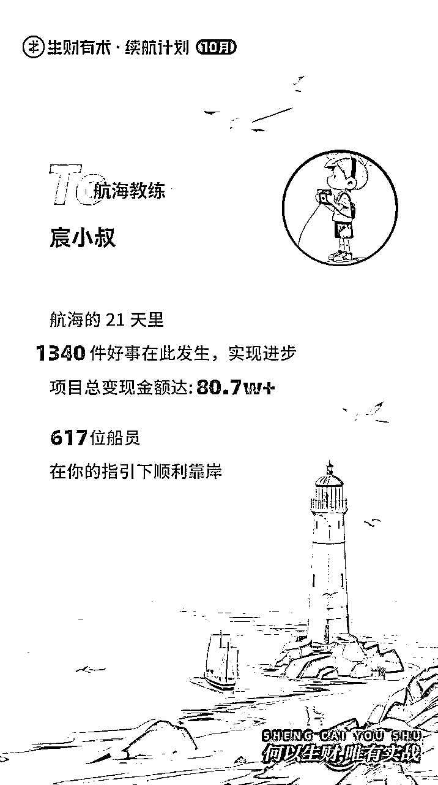

讲完了与航海的故事，还是要讲一下，在做教练期间发现一个问题，对于快上船的船员一些帮助。

因为目前我参与教练的航海是公众号爆款项目，我就从这个项目来谈起：

对于一个项目的认知，其实就是看你的执行动作的分类。

1、很多人喜欢从最简单的方式来做，洗稿。

2、很多人喜欢从最难的方式来做，AI提示词，为什么说最难，因为很多人，都是对AI一无所知，看着好像在做公众号流量主项目，其实，他已经在做别的项目了，写提示词、调试提示词、IP隔离。

3、很多人从最懒的方式来做，别人帮忙提供文章，自己直接发就行了。

仔细想想，是不是发现上面三种，就是三个项目，虽然都是通过流量主收益赚钱，但是玩法不同，难度级别不一样，各种滋味也不同。

三种方式，所用的时间也是不同的，产生的效果当然也不同的。

看着第一种方式省时省事省力，其实后期很难通过平台审核，当然有很多人喜欢用别人的文章去喂AI，让它产生新文章或者类似文章，从而提高原创度，看着似乎还行，听着似乎也行，但是你把时间线拉长一些，你就会明白，其实行不通的，因为你账号如果大多数来自于这样的产文方式，系统会给你打标签的，就是重复的垃圾号。

所以，这种方式渐渐没落了，但是很多人或者相当一部分不死心，因为前期可能洗上一两篇文章，得到了10W，这种投入产出比前期出奇的高，使他失了心智，为了这些高回报敢于犯险，赌博就是这个道理，异曲同工之妙。

第二种方式，其实，不同人做，效果可以说千差万别，你以为搞定AI提示词就搞定了一切，这才是问题刚刚开始，一部分不合格的提示词，或者不能叫不合格，应该叫是给系统看的，不是给读者看的，AI产文最大的敌人就是缺少人性语言，读者读得多了，系统识别得多了，都会对这类文章打标签，你就又要回过头，调试提示词，一遍又一遍，然后，你会发现，你做得项目，就是调试提示词而已。

我见过很多人成功了，也是因为他做这个项目是先搞懂项目的逻辑，而不是上来就加号，矩阵化，加文章，自动化，很多人看似跑通了第一个号，就马不停蹄的说自己跑通了从0到1，其实，这个项目才开始，有一点点收益，是因为多种原因而已，比如新号、热点、关键词踩对了，跟你完全跑通0到1一点关系都没有。

这样的人是最多的，等他上了矩阵化、自动化，然后就讲给别人说，其实，这个项目就是跑概率，号越多，收益就高。

小白们误以为这个项目就是博概率的，刷刷的找亲戚朋友开号，要么自己做，要么交给别人做，自己做，对项目都是一无所知，怎么可能做好，交给别人做，其实，对于项目所带来的收益（就是碰运气啦），除了金钱，他没有一个学到，当然，你会说我就是来赚钱的，我不辩解，因为确实是，时间线拉长，可能他的几十个号，真正入池的就是两三个，最终的收益就是来自这两三个号。

等他跑二三十个号的收益，其实远不如好好运营三四个号的收益。

当然，他们会说，我时间利用率很高效了，我文章10秒一篇，5秒一篇，这个时候，其实你们做的就是两个完全不同的项目了。这点一定要明白。

第三种方式，其实，是最大化利用闲置的号和最忙的人，这个时候的关键点，一定要找经验丰富的人来做，比如他跑通了不少账号，而不是一两个账号，你把号交给后者，大概率的情况下，你的号是死掉了，他回头会给你再次解释，没办法，就是概率的问题，他把所有问题都归结于概率。

当然你也没啥损失，都是亲戚朋友嘛，干嘛计较那么多，于是你不死心，在找号让他做。

这个项目，确实成功需要一些概率，但是概率不是一切问题的解释。

谈了这么多，亮哥，你是怎么做的？​

我是用最笨的方式，先手搓，了解项目的逻辑，爆款逻辑等等，运营一段时间，在结合AI提示词，最后，两个都不用了。

为什么这样说了？​

这里我就提到，我在航海已经说过不下20遍了，每次日志点评的时候，我都会提到，你找到一个领域，先写出来100篇文章出来，比如我写娱乐号，我写了100个明星，大部分是我特别喜欢的，和特别讨厌的，这两种方式，动力都很强，然后我就不在造新轮子了。

每次娱乐圈有新瓜，是关于一个我写过的明星的，我就把之前的文章，略微改一下，基本上都是前面的部分，一般就是10分钟，还有这个明星的新剧，都是这样写出来的。

当然，你说，万一我这100个明星，这短时间没有新瓜，新剧，怎么办？​

我说，这个简单了，有时候，你当时收集的素材不一定很全，偶尔看到一段关于这个明星的不为人知的一段故事，你都可以加进之前的文章在发一遍，你算算，你一篇文章一年发3遍而已，其实也不算高。

每个领域找到100篇文章的方式都不一样，有的根据人物故事，有的根据发生交通事故的数量，有的就是根据这个领域的关键词找不同角度发文，比如一个关键词10篇文章，那么，你就直接找这个领域10个关键词就好了。

我们拿民生细分方向里的交通事故，关键词女司机、大货车、油罐车、鬼探头、自动驾驶、货车盲区、追尾、失控。

其实，还有一类就是跳河跳桥，关键词就是跳河、跳桥、轻生、见义勇为、游泳、等等，这里我就不多举例了。

这个时候，你来看看，这三种方式，到底哪种方式，时间花费最多，效果最差的。

很多事情，把时间线拉长一些，就有答案了。

AI 最大的幻觉是，你以为你可以偷懒。

最后，这些年加入的星球不超过3个，每年都会续费生财有术，这些年赚钱的认知一直在提高，感谢生财有术，感谢亦仁。

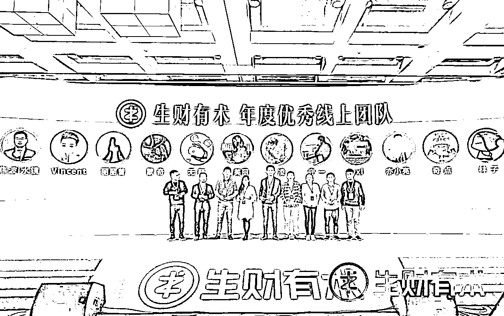