# 为什么我建议你做知乎？双十一带货GMV230000，躺赚3000+，新手小白可实操的经验分享

> 来源：[https://o0sapbae55.feishu.cn/docx/R7mndKmqroBUcnxaWtqcfE6fnCg](https://o0sapbae55.feishu.cn/docx/R7mndKmqroBUcnxaWtqcfE6fnCg)

大家好，我是陈知意，一个全网12W粉丝的全职自媒体人，深耕公众号、知乎、小红书平台。

我从2022年9月开始做知乎，23年的时候开始带学员做知乎变现，一开始只是带大家在知乎实现初级变现，也就是参与门槛很低的活动薅羊毛，做了个初级课程，学费百元，70%学员都赚回了学费，有几位勤奋的学员更是变现了2000多元。

知乎的入门级活动，门槛很低，收入几元到几十元不等，有些活动还能收到知乎平台的周边产品，我有学员参与这样的活动获得了甄嬛传的周边产品、荣耀手环、知乎各种礼盒等等。

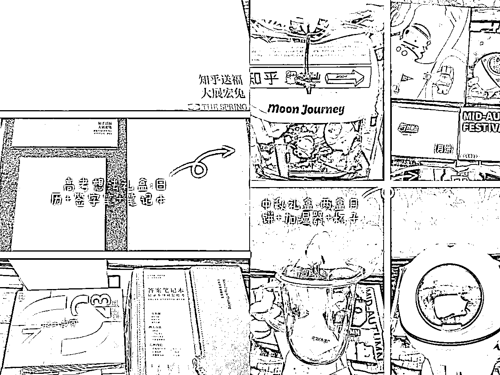

再后来有学员咨询能否跟我学深耕知乎，想做测评博主，于是我开设了知乎高阶变现营，截止到现在，我带的知乎学员总计超过100+，其中30多位学员参与知乎高阶变现营，目前已培养出十来个千粉博主。

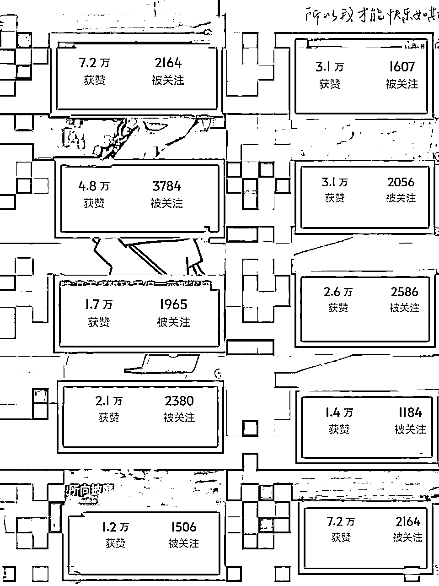

我自己目前知乎矩阵3W粉，收获的稿费+产品价值六位数。从我做知乎博主的实操角度出发，带给大家以下4个方面的分享：

一、知乎双十一带货GMV230000+，我做对了什么

二、怎样写一篇好物带货文章

三、做知乎博主涨粉的三个方法

四、复盘总结

全文5000+字，预计阅读时间8分钟

# 一、知乎双十一带货GMV230000+

双十一终于落幕，昨天算了一下，今年知意双11知乎带货230000+，佣金加奖励有3000。

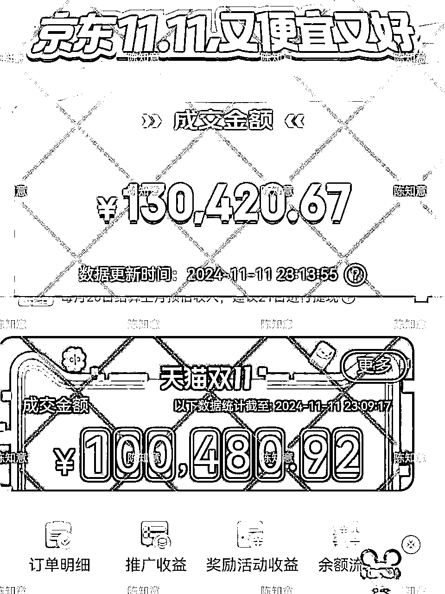

这是单号的收益，我还有一个粉丝8000+的知乎账号，我比较懒，重心也不在这个号上，写了三四篇回答。京东带货12,000，佣金200多。

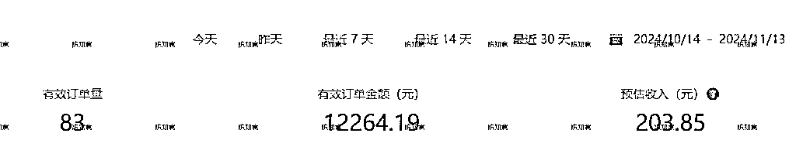

这个账号的淘宝带货，具体数额不知道，因为是用我妈的身份信息开通的，所以自己看不到账号信息，老妈不太会操作，就等过年回家时再看吧，哈哈哈，有多少都是惊喜。

对比去年带货10万的成绩，今年总体来说是有进步的，但还有提升的空间。

今天就来复盘加总结经验，想在知乎带货的朋友一定要点赞收藏，压箱底的干货都拿出来了，哈哈哈。

## 双十一带货我做对了什么？

## 1、赶早发文章

这次双11我有两篇数据还不错的，都是因为发布的时间比较早，抢占了先机。

在国庆假期快结束的时候，我就提醒我的学员们可以去准备双11的文章发布，做好布局。

同时我自己也赶着国庆假期发布了双11的相关文章，这时候发同类型文章的人还比较少，所以就有搜索排名靠前的机会。

能够快速写完双11的文章，也是因为文章里面我推荐的产品都是平时合作的实测产品分享，我只需要把平时写过的产品测评内容精简到几百字，放在文章的推荐产品部分即可。

这样比较节约时间，另外这些产品都是合作的产品，如果通过大促能多带一些货，也能及时给品牌方报喜，拥有更多合作的机会。

## 2、选流量大的题目

想要在知乎获得更多的流量，一定要学会选题，选择流量较大的题目去回答。

一方面可以用知乎的选题工具——吐司。

吐司网址 https://tools.zhihu.com/questionselection/recommend

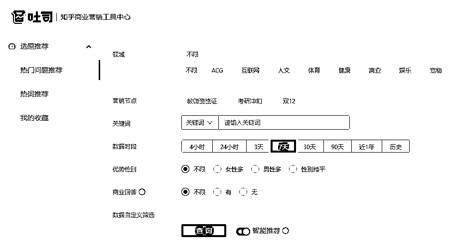

在这里去寻找近期热度比较高，回答人数相对少一些的题目，去回答。

另一方面一定要跟随热榜。

像双11，618，双十二，年货节等等这些大促时节，会有一些题目出现在知乎热榜。

平时多关注热榜，这样我们及时去查看，及时去回答一些流量比较大的题目，就能薅到流量。

这里需要注意：热榜上的题目，维持热度是有一定的时间限制，所以看到题目后一定要尽快回答。

这就是知乎首页 热榜的页面

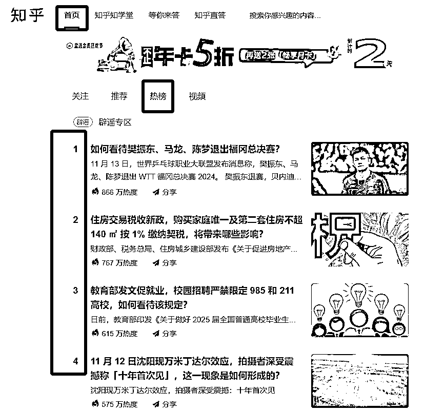

那就需要我们提前准备一些稿件，像双11双十二的这种情况，都尽量能提前备稿是最好的。

这样能最快的抓住热榜机会，也不会耽误自己上班，或者其他日常安排。

## 3、发红包锁单

我为什么比较推荐大家，去抓住双11双十二这种大促的机会呢？

因为这种时间段带货有个好处，就是能够通过发红包来锁单。

也就是说在回答问题时插入这个【红包】，当别人购物时，哪怕没有买你推荐的东西，但是领了你的红包，买其他东西付款时用了你的红包，你就能获得一定的佣金。

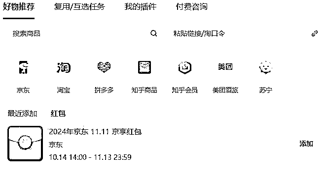

这个红包权限也是需要满足，知乎账号开通5级好物的情况。

接下来我们说说

# 二、怎样写一篇好物带货文章

以此为例：

这是知乎上挂的链接卡片

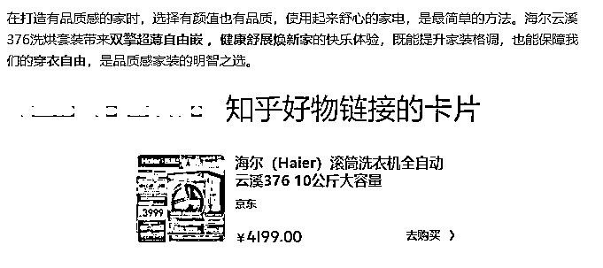

这是别人下单后我获得佣金的界面

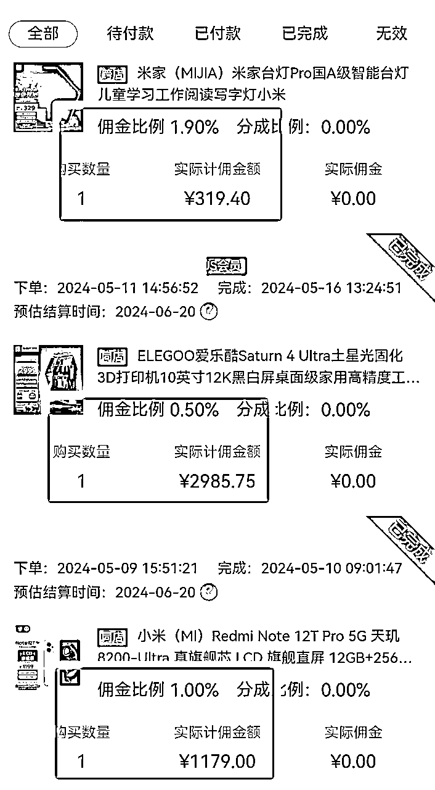

那在知乎上要拥有挂商品链接的权利是有要求的，知乎好物分为三级好物和五级好物。

其中三级好物能够带货的商品是知乎自营的内部产品可选择的品类比较少，也不容易出单。

五级好物能够带货的商品，范围就比较广。比如我们平常购物喜欢用到的京东淘宝，拼多多上的产品，都可以带货，相对容易出单一些。

想要开通5级好物，必须同时满足以下4个条件。

一定要注意避免违规，不然会耽误自己开通好物权限的时间。

## 避免违规开通5级好物权限

尽量关注以下几点注意事项

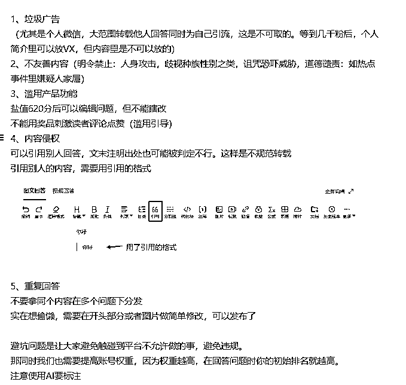

拥有权限之后，将自己的知乎账号绑定【京粉】和【淘宝联盟】APP，就可以开始在文章中或回答中挂上自己的专属商品链接了。

我去年写的文章，今年还在时不时出单。

也就是说，只要写下的这篇文章不删除，他就有一定的曝光机会，当有需要的人看到之后，购买了商品我就能获得收益。

之前有跟大家分析过主动收入和被动收入，做知乎好物带货就是能产生被动收入的渠道。

比如这次618活动期间，我的后台有一个比较大的单子有人买了1万多块钱的相机，我能获得的佣金是100多元。

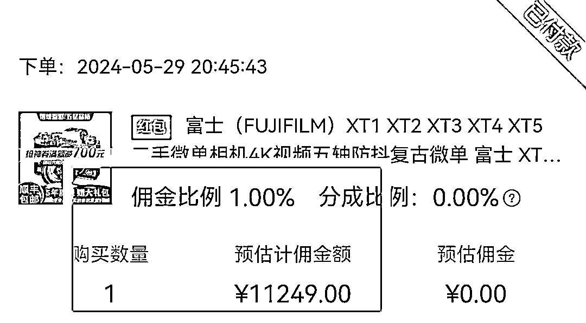

没费什么功夫就能赚到这笔钱，还是挺不错的了。

平时知乎好物给我带来的带货佣金一个月有几百元，像618双11双十二等这样的活动时期，能带来上千元的收益。

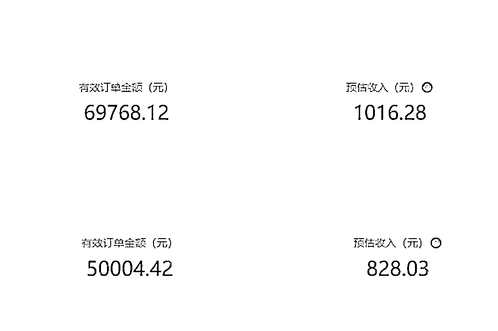

对咱们普通人来说，搞副业被动收入能获得几百元上千元，也挺不错滴。

拥有五级好物权限之后，除了能够自己写文章或回答来进行带货，还有机会接商单。

有很多品牌方需要推广他的产品，就会来找你合作。

比如我接一个冰雾扇的合作，产品加稿费的形式。

品牌方把合作要求发给我，我来写这篇文章，通过品牌方审核之后，发布在我的知乎账号上即可。

但一定要注意是需要挂好物链接的，就是合作的这个商品的链接。

再比如我有学员最近接到了代发的合作，这样的合作形式更简单。

品牌方来提供文案，他只需要把这个文案复制粘贴发布到自己的账号上即可。

千粉一篇100元，合作两篇，赚点零花也是蛮简单的。

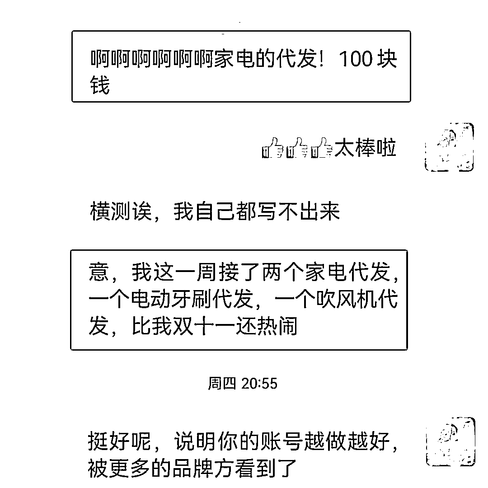

这一切的前提就是要开通知乎五级好物的权限。

## 如何写一篇好物推荐文章

01了解产品详情

先弄清楚这个产品是卖给谁的，有什么特性，有什么主打卖点。

想要把产品卖给别人，肯定是要讲清楚它的功能，它能帮我们做什么事。

02代入真实场景

结合自己的生活场景，代入去写更真实。

比如一个耳机，我买它就是很看重它的颜值，喜欢戴它出去拍照，拍照很出片儿。

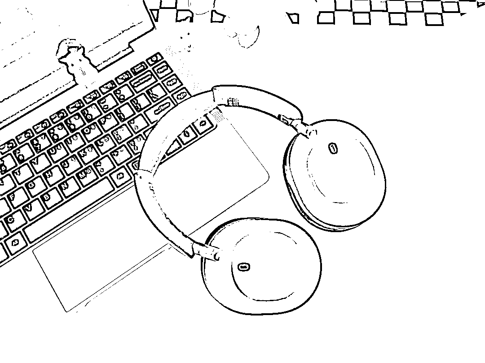

这样去写就显得更加真实，而不是一直夸这个耳机颜值高，但没有实质代入的场景。

真实代入生活使用场景，更容易让人产生购买欲望。

ps：这是我最近合作的很喜欢的一副耳机，做知乎之后实现小家电数码产品自由，太幸福了。

下面这些都是做知乎为我带来的数码小家电产品

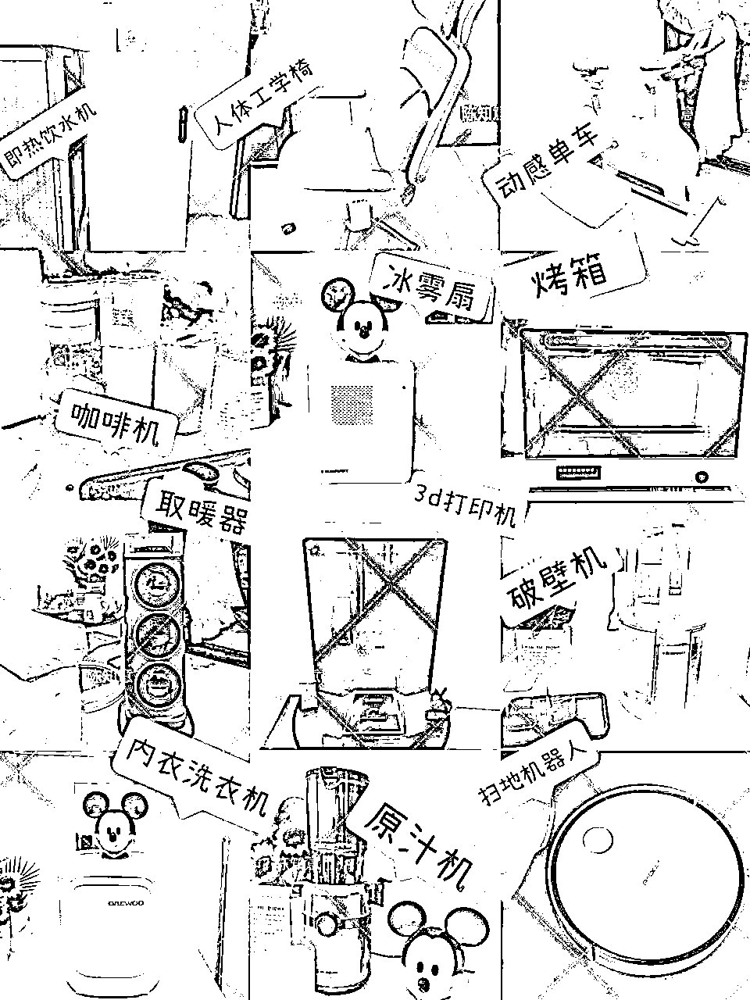

03多写

对于新手来说，想通过写一两篇文章就在知乎上开单是很难的。

当然找对方法，把握住类似618这种大促的时机也是有机会的。

就像我的合伙人浅浅，运用了我分享给私教学员们的私密涨粉方法，不仅实现被动涨粉，而且还写出了几十万浏览量的文章，一篇文章在21天内带货gmv25000+！

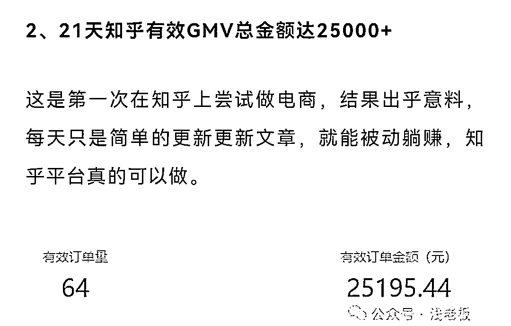

但是如果没有一些特殊的方法，自己去写好物推荐文章，那建议一定要多写。

当然多写也不是去“水”文，也需要用心，推销产品是真实代入自己的使用场景（重要的话说三遍，哈哈哈），这样更容易出单。

如果你没有专门去学习写作的方法，那么按照我说的方法，先去写个百八十篇的也是有机会出单的。

如果你按照我的方法去写了百八十篇不出单，那欢迎你来找我，我免费帮你看号一次~

当开通了知乎好物的权限之后，插入链接的方法也分享给大家。

## 插入链接方法

之前有人告诉我，他直接把商品链接复制粘贴发布在知乎上，被人举报导致账号违规，这样是不可行的。

可行的操作方法，我用这张图来表示，这是电脑版的页面，找到【钱袋子】，搜索你要带货的商品，点添加即可。

然后会出现下面这个页面

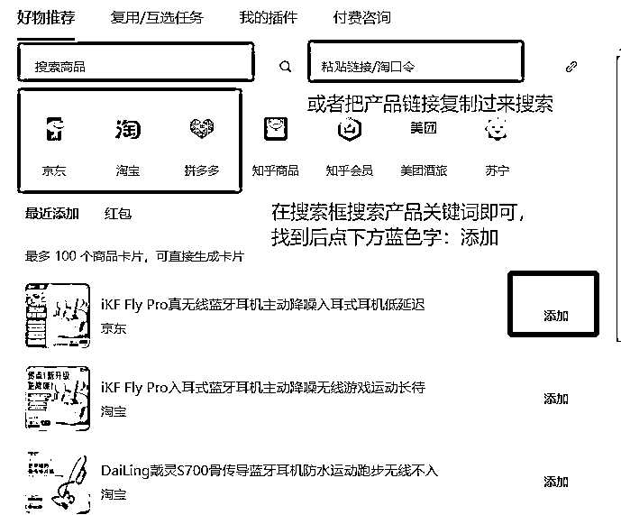

把产品链接添加进自己写的好物文章里，有人通过你的文章购买产品，就能获得一定的带货佣金了！

学会知乎好物的玩法，给自己开辟一个被动收入的渠道，也是很香的。

# 三、做知乎博主涨粉的三个方法

知乎平台的回报率还是比较高的，打造一个千粉账号后，就有机会接到基础的合作，当然，万粉合作大牌产品的机会会更多。

在知乎涨粉的方法很多，其实各个平台的涨粉逻辑，无非出于这三个方面：干货价值、情绪价值、时间价值。

这里举例3种

### 1、分享人生经验哲理

比如这样的人生道理的题目，很多人关注，浏览量也很高。

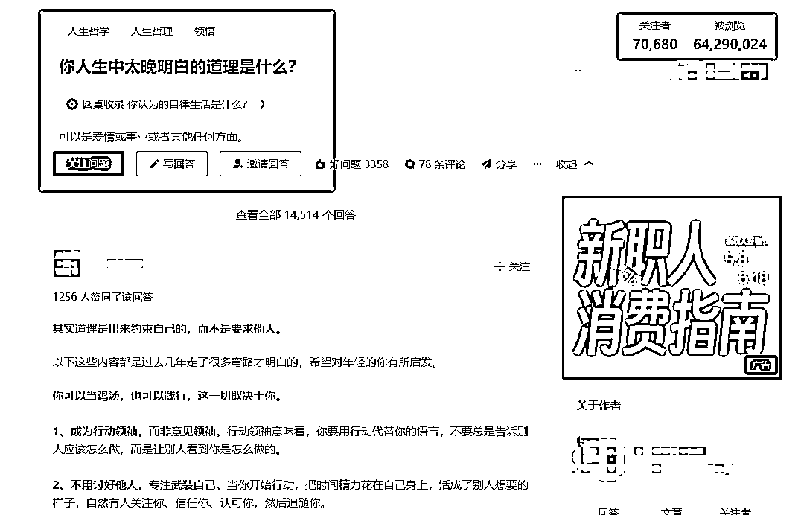

我们可以去其他平台整理一些人生哲理，来回答这个问题，文末注明：侵删致歉。

也可以平时收集一些名人名言的金句，比如罗翔老师、人民日报的金句，整合一下来回答这样的问题。

出高赞之后，你就能享受到一天涨粉大几百上千粉的快乐了。

切记：如果用AI创作，一定要注明是AI生成的，系统会查出来的。

### 2、追热榜，写娱乐明星或者时事

以电脑端为例，打开【创作中心】——【近期热点】还有【潜力问题】里面搜索自己可以回答的问题，一定要快，热榜的热度也不是一直有，所以发现是热榜上的问题尽快回答，才能获得更多流量。

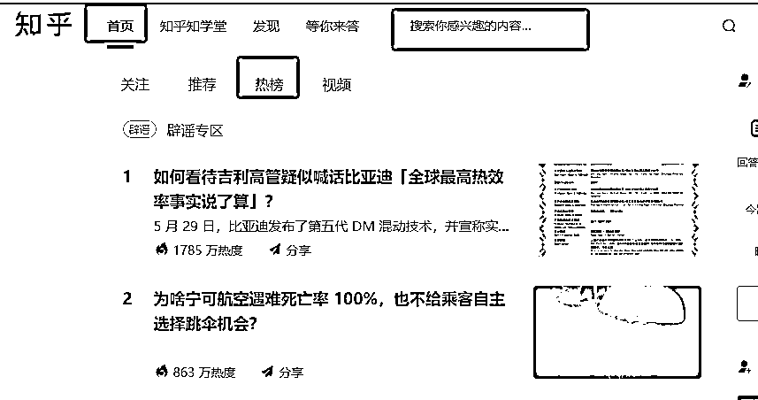

这时做好自己的人设，每篇回答下都带上自己的人设，更容易吸粉。

除了在热榜寻找话题，搜索框也是有热度的问题。具体方法：打开电脑知乎pc端，有一些问题滚动，这也是潜力热榜问题，这类型问题容易得到更多流量，也更容易曝光。

写这方面内容尽量不要太过带入个人情感色彩，避免有人看你观点太过激进招骂（只是提个醒，知乎的整体使用人群素质还是比较高的）

写娱乐明星或者时事方面的内容，在知乎获得的自然流量比较大。

这个方法能涨粉的原理在于： 提供了情绪价值。

### 3、非原创方法

比如说整理分享，在知乎上找到切题的内容，把你整理的内容发布上去，也能获得流量。一定要备注好：图文源自网络，侵删。避免侵权问题。

具体做法：在知乎/小红书上找一些句子/文案的题目，把你整理的内容发布上去，也能获得流量。一定要备注好：图文源自网络，侵删。避免侵权问题。

其实这个方法，在很多平台都是通用的，大家回想一下，看小红书的时候有没有看到这样的发疯语录？流量普遍都嘎嘎好。

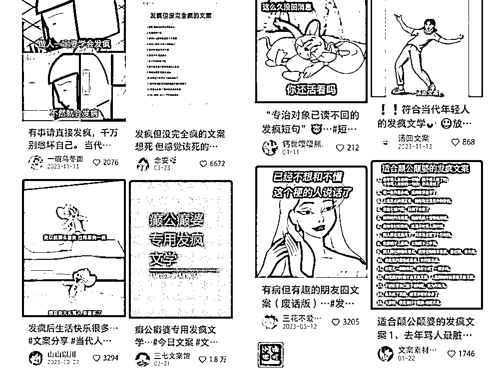

这个方法能涨粉的原理在于： 提供了情绪价值。

无论在哪个平台上，语录/文案，都是自带流量的内容方向。再发散思维一下，在小红书/抖音/快手/微博等平台，这个方法涨粉都是很有效的。前两年有很多人就是靠这个方法在抖音快手上吸粉几十万，上百万的。

最近我也在研究知乎其他的方法涨粉，自己也实验了，效果还不错，其实涨粉方法很多，找到适合自己的，去深耕总能出成绩，重点是要坚持。

# 四、复盘总结

感兴趣的伙伴都可以去行动起来，我分享的实操还是比较实在的，可实操落地性很强。

之前就有小伙伴跟我说，她通过我公众号分享的参与知乎有奖活动的玩法，已经开始收到盐粒奖励了。有收获我就很开心啊~

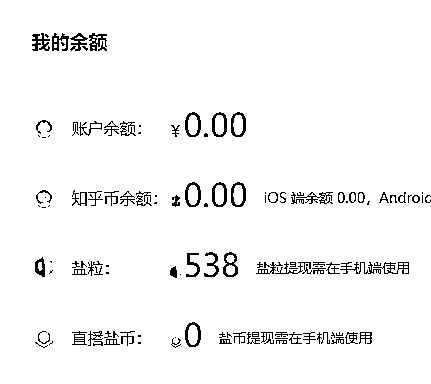

别小看几块钱，大家都是从一块钱赚到一百块，再赚到一千块，一万块，十万块的。

回归正题，最终的带货效果，和我们账号粉丝量，账号的权重也有密切的关系。

同样的粉丝量，账号权重越高，在同样的问题下，排名就越靠前，曝光量越大。

所以提高账号权重，涨粉也是非常关键的，想在知乎做带货，也要尽量提升自己的粉丝量。

想要给自己的知乎账号涨粉的伙伴，欢迎来找我免费领取一份知乎涨粉的秘籍。

今年双十一带货虽然比去年是有进步，但在我看来，有两个方面需要提升，一方面京东带货没有我预期的那么好，另一方面佣金比例不够高。

一个一个来分析，其实在双11开始的7天內，我的京东带货数据就已经超过了6万。

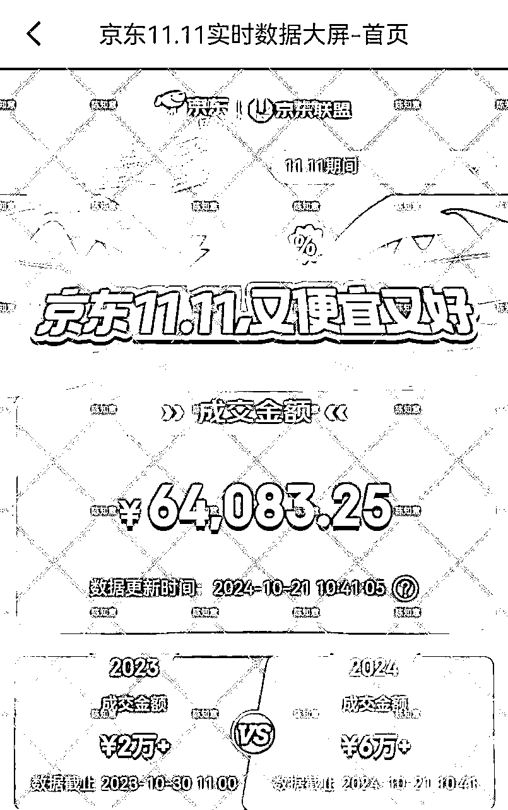

但这次不太走运，京东经历了“杨笠”事件，后续有不少退单的，带货趋势没有明显上升。

所以截止11月11日晚，我的京东带货总数据是13万多，比我预期的要差。

对比起来淘宝活动开始时间比京东要晚几天，包括我发淘宝红包的时间也要晚一些，但在较短的时间内，淘宝带货数据能达到10万，增长速度上是比京东要快的。

但这是客观原因，我也无法控制，就不过多纠结了。

另一方面，佣金比例。

这次带货的很多产品，佣金比例不是特别高，0.1% ，1%的比较多，所以20多万GMV，带货收益3000多。

要知道平时很多时候带货一个小家电佣金至少十几块，如果是合作的产品有定向佣金，佣金可以达到三四十，一百多。

所以为了改善这种情况，后续在账号的布局上，还是要多去写一些佣金比例高的小家电产品。

这样同样是卖1000块的产品，佣金50块就比佣金20块的，要划算很多。

就像下面这个合作的产品，佣金比例20%，带货一台佣金有150+，还是很香的。

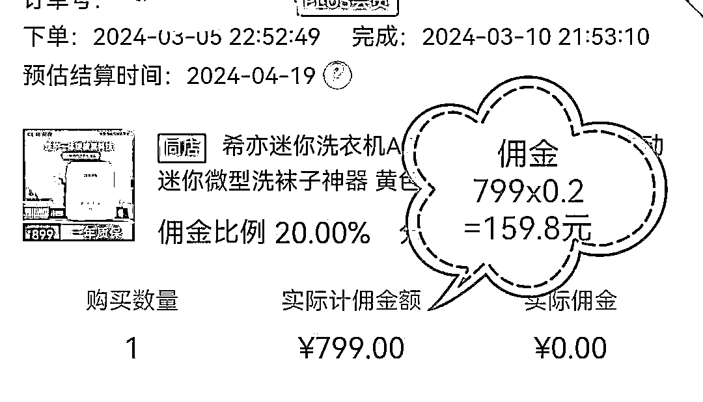

不过总体来说，这次带货是有进步的，我也采用了一些新方法，带动了几个w的GMV，不断去尝试新方法，也是我不断进步的法宝。

不完美是很正常的，都是在不断的复盘当中不断的去纠正方向，提升自己。

所以我也不会过分苛待自己，知道进步的空间在哪里，朝着对的方向去改进，不断完善自己就好。

也送给屏幕前的你，尝试改变这件事，开始是最关键的。

先完成，再去完美。哪怕是一个不完美的开始，

也胜过一百次审慎的纸上谈兵。

一个粗糙的开始，就是最好的开始，不要等待一切准备完美了，再去做。

干的慢总比什么都没有干要好的多，共勉~

一起在自媒体这条路上继续探索吧，欢迎和我交朋友~