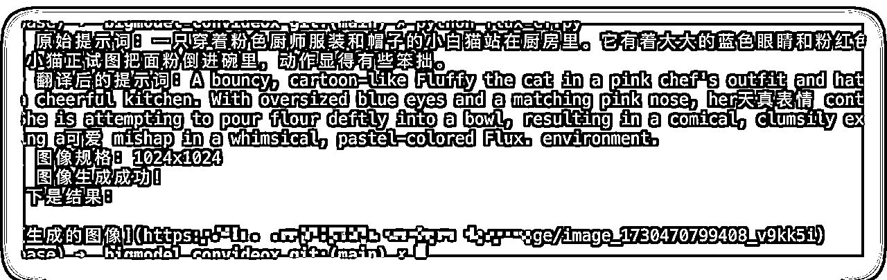
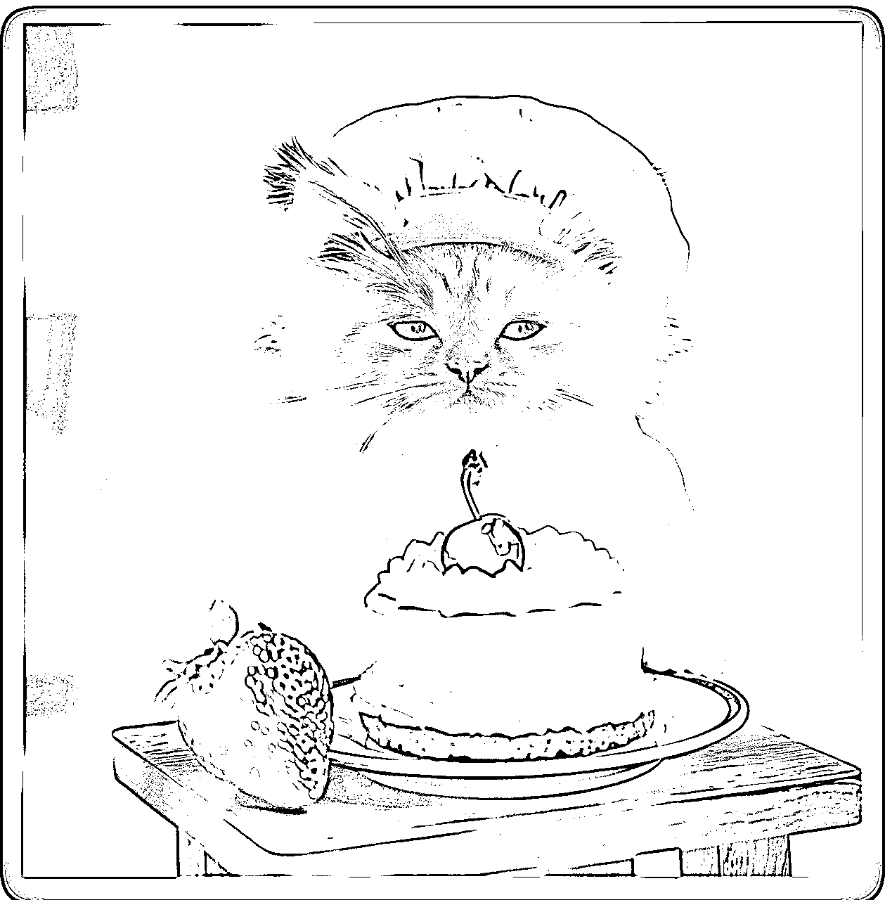

# 第二弹：生成 Shorts原创视频

> 来源：[https://y3my0b87ql.feishu.cn/docx/RA0mdDv2mo76PJxtGS8c2onynsd](https://y3my0b87ql.feishu.cn/docx/RA0mdDv2mo76PJxtGS8c2onynsd)

来了～ 基于上一篇文章的思路。有了一个大概的风格，讲出一个新的剧本和故事，产出一个完全新的不一样的原创视频。

老规矩，文末有成品视频，没有精挑细选的，一次生成的，如果继续调教下，效果可提升。

2 个思路：

第一，原创是视频主体(不是主题)。可以理解为主角，猫、狗，超人等。就是把原始视频，每个视频的片段，解析出来就成了文字，作为视频脚本。通过把这个视频脚本，生成一个新的视频脚本，视频脚本格式需要拆分为独立的若干个片段。这样就保证了每一个片段，每一个6秒钟的视频长度的脚本内容。最后合并为一个新的视频+音频。

第二，原创视频的脚本（剧本和故事）。直接不用之前的了，直接用 AI 生成一个视频脚本，脚本分为若干个片段，然后用每个片段来生成一个视频。然后把这些视频组合起来就可以了。

BMG也可以更换为原创，个人建议用 sono

这里有个坑，如何保证每一个片段的任务主题都是一样的？需要注意下，具体看文中。

# 思路 1：视频解析与脚本生成

实现第一个思路：

就是把原始视频，每个视频的片段，解析出来就成了文字，作为视频脚本。通过把这个视频脚本，生成一个新的视频脚本，视频脚本格式需要拆分为独立的若干个片段。这样就保证了每一个片段，每一个6秒钟的视频长度的脚本内容。最后合并为一个新的视频+音频。

之前的教程已经可以解析视频的文本，需要把这个文本清洗一下

这里用这个视频举例。

用提取视频的脚本；得到视频的脚本内容。时间间隔是 1.5s 一个图片素材。

```
0,http://xxxx.com/video_frames/frame_0000_1730469319.jpg,这幅图画的幽默之处在于一只小猫穿着人类的衣服和帽子，看起来像是在烘焙。它那双大大的、闪闪发光的眼睛和它试图把面粉倒进碗里的滑稽动作，创造了一个异想天开和可爱的场景。一只猫进行人类活动的想法本身就很有趣，而小猫脸上的天真快乐更增添了这幅画轻松愉快和诙谐的本质。
1,http://xxxx.com/video_frames/frame_0001_1730469319.jpg,这张图片描绘了一只穿着粉色厨师服装、头戴着粉色厨师帽的小白猫在厨房里烘焙的场景。这只小猫有着大大的蓝色眼睛和粉红色的鼻子，它的表情看起来非常开心。它正用爪子拿着一个鸡蛋，似乎是在准备把鸡蛋打到面前的碗里。碗里已经有一个完整的蛋黄了。桌子上撒满了面粉，旁边放着一瓶牛奶和一些散落的蛋壳。整个场景给人一种温馨又有趣的感觉。
2,http://xxxx.com/video_frames/frame_0002_1730469319.jpg,这张图片非常有趣，因为它展示了一只穿着粉色围裙和厨师帽的小猫在厨房里。这只小猫有着雪白的毛皮、明亮的蓝色眼睛和粉红色的鼻子，它的爪子正放在一个装有鸡蛋的碗上，好像它正在准备烘焙。周围散落着面粉和几个蛋壳，增添了滑稽的混乱感。此外，小猫那双大而圆的眼睛和微笑给人一种它对烹饪充满热情的印象，即使它还只是个孩子。
3,http://xxxx.com/video_frames/frame_0003_1730469319.jpg,这张图片中的幽默元素来自于一只小猫参与人类烘焙活动的荒谬性。看到这只穿着粉色厨师服的小猫用电动打蛋器搅动蛋糕糊，仿佛它真的在烹饪一样，这一幕非常有趣。小猫脸上那类似人类的快乐表情增加了喜剧效果，因为它似乎对自己的烘焙工作感到自豪。厨房中被打翻的面糊和混乱的场景也增强了这幅画的诙谐感。
4,http://xxxx.com/video_frames/frame_0004_1730469319.jpg,这幅图中的幽默元素在于一只小猫正在烘焙蛋糕的场景。小猫穿着厨师服装，戴着粉色帽子，围着粉色围裙，它正用爪子拿着一个杯子往蛋糕模具里倒东西，这很有趣，因为猫通常不会做这样的事情。此外，厨房里一片混乱，面粉散落一地，蛋糕糊也洒了出来，增加了喜剧效果，暗示这只“小厨师”可能不太熟练。
5,http://xxxx.com/video_frames/frame_0005_1730469319.jpg,这幅图片的幽默之处在于一只小猫穿着人类的衣服和帽子，扮演着厨师的角色。小猫从烤箱里拿出一个蛋糕的场景很有趣，因为猫通常不会做烘焙，也不会使用烤箱。此外，小猫那双大大的、闪闪发光的眼睛以及它试图保持平衡在托盘上的样子增加了喜剧效果。
6,http://xxxx.com/video_frames/frame_0006_1730469319.jpg,这张图片的幽默之处在于一只小猫穿着人类的烘焙服装，戴着厨师帽和围裙，正用挤花袋在蛋糕上挤奶油。小猫那双大大的、无辜的眼睛和它试图保持专业烘焙姿态的努力形成了鲜明的对比，而实际上它的爪子却笨拙地悬在蛋糕上方，这增加了喜剧效果。此外，小猫嘴边沾着的奶油暗示了它可能已经偷偷品尝了一些蛋糕，这进一步增强了整个场景的诙谐性。
7,http://xxxx.com/video_frames/frame_0007_1730469319.jpg,这张图片描绘了一只穿着粉色围裙、戴着粉色厨师帽的白猫，它有着引人注目的蓝色眼睛和粉红色的鼻子。这只小猫正用一只爪子拿着银色的叉子，似乎正在品尝一块放在木制砧板上的蛋糕。蛋糕看起来是黄色和白色的，可能是香草或柠檬口味，中间夹有粉色的奶油或糖霜。背景是一个温馨的家庭厨房，可以看到一些厨房用品。整个场景给人一种可爱和甜蜜的感觉。图片下方还有“Cute Cat Games”的字样。
8,http://xxxx.com/video_frames/frame_0008_1730469319.jpg,这幅图片描绘了一只穿着粉色厨师服装和帽子的白色小猫坐在桌子旁，它闭着眼睛微笑，用叉子吃着一块装饰精美的蛋糕。蛋糕上面有白色的奶油霜和一颗草莓。桌子上还放着一个完整的草莓。背景模糊不清，但似乎是一个室内环境。整个场景给人一种温馨、愉快的感觉。此外，图片下方有一行水印文字“Cute Cat Games”，表明这张图片可能与某个游戏或品牌有关。
```

用 GPT-4o 的 API 接口清洗一下, 7个视频的素材就有了；

```
# Start Generation Here
import requests
import json

def custom_openai_gpt4(prompt, api_key, api_base, model_name):
    headers = {
        "Content-Type": "application/json",
        "Authorization": f"Bearer {api_key}"
    }

    data = {
        "model": model_name,
        "messages": [{"role": "user", "content": prompt}],
        "temperature": 0.7
    }

    response = requests.post(f"{api_base}/v1/chat/completions", headers=headers, data=json.dumps(data))

    if response.status_code == 200:
        return response.json()['choices'][0]['message']['content']
    else:
        return f"Error: {response.status_code}, {response.text}"

def main():
    # Example usage
    api_key = "sk-xxxx"
    api_base = "https://xxxxx"  # Replace with your custom API endpoint
    prompt = """需要清洗的内容，放在这里 xxxx"""
    model_name = 'claude-3.5-sonnet'

    result = custom_openai_gpt4(prompt, api_key, api_base, model_name)
    print(result)

if __name__=="__main__":
    main()
```

```
画面1：一只穿着粉色厨师服装和帽子的小白猫站在厨房里。它有着大大的蓝色眼睛和粉红色的鼻子，表情天真快乐。小猫正试图把面粉倒进碗里，动作显得有些笨拙。

画面2：小猫用爪子拿着一个鸡蛋，准备打进碗里。碗中已经有一个完整的蛋黄。桌子上撒满了面粉，旁边放着牛奶和蛋壳。

画面3：小猫正在用电动打蛋器搅动蛋糕糊，脸上露出自豪的表情。厨房里一片混乱，面糊洒得到处都是。

画面4：小猫小心翼翼地往蛋糕模具里倒入面糊，但显得不太熟练，造成更多混乱。

画面5：小猫戴着隔热手套，正从烤箱里取出新鲜烤好的蛋糕，努力保持平衡。

画面6：小猫拿着挤花袋，试图在蛋糕上装饰奶油。它的爪子笨拙地悬在蛋糕上方，嘴边还沾着些许奶油。

画面7：最后，小猫坐在桌旁，闭着眼睛幸福地品尝自己制作的蛋糕。蛋糕上装饰着奶油霜和一颗草莓，旁边还放着一个完整的草莓。
```

这个坑就是，需要保持后面的每个场景都是用的一致性的图片，相关联。需要生成一个 base 图片。

还记得我之前分享的 CF-flux么？

可以用上了，只需要把关键的部分，model_name 和其他几个修改自己的内容即可。如下

```
def main():
    # Example usage
    api_key = "sk-12333"
    api_base = "https://flux.xxxx.workers.dev"  # Replace with your custom API endpoint
    prompt = "一只穿着粉色厨师服装和帽子的小白猫站在厨房里。它有着大大的蓝色眼睛和粉红色的鼻子，表情天真快乐。小猫正试图把面粉倒进碗里，动作显得有些笨拙。"
    model_name = 'FLUX.1-Schnell-CF'

    result = custom_openai_gpt4(prompt, api_key, api_base, model_name)
    print(result)

if __name__=="__main__":
    main()
```

出来一个 base 图片。





flux 出来质量就是高。

根据这个 base图片，生成视频片段。

用每一个 base 图片，加上面提到的提示词。就可以完成一小段 6s 的视频。

参考第一个教程的和这个片段，下面是核心代码。

```
def main():
    base_prompt = '一只穿着粉色厨师服装和帽子的小白猫站在厨房里。它有着大大的蓝色眼睛和粉红色的鼻子，表情天真快乐。小猫正试图把面粉倒进碗里，动作显得有些笨拙。'
    base_img = 'xxx'  # 刚刚生成的base 图片
    video_id = generate_video(base_prompt, base_img)

if __name__=="__main__":
    main()
```

可以自定义视频的：光线和细节随机变化以增加原创性。

```
amera_movements = [
    "镜头平移",
    "推近",
    "拉远",
    "升降拍摄",
    "摇摄",
    "跟随拍摄",
    "手持拍摄",
    "无人机航拍"
]

shot_types = [
    "大全景",
    "中景",
    "近景",
    "鸟瞰视角",
    "跟随视角",
    "鱼眼效果"
]

lighting_effects = [
    "自然光",
    "丁达尔效应",
    "柔和散射",
    "硬光直射",
    "逆光剪影",
    "三点布光"
]
demo_prompt = f"镜头{random.choice(camera_movements)}, {random.choice(shot_types)}，{random.choice(lighting_effects)} ，一只性感猫妈妈一只可爱毛茸茸的小猫，小猫在用猫妈妈的化妆品在给自己化妆，前景是从门的方向看到的视角，背景是化亮色妆镜前面，场景家居卧室环境，氛围开心欢快"
demo_iamge = ""
```

# 思路 2：新的剧本和故事

用ai 生成一个剧本和故事。下面是生成的每一个片段视频的素材的提示词。

```
random_animal = '可爱的小猫' # 其他主体，狗，猫 马 都行
base_prompt = f"""# context
创作 YouTube Shorts 视频片段的脚本概述，专门针对美国儿童观众

# object
用{random_animal}生成一个简短、吸引人且适合儿童的 YouTube Shorts 视频片段的脚本概述，需要 6～10 个镜头的概述，每个概述的 100～200 左右，必须为中文。

# style
可爱、活泼、富有想象力

# tone
友好、温暖、充满乐趣

# audience
美国儿童，大约 3-6 岁

# response
输入格式为：镜头 1：xxx，
镜头 2：xxx
镜头 3：xxx
镜头 4：xxx
等
"""

# Start Generation Here
import requests
import json

def custom_openai_gpt4(prompt, api_key, api_base, model_name):
    headers = {
        "Content-Type": "application/json",
        "Authorization": f"Bearer {api_key}"
    }

    data = {
        "model": model_name,
        "messages": [{"role": "user", "content": prompt}],
        "temperature": 0.7
    }

    response = requests.post(f"{api_base}/v1/chat/completions", headers=headers, data=json.dumps(data))

    if response.status_code == 200:
        return response.json()['choices'][0]['message']['content']
    else:
        return f"Error: {response.status_code}, {response.text}"

def main():
    # Example usage
    api_key = "sk-xxxxx"
    api_base = "https://xxxx"  # Replace with your custom API endpoint
    prompt = base_prompt
    model_name = 'claude-3.5-sonnet'

    result = custom_openai_gpt4(prompt, api_key, api_base, model_name)
    print(result)

if __name__=="__main__":
    main()
```

生成的结果：

```
以下是一个适合美国3-6岁儿童观看的YouTube Shorts视频脚本概述，主题是可爱的小猫：

镜头1：一只毛茸茸的橘色小猫咪正在阳光明媚的客厅里玩耍。它好奇地看着周围，大眼睛闪烁着调皮的光芒。突然，它注意到了一个神秘的纸箱子。

镜头2：小猫咪蹑手蹑脚地接近纸箱，竖起耳朵仔细聆听。它用爪子轻轻地拍打箱子，然后突然跳了进去！镜头对准箱子，我们听到里面传来沙沙声。

镜头3：哇！小猫从箱子里跳出来，它变成了一只威风凛凛的狮子！（其实是戴着一个毛茸茸的狮子鬃毛发箍）它开始在房间里自豪地踱步，假装自己是丛林之王。

镜头4：小狮子猫来到一面镜子前，看到自己的倒影。它惊讶地张大嘴巴，然后开始做各种滑稽的表情，逗得观众咯咯笑。

镜头5：突然，一只毛线球从画面一侧滚过。小狮子猫立刻被吸引住了，它蹲下身子，准备扑向毛线球。它的尾巴兴奋地左右摇摆。

镜头6：小狮子猫一个飞扑，但毛线球滚得更快！它追着毛线球满屋子跑，最后被绕得晕头转向，一屁股坐在地上，困惑地歪着头。

镜头7：这时，一只温柔的手出现，摸了摸小狮子猫的头。小猫咪舒服地眯起眼睛，开心地咕噜咕噜叫。它摘下狮子发箍，又变回了那只可爱的小橘猫。

镜头8：视频以小猫咪对着镜头眨眼睛、伸出小舌头舔爪子的可爱画面结束。它似乎在说："再见啦，小朋友们！"
```

# 

这个是不是每个片段的视频的提示词，熟悉不？

调用之前的生成视频的脚本即可。

# 最终成果

第一个视频，和原始的视频东西差不多，但是质量一般般～。改进点就是提示词优化，CO-STAR 法则优化～

第二个视频有点粗糙，主体和动作+背景的提示词还需要完善，happy weekend ~

思路 1：视频

思路 2: 最终的视频

下面是 1.0 和 2.0

2.0 的视频：

贵一点，但是质量好多了，下面一个 2 只猫购物的一个场景吧。 （最后一个镜头没有加上，生成的视频漏了）

TODO: 其他都是全流程一键生成，2 个优化点的地方（可以继续迭代）：第一个是下面的镜头的提示词，可以细化，第二个是视频模型。

对于视频模型思路：对于视频的我都经验太少，用了国内的，质量不太行，尤其是免费的，可以试试国外的，或者去 HG 上找一些比较好的模型，然后购买 API 付费模式即可。

```
好的,我来为您创作一个适合3-6岁美国儿童观看的YouTube Shorts视频脚本概述,主题是两只可爱的白猫去购物。以下是6个镜头的概述:

镜头1：(特写+正面+柔和自然光) 两只毛茸茸的白色小猫咪 (大眼睛,粉嫩鼻子) 好奇地望着镜头 + 猫咪家里的猫窝 (温馨舒适) + (充满期待的氛围)

镜头2：(中景+侧面+明亮日光) 两只小白猫 (戴着迷你背包) 蹦蹦跳跳地走在人行道上 + 阳光明媚的街道 (绿树成荫,鸟儿歌唱) + (欢快愉悦的氛围) 

镜头3：(全景+俯视+柔和室内光) 两只小白猫 (东张西望) 走进一家玩具店 + 琳琅满目的玩具店 (五颜六色的玩具,各种形状大小) + (好奇兴奋的氛围)

镜头4：(特写+正面+聚光灯) 一只小白猫 (眼睛闪闪发光) 用爪子轻拍一个毛绒老鼠玩具 + 玩具店的架子 (摆满各种动物玩具) + (惊喜欣喜的氛围)

镜头5：(中景+侧面+温暖光线) 两只小白猫 (小心翼翼地) 用嘴叼着购物袋走出商店 + 商店门口 (阳光洒在地上) + (满足自豪的氛围)

镜头6：(特写+俯视+柔和夕阳光) 两只小白猫 (依偎在一起) 躺在猫窝里玩新买的玩具 + 温馨的家 (窗外夕阳西下) + (温馨幸福的氛围)
```

over~ 今天你发视频了么？