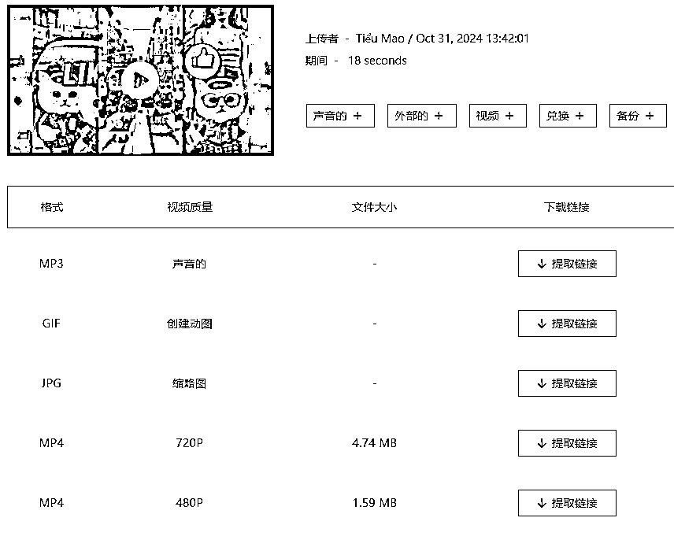
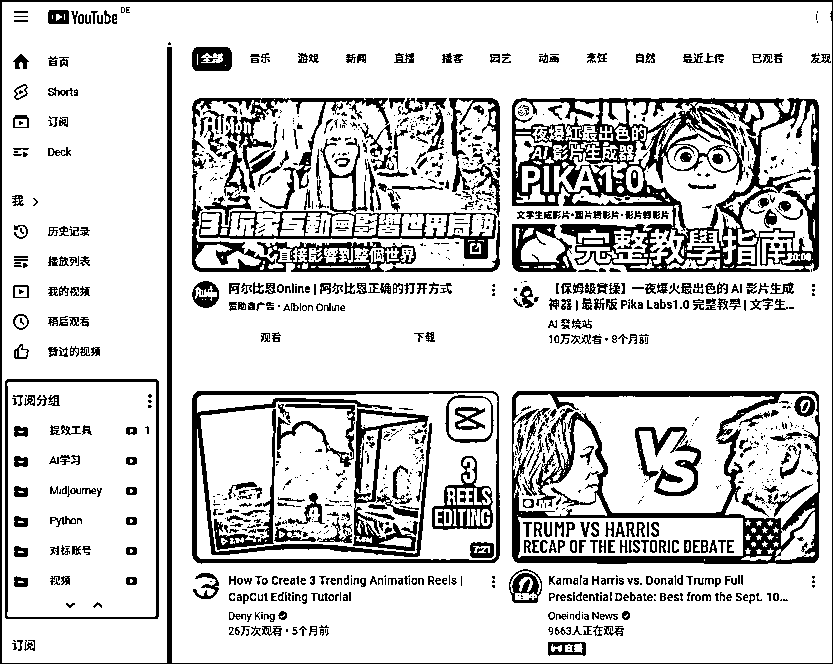
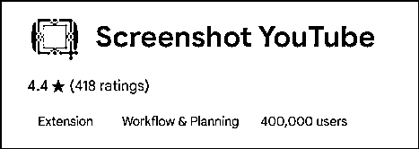
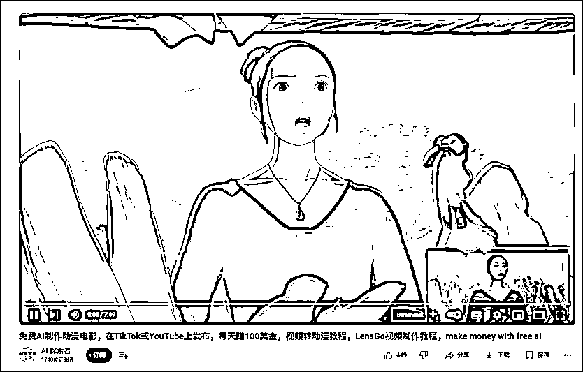
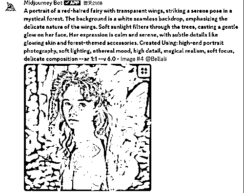
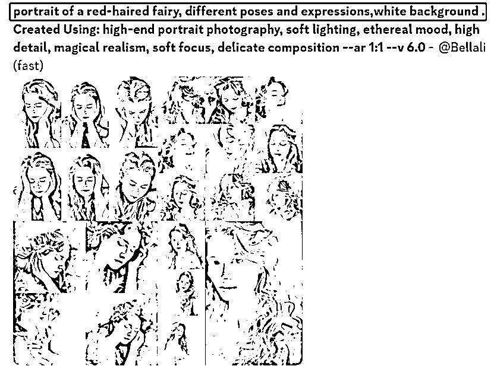
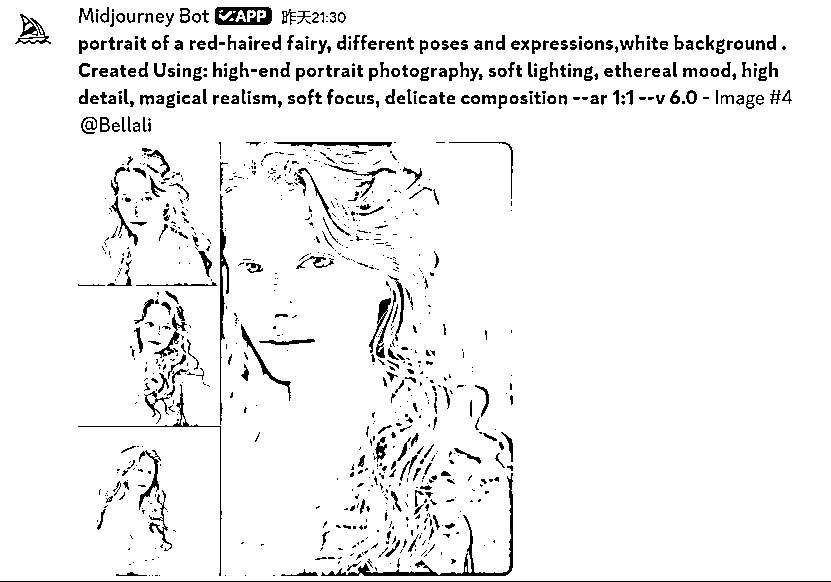
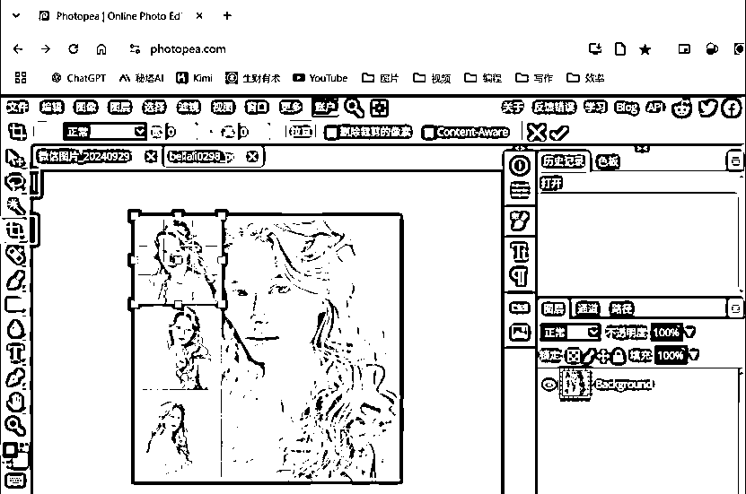

# YouTube几个小技巧

> 来源：[https://ku55nbq1e3.feishu.cn/docx/RRGadqLfco8SopxlGCXcuCBonKc](https://ku55nbq1e3.feishu.cn/docx/RRGadqLfco8SopxlGCXcuCBonKc)

在超级标上折腾了好久也没摸到一条高效的路子，但在摸索中也逐步获得了一些小技巧，可以用来提高作业效率。这里分享出来希望对大家有所帮助：

【视频下载】

在网址中“www.”后面加“9x”，直接跳转直达，mp3、不同质量的mp4、gif动图都有，无广告

【订阅账号分类】

在谷歌浏览器上安装PocketTube这个扩展程序，YouTube首页左侧栏中会多出一个“订阅分组”模块。方便把账号分类保存，如把要对标的账号单独拿出来。

【视频截图】

在谷歌浏览器上安装Screenshot YouTube这个扩展程序，视频下方会出现一个Screenshot的按钮，点击后截图会直接下载。而且截图画质等于正在使用的视频画质。但shorts貌似用不了……

【Midjourney角色一致性】

我在模仿故事类视频制作的时候，经常出现角色形象前后不一致的情况，用cref指令也会抽风。搜索了好多教程，看到一个比较靠谱的，属于前面比较费劲但一劳永逸型：

在确定角色形象之后，再加一步生成多角度、多表情的角色图片，分割后实现多图垫图，再去做分镜图片生成。

Step1：确定形象角色

Step2：获得step1中图片的链接，作为垫图生成该角色的多角度图片。关键词：portrait，different poses and expressions，white background

Step3：我选择第四套图，放大。

Step4：使用photopea中的裁剪工具或套索工具（针对不规则图形），单独保存，获得一组小图。

Step5，将4张小图全部获得链接，生成分镜的时候粘在提示词后作为垫图。

【最后放一下上面提到的资源链接】

PocketTube: Youtube Subscription Manager https://chromewebstore.google.com/detail/pockettube-youtube-subscr/kdmnjgijlmjgmimahnillepgcgeemffb?hl=en

Screenshot YouTube https://chromewebstore.google.com/detail/screenshot-youtube/gjoijpfmdhbjkkgnmahganhoinjjpohk?hl=en

Photopea https://www.photopea.com/

已经在用Cursor学Python了，希望看到大佬们的更多神操作，早一天摆脱手搓之苦/(ㄒoㄒ)/~~

大家加油鸭！