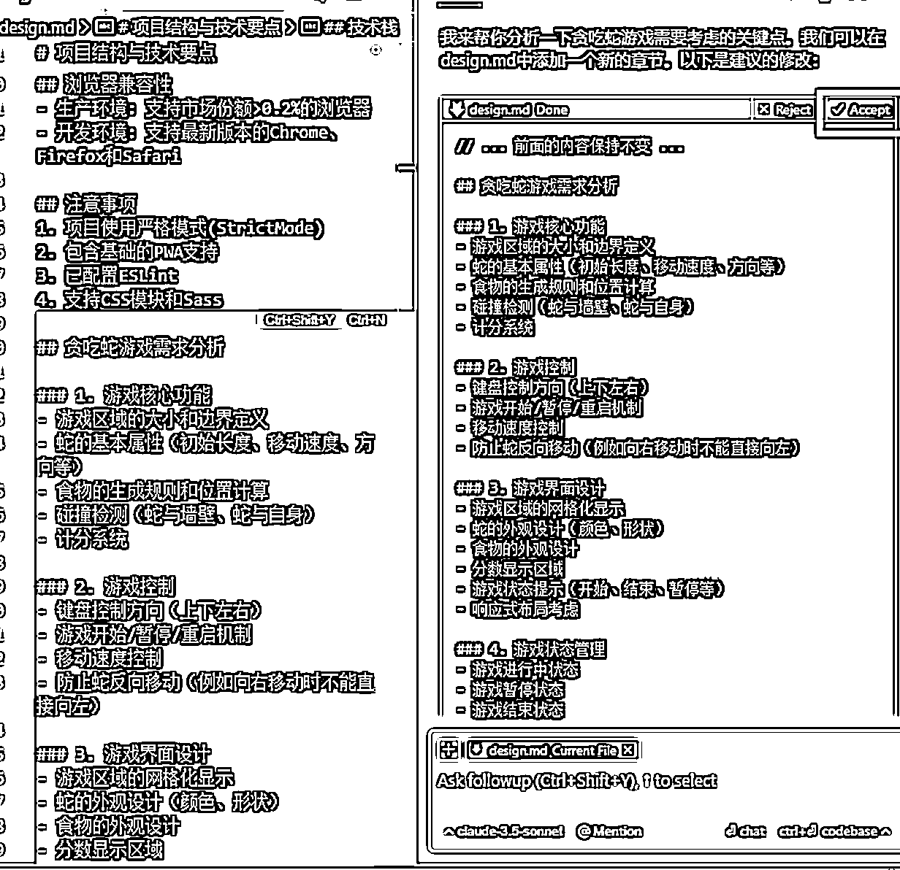
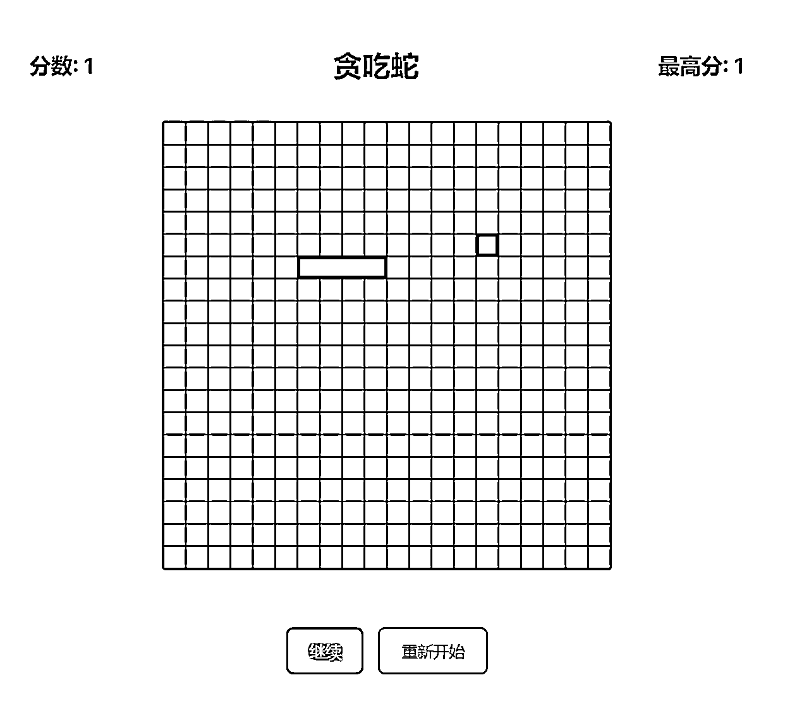
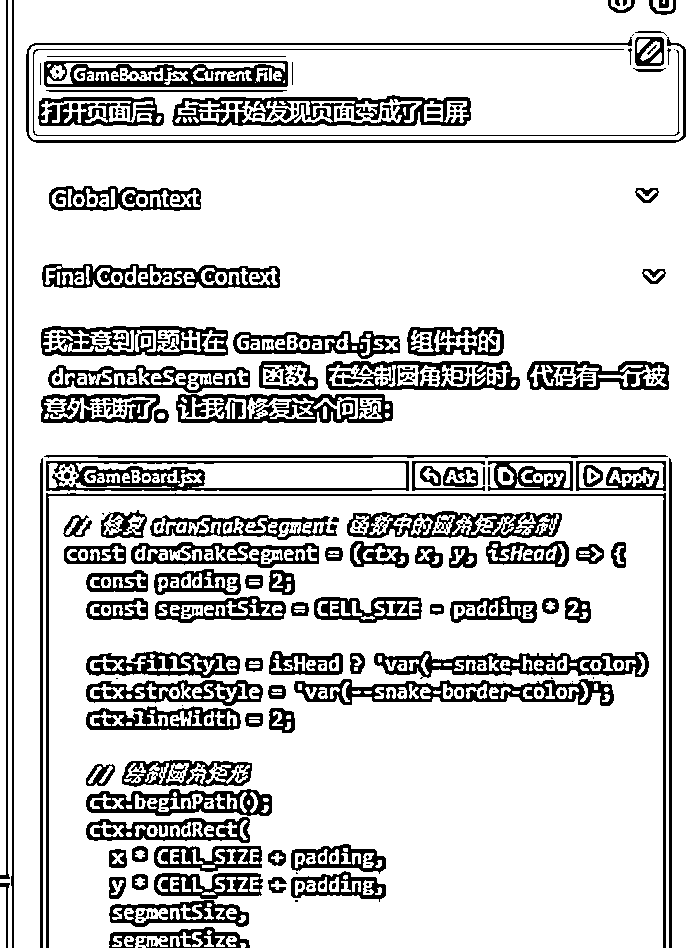
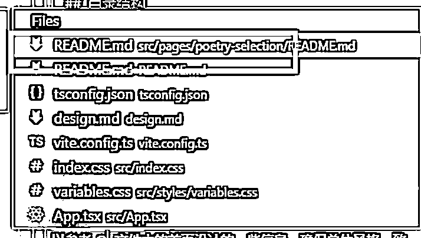
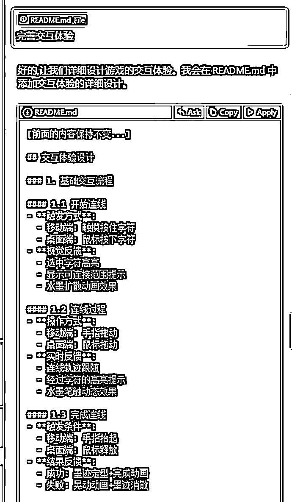
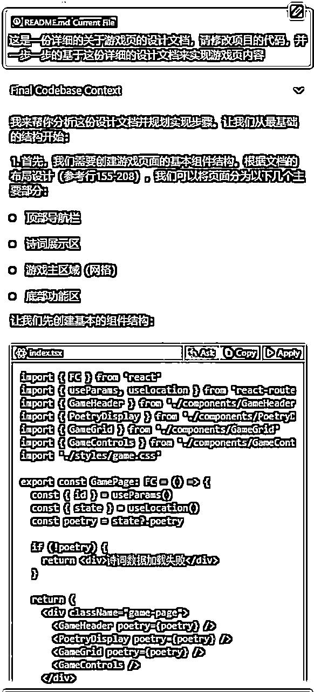
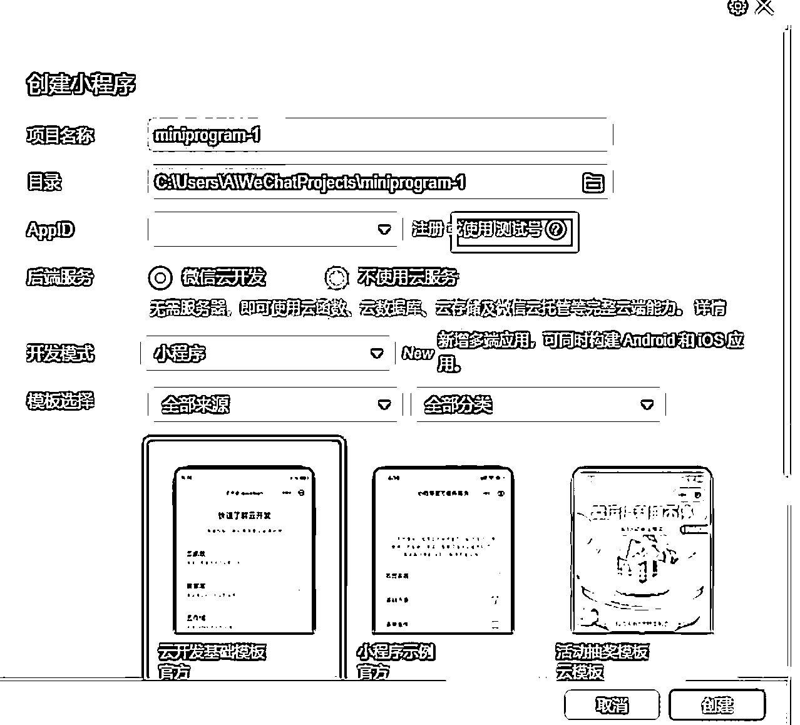
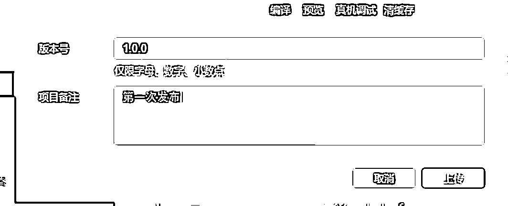

# 如何让吴佳文学会用cursor完成一个复杂项目

> 来源：[https://vqxvy65apk2.feishu.cn/docx/RU4RduqJDo6VvwxiXE5cnYDOnJh](https://vqxvy65apk2.feishu.cn/docx/RU4RduqJDo6VvwxiXE5cnYDOnJh)

大家好呀，我是阿紫，如题，本文的目标是让一个小白也能使用Cursor完成一个复杂的项目(简单的项目当然也行)。

可评论本句话交作业~

小白这个定义可能太笼统，所以我想进一步定义本文的目标群体：会用键盘打字，会用鼠标打开软件。

要求：不需要魔法，但请给自己的电脑预留20G以上硬盘空间。

别问我为什么加这条，因为真的有人硬盘只有4个G....

如果你不知道cursor是什么，那你可以先认为它是一个AI编程工具(帮你写程序的软件机器人)，你向它提出需求，它为你编写代码。比如：帮我编写一个贪吃蛇小游戏。当然这样简单的一句话大概率是做不出你想要的效果的，本文会给出实际操作以及为什么要这样做。

为什么会写这篇文章？

很多人都尝试了使用cursor完成一个简单的网页，游戏，或者app等等，完成复杂项目的却鲜有耳闻。以及我目前还没有看到过一篇从0到1。

在开始之前，我们先来思考个问题：

什么是复杂项目，平常我们是通过哪些手段完成这样的项目的？

复杂项目一般指这个项目里有许许多多的功能，工程量大。反过来就是：一个复杂的项目是由许许多多的功能堆砌而来的

平常做一个项目我们会有产品列出功能清单，给出原型图，核心业务流程图，需求设计等，在实际开发时程序员还会时不时与产品确定需求，并自己建立issue(其中某个小功能的需求点)，编码时一个issue一个issue的开发。

所以最起码我们需要有一名产品经理和一名程序员，你觉得你是哪个？

假设我们认为cursor是一名程序员，那么和他对话的你是什么？我想大概率是一名产品。当产品向程序员提出不合理需求时，一般会有以下4种应对情况：

*   我知道这个需求不合理，我会告诉产品这个需求不合理，让他修改需求。

*   我知道这个需求不合理，但我会按产品的需求完成这个功能，于是做出的功能同样不合理。

*   我不知道这个需求不合理，所以产品说啥我就做啥，同样做出的功能不合理。

*   我知道这个需求不合理，我会自己将功能做的很合理然后交给产品，于是做出的功能既能满足产品需求，又合理。

你肯定期望cursor是第4种，或者起码是第1种程序员。但很遗憾，cursor属于第二种或者第三种，即不管他是否知道这个需求是否合理，他都会去完成。

比如你说：帮我做个网页，背景色是五彩斑斓的黑，你会得到


AI的特点就是不会反问，一个经典的段子：老婆叫程序员去买个番茄，程序员：“去哪里买？买多大的？什么品种？什么价位？ ” 虽然是个段子，但也说明了程序员会认真的和你讨论需求，确保完成的功能和你的想法一致。

正所以AI不会反问，所以提出一个合理的需求就变得很重要。

这里又引出新的问题，我怎么知道我提的需求是否合理呢？我只是个键盘侠啊(会用键盘打字)

刚才我们只是假设了cursor是程序员嘛，我们同样可以假设cursor是产品经理呀。

你不会真以为自己是产品经理吧~(狗头)

当我们有想法时，先将cursor当成产品经理，与他讨论需求，让他完善，再将他当成程序员，让他完成。当然，其实我更建议将他当做懂产品的程序员，或者懂技术的产品(也可以是懂xx的UI等等)。你可以在和他讨论需求时立即让他实现相应的功能，也可以在他实现功能后立即和他讨论这个功能是否需要改进。

比如你说：我想做个网页，背景色是五彩斑斓的黑，你有什么建议吗？当你采纳他的建议时，你会得到：


## 实践

大道理已经讲差不多了，剩下的小道理我们边实践边学习。

实践过程我使用了一台完全干净的Windows系统，力求和大家的环境保持一致

### 安装软件

1、打开你的浏览器，在地址栏输入网址：https://www.cursor.com/ 点击右上角Download按钮下载软件安装包

也可以去下trae: https://www.trae.ai/


2、双击下载好的安装包，进入安装过程


在安装界面的 Language for AI(与AI对话式的语言)输入框中，输入中文，然后点击Continue(继续)按钮


选择 Use Extensions(从VS Code导入扩展)，我们没有VS Code，所以这一步不重要，哪里亮了点哪里就是。


继续


由于我们没有账号，所以选择Sign Up(注册)


点击后会跳转到网页，点击下面的Sign up(注册)按钮进入注册页，注册遇到问题见最后面问题点章节


输入你的姓、名、邮箱后点击Continue(继续)按钮，邮箱随便哪个都可以，我这里使用qq邮箱，我想qq邮箱大家应该都有吧。


设置密码


打开你的邮箱，输入cursor发送的验证码


成功后会跳转会主页，选择登录到桌面软件


现在，让我们回到软件上，后面的所有操作都只在软件上执行


至此，恭喜你！软件已经安装完毕，成功迈出了第一步！

发现软件界面是英文，看不懂？我们来简单配置一下，将它配置成中文界面。

#### 配置中文插件

点击右上角的小图标，展开左侧界面，点击第四个插件图标，切换到插件栏


搜索框中输入Chinese，找到中文简体插件，点击Install(安装)按钮


安装完毕后，点击Change Language and Restart（更改语言并重启）按钮，重启Cursor软件。如果没有就手动关闭重启一下


现在界面就是中文了！


### 如何实现自己的idea

这是我后面又补的一个案例，含了视频实操：

### 贪吃蛇小游戏

虽然本文旨在完成一个复杂项目，但我想我们还是先来一个小游戏练练手吧~

打开软件，点击右上角按钮，展开Chat(聊天)框


聊天框右上角的四个按钮分别为：打开新的聊天框，查看历史聊天记录，全屏展示，关闭窗口


#### 确认技术选型

请记住，第一步永远是讨论

提示词：我想做一个在网页上运行的程序，他是一个贪吃蛇小游戏，你认为适合用什么技术来完成它？请给出一个你最推荐的技术以及对应的脚手架。

敲黑板

程序一般分为网页应用，桌面软件，app，在不同环境下运行的程序技术选型有很大的区别，告诉Cursor你想做什么程序，可以有效减小讨论访问，提高讨论效率。

如果你不知道你想做的程序应该在什么环境运行，你可以想想你做成程序主要用来做什么？

然后询问Cursor: 我想做一个贪吃蛇小游戏，做好以后我想将它分享给我的朋友游玩(或者发布到网络上等)，你建议是做成网页应用或者桌面软件还是app？

告诉AI你想做什么，由于贪吃蛇小游戏比较普遍，所以我说的很简单，如果你的想法没那么普适，那么就要尽量描述清楚，当然我们只是在确定技术选型，没那么详细也无所谓。

最推荐的技术： 推荐的意味着使用性广，文档多，做起来不容易遇到一些奇怪的问题

脚手架: 脚手架简单理解就是个规范，使用脚手架能够在一定范围内框定技术选型以及开发规范。和为什么程序员刚入职要学习开发规范一个道理：1) 统一团队的技术栈 2) 统一团队的开发风格 3）任何人都较容易的接受你的项目(狗头)

它回答了什么不用看，反正我(假装)也看不懂


它推荐什么我们就用什么，但由于我们是小白，我们也不会用，所以我们需要一个保姆级教程。

提示词：我觉得很不错，但我没有任何相关的编程经验，我的windows电脑上除了安装了Cursor代码编辑器外，也没有任何相关环境，请详细的一步一步的告诉我应该怎么做，我做完一步告诉你我做完了，你再告诉我下一步应该干什么。另外，我想把我代码放到d盘的projects目录下

应该怎么做后面可以接一句以及这样做的目的是什么，如果你想知道的话~

详细的一步一步的：这样可以让Cursor保证每一步都非常详细，喂饭喂到嘴里。在其他的场景也可以采用这样方法，尽量小范围的讨论。

代码的所在的盘和文件夹你可以随意修改，但请确保有你这个盘(如c盘，d盘，e盘)


好，我们现在就按照他的步骤来，首先第一步，访问Node.js官网，确实看到了个LTS, 点下载


然后我们双击安装包，安装他说的，全程下一步(Next)


好，我们按照要求无脑点，安装好了，点击完成(Finish)


接下来验证是否按照成功，按 Win + R 键， 输入cmd后回车


打开了命令提示符


然后我们输入node -v 和 npm -v


看到了，我们回去告诉Cursor安装成功了~

全程不动脑子的感觉真好~


现在Cursor让我们完成下一步，成功后可以看到页面，想想感觉有点小兴奋

你有没有发现每条命令旁边有三个按钮 Ask Copy Run。如果你不想修改他给的名字，可以直接点击Run按钮，我验证了是可行的，不过我还是先按它说的做。

点击Run按钮可能会报错，解决方法见： 末尾问题点章节-点击Run按钮出错

也可以把报错信息发cursor问他怎么解决(我也是这样问的）

实践时会遇到第一个Cursor没囊括的点


这是问你是否运行的意思，一般遇到这种，你直接回车就可以了(括号里的y表示默认y(yes))，当然也可以粘贴问cursor

这里也是一个问题点，因为可能会报错


不用紧张，我们将错误告诉Cursor就好。


好，我们按照步骤继续执行


Cursor又帮助我们解决了~

如果你还遇到了其他问题，或者不确定是否安装成功，同样的，发给cursor就好， 就像这样：


我们继续按照指示后，成功运行起来了~


成功之后就可以将这个小黑窗关闭了

注意：到这里cursor当前的任务就完成了，请不要在这个聊天窗口继续了，我们在cursor上打开我们刚刚创建的项目文件夹


请确保你的项目名(SNAKE-GAME)在最上面


打开之后，你会发现我们刚刚的聊天记录没有了，因为cursor的聊天记录是基于项目的，但没有关系，他的使命就是为我们确认技术选型和创建一个项目出来，这样我们就可以在项目里让他帮我们修改代码了。

如果真想看，可以在左上角新建窗口，它就在那里


#### 讨论需求

第一步仍然还是讨论~

永远都不要让AI做什么，而是让AI建议你怎么做

打开右侧聊天框，输入提示词：这是一个模板项目，请在项目根目录下创建design.md文件，并将该项目的目录结构和技术要点总结在这个文件中，方便后续我与你讨论需求时供你参考。

Design是设计的意思，名字你也可以随便取。

这样做的目的是讨论需求时就不用让cursor时时读取整个项目，读取这个文件就可以根据技术把握需求了(将它当成一个懂技术的产品)。

输入提示词，按ctrl+回车键(或者点击按钮)，cursor将会读取整个项目


点击Apply(应用)按钮，cursor将自动帮你创建文件，并将内容输入到文件中， 等一会儿，然后点击Accept(接受Cursor的更改)按钮。


由于目录结构这里语法问题导致出现了断层，我们可以手动将内容复制到文件里。


文件上有个点说明未保存，记得Ctrl + S保存一下

接下来我们打开新的聊天窗口(加号按钮)与他讨论需求

提示词：我想做一个贪吃蛇的小游戏，我们一起来讨论下关于这个游戏的需求，请将我们讨论的结果记入到design.md这个文件中，讨论需求时请不要编写代码，首先，请告诉我需要考虑的点有哪些？这样我才知道应该与你讨论什么。

注意：讨论时选中刚刚生成的design.md文件，可以点击左侧的文件，会自动放到聊天框里。也可以点击聊天框的加号手动添加

我们作为一个小白，只知道要做什么，根本不知道怎么做，也不知道如何发问，所以让Cursor告诉我们可以讨论哪些事情。这样我们才知道问啥~




有了可以讨论的方向，我们就开始一个一个的让cursor完善，完善的点就是上一步他给你写的考虑点，这里每个人都可能不一样，我这里第一点是游戏核心功能，你按自己的情况给他发就是

这里我复盘发现可以用固定提示词：一个一个来。 他就会按照文档逐步完善。


最后他还会给你一些建议


如果你觉得没问题，点击Accept接受即可，有其他想法也可以继续讨论，比如这里碰墙改成穿墙。如果你觉得不需要的内容，你也可以在Accept之后手动删除掉


接下来就是依葫芦画瓢，让他帮我把所有要考虑的点都完善。


省略剩余部分

请不要无脑Accept，Cursor只是建议，你可以把你认为不需要的删掉，把认为没有的让他补充

你可能不知道自己想要什么，但不要什么总知道吧~

#### 开始编码

需求已经完全讨论清楚了，现在我们可以开始编写代码，让我们打开新的窗口(选中design.md文件)，输入提示词：

这是一份详细的设计文档，请修改项目的代码，并一步一步的基于这份详细的设计文档来实现这个项目。

发送时按下ctrl + enter键(使用codebase模式)，让他读取一下整个项目的代码


我们将他给出的所有代码Apply就可以了~ 他会自动创建文件夹和文件的

并且他在最后还提示了下一步需要做什么


我们让他继续，然后apply所有代码


最后他告诉我们已经实现了基本功能


这里我已经迫不及待想玩一下了，所以就没让他继续实现，而是问他：

我已经将你给的代码全部应用到项目中了，现在我想运行试试效果，请问我应该怎么做？


我们根据提示点击Run按钮运行即可

我这里遇到了一个问题，我们选择所有报错信息，点击 Add to Chat(添加到聊天框)，然后发送给cursor


我只是个小白，他这些我都看不懂，但我知道Cursor就是VS Code，所以我选择方案3


当然你也可以进一步询问他。

继续回到刚刚的地方点Run按钮，成功启动了项目，抓紧试玩一下

接下来每个人遇到的问题可能都会不一样，但没有关系，发送给Cursor总能解决的

比如我打开发现游戏窗口上没有蛇


我们回到cursor，告诉他：打开发现游戏窗口上没有蛇，发送时使用codebase模式


采纳他的代码后，发现游戏可以正常游玩了，保存文件页面会自动刷新(也可以关闭程序重新运行)



发现页面有些丑，我们选中设计文档，让他按要求重新设计样式，仍然使用codebase模式


当然再次打开页面后，点击开始发现页面变成了白屏



继续采纳，成功运行

接下来可以继续让他根据文档进一步完善功能，但我想后续的功能你肯定知道怎么做了，我这里就不再展示了。

### 古诗划字连词游戏

接下来我将以这个项目为例，演示如何完成一个复杂项目。

在这里，我们将要使用模块化的思想，什么是模块化？可以理解成我们讲一个复杂的功能(项目)拆成一个个小功能，每个功能在实现的时候完全是独立的(不依赖其他功能的代码)。这样我们只要专注于让cursor实现这个小功能就可以了。

由于贪吃蛇只是个小游戏，所以我并没有运用这个思想，而是把整个游戏看成了一个功能

这个游戏是我在网上看到了一个strands游戏而来的想法，游戏玩法是给你一个主题单词，告诉你这里有几个单词需要连线起来。


于是我改造成了：告诉你诗名，让你将这首词的所有诗句连线起来


我将这个项目拆解成了3个页面：首页、诗词选择页、游戏页

你可能会认为3个页面不算个复杂项目，但按照我的方法，你可以增加更多页面，我总不能真搞个巨复杂项目做案例吧，我也做的头疼，你学的也头疼。

#### 开始实践

同样的，第一步，让我们确认技术选型

提示词：我想做一个在网页上运行的程序，他是一个关于古诗的划字连词游戏，游戏玩法是将一首诗的所有汉字打散，玩家需要正确的将汉字连接在一起，你认为适合用什么技术来完成它？请给出一个你最推荐的技术以及对应的脚手架。


咱也别管它回了啥，固定一句：

我觉得很不错，但我没有任何相关的编程经验，我的windows电脑上除了安装了Cursor代码编辑器外，也没有任何相关环境，请详细的一步一步的告诉我应该怎么做，我做完一步告诉你我做完了，你再告诉我下一步应该干什么。另外，我想把我代码放到d盘的projects目录下


又叫我们安装Node.js，上个案例我们已经装好了，所以这里直接回：安装好了~


这里我就直接点Run按钮了哈~


又遇到了这个问题，还是按照之前的方法，改一下


一路点下来，告诉他第二步完成了。


继续点Run


好，我们在浏览器访问试试


看起来没问题了，接下来我们用cursor打开这个项目

我们先按 Ctrl +C把程序终止(免得浪费资源)，再打开项目


#### 讨论需求并完成

还是打开右侧聊天框，还是输入这个提示词(codebase)：这是一个模板项目，请在项目根目录下创建design.md文件，并将该项目的目录结构和技术要点总结在这个文件中，方便后续我与你讨论需求时供你参考。


同样点击Apply将内容写入的design.md文件中


目录这一段由于语法问题，还是只能复制进来，记得保存

##### 首页

###### 讨论需求

接下来还是一样，我们打开新的聊天窗口与他讨论需求

提示词：我想做一个关于古诗的划字连词游戏网站，游戏玩法是将一首诗的所有汉字打散，玩家需要正确的将汉字连接在一起，这个游戏我想使用三个页面来完成，首页、诗词选择页、游戏页，我们一起先来讨论下关于这个首页的设计，请将我们讨论的结果记入到design.md这个文件中，讨论需求时请不要编写代码，首先，请告诉我需要考虑的点有哪些？这样我才知道应该与你讨论什么。

改一下做什么就行了，这里我把游戏改成了网站，因为我想做一个网站，不是单纯只有个游戏页，并且先讨论首页(模块化)


这里可以调整需求，比如我不需要用户登录和排行榜


紧接着他给出来了三个建议


我们先和他讨论布局


然后再和他讨论视觉风格


最后讨论交互方式


关于首页的需求我们先就这样，然后开始完成首页的编码

###### 完成编码

同样，我们打开新的窗口(选中design.md文件)，输入提示词：

这是一份详细的关于首页的设计文档，请修改项目的代码，并一步一步的基于这份详细的设计文档来实现首页内容。


先运行看看效果(在技术选型阶段，cursor已经告诉了启动方式，或者也可重复询问他，这里我就不在赘述了)


看起来还不错，我们继续按他的提示完成下一步编码


继续查看效果


这里我遇到了一个问题：弹窗动画会连弹三次

将问题告诉Cursor, 他会帮助解决的，使用codebase模式


每个人都可能遇到不同的问题，将问题告诉cursor就好， 处理问题时注意使用codebase模式

第二点页面动画和第三点移动端适配我暂时没这个想法，所以让他添加一下更多的视觉设计，让页面更好看些


效果是不是好了很多


首页我感觉可以了，接下来完成诗词选择页

##### 诗词选择页

###### 讨论需求

同样的，一开始我们先讨论清楚需求

打开新窗口，提示词（codebase模式）：我们一起来讨论下关于诗词选择页的设计， 请先为我创建关于诗词选择页的代码文件夹和README.md文件， 并将后续我们讨论的结果写入到其中的README.md文件中，这个文件夹会用来放置诗词选择页的代码。创建好了我们再开始讨论

将一个功能点框定到一个文件夹下，后续我们就不会再让cursor读取整个项目了，而是只关注这个文件夹下的代码


点击Apply会自动创建文件夹和文件，将cursor回复内容写入README.md文件中

如果cursor回了一些关于需求的设计，直接删掉，只保留目录结构进行


接下来就和之前一样开始讨论需求了。

提示词：现在我们可以开始讨论了，请务必将我们讨论的结果写入到 @README.md 文件中，方便后续编写代码时进行参考，你可以参考 @design.md 文件中的首页设计的一些信息，确保总体风格一致。首先，请告诉我需要考虑的点有哪些？

这里需要用到cusor的一个功能，输入 @ 符号，会弹出一系列指令，我们选择File，再选择README.md文件(注意不要选成了根路径的那个文件) 选择@design.md 同理





后续的内容基本一致，就是叫他完善每个点了，完善的时候可以删掉一些你不想要的


###### 完成编码

照例打开新窗口开始，提示词类似，改个功能就好。

提示词(codebase)：这是一份详细的设计文档，请修改项目的代码，并一步一步的按照这份详细的设计文档来实现功能


接下来我想你已经知道了，就是一直继续让他写完，直到你觉得写得差不多了为止。

然后把这个页面和首页关联上，在首页点击开始游戏进入该页面

提示词(codebase)：请将诗词选择页和首页关联起来，点击开始游戏时进入诗词选择页


这时候运行项目大概率会报错，因为我们写了很多代码，但没有关系，我们把报错信息发送给cursor即可


运行效果


现在只有两首，但我们不知道怎么增加更多的诗词，但我们知道诗词选择页的代码都在一个文件夹下，所以我们可以这样做：

输入 @ 键，选择 Folder(文件夹） 选择 poetry-selection(诗词选择页的代码文件夹)

然后询问他：我现在想增加更多的诗词，请问我应该怎么做？


可以看到，这个时候cursor就只会读取该文件夹(功能点)的文件了


在最后他还给出了建议：


我觉得第一点很不错，这样我们就不需要知道代码要怎么改了，可以自己单独在数据文件中管理诗词了。


现在我们可以自由的在熟悉的文件中添加诗了。

我发现上下两行有重叠部分，以同样的方式询问cursor


当你在一个聊天框(上下文)中选取过文件夹，后续的讨论cursor会自动读取


效果完美


现在诗词选择页就算基本完成了。

##### 游戏页

我想游戏页你肯定会了~

###### 讨论需求

打开新窗口，提示词（codebase模式）：我们一起来讨论下关于游戏页的设计， 请先为我创建关于游戏页的代码文件夹和README.md文件， 并将后续我们讨论的结果写入到其中的README.md文件中，这个文件夹会用来放置游戏页的代码。创建好了我们再开始讨论


同样，只留取目录结构


提示词：现在我们可以开始讨论了，请务必将我们讨论的结果写入到 @README.md 文件中，方便后续编写代码时进行参考，你可以参考 @design.md 文件中的首页设计的一些信息，确保总体风格一致。首先，请告诉我需要考虑的点有哪些？


这里有个问题，由于这个是游戏页，也平常的网页不一样，我们需要详细的告诉cursor我们的游戏玩法，所以在这一步和其他网页不一样，当然你要是做普通的网页，和诗词选择页一样的过程就可以了。

游戏机制

```
### 基本游戏机制

1\. **游戏布局**
- 游戏界面是一个方形网格
- 网格中随机分布着诗句的每个字
- 字符以圆形背景的形式显示
- 网格大小根据诗句字数自动计算

2\. **连线规则**
- 玩家可以通过鼠标拖动来连接相邻的字
- 只能连接相邻的字（包括斜向相邻）（9宫格内的字）
- 连线时会显示实时的墨迹效果
- 连线路径会有动画效果

3\. **判定机制**
- 当玩家完成一次连线后，系统会检查是否匹配诗句
- 如果匹配成功：
  * 连线会保持显示
  * 连过的字会变色标记
  * 进度条会更新
- 如果匹配失败：
  * 显示错误动画效果
  * 连线会消失
  * 可以继续尝试

4\. **游戏进度**
- 界面顶部显示当前进度
- 显示已完成数量/总数量
- 有进度条直观展示完成程度

5\. **辅助功能**
- 重新生成按钮：可以重新打乱字的位置
- 下一首按钮：完成当前诗后可以进入下一首
- 返回关卡按钮：可以返回选择其他诗词

### 特殊设计细节

1\. **字符布局算法**
- 确保同一首诗的字符相邻放置
- 使用随机算法保证每次布局都不同
- 保证所有诗句都可以被连出来

2\. **视觉反馈**
- 连线时有实时的墨迹效果
- 选中的字会高亮显示
- 已完成的诗句会保持显示
- 错误操作会有晃动动画

3\. **完成效果**
- 当诗句全部连完后，会显示完整的诗词
- 提供下一首操作选项
```


给完之后流程就和以前一样了

接下来就是完善完善完善完善~~~~





一般来说，完成了布局、视觉、交互、内容就可以了

其他的随意

###### 完成编码

提示词(codebase)：这是一份详细的关于游戏页的设计文档，请修改项目的代码，并一步一步的基于这份详细的设计文档来实现游戏页内容



同样，他给出了下一步的建议


接下来就是继续继续继续继续继续~ 直到你觉得差不多了为止


到这里我觉得差不多了

于是到下一个阶段：

提示词(codebase)：将游戏页整合到项目中，可以在诗词选择页进入


不出意外，又有错误，同样发给cursor


成功启动后，查看效果，发现了几个问题：文字未被打乱，没有去掉标点符号，连接效果没有按设计需求来


一样的操作，@ 选中 games 文件夹，将问题发给cursor


现在文字是打乱了，但无法相连


这个游戏玩法还是太难了，cursor很难搞定，不是个好的案例。

不过这个页面可以退而求其次，变成一个诗词详情页，@双菱 已经完成了，这是她做出的效果


看来cursor用来做网页是没有任何问题，但是做需要逻辑性的事情还是比较难。嗯，我感觉游戏页的游戏玩法也要单独提出来讨论需求。后面我再调研一下怎么稳定做游戏出来

这是我上周末完成的功能，今天尝试不动脑子不看代码，没有办法复现出来。抱歉了。


有朋友说想玩，那我发出来给大家玩一下：https://poetrystrands.com/zh

### 今天吃什么小程序

好像大家都很想做一个小程序，来，补个！

#### 安装微信开发者工具

首先打开cursor，提示词：

我想开发一个微信小程序，但我没有任何相关的编程经验，我的windows电脑上除了安装了Cursor代码编辑器外，也没有任何相关环境，请详细的一步一步的告诉我应该怎么做，我做完一步告诉你我做完了，你再告诉我下一步应该干什么。


我当然也可以水一下流程，但我觉得cursor能够更好的帮助你~

windows下载点这里，这个下载不是很明显，单独提出，剩下的按cursor的来


安装好之后，在一个你喜欢的地方创建一个项目文件夹，用英文，不会就用翻译


打开微信开发工具，创建项目，如果你注册了小程序，就是使用你的appid，没有可以先使用测试号





#### 讨论需求

回到cursor，用cursor打开这个项目

一样的提示词：这是一个模板项目，请在项目根目录下创建design.md文件，并将该项目的目录结构和技术要点总结在这个文件中，方便后续我与你讨论需求时供你参考。


打开新窗口

提示词：我想做一个今天吃什么的小程序，他可以让用户在上面随机的抽取美食，小程序一共有两个页面，一个首页，用来随机抽取美食，一个是个人页，用来编辑自己想抽取的美食信息，我们一起先来讨论下关于这个首页的设计，请将我们讨论的结果记入到design.md这个文件中，讨论需求时请不要编写代码，首先，请告诉我需要考虑的点有哪些？这样我才知道应该与你讨论什么。


根据情况删除或者增加自己想要的内容


#### 编写代码

接下来我们使用个更好用的方式，感谢土豆君提供

Ctrl + I 快捷键 打开composer模式，然后点击更多 -> Open composer as pane(将composer放到右边栏目中)


提示词（codebase)：这是一份详细的关于首页的设计文档，请修改项目的代码，并一步一步的基于这份详细的设计文档来实现首页内容。

composer只能用 @ 的方式使用codebase模式


等他全部写完后，直接点击accept all


在微信开发工具端可查看效果，点一下编译按钮，虽然有时候UI的内容他自己会直接展示，但有些代码他不会自动编译，建议每次写完代码都点一下


这个时候你可以让它改样式，也可以让他继续完成剩下的功能

开始随机那个不用管它，现在只是在搞布局，还没调样式，它在那个位置就行。


他说需要图片，但我没有，可以去网上找，但我偷懒直接问他能不能换成别的样式了。


我感觉还行，让他继续完成功能


现在我点击开始随机，和筛选都没反应，一个一个告诉他，让他解决。


接受之后查看效果


实际效果

剩下的其他功能俺就不写了，我想你应该知道怎么搞了~

#### 手机上怎么看效果

点击真机调试


选择你的手机系统，扫码即可


#### 发布小程序

发布小程序需要真实的appid，所以想发布开始看看cursor的注册流程注册一个小程序账号吧

修改项目中的appid, 如果你注册时填的就是真实的，就不用改了


点击上传按钮


内容随便写



发布后打开小程序页面


下拉可以选择体验版试玩，提交审核需要填一堆资料，自己填去。发布完了就可以在小程序上搜到了。

### 如何准确回退到心仪的代码版本

当代码改乱了的时候怎么回到心仪的版本。

如何安装Git，可以直接问cursor，还是差不多的提示词：

我想要在我的windows电脑上安装Git，请详细的一步一步的告诉我应该怎么做


这里可能会下载很慢或者下载失败，我们可以直接告诉cursor


按照给的方法打开地址 https://mirrors.huaweicloud.com/git-for-windows/v2.47.0.windows.2/


下载好后根据cursor的指示一路next就可以了。

## 结语

从案例来看，利用Cursor完成创造性的内容还是没有任何问题的，或者一些需求十分明确的逻辑，比如当xx的时候，逻辑是xx

游戏这一块我后续继续研究一下，怎么才能让cursor成功的实现出来。

## 问题点

### 点击Run按钮出错


切换成Command Prompt， 切换后请重新执行刚刚执行过的命令（如 d: ,cd d:\ 这种)


### 注册Cursor失败


解决办法：清除cookie


### 注册Cursor看不到验证码


回到列表页


或者点击纯文本按钮


### 注册时返回服务器错误

可以稍微等几分钟再试试，或者换个谷歌浏览器，不要开魔法。确保你的环境是干净的。