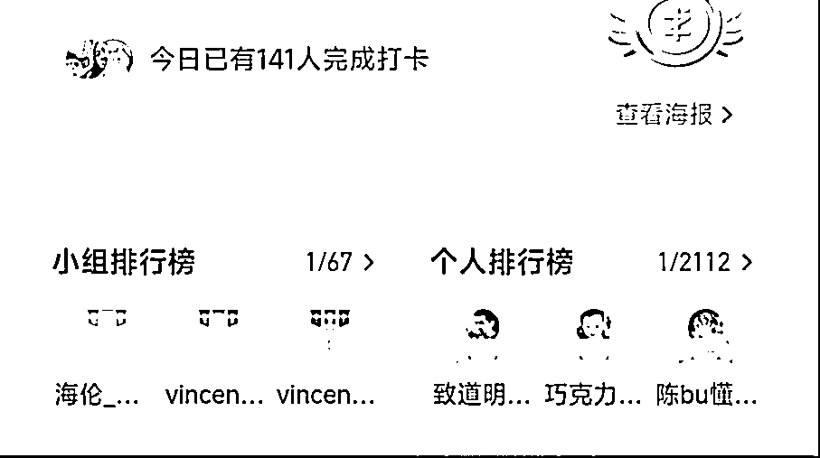
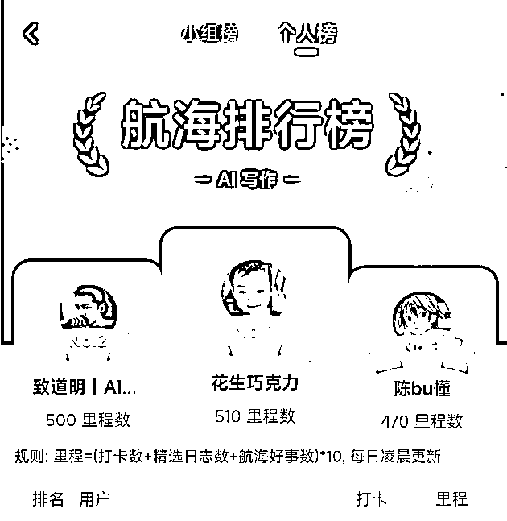
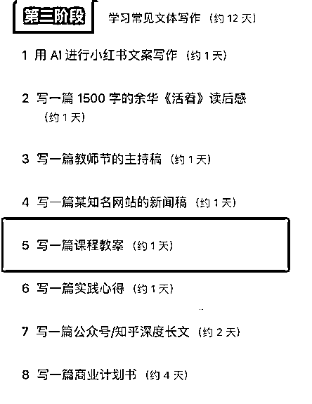
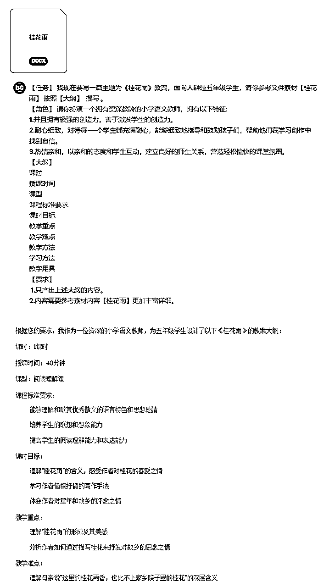
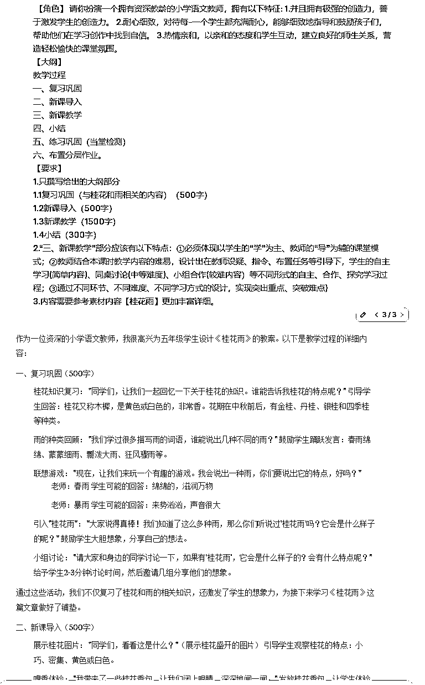
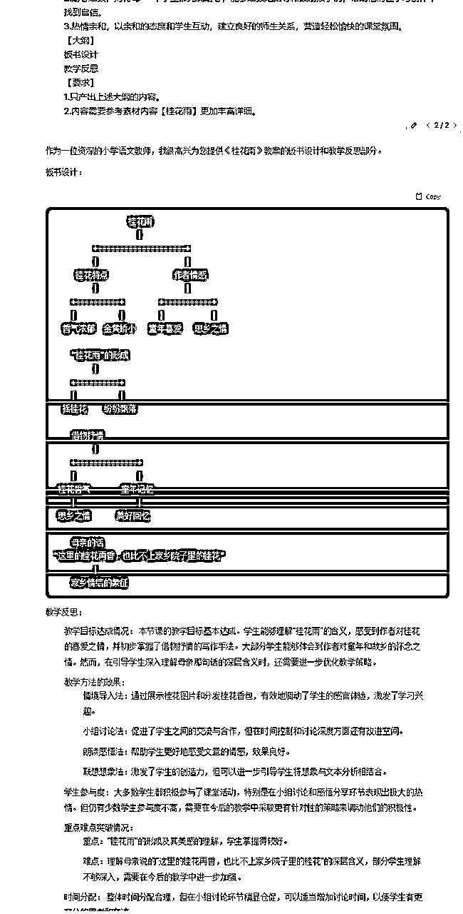

# 航海提速「AI」写作项目，实操讲解「教案品」交付

> 来源：[https://icnlcuvvkj7r.feishu.cn/docx/YTvCd795oorrK4xMTVccUuDSnUb](https://icnlcuvvkj7r.feishu.cn/docx/YTvCd795oorrK4xMTVccUuDSnUb)

# 1.我和「AI代写」的一些故事

圈友们，大家好，我是道明，位置是杭州余杭/合肥庐阳，曾经主业工程师，现在全职在做AI代写的业务。之所以能全职做AI代写这件事，是因为我自己已经从流量端到交付端跑通了。在全职all in 后我开辟了一个单品，10天变现利润7000元。后面再一次偶然的机会面前，我走巧在1天变现利润是1万6。

我和AI写作初相识：

我开始接触AI写作是在去年8月，起初只是出于好奇。随着时间推移，我逐渐意识到这项技术的潜力，但单靠自学，进展却很缓慢。没有一个足够大的平台，即使能力好与坏都无法施展，在一个人做AI写作时我是从每天4小时副职开始的，那时每天可写的利润是200-300元，最多一次在4小时内完成了21单这些数据更让我深感一个人的力量是有限的。

在今年八月份，我加入了生财，加入后查阅了很多生财内的神贴，各个都很吸引我的眼球，干货满满。但我唯独忠爱AI，我尝试过很多AI内容，但体感下来AI写作会是最直接最接近变现的项目，我一直都期待着自己能做到AI整条链路的应用项目，如AI短视频甚至故事剧情长篇。AI可以赋能的事情很多，每每想到AI的作用都会兴奋不已。

在航海深耕AI项目：

9月，我得知生财有术有「AI写作」航海项目，觉得这是一个难得的学习机会，于是报名参加了。参加这次活动，我有两个主要目标：一是提高AI写作技能，二是认识更多在这个领域工作的朋友。这是一个精进技能的机会，更是一个拓展视野、结识同道的平台。

在航海过程中，我重点关注了一些进阶主题，如更复杂的prompt工程技巧、AI辅助下的创意构思方法、以及如何将AI写作整合到更广泛的内容创作流程中。这些内容正是我之前自学时难以深入的领域。通过系统的学习和实践，我的AI写作水平有了显著提升。

比如，我现在能够设计出更精确的教案品的prompt，产出的内容质量和相关性都有了很大提高。在创意方面，我也可以更好地引导AI，让它成为我思考和创作的得力助手。

航海手册的内容还是很中肯的，干货满满。通过这些时间的学习，我的AI写作能力提升了一个层次，尤其是在提示词这块，更高效，更精准了。

接下来我会分享，我在本次航海中的收获和实操结果、以及感想感悟。

如果你和我一样，对写作感兴趣，想通过AI赋能甚至变现，可以详细看看下面的内容

* * *

## 我来分享我拿到结果最快的一个品类，教案品类。

虽然教案品类只有一天的教学内容，但是内容丰富且干货满满，我也通过通过教案品类变现了2W，这是我应用我们航海手册教案知识点实操写教案客单的真实案例分享，希望能帮助到大家。

### 教案是什么？

简单来说，教案就是教师上课前准备的一份详细计划，类似于我们做事情前写的清单。教案帮助教师理清思路，知道每一节课要讲什么，怎么讲，怎么让学生理解和掌握。

教案主要用于是老师进行教案比赛、教学展示、招聘面试、日常教学等场景。

教案的客户群体一般是：幼儿园教师、小学教师、中学教师、大学讲师、新手教师（面试）、补习班、培训班教师、职业培训讲师、特殊教育教师、支教老师。

### 为什么做教案？

教师和师范生们没空写教案，市场需求量大。

掌握方法后ai生成难度低，新手入门快。举一例，一篇优质课的教案，教师如果不用任何现成的模板而是用手搓教案，在只参考教材的情况下，一篇稿可能需要4天再通过试讲等措施进行打磨修改，可能需要的时间会比较多。但现在通过AI的赋能在1小时内可以根据自己的想法做出一个逻辑清晰、内容详细、过程丰富还能为你提供创新点和跨学科的思路的教案。已经亲测，老师们很喜欢。因为他们可以把节省下来的时间进行打磨教案，让他的作品在短时间内达到以往需要4天起步的效率和质量。

这就是产品打通顾客的痛点了。

我有一个理念，我希望让AI给人类进行赋能，如教案给教师赋能，让他们在自己的职位上做得更好，这是在通过AI创造更多的饭碗，为方便人类而生的AI。当然也可以学会后赚到一些钱，但这我希望是惊喜而不是目标。

这份干货与感悟我相信教师们对此应该会感兴趣，当然圈友们如果也对此也感兴趣我也很乐意与之交流。

如果大家喜欢这个系列，我可以后面再单独将写作篇细节，进阶和谈单篇思路等等再写一些贴。

这里进行补充过自我介绍一下。方便大家认识我这位生财新人。

一张照片混个脸熟

# 2\. 航海学习中实操教案品类结果展示

## 2.1教案品类结果展示

## 2.2个人收获与思考

收获总结，目前来说通过市场体感，我感觉教案品类单兵上线应该是在2万/月元左右，全流程（三端）。

感想思考，AI写作航海的学习收获颇丰，回想起来,最大的感悟就是，AI写作不仅仅是一项技能，更是一种思维方式的转变。在教案品类的过程中AI并不是简单的替代品,而是我们思考和创作的助手，它能够快速生成内容框架，但真正的价值在于我们如何利用这些框架,再通过人工的经验进行提效。

# 3\. 实操过程遇到的四大挑战

在本次AI写作航海写作教案的实操过程中,我也遇到了不少问题和挑战。现在分享这些经历,希望能给同样在学习路上的圈友们一些参考和启发。

## 3.1如何让AI生成的内容更接地气，如何更接近老师的语气？

这是我面对最大的挑战，刚开始时写的时候,我发现AI生成的教案虽然结构完整,但总觉得少了点味道。经过反复尝试反复踩坑后,我意识到问题出在输入上，我们需要给AI更多关于实际教学场景的信息,比如学生的年龄特点、班级氛围、教学案例等进行投喂。

这样生成的内容才能更贴近我们老师语气，更加符合实际需求。还有就是如果在与顾客沟通中你能找他要到以往他之前的案例，或者他告诉你他的风格语气和状态，也是不错的帮助。

## 3.2 如何平衡AI生成和人工修改？

一开始写教案的时候我完全不懂结构和内容含义，我总是想完全依赖AI,结果发现效果并不理想很多都过不了关，不符合老师的要求。后来我学会了先用AI生成框架和基础内容，然后根据自己学习参考案例总结出教学经验进行调整和补充。这个过程让我深刻体会到,AI是辅助工具,而不是替代品。

## 3.3 如何构建提示词？

在学习航海手册前，我所有给到AI的提示词都是一种野路子对话的方式，这样不仅仅低效低质量且每一个都是独立性不可复用，大大的减少了赚钱的效率。严重的技术滞后直到参加了AI写作航海进行了系统性的学习提示词SOP教程，优质的提示词SOP模板能带来事半功倍的效果，但如何写出好的提示词却不是件容易的事，想必海盐老师在这上面费了不少功夫和时间精力。

在航海手册的教案SOP教程中我花了不少时间研究提示词模板，并在实践中不断调整。现在我已经能够根据不同的教案需求，灵活地组合和修改提示词了。

## 3.4、如何让AI生成的内容更有创意？

很多时候，老师的教案要求里面就会有一些创新、或者跨学科的组合，这就是AI的弊端了。毕竟,AI是基于已有数据学习的,要让它产出真正创新的ideas并不容易。我的解决办法就是我尝试试让AI结合不同学科的知识,或者引入一些新颖的教学方法,来激发它的"创造力"，虽然还不够完美，但已经有了明显的进步。

# 4\. 新手入门实操指南

相信很多人和当时的我一样，刚接触AI写作，或者深一点教案品AI写作时会感到有些无从下手。这里，我想结合自己的学习经历，给大家分享一些入门的实操建议，希望能帮助新手们少走些弯路。

这里先从AI工具简单介绍一下，在众多AI工具中，我首选推荐的工具就是GPT-4和Claude，这两者对我来说比其他的AI工具都要熟悉，也是市面上公认的最强AI，选他们准没错。

## 4.1 GPT-4：作为OpenAI最新推出的大语言模型，GPT-4在理解复杂指令、生成高质量内容方面表现出色。

理科生！！！！（二极管）更加擅长推理。

## 4.2Claude：Anthropic公司开发的AI助手，Claude在长文本处理、逻辑推理方面有独特优势。

## 文科生！！！！（二极管）更擅长文字色彩。

花点时间了解AI写作的基本概念很重要。比如什么是提示词(Prompt),什么是token,AI模型的能力边界等。这些知识会帮助你更好地理解整个过程。

通过航海手册教案单品的教学

我们可以从简单任务开始，不要一上来就挑战复杂的教案。可以先从简单的教案开始，然后拆解结构先列举出模板大纲（航海手册中有一个万能模板），比如我是直接先套用航海手册中的“万能模板”的大纲。这样可以帮助你快速熟悉操作流程，建立信心。

模板中，需要我们撰写的部分是以下几个部分

课时

授课时间

课型

课程标准要求

课时目标

教学重点

教学难点

教学方法

学习方法

教学用具

教学过程

其中，课时、授课时间、课型、课程标准要求、课时目标、教学重点、教学难点、教学方法、学习方法、教学用具 这几个维度是相较而言比较简单和普通的内容，我们称之为“无脑内容”。教学过程这个部分是整个教案的“核心部分”，需要根据客户需求来修饰。

“无脑内容”撰写

GPT直出，根据所得内容，以及客户的简单要求稍作调整即可

提示词模板（1）

黄色部分是我们提示词模板部分根据客户群体和需求调整的部分，其他部分不用动。红色部分是客户特色需求，客户没有特色需求就可以不写这条。

【任务】

一篇主题为《小学生美术》教案，面向人群是三年级学生，请你按照【大纲】

我现在要写

撰写

【角色】

请你扮演一个拥有资深教龄的小学美术教师，拥有以下特征:

特征

1.并且拥有极强的创造力，善于激发学生的创造力。

2.耐心细致，对待每-一个学生都充满耐心，能够细致地指导和鼓励孩子们，帮助他们在美术创作中找到自信。

3.热情亲和，以亲和的态度和学生互动，建立良好的师生关系，营造轻松愉快的课堂氛围。

【大纲】

课时

授课时间

课型

课程标准要求

课时目标

教学重点

教学难点

教学方法

学习方法

教学用具

【要求】

1.只产出上述大纲的内容。

2.客户特色需求

提示词模板（2）

【任务】

我现在要写一篇主题为《小学生美术》教案，面向人群是三年级学生，请你按照【大纲】撰写

【角色】

请你扮演一个拥有资深教龄的小学美术教师，拥有以下特征：

特征

"""

1.拥有极强的创造力，善于激发学生的创造力。

2.耐心细致，对待每一个学生都充满耐心，能够细致地指导和鼓励孩子们，帮助他们在美术创作中找到自信。

3.热情亲和，以亲和的态度和学生互动，建立良好的师生关系，营造轻松愉快的课堂氛围。

"""

【大纲】

教学过程

一、复习巩固

二、新课导入

三、新课教学

四、小结

五、练习巩固（当堂检测）

六、布置分层作业。

【要求】

1.只撰写给出的大纲部分

2.“三、新课教学”部分应该有以下特点：①必须体现以学生的“学”为主、教师的“导”为辅的课堂模式；②教师结合本课时教学内容的难易，设计出在教师设疑、指令、布置任务等引导下，学生的自主学习(简单内容)、同桌讨论(中等难度)、小组合作(较难内容）等不同形式的自主、合作、探究学习过程；③通过不同环节、不同难度、不同学习方式的设计，实现突出重点、突破难点)

3.客户特色需求

# 5.入门级教案实操

核心提示词方法论，通过上述SOP教程我们进行一个实战。

*   1.首先我们先下载上面的教案万能通用模板，了解框架内容。

*   2.我们将提示词按照航海手册的模板输入进去形成大纲。如下。

*   3.投喂教材素材让AI知道你的课程内容。（素材可能文件在下面）

*   4.因为是日常教案，可无脑出~

## 一、”按照提示词模板无脑出部分“

## 二、素材教材（桂花雨）自行下载

## 三、“根据模板出的教学过程部分”

## 四、最后用模板出一下板书内容和反思部分。

## 五、最终成稿结果~

六、现在的结果是我用了十分钟出的结果，请问感觉如何呢？

据我所知，正常一节课的教案准备需要少说4个小时的准备或者3-4天。

有了这份初稿，我们在此基础上进行人工修改，根据顾客需求，再结合自己的思想创意。能得到一个不错的教案。就目前来说，我认为日常使用已经足以。

# 6\. 高阶教案AI写作发展路径

我经过这段时间的航海学习和实践，大体对AI写作教案已经有了初步的掌握。但是，我如果想在这个领域走得更远，就需要思考如何进阶，如何开拓更广阔的发展空间。

以下我对这个教案品的思路分享。

## 6.1 技能提升方向

1.从制作教案的底层逻辑开始学习

2.同时关注课程与教学论、教育心理学等核心领域，深入阅读。

3.多去了解课本结构内容,多去看看优秀案例视频进行快速拆解课文内容重难点，然后结合创新点进行突破。

这些理论是指导教学实践的基础。系统学习可以帮助我们建立完整的知识框架，为后续的教案设计提供理论支撑。

## 6.2 教案代写行业趋势分析

1.教育行业规模从,幼儿园到中小学至大学、培训机构对高质量教案的需求会很高。

2.教案设计是老师职业群体的刚需产物，相关内容可延申至逐字稿、课件PPT、作业设计、大单元设计、试卷设计、微课等产物。而这些产物对于教师工作来说是很重的负担，时间和精力有限。从而会找到代写服务。

3.AI技术深度融入，降本增效，提高产出速度，节约的时间精进内容，有价值的教案可将客单价百元提升至千元。

# 7\. 结语：AI写作的未来与个人成长

## 7.1对AI写作行业的展望

AI写作技术的发展正在逐步改变内容创作的格局。越来越多的专业人士和普通用户开始在自媒体运营、公文写作和商业策划等领域运用AI工具，取得了显著的效率提升。这种趋势预示着AI写作可能成为未来十年内极具价值的技能之一。

AI写作技术的进步为内容创作领域带来了新的机遇，也为更多人参与创作提供了可能性。

## 7.2给新手的鼓励与建议

对于刚接触AI写作的新手，保持耐心和持续学习的态度至关重要。入门AI写作并不需要高深的技术背景，关键在于培养正确的学习方法和实践实战。建议从一些基础的写作单子开始，如短文创作或产品描述，逐步积累经验。

在学习过程中，可以善用各种学习资源，如AI写作提示词手册等工具。这些资源能够帮助你更快地掌握AI写作的基本技巧。当然也要注意培养自己的人文素养和创意思维，这些是AI难以替代的核心竞争力。

总的来说AI终归还是一个好用的工具，可以帮你解决大部分文字工作，却无法替代你的文字工作，所以不能过度依赖，保持自己的思想活跃非常重要。然后只要保持持续学习和实践的态度，相信你也能在这个领域逐步成长。

## 7.3持续学习与实践的重要性

建议新手小白入门的时候养成每天固定时间学习和实践的习惯，哪怕只有短短的半小时。可以通过阅读行业资讯、参与课程教程、尝试不同类型的写作任务等方式来提升自己。实践是检验所学知识的最佳方式，只有在实际应用中，我们才能真正掌握AI写作的精髓，发现自己的不足并加以改进。

也要注意拓展自己的知识面，将其他领域的见解融入到AI写作中。跨学科的知识积累能够帮助我们创造出更有深度和价值的内容。在这个快速变化的领域中，唯有保持开放的学习态度，我们才能不断提升自己的竞争力，在AI写作这个新兴领域中找到自己的发展空间。