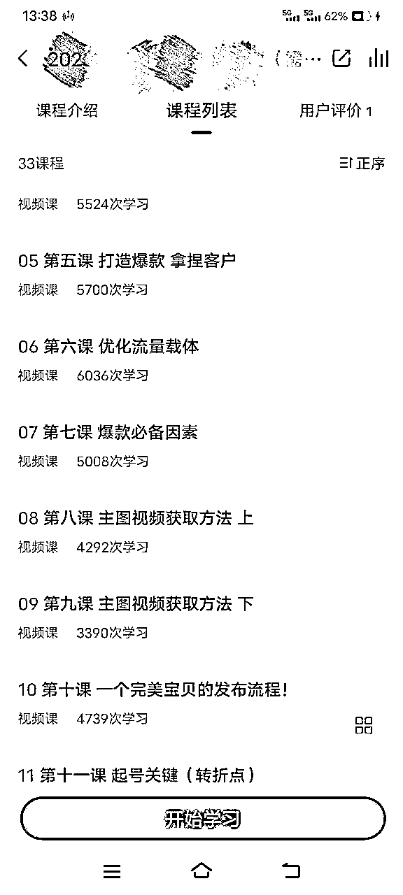

# 大二开工作室失败，我得到了什么？

> 来源：[https://y0pouyn2ytx.feishu.cn/docx/XBhfd8WQpoxmjlx6f1Lcp0Hrnng](https://y0pouyn2ytx.feishu.cn/docx/XBhfd8WQpoxmjlx6f1Lcp0Hrnng)

大家好，我是楠天，现在是一名02年大四学生在读。是一名一直在路上的创业者，虽然没有做出什么太大的成绩。这是我第一次分享创业经历，希望给大家在创业过程中提供点参考，避免走我走过的坑。

这是我大二时候的一段创业经历，把它分为几个阶段更好的分享给大家。

一.跟随老师做闲鱼

那是大二上的时候，当时刚接触闲鱼，就感受到闲鱼的流量好大啊，有流量肯定有财富，我看到了商机。所以我在知乎里搜索闲鱼副业，了解到了闲鱼无货源玩法，开启了我的闲鱼之旅。之后自己操作，大概了解流程，并且下场实际操作，发现有流量但不容易出单。为了让项目进度加快，我主动认识了很多教闲鱼的老师，从中挑了个最靠谱的，交了700块（大家对项目进行知识付费前自己一定要先把手弄脏，亲自做一下项目，再决定是否付费），把课程看完后实操，第一个星期就出了一单，给了我很大的反馈。成绩也还不错。第二个月就月入过万，第三个月开了三家店铺。每月GMV可以达到小20万。利润率大概20%（我做的高客单）

二.思维转变

这三个月我很忙，学到了很多，但是我也在思考，这样的零售行业我要干一辈子吗。因为闲鱼的特性，自动下单的顾客是很少的，一般都会咨询你半天，才会决定是否成交，对我的精力成本是巨大的，基本那段时间除了睡觉。吃饭，上厕所都要拿着手机回复顾客消息。回复慢了，客户一下子就跑了，三个店铺让我疲惫不堪。但是我一个月最多只能挣4万左右。是我闲鱼师傅的零头而已 我就在想，我师傅可以挣那么多我为什么不可以。

三.进军知识付费

我师傅闲鱼做的很好，同时也在做知识付费，688一个人，手把手带别人做闲鱼。缴费了后，我当时是千聊平台看的他的课程，我发现每天都要20人左右购买他的课程。不算其他收入，单是课程收益，一天都要赚上万，而且成本为0。还没算上其他收入。我当时就想哇，我要能够做成这样多好。

（每个学习次数代表购买了课程数量）

进军一个行业最快的方式就是模仿，因此我每天除了闲鱼卖货就是在观察闲鱼师傅的模式。了解他的引流模式，付费产品，各种服务等等。但是自己执行力没有拉满，没有以前的那股冲劲。导致我录完课程之后，引流了十几个人，转化为0，就开始怀疑自己了。现在想想，要是在努力努力是不是就成功了。所以当时把失败归咎于是不是一个人做不好这个项目呀，是不是一个人没有一群人一起工作更有动力呀。等等，其实都是我内心在说服自己。然后就想到开工作室。第一次开，就属于摸着石头过河。

四.合伙创业

当时就想创业创业一个人怎么创，雷军大大说过“一个人走的更快，但是一群人走的更远”我就有了找合伙人的想法💡。可是大学本来创业的就少，找到志同道合的合伙人也有难度，通过校园墙的方式，我认识一位大四学长，跟我一样喜欢琢磨这琢磨那，很有意思的一个人。感觉遇到了知己。我就跟他找了个教室在本子上写项目。一拍即可，他也觉得可以搞，我当时就感觉遇到了知己，哈哈。就是哪种心有灵犀的感觉。

五.招募合伙人

我们俩重新编辑招募文案，在校园墙发了招募合伙人的帖子，有几十个人来加我们，当时很激动。我们设置了线上问答和线下面试。在一个教室里用PPT给他们集体讲解了项目。最终筛选出了7个人，同时敲定了股份和出资。最终的出资就是我和学长各出了10000，其他的7个人有的出8000的，有的出6000的（对于这点，我很佩服学长，他有很棒的情绪渲染能力，即使我们跟另外7位同学才见一面，就可以确定出资）具体的面试问题我现在已经忘记了，好像有做这个项目的决心呀，为什么要创业之类的。我觉得这几个人都非常不错。

（可惜当时没合照）

六.合伙初阶段

这个阶段很美好，类似于谈恋爱时候的甜蜜期。我们给工作室取名“铸就非凡”电商工作室，希望我们有一天也可以不平凡。首先，我们合伙肯定要有一个工作场地，这样大家就好一起创业了，我们去学校周边找了个商业房，就是哪种客厅非常大的房间。周围环境也不错。

（当时下班了了灯火通明，很有意境）

根据我们的需求可以设置为办公区，直播区，茶水区，开会区。记得一个月好像3000，一季度一交。之后买办公用品等等，很快乐很美好，每天忙到晚上9点钟才回学校，当时感觉高考都没有那时候努力，哈哈哈。

（多想一直留在那一刻）

七.合伙中阶段

美好的日子总是短暂的，我们倒腾好工作室后，就开始了项目的筹划，我在我的记忆里，我们当时定位产品是闲鱼课程和一对一辅导。引流有线下地推和线上抖音尝试。

我们开始对知识付费的产品进行制定，由于我对闲鱼比较了解，也开过店铺，我负责的是课程的制作与录制。

一名负责小程序的制定，还有宣传海报。还有负责记录我们每天创业日常，并剪辑的。

还有很多内容，包括校园代理招募、营业执照、大学生创业政策、电商货源等等内容，花了我们很大的心血。

我现在电脑里面都还留着我们当时努力的成果，不舍的删去，也是一份奋斗的记忆

八.合伙最后阶段

由于各种原因，我们工作室解散了，结算资产的时候我们跟学长大吵一架，从朋友变为了仇人。我们当时预期一个星期录制完课程，拖到最后解散还有2节课没搞完。

总结

项目失败是有很多因素导致的，我把最重要的几个原因说下。这是我那段时光收获的最宝贵的财富了，现在分享给大家。

1.学长（除了我另外的核心合伙人）

A.特点：会吹牛，营销能力强，技术能力薄弱，精致的利益主义者，没有道义

B.不考虑同伴的感受，强制熬夜加班，在我们白天已经很累的条件下，回寝室要开一个小时的线上会议，同时安排加班任务，不干完不许睡。长时间身体都吃不消，这件事不再让我开心。我现在都理解不了，反应过很多次，他跟我们说当不能心狠到熬夜做项目，那怎么成功，但是自己跟妹子聊天到凌晨。

C 喜欢背刺，我跟他最开始认识的，他会跟我私密的聊些其他合伙人的坏话，到最后甚至要踢出两个干了一个月的新生合伙人，这样我跟他就有更大的股份了。美其名曰说免费劳动力。

D. 当时我们的创业资金交给他的手里，之前开会时说过要制定一个共同账户。最后都没有制定，同时工作室结算时，故意把账单里面的很多内容删掉，最后结算时，除了工作室开销，创业资金5万块已经被他花的只有3000了。故意下套，把损失都强加给另外几名合伙人，我不同意，然后经历漫长的扯皮。（最开始有多亲，最后就有多狠，都要吵到办出所了）

2.我的问题

A.我作为最开始提出项目的人，并且在闲鱼这个领域还算是有一点小结果的，没有以自己的判断决定为主导，太相信别人的一面之词。同时把财务也交给一个人手上。给了我一辈子的教训。

B.自身创业经验的缺少，第一次开工作室，说实话，忙的方向都是错的，一直紧抓产品，要精细要让客户多喜欢，一直没有变现。没有搞流量，大错特错。！！！线上抖音有搞效果不好）

C.感情用事，创业是残酷的，不能太相信一个人，就像这次把创业资金都给学长一样

D.自己能力不够全面，没有以自己为主导，还不够自信。

3.项目的问题

A.最主要的打通第一个MVP，时间太长了，我之后总结按照我们当时的速度，很快创业资金就扛不住了，对于我们学生来说压力是非常大的。

B.没有用心搞流量，天天钻研一些有的没的，浪费时间。起个名字，搞个海报还要搞半天。效率低下。

C.管理制度的严重不合理，后来大家越来越不开心。导致大家相继退出。

4.其他问题

A.其他合伙人都是学生，除了学业繁忙，还没有任何创业经验，在做项目的过程中，无法忍受这么长时间没有正反馈。

B.没有向同行学习，自己摸着石头过河。

C.工作室出了问题没有及时开会解决。而是一拖再拖，最后爆发出来。

在一次短学期实践内容中上台发言，讲到工作室内容，当时对工作室开失败感觉不好意思，很愧疚。但是老师鼓励我说，“失败的是项目，而不是你”这句话令我印象深刻，鼓励我前行，现在我把这句话送给大家!

谢谢大家有耐心看完，希望可以帮助到大家。