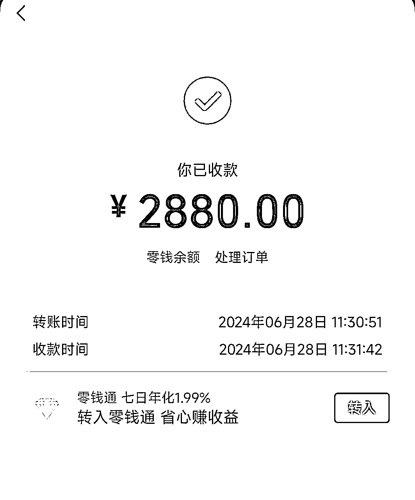
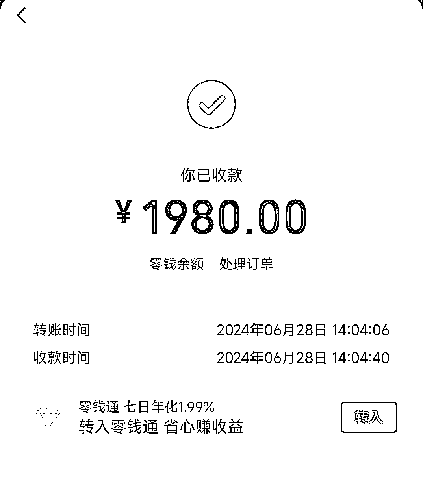
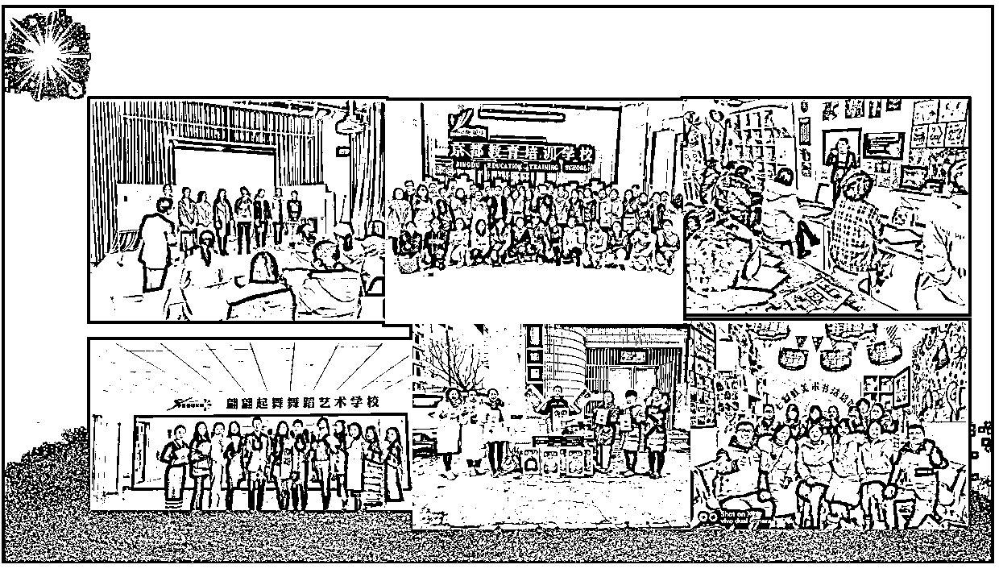
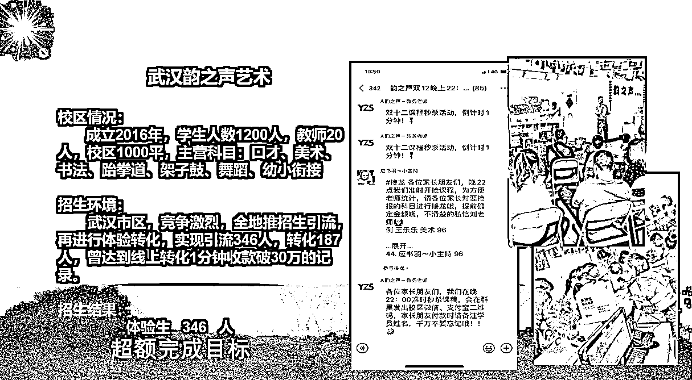
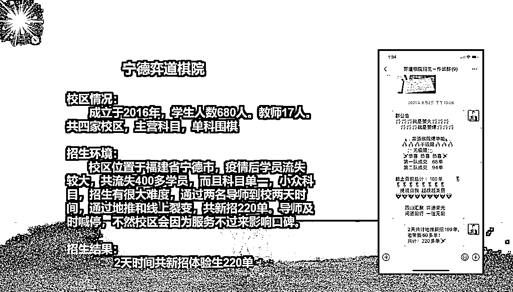
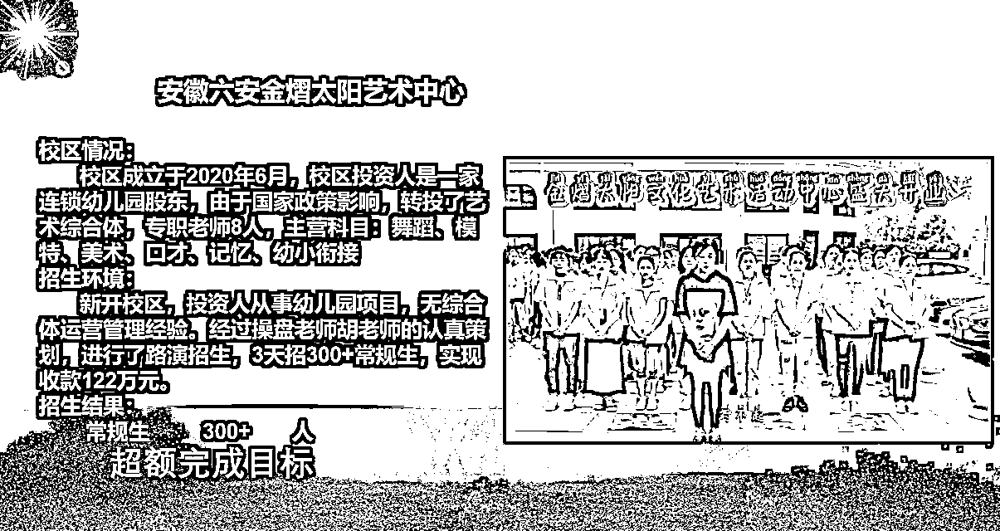

# 【项目实操】从0-1剖析农村暑期补习项目

> 来源：[https://py8zdt8aqs.feishu.cn/docx/SfyCdqli7otMDpxdkofc78uenqd](https://py8zdt8aqs.feishu.cn/docx/SfyCdqli7otMDpxdkofc78uenqd)

暑假已经过去了，盘算一下暑假的数据，给自己这个短期项目做个总结，同时也给看好教培的圈友一个正解。

当然了教培绝对不是

最赚钱的，也不是赚快钱的。咱们社群搞电商，自媒体的挺多的，这些相对来说踩中了赚钱快，而且是超级多，动不动都是百万起步。

教培啊，在这里我先说说大致营收啊，还是说利润吧。一般一年或者一个周期项目，盈利也就几十万，真达不到动不动好几百万，好几千万。所以想赚上百万，上千万的大佬看到这止步就行了。

## 一、我介绍一下我本人

我也是生财4年的圈友了，也曾有幸获得一枚龙珠。我主要是做教培营销的。

在这里我先送各位圈友一句话：不要站在行业之外看行业！

在行业外看行业，你根本不可能看得懂行业。如果你圈外人都看懂了，都能赚钱，那也太不尊重行业内的老前辈了。很多行业看似简单，或者说大佬说的很简单，但是他从来不说他具备什么样的资源，具备什么样的人脉，他只告诉你轻松几百万，告诉你非常简单，实际不是的啊，这就是你被割的原因。

教培这个行业，很多人是熟悉的，但你这个熟悉有可能是假熟悉。

怎么判断你是真熟悉还是假熟悉，那我给你列一些公司你听听：天地人和、西点军校、腾跃、朗培、君学、欧美思、北京现代、和君、华德汇智、正贤、小来、小水滴、汇爱、领跑...........如果以上你几乎都没听过，那你就不用说你知道教培了，你应该是知道补习班、培训班而已。

教培行业里有那么个教补习班、培训班如何运营的组织，就是教培商学院，上面的举例都是教培商学院。

我本人，网名简峰校长（曾用名：精简峰、裂变王子、道一），曾任职国内最大的教培商学院北京欧美思教育集团，负责全国15000家会员校区的招生服务。

可以说是走遍了全国各地！带团队落地4000+校区的招生活动，为机构引流了近百万生源（整个团队）！

经济发达的时候你看不上教培，但最近三年你如果没有强的资源能让你挣几百万上千万的项目。那么对普通人而言教培就是最好的项目！

穷什么都不能穷教育，补习行业经过十多年的发展，已经深入家长心里了。一个学生四五六线城市单课习3000左右，二三线城市在3000-6000之间，新一线在6000-8000之间，一线城市在1万左右。个别高端课程，价格更高，比如击剑、网球、足球、钢琴等等，课程价格挺高的。

口罩缘故，大环节也不好，而我也曾想过转型，想挣大钱。每当深夜刷生财，看着好多分享的大佬都是月入好几百万啊，给我整焦虑了。我也想挣啊！

我曾投身电商，短视频、直播带货等等，在快手一个月做出来过70万粉丝的账号，在视频号一个月做出来12万粉丝的账号。但是变现都不行，还不如我们招生变现快，还稳定。

看了那么多行业，也躬身入局了茶叶、和田玉、翡翠、天珠、星月菩提等一些文玩，没做出什么大结果，也没被坑过，还是比较平稳收场的。

转一圈，发现还是教培行业好，现金流稳定，而且是预付款，市场足够大，多得劲。就目前的大环境，对普通人来说，没有比教培更赚钱的了。

我除了给机构做营销活动，还有自己开机构。暑假时候会做一个短期盈利项目，这也是我今天要跟大家分享的，适合普通人项目——农村暑期补习项目

整个教培行业这几年一直在地震，生源减少，各种查，城市里卷的不能再卷了，恰恰农村成了好市场。我把我整个的项目经验分享给大家，供大家参考学习！

## 二、项目概况

这个业务我们在疫情前做过3次。疫情期间2022年没怎么开起来。

2023也开了，但我们这年在做兰州的暑假班。农村暑假班，其实也没开起来，也就100多个孩子。

2024年，今年的暑假，我们收了460人。

2016年收周边镇上60人（县城校区自有100多人），亏损。

2017年收330人，利润30万

2018年收390人，利润40万

2019年收310人，利润30万

2023年收140人，利润12万

2024年收460人，利润42万

下面是我们最近的收益截图：

下面给大家介绍下这个项目：

1、暑假补习班的机会：这种补习班在暑假是刚需！

农村市场非常大，随着经济发展，时代作用下出了不仅仅是农民工这个词群体，还同时出了留守儿童这个群体。农村有大量的留守儿童，暑期不上学，就存在各种不安全因素，一般老人管不住。

如果有一个地方每天可以照顾孩子就很好，再能补习下暑假作业就更好了，再可以给预习一下新改变课程，那简直不能再好。

可见啊，农村暑期，家长是非常刚需的，只要你宣传到位，成交起 n 来很简单。

而且现在道路比较畅通，农村的中心就是镇。一般一个镇有几十个村子，每个村子好几百人，学生少的几十人，多的几百人。你可以想想，一个镇上有上千学生，多的能达到三五千小学初中生。我老家河南的，机构也是在河南开，我们那人比较多。

一般的镇上能招三五百人吧，每个人收费1000，也就是30万以上营收，成本也就几万块钱，一个月搞定，短平快。

2、暑期补习一般收费1000-2000元一个月，全天全科目，不管接送不管饭，每年暑假都可以做一次的。

我们从2016年开始做农村暑假市场，一直到2019年。疫情期间没有做，去年2023年又重启项目做了一期。根据我们多年的运作经验，我给大家画一个模型：

单家运营基本30-50万营收，可以多镇布点，这样一个月营收是40-300万之间。

我们按照单点进行计算，房租1万，水电5000，按照500人，营收50万，500人需要10-15个老师，按照最大数值15人，每个人工资3000，老师工资4.5万，用的是大学生。宣传有一些成本，但不高，稍后给你讲如何宣传。这样算下来，你会发现利润挺高的。

3、面向群体：农村孩子

从小学1年级，到初二。因为幼儿园的太小，不能招，太废人，初三的是毕业班招不了。

4、场地：

一种是和幼儿园谈场地，房租也便宜，她空着也是空着！

一种是好多村的小学被合并了，你找到搬空的小学，找当地的村委谈就可以，给这个村的孩子来点优惠就搞定了！

选址一定要选交通便利的，最好是这周围村子的中心，这样方便老人接送！

5、盈利模式的区别和优劣势

这个项目是短期项目，平时是做不了的，至少说北方肯定做不了。个别地方平时可以做补习，比如说依附一线城市周边的镇是没问题的！

大部分农村平时做不了，一是一旦开学，家长没有这个理念意识啊，而且耗课周期长。收费低，也就是你需要耗课一学期，甚至一年也挣不了多少钱啊，不够费劲呢，暑假是集中上课，耗课快，短平快啊。

南方的城镇发展比较好，很多镇其实比北方的县城都要好。南方的教培市场更发达，周末班是存在的。

这也导致这种模式适合北方，南方可以走正常的教培模式就可以。个别地方也可以用到暑假模型。

下面是我们自己转化报名的图片：

这是我们招生服务的校区：

案例太多就不再多放了！

## 三、流量从哪里来

1.渠道入手

首先做这个项目啊，你是本地的就更有优势，因为你的人脉资源在这呢。你是本地人，就好办事，你清楚的知道这个镇有多少村庄，有多少个学校，大概有多少学生，甚至场地什么的，你都很轻松的可以搞定。

招生先是从渠道，也就是从学校下手。我们都知道城市里的老师，一到暑假就开班，农村的老师开不了啊，没那环境，也没那氛围。

你是这毕业的，你肯定自己认识或者通过关系认识一些学校的老师。那这样你就可以找会来事的老师，暑假想开班赚钱的老师，一起合伙开暑假班，谈好分成就行了。她们工资本身不高，要求也不高。你用他这个关系，就比较好宣传，每个班都有家长群，发一下就行了，因为暑假是刚需中的刚需啊。

你看看每年溺亡的小孩有多少，就知道家长多担心孩子安全了。你要是能搞定主任或者校长类的就更好办了啊。

走渠道，挨个学校进行走，就可以直接触达家长。把自己的补习班包装好一些，让家长放心，让老师放心，就不愁推荐不来学生。这对你个人的运作能力还是有一定要求的，好在这片你熟啊，甚至各村都有同学关系。

2.从镇上集中宣传招生

每个乡镇都会有固定的赶大集的时间，这个时候很多人从各个村都到镇上买东西，你只需要守好各个出入口就行了。

当然你能力再强点可以和镇上和你客户群体比较重合的商家合作，谈好处就行。这就是简单的异业联合啊。

你也可以摆摊，吸引咨询。比如有套圈的，有送西瓜的（开封产西瓜，很便宜）等等。只要你出击，肯定有结果！

3.深入村庄进行宣传

我们做完前面2种宣传模式后。可以利用已经拿到的报名数据，整理人脉。然后各村线下进行宣传，线上也可以同时跑着。

线下广告单页，挨家挨护发，老房子，一看就不住人的房子就不要发了啊。

或者你招募当地村里的妇女，把要求告诉她就行，她挺知道哪家有孩子，哪家没孩子上学的。一个片区你找一个这样的人，很快打通啊。工资一般60左右，而且她还能深入敌人内部，给你搞来资源，你付提成就行了。

还可以送西瓜，有小孩上学的家庭，免费领，拿个大喇叭，或者大音响全村吆喝就行了。简单粗暴最高效！

4.线上宣传

一方面啊通过前面渠道报名的学生家长，你可以做一个链接，礼品给到位，让家长疯狂宣传就行了，要是有个介绍礼，那就更牛逼了。那简直是铺天盖地的宣传啊。市里你可能住一年了都不认识上下楼的邻居。在农村根本不存在啊，有的社牛几乎认识全村人啊。而且这批家长小时候也是一块玩到大的，相互转介绍非常快。好多村，还是亲戚串亲戚，真宣传开了，机制设计好了，那简直是不用动，学生像海水一样涌进来，一点都不夸张。

以上是宣传是各种方法，落地还是需要一些物料工具的，特别是裂变用到的机制和礼品，非常重要，每个阶层喜欢的东西不一样。

## 四、项目是怎么0-1做起来的？

讲一下我们去年2023年如何做这个项目的吧！

1.师资，人员配置标准

师资这块，我是已经大学毕业10年的人了，肯定是没有大学同学能拉过来搞的啊。但是我们有另外一个项目，就是研学项目，我们研学做全国市场，平时做半日营，周末营，节假日营，暑假就做长期营。我们做研学就需要研学导师啊，我们就和3个大学合作，培养了一批可以跟着我们落地研学的在校大学生。

这个前期对接的创业中心和就业中心，需要你有营业执照啊。每年都面临就业压力，甚至是学生实习的压力。打通大学生渠道，其实可以做的事情挺多的。

如果你不具备打通学校的能力，那你找各种校区内的协会或者学生会，也是可以的。谈好如何给介绍费就行了。

再说人员配置标准，一般是30-50人一个老师就可以，关键看教室大小能坐多少人。按照这种配比，500人，也就需要15个老师就可以了。而且是他们先工作一个月再拿到工资，你启动成本非常少。

2.场地

上文我们提到了场地，我们这个是有一家公立小学搬走了，剩的教室刚好。另外我们是做招生的，还谈了一家幼儿园，代价就是帮他们宣传一下，招一下秋季学生。

3.如何进行招生引流

由于中间断好几年了，我们并没有打通所有学校的关系。我侄子在一个初中，我们是从他班主任处入手，介绍一个给200，拉了有30多学生。从另外一班拉了十多个学生。侄女是小学的，拉了一届3个班的，搞了小100人。

其他就是下村去招了，跑了16个村，招了180多人。

在镇上赶大集4次，免费送西瓜留信息，留了300多个电话，报名了86人

线上转介绍有个五六十人，大致就是这样！

4.教学交付

我们需要根据场地进行安排上课内容。如果你找的场地小，就几个教室，那么你可以按照半天去排课。

交付内容：

1.暑假作业

2.看书阅读

3.游戏活动

4.3门主科预习

其实交付很简单，因为没有任何标准，就拿暑假作业来说，不上这个班也得写。上这个班就是写的时间规划一下，真开学了，暑假作业没老师检查。

看书阅读玩游戏是孩子们比较喜欢的，大学生刚好满足，和学生能打成一片，多好！

主科预习，我们收的都是小学和初中的，课程内容非常的简单，多少备课讲简单的知识点一点问题没有。

在整个暑假期间不存在校区的考试，也就形不成对比，就不会反馈质量差。

5.学生安全

安全这块特别重要，签到和签退，必须严格控制。

家长或者监护人入学时必须签安全须知协议，协议内容，校外安全由家长或监护人负责！

必须为每一个孩子买一个月的意外险，家长出钱！

以上是一个暑期项目起要注意的点，其实真正落实时候挺难的，特别是第一次做。但是利润非常可观，适合创业的大学生！

## 五、遇到过哪些困难

### 1\. 人员方面

2016年做的是第一年，理想很丰满，想学教员走农村包围城市路线。我们在县城开了机构，4层楼1200平，招生成了最大问题。

然后我们就想着把周边村上的，镇上的学生向县城学校拉。

这就需要有车定时接送学生！安全是个大问题，被交警查后，就不敢再这样运作了。

这种拉周边学生的模型，也没招多少学生，也就是五六十人。可想而知，第一年是亏损的！

通过下乡，我们发现了乡下的需求，也就有了干农村市场的想法！

在2017年我们开始做农村市场！

人员是最大的问题，记得第一批招的大学生，一到放假直接跟着学校的学长学姐到南方电子厂打工了。导致我们储备的12个人，只来了4个。

我们又临时在县城的高中找到班主任，介绍应届高三毕业生学习好的学生。我们拉他们过来每天辅导学生作业。算一下把人这块问题解决了！

这种方式，后来我们升级了一下。直接告诉家长高考状元伴读。报名噌噌的就起来了，那年我们收了300多人，初中生200人，小学生100多点。误打误撞，歪打正着啊，家长特别喜欢这种伴读。

这也打开我们文化课加盟的招生模式（在此期间我们还左右文化课加盟业务）。

### 2\. 场地问题

我们刚开始没想过租幼儿园，我们是在镇上租房子，然后利用原来老师的关系，从公立学校借一批桌子。

给镇上的老师拿点好处就行！房子不太好招，因为需要好几间教室。2017年镇上的小学好几所，还没有倒闭的。

我们租了临街的二楼，租了5间，每间房顶天了坐30个学生，暑假超级热🥵。

后来经过家长的介绍，我们才发现原来幼儿园刚好合适啊。有一个家长的亲戚开幼儿园的，私立的那种。我们谈了一下，一个月1万租金，就顺利的搬过去了！

### 3\. 宣传招生

真正去做的时候，你会发现大家都是腼腆的，都不愿抛头露面。特别是我们在市区，在县城有机构，谁还愿意干这活啊。

一开始宣传，只敢发单页。眼看招不到学生啊。

我就把我们市里的合伙人，拉过来，我们3个人，亲自一群雇的大妈去发单页。这个时候，留电话，一个1块钱，底薪50一天，西瓜管够。

早上进村宣传到10点，中午休息，下午4点半集合，出发各个村，晚上8点收工。大妈们特别喜欢干，西瓜，饮料，雪糕管够。带着我们招的高中生还有那大学生，挨村进行宣传搜集电话，加微信！

我们拿到电话和微信后，开始邀约过来看校区，可以体验3天！刚开始是一天，一天出现的问题是有的家长压根不来，时间短又搞不定孩子，就没人交钱。3天刚好，和小孩混熟了，直接家长转微信，特别方便。

报开后，真的是成群报名，一个村在一块玩的七八个都会报名。招生就靠给学生返钱做起来的！

1000块钱，我们直接给学生100拿去花吧。

学生拉学生，速度真的是特别快。

### 4\. 安全问题

一开始没意识到安全重要性。想着我们开班，就是让家长把孩子送来，不到处跑，不就安全了吗？

其实不是的，因为从各个村到镇上有3公里左右的路的，小孩子有爷爷奶奶送。初中生就成群结队了，这群小孩不好管理。又🈶上补习班的借口，有好几次都是组队出去玩了，上网吧，游泳等等。

开始我们只能要求，严格要求，没意识到事情严重性。

后来发生了有其他学生游泳溺亡事件（不是我们机构的学生），这个时候人心惶惶啊。家长不敢让小孩在出来了，而且天天村里的大喇叭有宣传，不让小孩在一块玩，游泳！

这个时候影响来了，首先是缺勤，后面还退费二十多人。因为管不住啊，不退不行，怕风险。

我们给所有老师嘱咐，必须监督你带的学生安全。

有一次，一个学生放学后跟着同学去玩。到晚上8点了，孩子爸爸打电话说学生没回家。孩子爷爷年龄大，也没法来镇上，在家等一直没等回来。就给孩子爸爸打电话了。孩子爸爸又打给我们老师，当时那真是急坏了！那个时候农村的配手机的特别少。没办法，老师只能骑个电动车去找他们一起玩的小孩。跑了3个村，才找到人，索性没发生啥事。但把我们吓的不轻。

我们给每个小孩都买有一个月的意外险。

## 六、项目门槛

项目是短期项目，只要你去做，不存在亏本的可能！

人员是一个月后结束才发工资，招多少学生用多少员工，不存在亏！

1、项目是否存在亏损风险

场地，一般的场地一个月在农村，1万以内，也就是10个学生的学费而已！

宣传，如果你是本地的很简单，不是本地的也别怕，买个三轮车二手的，千把块钱，拉着五六个大学生宣传招生就行了。

2、时间限制

这是一个介绍暑期培训的文章，该文章仅对暑期项目有用，平时的培训机构运营和暑期还是有很大区别的。

在农村其他时段我们没有做过，也就没有发言权啊，大家可以参考暑假这个模式。

2、地域限制

南方的镇上可以，有补习班，常年的补习班（广东那边镇上，浙江，福建的镇上）。

北方的农村人口多，生源大，家长外出打工，留守儿童比较多，北方镇上经济不如南方发达，此项目更适合北方的农村市场。

3、操盘人

再好的产品，再好的项目，人，才是成功的核心。这要求操盘手有一定的领导能力，执行力强。

这个人最好是当地的好一些，他对本地情况肯定了解。

## 七、入局建议或者去其他经验分享

我首先是想给所有即将创业和创业的人说，一定要懂基本的商业逻辑。如果你不懂，那你只需要知道钱从哪里来，到哪里去就行了，这个过程你看你能不能得到自己想要的钱就可以了。

再者就是不要去轻易评价项目的好坏，说实在的再小的行业，里面也有挣百万，千万的。最重要的是你全面了解后，去评估一下是否适合你最重要。

最后我想说：创业不是赌博，不是博概率，创业是必成事件！

当你有了商业认知，有了逻辑思维，你看项目应该是全面的，演练的，而且是得出来100%可以成功创业的。你只需要在真正落地时候，有突发情况，就是没考虑到的情况，去用自己的能力解决就行了。

愿每一位积极进取的人，稳步生财！