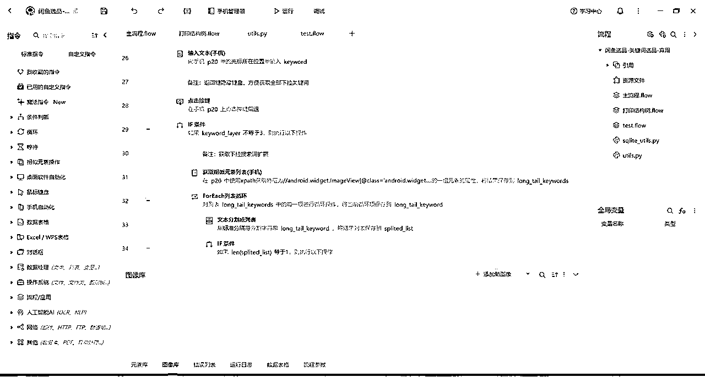

# 闲鱼虚拟项目自动化选品上品工具分享及开发思路复盘

> 来源：[https://fiazd3hbob.feishu.cn/docx/T7uFd8OGQoPH4cxly7LcMxBqnsb](https://fiazd3hbob.feishu.cn/docx/T7uFd8OGQoPH4cxly7LcMxBqnsb)

新的一期航海马上就要开始报名了，看到有闲鱼虚拟的项目，正好前段时间自己用Cursor和影刀做了一个关于闲鱼虚拟项目的自动化选品和上品的工具，分享给大家。

声明：

第三部分分享的源码，都不是开箱即用的，因为代码里有一些“硬编码”，比如数据库的文件路径，还有影刀里关于闲鱼App的自动化，可能会对App版本，以及元素定位等有一些有求，可能需要对源码进行一些简单的修改才能在你的环境下使用，好在现在有Cursor，借助Cursor进行源码review并学习，可以很快掌握源码结构。

如果你要使用本文档提供的自动化工具进行选品上品，请遵守法律法规，不要做强版权相关的品，由于这个原因导致的一切后果与工具作者无关。

## 一、工具介绍

这套工具主要有三部分组成：

*   工作台，主要用Cursor开发，可以管理对标账号、对标品、选品关键词以及对自己闲鱼多账号的管理

*   自动选品，主要使用影刀开发，分为两个部分

*   针对选品关键词自动搜索并筛选出符合选品需求的品

*   针对对标账号自动筛选出符合选品需求的品

*   自动上品，这部分同时使用了Cursor开发的代码和影刀，主要使用阿奇索的功能来实现自动上品

### 1.1、工作台介绍

*   自有账号列表页面，主要管理自己的闲鱼账号矩阵，同时给影刀的自动上品提供数据支持，可以使影刀的自动上品脚本实现多账号矩阵的批量上品，目前功能有个缺陷，并没有在页面上提供对闲鱼账号的登录信息维护的功能，需要直接在数据库里进行操作，截图如下：

*   查看对标账号页面，主要维护对标账号，同时给影刀的对标账号自动选品提供数据支持，支持自动解析闲鱼账号主页分享链接并入库保存，同时支持手动填写对标账号昵称和url入库，截图：

*   管理关键词页面，主要是采集到的一些选品关键词的维护，同时给影刀的关键词自动选品提供数据支持，关键词分为三级，2级3级关键词都是在闲鱼搜索框搜索1级关键词时收集到的下拉词，截图：

*   已出单商品页面，主要维护已经出单过的商品的发货内容，主要是网盘链接，这个页面支持云端同步，方便多人共用，比如我出单过的商品，去买了一份存到自己网盘了，我会放到已出单商品这里，同时别人拿到这套系统后，可以同步获取所有大家共同已出单的商品，做这个的时候当时是分享给朋友一起用的。截图：

*   首页，这里主要维护影刀自动选出来的品，支持对品进行进一步的筛选，去除掉不符合自己选品需求的品，同时支持云端数据同步，方便多人共享选品。每个品都有一个Flag，自动选出来的品的Flag是默认，进一步人工筛选可以给品分类成强版权弱版权等等。在这个页面还可以把品的链接导出，导出后提供给影刀自动上品来使用。出单后，也是从这个页面来录入已出单商品的发货内容。截图：

### 1.2、影刀自动上品介绍

自动上品主要使用的是阿奇索的功能，需要自己的闲鱼账号绑定阿奇索，并打开“允许绑定的91卡券账号直接登录本店铺”选项，绑定好后是这个样子的：

这个影刀脚本（文档最后提供，可以直接导入自己的影刀账号使用），支持同时多个账号自动上品，会自动解析对标品链接并获取文案、价格以及图片等等（这部分用Cursor写的代码，融入到影刀里了），还支持自动使用美图秀秀对首图做一些简单的去重处理（经过我多个账号的实践，对首图的去重并不能带来曝光的提升，所以我基本不处理了），由于主要是自己用，代码里有一些硬编码，如果拿到别的电脑去使用的话，可能需要自己修改一下，很简单的：

### 1.3、影刀自动选品-对标账号介绍

这个脚本主要也是用影刀来实现的，需要电脑连接手机，自动化闲鱼App。主要是从工作台里获取对标账号，并从对标账号首页里获取想要数大于等于10的品并入库保存。

这个脚本的缺陷在于，对闲鱼App以及手机浏览器有“强依赖”，可能会由于闲鱼版本不同以及手机品牌型号的不同导致脚本失效，好在很容易修改，源码也会放在文档最后。

同样的，源码里会有一些硬编码需要修改，并不是拿来即用的，好在不难。

### 1.4、影刀自动选品-关键词选品介绍

这个脚本主要功能是通过自动化手机闲鱼App，自动搜索关键词来筛选出想要数大于等于10的品并入库保存到工作台，同时还会收集下拉词并入库到工作台，每次运行这个脚本时，会随机从工作台里获取一部分关键词进行搜索选品。不过近期我都没怎么用过这个脚本了，我一般都是手动从工作台选几个关键词，自己在闲鱼里搜一下，找几个对标账号让1.3的脚本来跑品。主要是维护起来费劲，供参考：

## 二、使用Cursor和影刀开发工具的思路复盘

由于时间比较久了，Cursor的历史记录不太好找，而且本身就是断断续续完成的开发，而且经历过各种想法的试错修改，所以现在只能大概提供一下当时大体的思路供参考。

### 2.1、整体思路

闲鱼虚拟项目和所有电商项目类似，都是选品、上品、发货，发货部分可以完全交给阿奇索，选品上品部分能自动化的尽量自动化，由于我不是很想做强版权的品，所以没有把自动选品和自动上品打通，中间插入了人工干预，从自动选品列表里，人工筛选出弱版权的品，再交给自动上品去做。

选品分为两部分，在影刀脚本里也体现了，一个是根据对标账号选品，一个是通过关键词进行选品；上品的话，主要就是解析上品链接获取文案以及图片，对标题、文案、图片等等进行去重处理（这部分我没做，经过测试对曝光影响不是很大，我主要追求矩阵批量化，每个号500个品的情况下，做精细化运营很耗费精力），解析完对标品之后就是阿奇索的自动化上品，这部分比较简单。

这部分写的不是很细致，但都提供了源码，借助Cursor，都可以很好的学习理解，让Cursor review一下源码，再结合这部分文档，可以比较好的理解，也有助于自己改进代码。

### 2.2、影刀自动化选品脚本思路复盘

这部分折腾了很久，主要是闲鱼有手机App、还有网页版以及微信小程序，最开始想用网页版自动化来做的，但经过测试发现，网页版的一些数据和手机App是不一致的，而且有一些关键词搜索结果，网页版和App相差很大，最主要的还是网页版无法访问闲鱼账号主页，所以无法实现对标账号选品，微信小程序的缺陷在于里边获取到的链接，只能在小程序里访问，封闭性太大了。所以最后只能选择手机App的自动化。

#### 2.2.1、对标账号选品

获取对标账号-->获取所有已经入库的对标品（做去重处理，已经入库的品不再重复入库）-->打开手机App的浏览器并输入对标账号网址-->跳转闲鱼App-->循环获取主页上的商品（自动下滑手机翻页）-->获取商品想要数-->满足想要数大于10且库里没有相同标题的品就获取商品分享链接入库保存

主要思路就是这个，但是里边的“坑”很多：

*   获取分享链接多了会失败

*   闲鱼的文案里其实没有标题与正文之分，需要截取前30个字符作为标题

*   在对标账号主页，有的品可以直接拿到想要数，有的拿不到，所以需要频繁的进入单个品的详情页获取

*   查看商品多了，可能会触发App的防御机制，所以需要在脚本中适当的加入暂停机制

*   有时候会触发App的某个防御机制，虽然肉眼可以看到所有商品的详细数据，比如想要数、文案等，但在上边加了一层“遮罩层”，导致所有数据都拿不到，需要点一下手机屏幕或者按一下手机返回键，这时候就需要进行长时间的暂停自动化防止进一步触发App的防御机制

*   之所以从浏览器打开对标账号网址再跳转闲鱼App，是因为直接把对标账号分享链接放到手机剪切板里再打开闲鱼App，闲鱼App识别到后自动跳转主页，这个很不稳定，同一个对标账号识别几次就不跳转了

拿到这个脚本后，需要自己修改的点，包括手机App包名，以及点击的各个元素的定位方法，有可能会因为版本不同而不同。不过我在脚本里有一个打印结构树的子流程，可以用这个来获取App的结构树xml文件，来辅助定位按钮元素，并不是很难。

#### 2.2.2、关键词选品

获取选品关键词-->获取所有已经入库的对标品（做去重处理，已经入库的品不再重复入库）-->搜索关键词-->收集下拉词并入库-->在搜索结果页循环获取搜索出来的品-->筛选出想要数大于等于10的品并入库保存

坑：

*   折磨了我很久的一个坑是，两个手机完全相同，闲鱼App版本号相同，但是在搜索结果页的元素定位方法就是不一致，导致程序里需要做很多兼容性处理，导致脚本效率极其低下，所以后来慢慢就放弃这个脚本了

不过这个关键词选品真的很有用，会采集到很多自己想不到的下拉词，还会搜出来不少自己想不到的品。初期关键词的来源可以多看看生财里关于虚拟项目的帖子，可以扩展很多思路。

### 2.3、工作台思路

初期弄工作台主要是为了人工介入，将自动选品选出来的品，方便进一步人工筛选，剔除掉强版权和非虚拟品。但是中间各种想法思路进行了很多尝试：

*   自动化选品入库后，在工作台可以再次一键更新想要数，比如今天选品1入库时想要数是10，第二天在工作台一键更新想要数，如果想要数增加了，说明近期需求不错，这样选出来的品更容易出单，但经过几天的尝试，发现想要数增长的品并不多，就放弃这个功能了，不过代码里还留着这部分功能，只是在前端页面屏蔽了这个功能按钮

*   自动选品功能，选择一个自己的账号，获取这个账号已经上架的所有品的标题，然后和新入库的对标品做对比，自己账号没有上架过的品，且这个品的平均每天想要数增长大于某个阈值时，就作为选出来的品进行后续上架测品。不过这个功能现在也是在前端页面隐藏了，目前主打一个多账号矩阵大量测品，所以没有使用这个功能了，但后端代码还在可以作为参考

*   由于需要获取各种更新数据，上边的两个功能，做过很多版本的尝试，用到了阿奇索、闲管家，尝试了selenium、playwright，尝试了undetected chromedriver等等，都是用Cursor来做的

### 2.4、影刀自动化上品

用户选择需要自动上品的一个或多个账号-->读取urls.csv获取对标品链接-->使用download.exe解析获取对标品链接信息（可选）-->使用美图秀秀处理首图（可选）-->打开阿奇索登录页面-->等待用户人工登录（主要是有图形验证码，自动化难度大，没必要硬刚）-->根据用户选择的账号，自动登录阿奇索闲鱼自动发货-->自动上架品-->类目、标题、描述、图片等自动填写上传-->发货地随机（一二三线城市随机填写）-->循环发布

这个的难点主要在浏览器自动化时定位各个元素节点，有时候影刀的自动定位并不那么好用，需要自己写一下xpath，但是好在有cursor，把节点元素源码扔给cursor让它写个xpath出来还是很好用的。源码都在文档后边。

### 2.5、补充：云端同步API

这个主要是工作台云端同步选品和已出单商品用到的，影刀的自动化选品将选出来的品会自动上传到云端，工作台云端同步，都会用到云端同步API，功能很简单并不是那么完善，好在够用，源码在工作台.zip里。

## 三、影刀源码、工作台源码等等

## 四、影刀源码如何导入自己的账号使用

影刀如果不是付费用户，正常来说是无法使用别人写的应用的，但有一些取巧的办法，可以把别人写好的应用直接导入自己的账户，下边是详细的说明文档，可以将第三部分关于影刀的部分导入自己的账号并查看修改：