# 【来来】使用ComfyUI批量高仿AI视频工作流（附带教程+工作流+模型下载）

> 来源：[https://duuxkmjwsy.feishu.cn/docx/Axwvd54VeobBDGxUZZZcGrCdnYf](https://duuxkmjwsy.feishu.cn/docx/Axwvd54VeobBDGxUZZZcGrCdnYf)

# AI批量高仿视频工作流思路

深度拆解使用ComfyUI这个AI神器，免费高仿1个短视频为例的详细9个步骤。括号中是推荐软件

我尽量使用ComfyUI+开源模型，可实现免费批量生成。

1.  下载视频（网站）

1.  批量提取视频关键帧图片（老马特供软件）

1.  AI批量反推提示词（ComfyUI）

1.  AI批量生成图片（ComfyUI）

1.  AI批量图片生成视频（ComfyUI）

1.  AI批量生成音乐/音效（ComfyUI）

1.  AI批量生成对白/旁白（ComfyUI）

1.  AI批量视频高清化（ComfyUI）

1.  视频剪辑（剪映）

# 下载视频

首先我们肯定是要找对标视频下载，我列举了很多在线网站，因为大家都懂的原因多列一些以防某个网站打不开。

随意选择1个网站即可，使用方法大同小异，复制YOUTUBE视频链接，点击下载即可。

## 网站

1.  https://addyoutube.com/

1.  https://youtube.iiilab.com/

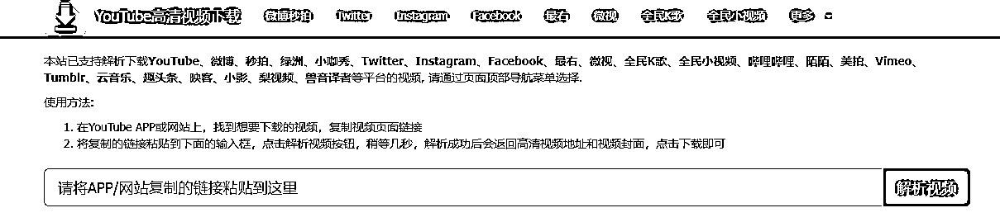

1.  https://hhm.zzrjcp.com/

1.  https://youtube4kdownloader.com/

1.  https://ytshorts.savetube.me/1keen2

1.  https://y2down.cc/zh/

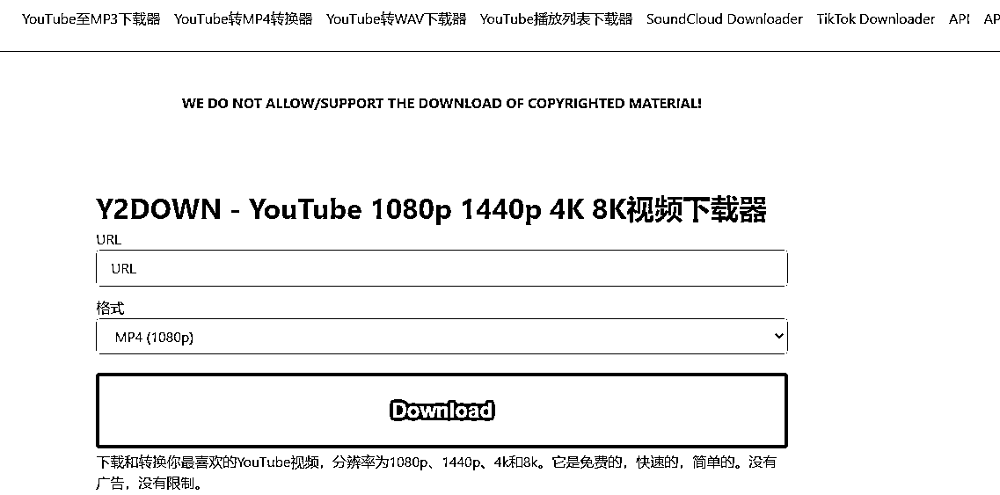

1.  https://www.freemake.com/cn/free_video_downloader_best/

## 实操

1.  我们搜索CAT，会优先展示SHORTS，我选择箭头这个视频，进行后续高仿实操。

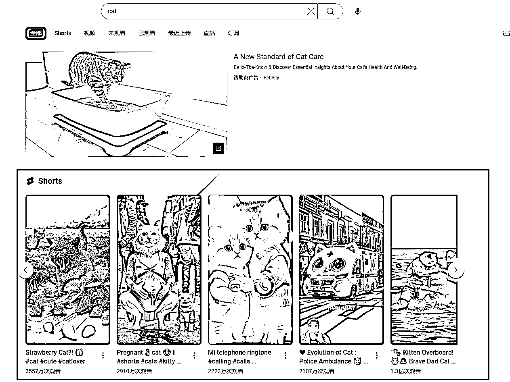

1.  打开后链接为：https://www.youtube.com/shorts/-AXxWdR74k0

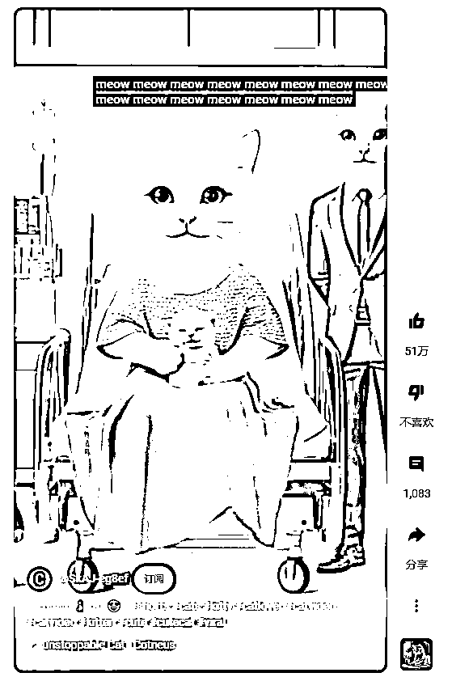

1.  复制视频链接到任意一个下载网站点击下载即可获得视频，我以https://addyoutube.com/为例。

# 批量提取视频关键帧图片

## 软件

多谢生财圈友 @老馬🐎内容出海 提供的工具。

https://pan.baidu.com/s/1QFVnSLKYSG9nUe4nFE-O1g?pwd=lai6

## 实操

1.  打开软件，自动新建输入和输出两个文件夹，把需要处理的视频放在输入文件夹。

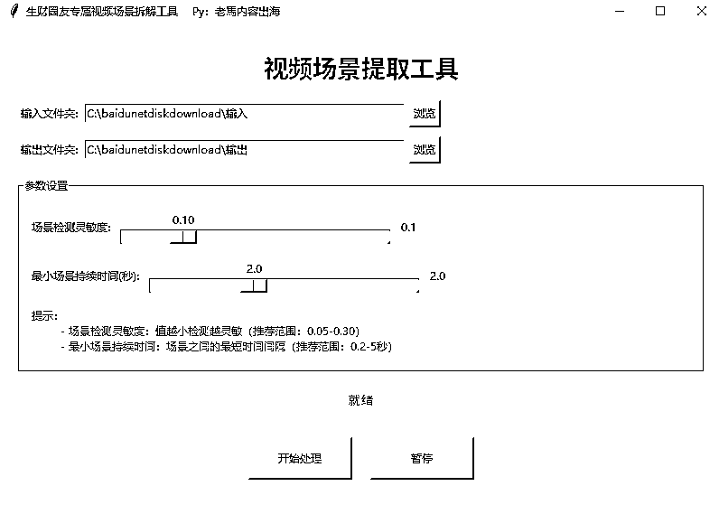

1.  参数可以按照默认去设置，点击开始处理即可。会批量处理输入文件夹中所有视频。

1.  输出文件夹可以得到一堆关键帧图片，第1张黑屏忽略，第2张和第3张和构图一样忽略，这里我们获得有用关键帧共8张（3~10）。

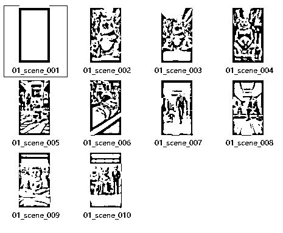

1.  如果觉得图片不够多，可以设置时间间隔更短和灵敏度更小。右侧是设置后的结果，但是发现很多重复构图关键帧，所以参数需要根据不同视频自己微调。

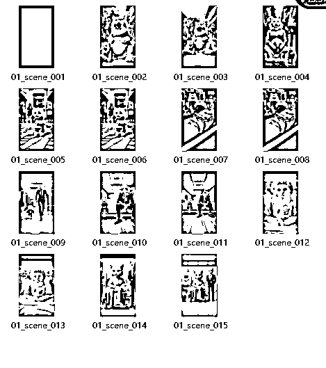

# AI批量反推提示词

## 软件

我们获得了8个关键帧图片，为了方便我重新批量改名了图片“视频名（序号）”。现在我们需要批量反推，这8张关键帧图片的提示词，方便下个环节的AI生成图片。其实chatgpt可以很好的反推出图片提示词，考虑到付费和魔法关系，来来选择使用免费的ComfyUI实现，目前在ComfyUI中可使用多种反推提示词模型，来来以操作最简单的反推模型示范，这个反推模型反推提示词效果中等，但是反推速度较快。

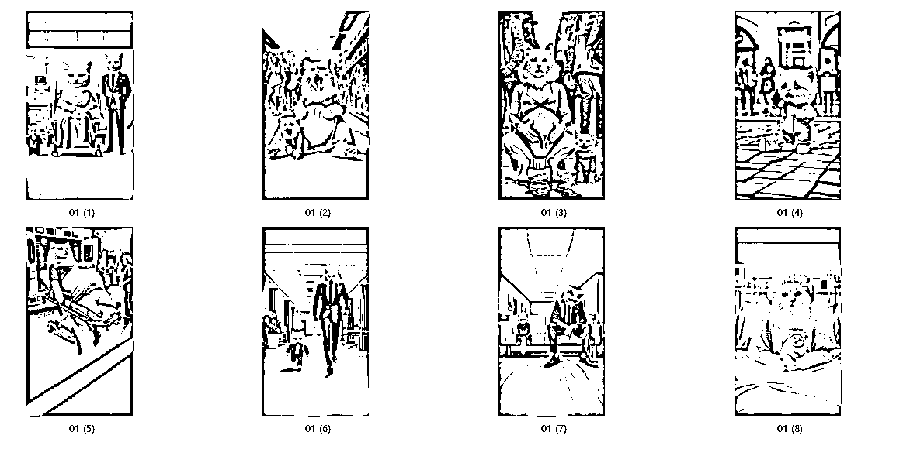

## 实操

### 温馨提醒

1.  请自己按照教程搭建ComfyUI工作流

1.  LIB在线ComfyUI，WD14反推提示词节点有BUG，无法显示反推后的提示词，所以本地使用ComfyUI

1.  LIB在线ComfyUI，不识别文件夹，不支持多张图片批量处理，所以本地使用ComfyUI。

1.  需要批量反推提示词，点击第1个YES。

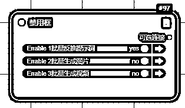

1.  单张图片反推，选择加载图像，上传1张图像即可；多张图片反推，选择加载图像（文件夹），左侧文件夹位置粘贴需要处理的文件夹即可

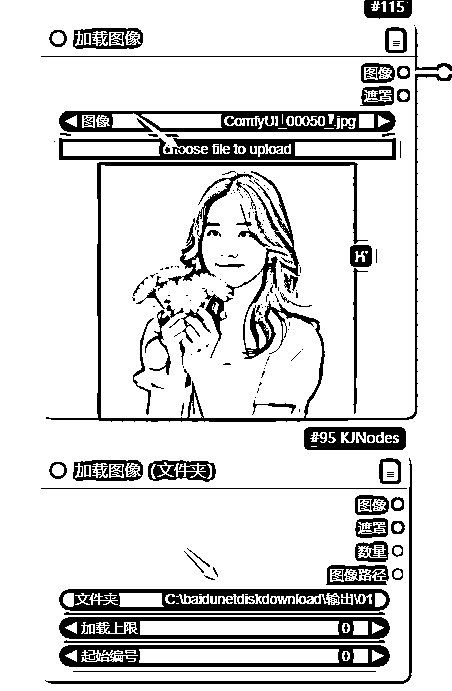

1.  右侧任意选择1个模型，建议选择V3结尾的模型效果较好。

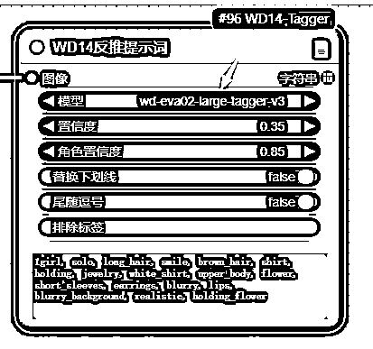

1.  点击执行队列，单个图片会直接出现提示词，多个图片会出现文件夹中所有图片的提示词。

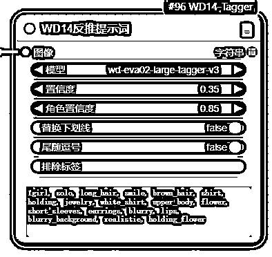

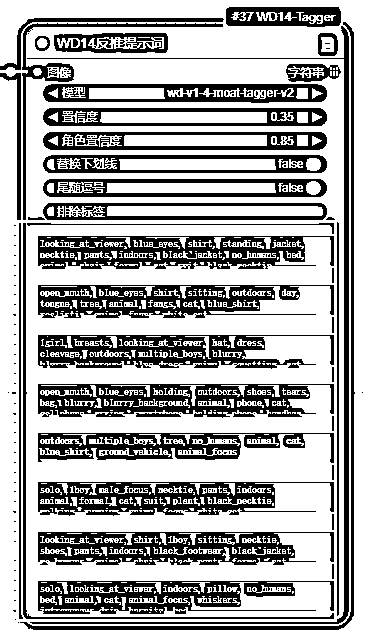

# AI批量生成图片

## 软件

我们已经获得了8个提示词，建议直接使用这8个不同提示词批量使用AI生成图片，来来依然选择使用免费的ComfyUI实现。

## 实操

### 温馨提醒

1.  请自己按照教程搭建ComfyUI工作流

1.  LIB在线ComfyUI，不识别文件夹，不支持多张图片批量处理，所以本地使用ComfyUI。

1.  这里点击YES

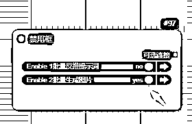

1.  加载模型：checkpoint模型不用修改。lora模型可选择FLUX版本的各种风格模型，我选择的是3D风格。原图是皮克斯风格

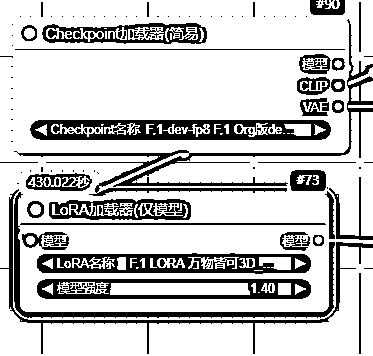

1.  设置提示词：使用下面的提示词设置8张为不同提示词

1.  looking_at_viewer, blue_eyes, shirt, standing, jacket, necktie, pants, indoors, black_jacket, no_humans, bed, animal, chair, formal, cat, suit, black_necktie, animal_focus, black_suit, white_cat, intravenous_drip, hospital_bed, hospital_gown

1.  open_mouth, blue_eyes, shirt, sitting, outdoors, day, tongue, tree, animal, fangs, cat, blue_shirt, realistic, animal_focus, white_cat

1.  1girl, breasts, looking_at_viewer, hat, dress, cleavage, outdoors, multiple_boys, blurry, blurry_background, blue_dress, animal, squatting, cat, green_dress, pregnant, puddle, aqua_dress

1.  open_mouth, blue_eyes, holding, outdoors, shoes, tears, bag, blurry, blurry_background, animal, phone, cat, cellphone, crying, smartphone, holding_phone, handbag, overalls, animal_focus, white_cat

1.  outdoors, multiple_boys, tree, no_humans, animal, cat, blue_shirt, ground_vehicle, animal_focus

1.  solo, 1boy, male_focus, necktie, pants, indoors, animal, formal, cat, suit, plant, black_necktie, walking, running, animal_focus, white_cat

1.  looking_at_viewer, shirt, 1boy, sitting, necktie, shoes, pants, indoors, black_footwear, black_jacket, no_humans, animal, chair, black_pants, formal, cat, suit, couch, black_necktie, wooden_floor, animal_focus, black_suit

1.  solo, looking_at_viewer, indoors, pillow, no_humans, bed, animal, cat, animal_focus, whiskers, intravenous_drip, hospital_bed

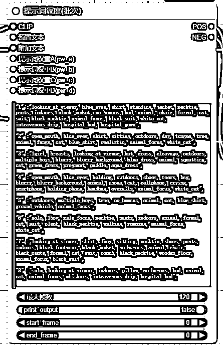

1.  修改参数：重点修改图片宽度和高度，批次大小设置为图片总数。其他参数可以默认不用修改。

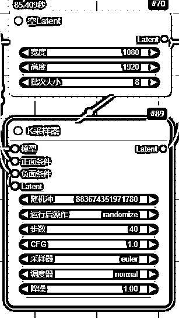

1.  AI自动生成图片：生成了8张不同提示词内容的图片，这里我们看生成的图片和原图差别很大，其实我是希望实现一点不同的画风。

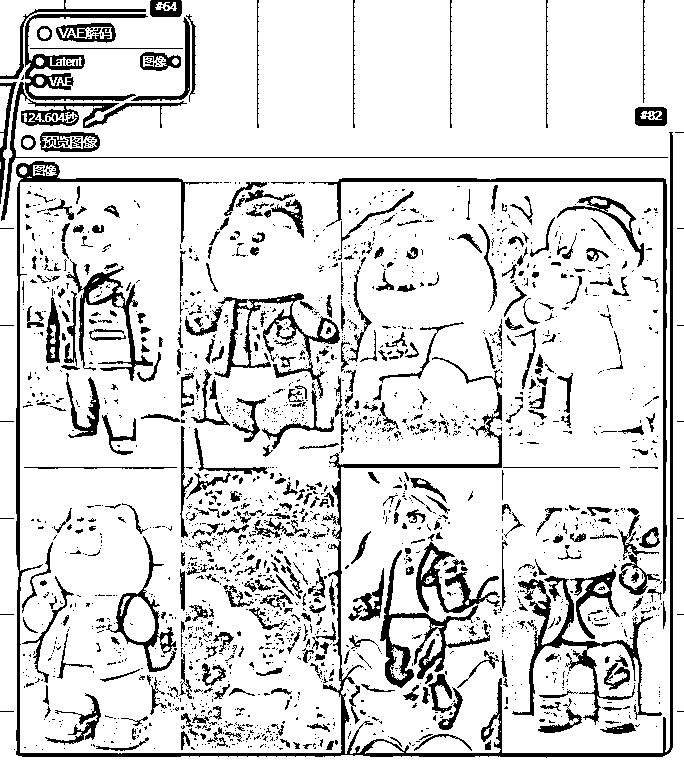

1.  如果需要和原始一模一样的画风，更换LORA为皮克斯风格即可。

# AI批量图片生成视频

## 软件

我们已经获得了8个图片，建议直接使用这8个不同图片批量使用AI生成视频，来来依然选择使用免费的ComfyUI实现。

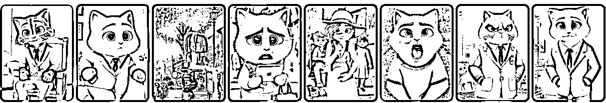

## 实操

### 温馨提醒

1.  请自己按照教程搭建ComfyUI工作流

1.  LIB在线ComfyUI，不识别文件夹，不支持多张图片批量处理，所以本地使用ComfyUI。

1.  这里点击YES

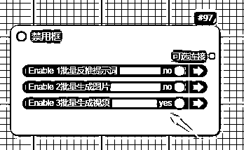

1.  加载模型：checkpoint模型不用修改。这里加载的是SVD视频模型

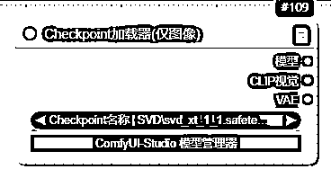

1.  加载图片：单张图片点击上方上传加载，多张图片文件夹使用下方节点上传

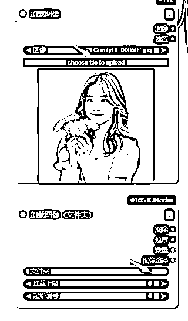

1.  修改参数：重点修改视频宽度和高度保持和图片大小一致，批量处理时候确保每张图片大小一致。其他参数默认不用修改。

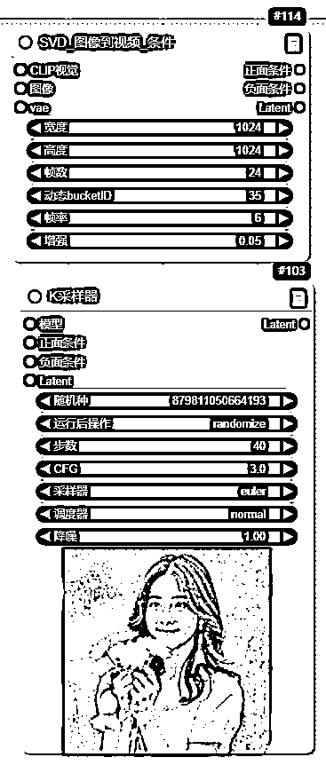

1.  AI自动生成视频：会自动生成8个视频，这里我们看到视频和原图还原度极高。

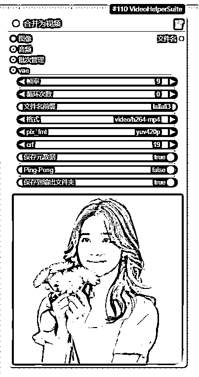

# AI批量生成音乐/音效

## 软件

我们已经获得了8个视频，需要配上一段好听的音乐或者音效，来来依然选择使用免费的ComfyUI实现。

## 音乐下载实操

1.  如果你需要使用原来的背景音乐，可以直接下载原视频的音乐，复制短视频链接：复制视频链接到任意一个下载网站即可，https://www.youtube.com/shorts/-AXxWdR74k，我以https://youtube.iiilab.com/为例，选择下载音频，就可以单独下载原视频的背景音乐和音效。

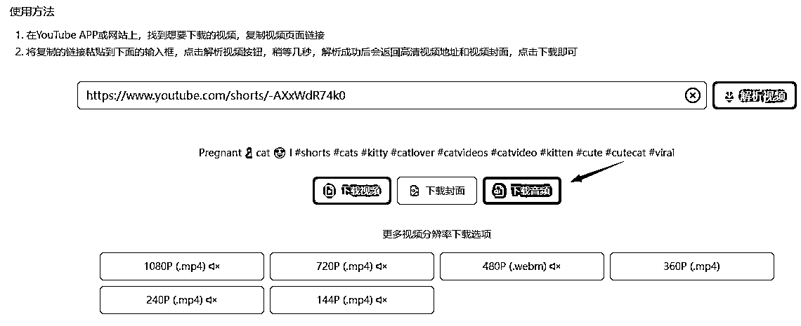

1.  获得音乐

## 音乐生成实操

### 温馨提醒

1.  请自己按照教程搭建ComfyUI工作流

1.  加载模型：上面加载stable_audio_open_1.0模型，下面加载t5_base模型

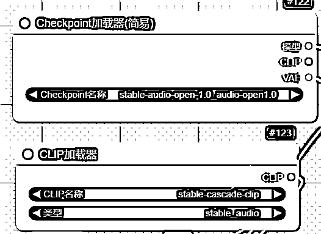

1.  设置歌曲的时长和生成数量。

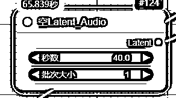

1.  设置生成音乐/音效的提示词

### 提示词参考

轻松的爵士小调：Very relaxing and pleasant jazz music, suitable for vlogs.

蛙鸣：A summer night with many frogs croaking.

雷电交加：Thunder and lightning, accompanied by the sounds of the wind and waves

1.  设置参数：默认参数不用修改

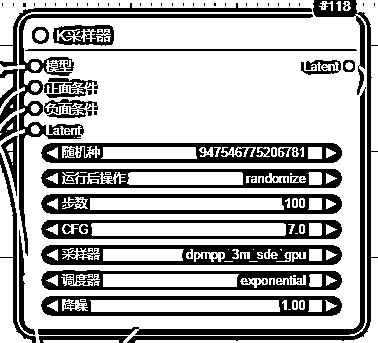

1.  AI生成音乐：音乐以文件形式存储，请去LIBLIB的图库下载。

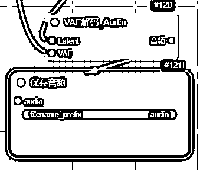

# AI批量生成对白/旁白（非必需）

## 软件

这个步骤并非必须，很多shorts没有对白可以忽略这个步骤。来来依然选择使用免费的ComfyUI实现。

## 实操

1.  下载节点https://github.com/shadowcz007/Comfyui-ChatTTS

1.  该节点目前可以创建音色，复用音色，支持多人对话模式的生成，输入的text不需要加[speed_3][laugh_2]这种手动控制的标签。

# 视频剪辑

这个步骤是必须的，核心就是把视频+音乐剪辑到一起即可。但是ComfyUI中没有找到合适的自动剪辑的

推荐大家用capcut即可，生财有术之前有过视频剪辑的航海建议大家去学习。