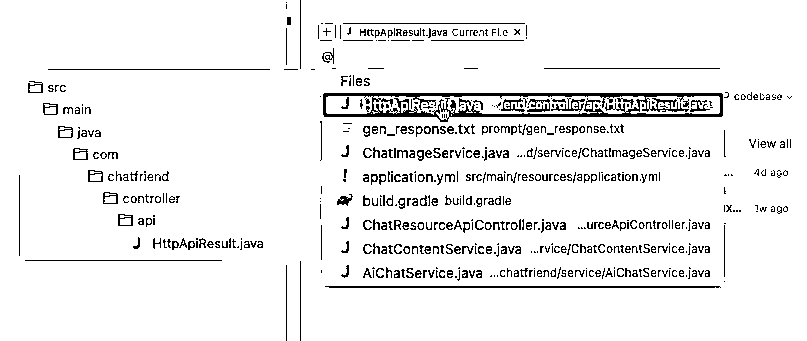
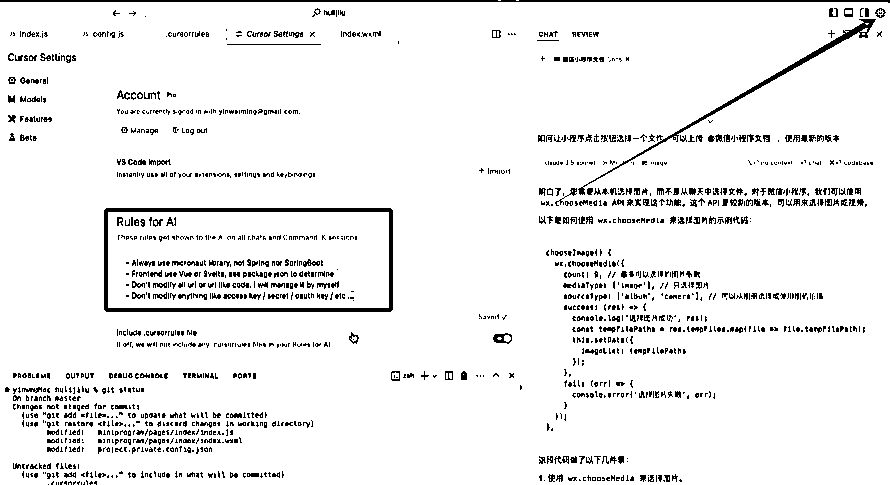

# Cursor 在实际项目中的使用经验分享

> 来源：[https://rxas35pmvn.feishu.cn/docx/UeuEdBTr7otuQOxhUAFct3g7n8f](https://rxas35pmvn.feishu.cn/docx/UeuEdBTr7otuQOxhUAFct3g7n8f)

今天站在一个相对写程序经验多一点的开发者的角度，跟大家去分享 cursor 这个软件。从实际工作场景的角度和大家聊聊，我们如何去使用 cursor 不断维护代码，不断迭代更新的。

这个软件我当时大约深度使用了两个多星期，就已经买了它的 Pro 版了，现在每个月 500 次的 Pro fast 使用的额度已经让我使用完了，所以大家可以看到，我的使用深度已经算是很深的了。

我稍微介绍一下我自己，我叫大铭，一直是程序员，一直在写程序。

最近是在月嫂月子中心这种母婴护理行业，最早是以技术的身份去参与到这个行业中，后来也逐渐参与到运营管理等其他方面。上一次借助了信息化的方式去玩了一下这个行业，现在准备再借助 AI 进行新的尝试。在这个过程当中我发现，尤其是今年的后半年，各种各样的 AI 工具起来之后，的的确确能够大幅度的提高我的工作效率。

最早的时候是在用 ChatGPT 这类 AI 工具，后来买了 GitHub Copilot 进行辅助编码，同时也试过很多的其他类似工具,直到现在全面切换到 cursor 这样的一个状态。

我个人感觉，如果只说在编码这个层面，我的效率大约是以前的 3 倍。

所以今天我分享一下：作为一个深度的用户，我是如何使用 cursor 的？

这次分享我会分成以下几步：

1.  我们从开始编码的时候怎么用？

1.  Cursor 的功能

1.  日常如何使用 cursor

1.  当做“正常”的 AI

大家如果还不清楚基础使用，可以看看 @Time 的帖子《0代码AI编程重塑你的编程体验：Cursor使用教程》 ，以及直播回放 9月23日【高手领航3】：Cursor基础教程与实战演练：AI编程 + AI写作@Time

## 一、我们从开始编码的时候怎么用？

### 实际的代码库是会持续被打开管理的

我看到身边很多人用 cursor 的场景，基本上都有一个前提：我是一个不太懂程序的人、我是个产品经理、我是个运营。我还看到了“一个小姑娘如何用 cursor 写了一个小游戏”等等类似的案例。

说实话，这类新闻基本上是打动不了我的。而且我跟很多有一定的开发经验的人聊过，大家普遍的对 cursor 的认知是：东西是个好东西，而且切过去了很可能就切不回来了，但是远没有现在传的这么神。

因为在我们的认知里面，“能有一个好的工具帮我们管理整个代码库”这件事是很好的，但是实际的开发产品的过程中，整个代码库不会是“做完了就不管了”的状态。比如我做一个贪吃蛇之类的小游戏，做完了就再也不会去把它打开了。

但是对于程序员来讲，我们在实际的工作里真正把 cursor 用起来时，让大家兴奋的或者网上宣传的那种场景，可能只是在开头的第一天甚至只是半天才会那样用，之后再也不会那样去用了，因为我不可能天天启动新项目。

### 实际工作代码量 VS 常见案例代码量

另外我们看代码量，虽然通过代码量来判断你的工作的深度是有一点偏颇，但还是会有一些对比性的。

100 行代码不能证明比 300 行代码差，但如果 100 行代码和 10000 行代码比，其实还是有一些区别的。

因此如果我们去看现在很多的 cursor 的应用例子里，code base 中总的代码量基本上很难见到 1000 行代码以上的例子。

但在实际日常工作中我们看看代码量，比如我现在要拿 AI 再重新做一个面向月嫂的 CRM 系统，目前刚做了一个开头，月嫂库还没有建好，履约任务只做了一点点，客户的信息只做了一点点，后面还有大量的功能如合同、产品点评这些都还没做。

现在的总代码文件已经 140 多个文件，总代码量已经将近10000行代码了。当前涉及到的模块大概只有 20% 左右，也就意味着最终会形成一个大约 50000 行代码左右的项目，相对来讲才是产出了第一个可用的版本。

在这个时候就可以看到，我们几乎就不能认为"啥也不管就让 cursor 直接去做"了，这就是我认为实际工作和当前展示出来的例子有很大区别的地方。

### 实际上，并非从 0 开始写代码

事实上，当我们开始编码时，真的很少从 0 开始写代码。

举一个例子，我最近写月嫂 CRM 时，最新选用的是一个叫做 micronaut 的框架。因为我想用 Java，但不想用spring，所以我用的是 micronaut 。当我对它进行了简单的检查之后，发现它有非常完整的“脚手架代码的生成器”可以使用。

网址：https://micronaut.io/launch/

比如我们正常用 application， Java 的代码， Java 用 21 版，项目名称叫 ShengCai， package 的名字是 com.shengcai，

然后点第一个【FEATURES】，现在最重要的是我要确定到底想支持什么？我需要支持 open API，我需要有 swagger 的支持，我需要有一个 JPA 的数据库的支持，可能我还需要一个简单的 Redis 的支持……基本上就有了一个大致的框架。

当有了这些支持之后，我直接会点【generate project】-【download】，然后大家就可以在电脑中看到已经有一个对应的目录了。

当回到 cursor 里面打开【ShengCai】这个文件夹时，就会发现其实这里面已经有很多的代码都替我写完了，也就意味着接下来的编程，其实已经要基于当前的框架来写了，完全不是从零开始的状态。

再看写前端代码也是如此，有一款前端工具叫 Flowbite，也会简单的提供一些起步时的代码，那么我们就可以不用从 0 开始写。

网址：https://flowbite.com/docs/getting-started/vue/

假如现在要写一个浏览器的插件，可能当前很多人想到的是在 cursor 的对话框输入类似“这是一个 Chrome 插件”的内容，但实际上，我会直接先去 GitHub 找一个 Chrome 浏览器插件的模板，比如找的是 VUE 的 Chrome extension template 的模板，找完模板之后直接下载下来解压缩，再在 cursor 里面点击 open folder，打开刚刚解压缩的文件夹，就会发现其实已经有了很多代码在里面了。

为什么我要这样去做？

当这样做的时候，我其实给我的 cursor 做了很多限定，告诉它不用重复造轮子。更重要的是，我可以让 cursor 帮忙先进行文件的整理，然后我就可以针对性的进行修改。

在上一步之后，我的工作方式是这样的：

首先，@Codebase 请帮我 review 整个代码库，并告诉我这是干什么的，核心的文件是什么。

然后，我再根据整理好的文件进行有针对性的修改。

比如说这里现在是 manifest_version“:2，但我们发现现在 Chrome 都已经进入到 version 3 了，那这个时候就再基于 manifest 这个文件进行后续的修改即可。比如我把这句代码复制到对话框，并告诉它“帮我修改成版本 3 ”，后续就会对这部分进行修改。

对于我来讲，这才是我正常的工作流程，而不是从 0 开始。

所以说，我们真正在实际工作中很少是用 cursor 从 0 开始的，大家要做的所有的项目，至少从框架的角度上来说，网上一定都有模板或者是脚手架代码，大家去找就可以了。

如果是一个老项目，那我们找好模板之后，也同样先让 cursor 帮我们读一遍代码，读完代码之后我们再去做后续的修改。

另外还有一个重要的原因，对于编程的这件事来讲，限定很重要。

如果我们把编程简单粗暴的分成前端后端，后端有很多的语言和框架，无论用Java，用go，用Python，在不同的语言里都能做到类似的事情。

而前端里也是同样的，从语言的角度看只有 Javscript 和 typescript 两种，但是它有很多框架，比如纯前端框架，前端里面包括 client render 和 Server render 的框架，或者是类似于 next js 这样虽然看上去是一个前端框架，但是也能写 Server 端的框架。

如果我们仅仅是从 0 开始，不做任何的限定的话，那么 cursor 生成的代码有可能会按照它认为合适的、主流的方式去生成，但它生成的很有可能并不是我们想要的。

举个典型的例子：

如果我说现在想要用 Java 写一个 Server side 的能够提供 LTDP 访问的需求。 9 × 9，他会选用 spring 这个框架，因为这个框架在 Java 的世界里太流行了，但我就不愿意用这个框架，因为这个框架太慢了，即使只做一个简单的启动，快的话需要 40 多秒，慢的话需要一分钟多，这个时间我受不了，所以我必须要给他一个限定：我要用 micronuts 这个框架。

所以如果有了一个相关的脚手架代码给到 cursor 就很方便了。所有该做的配置文件，什么东西该放到哪等等都很规矩，用起来会很舒服。所以从编码的角度来讲，我们可以不用从零开始，我们直接去网上去抄就可以了。

如果是对代码的这件事没有太深度的了解和熟悉小白用户，我也还是推荐去 GitHub 上找一个模板比较好，因为一般情况下，排在前面的都是主流语言的，主流的 framework 给出的例子，所以从学习资料的角度上来讲也是比较完善的。

所以这算是我从开始编码的角度给大家提供一个不一样的考虑。

## 二、Cursor 的功能

接下来我们来看一些 cursor 的功能。

### 2.1 交互功能

首先，我要对 cursor 进行非常重要的一个解释：cursor 不是一个 IDE 的插件， IDE 是 cursor 的插件。

我去翻过 cursor 这个团队所有的 blog 以及创始人的访谈。其中最重要的一点是，他们是把整个 vs code 这个IDE，就微软的这个 Vscode 直接 fork 了一份，然后自己在 Vscode 上去修改。

所以它和其他 AI 的编码工具（尤其是以 Copilot 为主的）最大的区别是在于交互模式。是这样的，一个是上下文，一个只能写next。

Copilot 这些都是借助的 IDE 的功能，因此它从代码层面的交互模式是针对光标的位置：只有从光标位置开始向后生成代码，且只有这一种模式。

Cursor 的交互是针对整个文件，这种模式用起来比较爽的是：当我们写了几句话，他后面就能够把这几句话打出来，且在其他对应位置更方便的生成。

举个例子，比如说我们在 application 的这个 Controller 这里，只要打这个 INJ ，inject，底下灰色的部分有相关的可以选择和生成了，这时我摁一下 Tab 就可以已经生成了，同时会看到上方有一个 Tab。

这时我再点一下 Tab，光标会回到上面，然后这部分灰色的内容就能够被生成出来了。

仅就这样的一个交互方式，在 Vscode 里是做不到的，原因是 Vscode 只能从光标位置向后生成字符，它不能在整个文件里进行光标的跳转，所以 Vscode 只能做到 append 模式，Cursor 能够做到 DIFF patch 模式。

DIFF patch 模式跟 append 模式的区别是在哪呢？

最简单的，比如我们看这个 application.practice，这里面其实没有跟数据库相关的操作，假如说我的鼠标放在“hbm2ddl”这个位置，然后输入的命令是“帮我做一个 MySQL 数据库，连接用户名密码都是 root”。

当它做完这个连接之后，我在这一段的代码右上角点 apply 时，可以看到它是隔行来生成插入的，我只要点击里面的 accept 就完成了。

但是这件事在 Copilot 里面就做不到。

举个例子，我们还是找这个配置文件，还是改一个数据库连接，我们来输入：帮我把数据库连接修改成为 sqlite，本地文件，文件名为 a.db。

可以看到它其实已经帮我生成得非常好了，但是它没有 DIFF patch 的方式。也就是说点击插入后，整个配置文件就全花了。

但如果我不点插入呢？那就只能全部 copy paste，但如果文件太长 copy paste 是没法用的，所以只能按以前的方式，选择对应的部分一个个 copy paste 过来。

这就是 cursor 带来的在编码的交互上最大的变动，仅仅这一个功能就可以让 cursor 相对于其他的 IDE 带来至少 10% 以上的效率提升。

再展开思考一下，AI 的时代到来了之后，当我们能够确定指向一个target（目标）后（对于编码来讲， target 可能是一个文件或者是一个目录，或者是整个的 code base），是不是能够颠覆一些传统的，习以为常的工具？我认为有这样的可能，因此我在做东西的时候对这部分也会有一定的探索。

### 2.2 文档功能

下面这个截图里就是我现在去给定的很多的文档。

如果我们用大模型来解决这种问题比较困难，因为大模型的语料库更新并不及时。比如 claude 的语料库更新时间是在 2023 年年底，所以开发者如果一些常用文档有需求，claude 知识库里的数据是不够用的，因为知识库里的文档其实是非常陈旧的。

比如说上图中的 Micronaut、Flowbite 以及微信的小程序。去官网上搜一下，我们就会发现他们版本更新是非常非常快的。所以在版本快速更新的背景情况下，claude 给出的代码有时候是错的。

那如何解决这件事呢？cursor 里有配一个简单的小爬虫，所以我们可以在 feature 里面通过添加文档的形式搞定，然后再使用文档就可以获得更准确的代码。

还是以上一节提到的项目为例，比如说现在需要做一个用户登录，选中了对应文件后输入：帮我生成用户登录的 Controller，使用JWT。

就可以看到已经有很多代码生成了，同时会发现其中有很多问题，比如右边红框里这个不是 Javax. inject，而是

那这时我们就可以补充一下提示词：帮我生成用户登录的 controller，使用jwt @Micronaut 阅读最新的文档，使用最新的 API。

这样生成的代码准确率会大幅度的提升。

这就是文档的使用。有的时候 cursor 会自己去看文档，有的时候你可以主动让他去看文档。

还有一些小众的库可能根本就没有文档，或者说这类文档是很难被收录的，那么我们自己做一个就可以了。甚至是我们内部的使用的一些文档，都可以 cursor 这个简单的爬虫来辅助使用。

Cursor 的爬虫能力不能像 Google 那样，但是它在简单的文档（比如静态文件）这块是非常好用的。

### 2.3 Composer

圈友 @Time 的直播分享里讲了很多，我这里就不展开太多讲了，我讲讲我使用习惯的不同。Composer 是以你的 code base 作为基础，一次性的处理多个文件。但是对于我来讲，当我的代码复杂到一定程度时， Composer 基本上只能生成简单的代码了。

比如我现在写的 CRM 里，有客户相关的，有出院记录相关的，有月嫂相关的，还有和服务总线相关的，基础里面也会有阿里云的、有附件的，有 JWT 的，有 OCR 的等等。

如果代码库复杂到这种程度时，我的代码是要和已有代码进行交叉调用的，这时候 composer 生成的代码基本上很难一次性完成，甚至几轮都很难生成。

所以在这种情况下，我一般使用 compose 的方式是：把它当成一个骨架代码，它只要帮我生成骨架就可以了。生成完骨架之后，我再进入到对应的代码里面，选取某一部分，点击 add to chat，进行下一步对话操作。

所以对于我个人来讲，我最常用的是 chat 的方式，而不是 composer 的方式。

我写单一功能的起步时，我会去用 composer，然后我再做后续的代码的修改。

例如这是我用 composer 起步的一个对话例子：

随着代码复杂到一定程度之后，就会发现不是 cursor 在驱动你，而是你在驱动 cursor 。这个时候就必须要对你的代码有一些精细化的控制。当开始有这种精细化的控制时，至少对于我来讲，compose 对于我的作用就会越来越小了。

### 2.4 Chat

我最常用的就是 chat，如何更好的使用 chat 呢？

*   第一：尽可能的明确需求

*   第二：一定要 at 上相关的文件

我前段时间用 cursor 做了一个嘴替的项目，叫 CHATFRIEND。这个项目里面全是 Java 代码，这是我的 Server 端代码。另外我还会有一个代码库叫 CHATFRIEND-FE，里面都是 VUE 代码。我不想让代码相互之间混淆，因此我会把这两部分代码这样完全拆开，Server 端做 Server 的， client 端做 client 的。

当不想做混淆的时候可以这样来用：

比如在 Server 端我有一个需求是允许用户登录。那我可能就会在 CHATFRIEND 代码库写一个需求来让 cursor 生成：

我需要一个用户登录的 API，以及相关的用户代码

用户登录，使用手机号，验证码的方式，访问

/api/v1/user/login

然后在 CHATFRIEND-FE 代码库这边，我会把上面这段复制过来，并且增加并形成以下内容：

我需要一个用户登录的 API，以及相关的用户代码

用户登录，使用手机号，验证码的方式，访问

/api/v1/user/login

帮我生成对应的前端界面，用户输入完手机号，点击按钮收验证码，按钮上 60 秒倒计时

也就是说，一个相同的需求，告诉 Server 端我 client 端写好了，请生成 Server 端代码，然后告诉 client 端我 Server 端写好了，请生成 client 端代码，但实际上两头代码都没有，这样就可以两头同时来做了，然后相互验证一下，速度是非常快的。

但是我们必须要做非常精准的控制。

比如下图，当我说明我需要一个 Post 接口，cursor 给了我一个 typescript 的代码。但这根本不是我想要的，因为我整个代码库是 Java 的，其实问题在于我没有说的足够清楚要用 Java：

这也是为什么我说在没有任何脚手架和已有代码的情况下直接给它下命令，cursor 可能会生成我们并不需要的代码方式。

所以我就加上一句话：是 Java API Controller。

可以看到重新生成的代码差不多都是对的，包括 package 的位置等等给的也都是对的。

### 2.5 在 cursor 怎么找错？

找错我用的是一个超级懒的做法，但是 fast 队列消耗的特别多。

就是当出现报错之后，我会直接点击错误部分右上角的“Add to Chat”，然后什么也不说，在对话框直接打一个“？”。

Cursor 就会帮我分析这个代码到底是干什么的，怎么用的。

它改完了代码之后，我们直接点击 「apply」- 「accept」就完成了，运行检查一下是否解决了即可，这种找错修改的速度就会非常快。不管是运行时期的错还是编译时期的错，我基本上都用这种方式找，它能够很快的解决我常见的错误中 80% 的情况。

但需要注意的是，逻辑复杂了也不行，复杂的就需要我们不断的介入了。

### 2.6 @ 的使用

「@」是我在这里用的最舒服的一个功能。我们可以做很多的艾特，类似于下图，@后我们打开某个文件夹，就可以看到我可以对哪些文件进行分析。

用的比较多的方式，就是直接告诉它，比如：用户要使用手机号验证码登录，帮我把相关代码补充在 @NannyService.java 中

如果你当前不在对应 @ 的界面中，点击红框位置，再点击「Apply」就可以了。

等它生成完，我们可以先 review 代码，可能会发现有大量的错，我们根据 2.4 说到的方式一个个找错纠错就可以了。

这里额外讲一个点，当指定 @Web 的时候，cursor 的小爬虫会去网上进行搜索，根据网上的搜索结果去做代码的生成。那我们可以在设置里的 feature 找到 chat always search the Web，默认是关掉的，我们可以把它打开，打开之后就会默认搜索 Web 了。

虽然初衷是为了能够在调用接口或使用时，可以从网上找到最新的用，但是我试了一下发现效果并不好，有时候会反而会让 cursor 混乱，所以我的做法是默认把它关掉，当需要用的时候再输入 @web 就可以了。

在使用 @ 的时候有个小技巧——全局限定，大家可以去用一下。就像我们在用 AI 的时候，我们会提供背景信息或者角色，来限定它的输出，在 cursor 里也可以这么做。

在设置里，找到「Rules for AI」，写入自己希望给它的一些限定。这个是全局的，是针对所有文件的。

但如果只想让 cursor 对当前项目的 code base 进行的限定，可以找到「.cursorrules」，在里面写上你的限定条件。如下图是个小程序的文件，就会做一些小程序开发规范的限定：

这一部分也还是本着“能从网上找就不自己写这样的原则”，推荐一个网站：https://cursor.directory/，里面有很多别人已经写好的，我们直接就复制粘贴就可以，很好用。

### 2.7 分析 git 版本信息

我见过很多人在做一些东西时不太用版本管理。但我个人还是强烈建议大家把版本管理用起来的。

拿我的 CHATFRIEND-FE 为例展示一下如何使用这个功能，大家可以直接看 59 分 27 秒 - 1 小时 8 分钟这段：9月24日《【高手领航4】：cursor 在实际项目中的使用经验分享》@大铭

## 三、日常如何使用 cursor

我现在有两种种方式跟 cursor 协同编码。

*   第一：把 cursor 当作结对编程的伙伴

我本身就是一个开发者，这时候我把 cursor 当作结对编程的伙伴时， 它来解决的不是编码问题， 而是沟通问题。我再说一遍，这个意思是，我需要不断的对「我的想法落到代码上」这件事进行沟通验证和 review ，我既要去 review cursor 的代码，也要让 cursor 来 review 我的代码。

从整个写程序的劳动投入角度上看分为体力劳动和智慧劳动，cursor 大约可以解决 90% 的体力劳动，大约能够解决 30% 的智慧劳动。

“我现在要实现一个快速排序，你帮我把这个代码写出来。”，这个是体力劳动。

“我应该如何去设计一个消息队列，到底要不要一个写缓存？我的分布式 ID 应该如何设计？”，我把这类思考的信息叫做智慧劳动。

我会把我的很多思考跟 cursor 不断的沟通，让他给我提示，让他去 review 我的代码，一起工作。这个效率提升是非常非常高的，因为它帮我消除了大量我不确定的环节，而在没有这样使用 cursor 之前，这个我不确定的环节大约占我总消耗时间的 1/ 3。

剩下的 70% 到 80% 的时间，我们解决的都是属于重复劳动的那种事，就真的就是敲代码，字面意义的码农。这种情况下我们让 cursor 帮忙生成这些代码就没有任何的问题。

*   第二：把 cursor 当做“外包”

如果我是一个小白和需求方，我把 cursor 当实施方，也就是把它当外包，那在这个时候是怎么用的呢？

比如，我一直是在 Server 端编程，我对前端有大致的了解但其实非常不熟悉。什么叫 VUE？哪个叫 react？小程序到底应该怎么写？我完全不知道。

我既不知道它的代码结构应该是什么样子的，我也不知道它的这个代码里面具体应该是怎么做的，所以在这个时候我去把它当成一个实施方，我有这几个方式使用它：

① 先找一个脚手架代码。我会开始用脚手架的方式先生成代码的结构，比如说这个小程序，我现在想要的功能只有「上传出院小结」以及「账号登录」，底部的「快速开发基础能力、业务实力」等根本用不到，但我之所以也用上了它们，是因为我用的是一个现成的小程序模板，里面已经有很多模板代码，用不到的代码大不了后面再删。

② 使用 @code base 的方式，让 Cursor 帮我解释代码

③ 当这两步都结束之后，我才会开始提出我的真正想实施的需求。如果这个代码我大约能看得懂，我可能就会指定明确的文件位置，如果我不太能看得懂，我就会使用 composer 的方式用，把需求写的稍微详细一点。

边生成代码我边看，这样同步 review 下来，我也会逐步的开始学习这部分代码。因为有编程的基础，所以基本大约 3 ~ 4 个小时就可以把「我是小白和需求方」的这种方式转换成「我是开发者和他结对编程」的这种方式了，效率会进一步的提升。

这两种方式最大的区别在于：如果我把它当做实施方或者叫外包，Cursor 为什么这么写？这么做到底是干啥的？我会完全不明白，即使中途我想介入都很难。从长远来看效率还是上不去的，而且我们也没有办法做很多介入，无法顺利的加入自己想做的其他事。

所以我就会不断的去问 cursor，让它来解释，我来学习，比如：

为什么小程序里面要有这个 json 文件？这个文件是干什么的？是每个页面都有吗？

我学习之后就可以逐步转化成结对编程的方式了。什么导航栏、自定义组件等等值，那我就基本上就知道，就边干边学是这样的一种方式。

*   第三：把它当做一个普通的 AI 工具使用

比如生成一个文章、改写或补充文字内容等等，其实就是把它当成一个普通 AI 工具使用。

但 Cursor 使用的模型是专门面向于代码的这样的一个小模型。并通过组合几个模型的方式做跟编码相关的特定领域的一些事儿。

这里面最大的区别在于：基础大模型是不保证“代码”的完整性的，而这种面向于代码特意 fine tuning 出来的模型是要刻意去保证代码完整性的。

所以我不会把它当成一个普通的 AI，而是会用它问一些和编程、编码更相关的问题，如下图：

## 四、推荐几个好用的组件

### SQLite3 Editor

我本地开发大多用 SQL light 数据库，这样协同起来非常的方便。

比如这个：我在做小红书视频转文字，再加上分析的功能。截图里就是我的一个 SQL light 的数据库，这样用起来就很方便。

### Cyan Light idea theme

这是一个浅灰色的主题。我所有的 IDEA 都用这个，因为我比较喜欢这种颜色。

### Excel Viewer

我用来看 Excel 用的，比如这里：

### Git Graph

这个非常方便，可以直接点 create、check out 这些。

## 五、注意事项

1.  单文件不能太大，否则可能直接撑爆 token 的限制。

我现在基本控制单个文件在不超过 600 行，大家如果对编码没有那么熟悉的话，在做的过程中一定要尽可能让 cursor 帮你来拆文件，因为文件大到一定程度，就不可维护了。

1.  人工修改和 AI 修改混用时， AI 会把代码改回来，这样代码逻辑很有可能乱掉。可以使用新对话窗口进行重制对话，然后让 Cursor 重新读取文件熟悉文件。

1.  常 git

最后放一下这个分享的直播回放，文章里我把关键信息尽可能的说明清楚了，但如果你想看更具体的演示，可以在回放中看具体的部分：9月24日《【高手领航4】：cursor 在实际项目中的使用经验分享》@大铭。