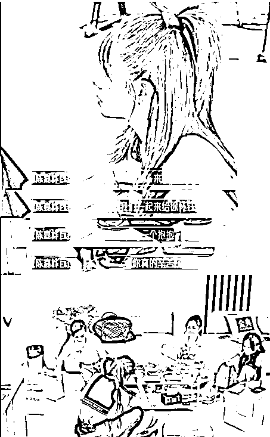

# 看综艺无痛学社交

> 来源：[https://ivqd5pmg5of.feishu.cn/docx/VV7FdFkEzoojt0xlBRKcSn9qned](https://ivqd5pmg5of.feishu.cn/docx/VV7FdFkEzoojt0xlBRKcSn9qned)

你是否曾因言语不当而被人误解，你是否曾因表达不清而错过很多展示自己的机会。你是否曾因嘴笨，情商低，遇到事情有口难辩的痛苦，你是否曾因不敢表达而社恐自卑。

如果你想要练习社交技巧却根本不敢踏出第一步，每次看完技巧方法感觉自己学会了，但是一到实际应用的时候还是觉得尴尬，还是紧张，磕磕巴巴的，脑子一片空白啥也想不起来。

咱们可以学学很多综艺节目，特别是团综，娱乐圈是社交高手的聚集地，而团综把这样一群人聚集在一起，观摩学习ta们的社交场景，看高手过招对我们大有益处。

➡现在具体来讲解一下怎么通过看综艺无痛学社交↓

# 《花儿与少年·丝路季》

《花儿与少年·丝路季》，简称花少5。花少5这一季可以说是封神了，一点不夸张。在综艺这种很有社交氛围的节目里，真的能学习到社交技巧！

## 当对方把可乐喷了一地，特别紧张无措时

当对方把可乐喷得一地都是，特别紧张无措时，你可以说“新年快乐！这没什么，反而是庆祝！感觉像喷了烟花一样”。

尽管那天并不是新年，但你用幽默和积极的态度缓解了对方的自责；还把意外变成了一件浪漫的事，缓和了气氛。

## 当对方在找你的时候迷路了，因为怕麻烦你，只让你发定位时

当对方在找你的时候迷路了，因为怕麻烦你，只让你发定位时，你选择直接去找对方，带对方过来。

主动提供更有效更重视的行动，让对方更安心。

## 当对方向你询问一条饰品的购买意见时

当对方向你询问一条饰品的购买意见时，你没有直接说它不值得，而是说“它配不上你的气质，你可以拥有更好的”。

运用夸奖来否定对方的意见，更能被对方接受；融洽氛围。

# 《乘风2023》

《乘风2023》又名浪姐4。浪姐4三公（刚好在一公播出后），Yuki徐怀钰一公表现不佳，被舆论攻击想要退赛。作为队长，Ella对她说了这么一段话。

Ella这段谈话堪称顶级的情绪处理，真的值得敲黑板学习！

## 共享经验和理解

首先让Yuki知道她的困扰被看到并且被理解。这种理解让Yuki感到自己的情绪是合理的。

## 正面的现实

检验用客观的角度分析了Yuki的问题。这种正面的现实检验有助于调整自己的心态，看待问题更加客观。

## 接纳和确认

浪姐4提到“有人喜欢你，就会有人讨厌你”。帮助Yuki理解这是人生的正常现象。这是一种接纳和确认的态度。

## 共鸣和共感

Ella说自己是Yuki的歌迷，也会唱Yuki的歌。这种共鸣和共感让Yuki感到被接纳和理解，帮助她建立信任感。

## 积极激励

鼓励Yuki不要害怕，即使犯错也没有关系，我们都有犯错的时候。让Yuki感到被支持，有力量继续前进。

## 关爱的触摸

最后邀请大家一起给Yuki一个抱抱。通过身体接触让Yuki感到被关爱，有人站在她身边。

✔其中第一步展示【理解和共感】 是最重要的，是所有后续谈话的基础。尝试理解他人的感受，并确认他们的情绪是合理的，从而建立信任，让对方冷静下来开始尝试解决问题。

❗同场的吴倩对芝芙Chi Pu的安慰不佳，就是因为一开始试图通过否认芝芙ChiPu的情绪、直接从理性的角度来安慰她，可能让芝芙Chi Pu感到自己的情绪被忽视，没有被理解和接纳。

芝芙Chi Pu：“我觉得好丢脸…”

吴倩：“没有，我一点都没觉得。”

芝芙Chi Pu：“甚至在我唱的部分”

吴倩：“但没关系。这只是一个小考。这不是正式的舞台上，对吗？我说过这不是一个舞台。我告诉过你会一直支持你的。”

# 《乘风2024》

比如，在郭碧婷因为紧张和不习惯回应他人热情，让气氛显得有些尴尬时，蔡文静打圆场说“让我们切到漂亮模式，因为漂亮是不能社交的。聊天的时候展现个性，安静的时候展现美貌。就我们安静了也很好看，我们一起来漂亮。”

## 在对方没能融入集体时要体现“我们”这个概念。

## 转移话题重点，即对方可能会引人不适的点（不是缺点）为优点，来夸奖她。

## 能一起夸到所有人更好。

①在这里，主语是“我们”，没有把对方另划一个阵营。

②给对方找了个理由，还夸了对方漂亮，表达了善意。

③解释完理由后，用“我们安静了也很好看”夸了在场所有人。

④最后说的是“一起漂亮”而不是“一起安静”，转换了话题重点。让大家感觉到对方是一个“还在安静状态的美女”，而不是“无法社交的安静者”。

* * *

最后，我是金多数，今天就先分享到这里啦！祝大家周末愉快！