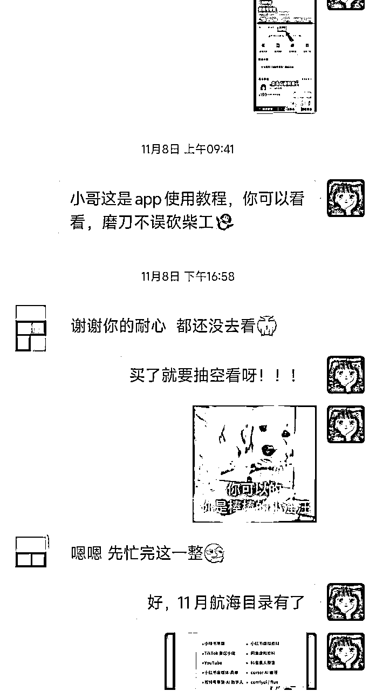
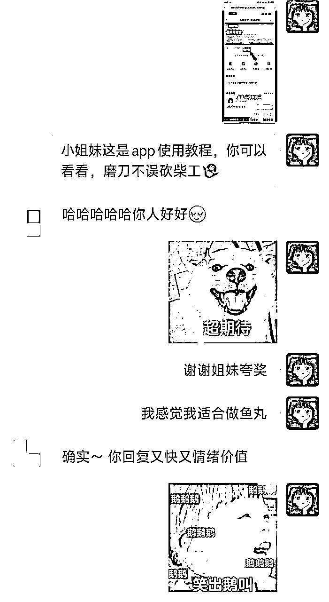
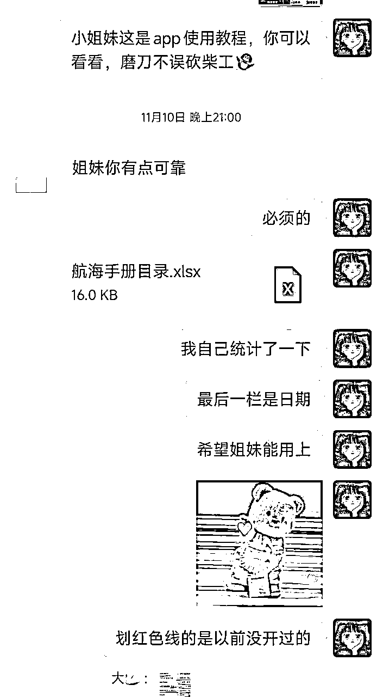
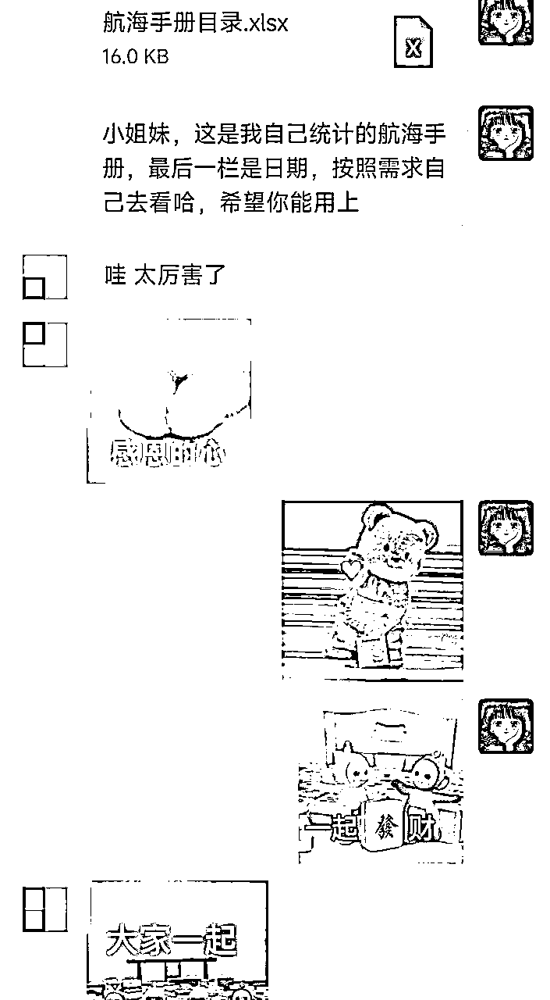
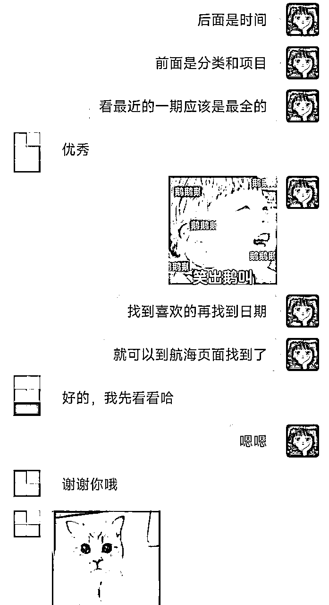
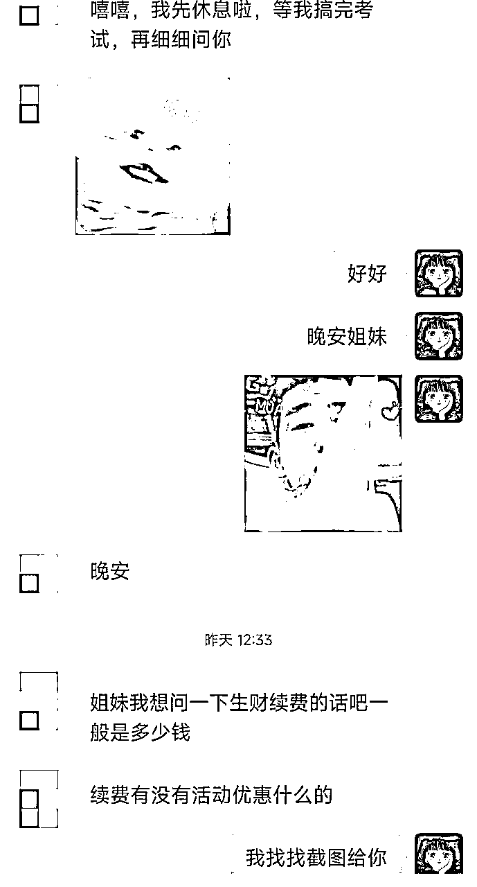

# 10天闲鱼生财拉新30人

> 来源：[https://bxhilsvblcu.feishu.cn/docx/VmSFdx0VUoT6cdxjp2UcAktznie](https://bxhilsvblcu.feishu.cn/docx/VmSFdx0VUoT6cdxjp2UcAktznie)

# 一、开始到实践

| 时间 | 11.2-11.11 | 工具 | 闲鱼账号1个+小红书账号1个 |
| 总咨询量 | 53人 | 转化量 | 30人（56.6%） |
| 下单人群 | ⅓参加过体验营，领过体验卡，想优惠下单；⅔新人下单； |  |  |

## 1.1 发现异常值

🌟起因：11.2号刷到亦仁大大说生财要涨价的通知，又发现生财在知识星球中客单价和返佣异常的高(实际自己半个月用下来，确实比之前三五千买的知识付费有用)，叠上双11的buff，感觉自己可以试试拉新，生财有术创建2596天的时候有60000位圈友，平均每天新增圈友23个，我想自己一天拉2~3个或许还是可能的

🌟资源：自己有个信用还不错的闲鱼账号，小红书粉丝214个(主要发自己日常生活的东西，活跃度不高，没开店铺和橱窗)；有啥用啥，搜了一下闲鱼相关的帖子，卖几块钱的资料比较多，拉新的圈友比较少；11.2号尝试发了第1条闲鱼，11.5号得到了亦仁大大小红书直播分销的同意，买了直播设备，准备试试直播

## 1.2 实践过程

备注：模式就是成单返佣金，闲鱼发帖有意向的引到私域再发链接成单；基本都走的知识星球，原因是知识星球返佣7天到账，生财要月底统一结算才到；在你是个默默无闻的素人，加上信任不够的情况下很难等到生财月底统一结算，如果是大博主有背书可能有人愿意等；本人0直播经验，小红书未开店铺和橱窗。

# 二、数据复盘

## 2.1 数据指标和结果

# 三、整体回顾

## 3.1 筹备

完全是看到了一个小小的机会，抱着试试的心态做了一下，拉新和小红书直播均为第一次；筹备阶段看了一下别人的闲鱼文案怎么发，有多少人做这个，也假装买家去问了目前在做拉新的卖家，看看人家是怎么做的；发现卖家回复慢比较机械，主图没特色，文案没重点等问题；

## 3.2 实施

3号开始不断优化自己的行为路径，闲鱼智能回复，主图和文案都做了相应的修改，增加了下单链接，返佣图，闲鱼每天定时擦亮增加曝光；8号直播设备到齐，用航海手册粗略看了下直播流程，9号开始尝试小红书直播引流，1h场观21，引流1人觉得太贵未下单，直播宣布失败，自我反思原因是账号不够垂，无店铺橱窗和黏性粉丝积累；遇到不会的和鱼丸及时沟通，得到了一些正反馈。

## 3.3 交付

站在下单的圈友角度，我要为人真诚热情才能获得信任；有额外交付（自己做了航海手册的目录，发给下单的圈友方便按照时间查阅）会更锦上添花；很多新圈友不会逐个去看生财的新手指南，有些圈友不太会知识星球端的具体操作方法，所以把官方录制的app使用教程下载了下来，供新圈友查看。

# 四、反思复盘

简单来说就是看到了机会，勇敢的尝试了一下，在做的过程中不断迭代优化，得到了一些正反馈；5号被亦仁大大设为精华贴后也有圈友开始尝试拉新，10~11号其他圈友拉新在数量少也明显有了提升，12号涨价后流量下滑咨询开始变少，当个细水长流挣奶茶钱的项目倒是可以；生财目前直播只在视频号，或许在小红书做垂类账号再增加小红书的直播，以及更多的跟小红书联动，让更多认可生财的圈友在小红书上做种草，扩大生财的影响力，或许会有意外的收获。命运的齿轮在你实践的某个节点会悄悄开始转动，12号晚上随手在生财发了条帖子，下楼散步听搞钱女孩的播客，这一期嘉宾刚好是小鹅，听完就看到被亦仁大大和小鹅点到了，也加到了微信，似乎冥冥之中有神奇的牵引，所以各位圈友既然我们在生财这个优质的搞钱平台，那就好好行动做起来，你想得到的东西，最后都会以意想不到的方式来到你的身边；谢谢亦任大大给予的平台和支持，虽然来生财还不到一个月，但也算是迈出了自己小小的第一步；也谢谢各位新圈友的信任，很高兴认识你们，希望你们都能在生财打开认知并搞到钱，最后附上亦仁大大之前发的视频，希望你们都能行动起来！