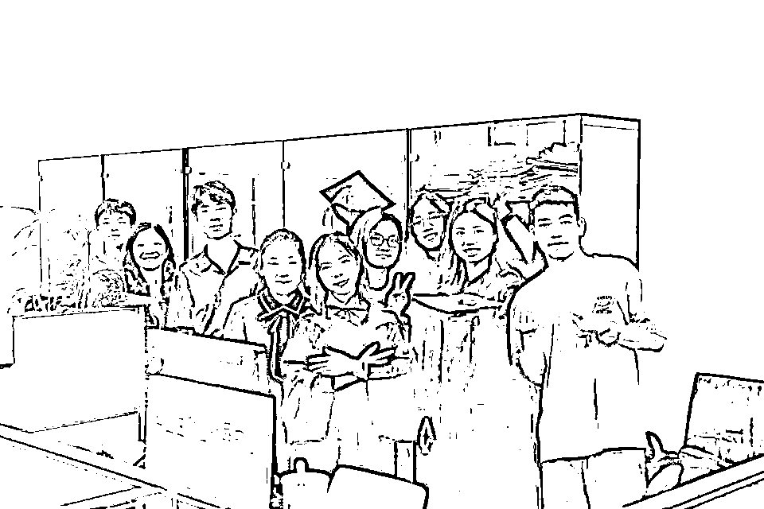
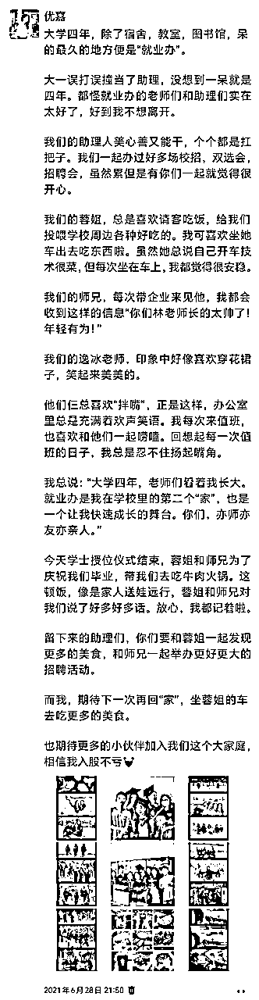

# 先找到一个小切口！

> 来源：[https://x6rsxr7w3l.feishu.cn/docx/VvSrduWJGoaCCfxNnSscpyqEntg](https://x6rsxr7w3l.feishu.cn/docx/VvSrduWJGoaCCfxNnSscpyqEntg)

Hi，欢迎打开这篇文章。

我是优嘉。

人最重要的是改变自己的认知和思维方式，进而才能改变自己的行为，改变结果。

所谓思维方式，就是遇到事情，你是如何想的？

如何想，就会影响如何做。如何做，就会影响结果。

要想改变结果，要从改变如何想开始。

2024年开启了一个新的系列内容：思维方式

在这个系列里面，我会分享我认为是正确的、好的思维方式，也会分享我看到的错误思维方式。

希望这个系列能够带给你启发。

* * *

今天分享的思维方式是：先找到一个切口。

国庆假期，在家见了两个长辈，他们的小孩都即将进入到社会工作，希望我能和他们聊聊，给点建议。

大道理对他们来说，听太多了。我再说一遍，毫无意义。

我选择和他们说了一下我自己过往的经历，看看是否能给他们一些新的启发。

在和他们分享自己一路以来的经历时，也是对自己的过往，做复盘。

突然发现，自己原来已经走了这么远。

在复盘的过程中，我发现自己做每一件事，都擅长找到一个切口。怎么理解呢？我给大家讲3个故事。

# 1.大学经历：从奶茶店兼职开始

我在广东上大学。

算是离开家乡，去外地上学。

从进入大学前，我就特别向往，大学能够自己独立赚钱的生活。

于是，刚来学校，就开始留心各种赚钱的信息。

但是，来到一个人生地不熟的地方，一没背景，二没资源，唯一拥有的就是吃苦耐劳的精神和时间。

当时有学长学姐发布，奶茶店的兼职，我毫不犹豫的去了。

奶茶店，就是帮忙点单，打包，有时间，还帮忙制作奶茶。

刚开始做的时候，面对一堆客户，我手忙脚乱。

再到慢慢的，轻车熟路，可以一个人独当一面。

锻炼了我面对客户沟通的能力，锻炼了我灵活应变的能力。

老板娘也很认可我的工作能力，经常带我出去玩，请我吃饭。

但是，我知道，这种赚钱方式，效益不够高。

所以，我就一边干着，一边去找新的赚钱机会。

我去面试了多个新的岗位，并成功拿到了offer。

比如，学校就业指导中心，我成功竞选学生助理。

一呆，就是大学整整四年。

这四年，这个岗位，给了我太多的机会。

因为它，我自学了推文技能，管理官方的公众号。

因为它，我接触了大量进学校招聘的企业，担任了多家企业的校园大使。既能赚钱，又能扩展营销能力，还能拓展商业视野。

因为它，我找到了第一份在中海地产的实习。

因为它，每年都要和毕业生接触，我结识了很多很多的师兄师姐。

……

比如，学校学生互助中心，作为导师去辅导他人学习。

有了第一个学期亮眼的成绩，我就有了机会辅导别人学习。成了学生互助学习中心的导师，每个月都有一笔不错的辅导费用！

比如，学校大型活动体育馆，担任活动员，参与每一场活动的举办。

在这里，参与了音乐节、明星演唱会、学校毕业典礼、篮球比赛等等活动，结识了好多朋友。

……

我为什么分享这段经历？

是因为，有好几个人听过我的经历，就问了我一句：你有能力，居然去奶茶店做兼职？

可能在他们的眼里，奶茶店兼职，是一个很low的工作。

但是，我并不是从这个角度看问题。

我知道，奶茶店兼职，是一个靠体力赚钱的事情。

但是，初来乍到，没资源，没背景，凭什么拿到更好的机会？

每个人到了一个新地方，得先找到一个切口，先下场干，才会慢慢接触到更多的机会。

我想找赚钱机会，那我先找到一个当下马上就能干的事情，先进到赚钱的圈子里，然后再慢慢升级。

我会把奶茶店的兼职，当作一个进圈子的入口。

进到圈子以后，慢慢积累自己的能力，我再接触更多的信息，去拿到更好的机会。

从0开始的时候，不要有那么多的标签，这个工作很low，那个工作很高级。

在你还很小的时候，保持中立，多接触，多下场干，才会有更多的可能性。

这就是我想要和你分享的第一个故事。

# 2.进入运营圈：从实习生开始

第二个故事：我做运营的经历。

我学的是财务专业，为什么后来进入到运营的圈子？

大二去中海实习，发现自己不喜欢做财务。

就一直在探索新的可能性。

大三下学期，因为疫情呆在家里，有了很多业余时间，去网上了解更多信息。

无意中看到了黄有璨讲运营的岗位。

了解到他出了一本《运营之光》书籍。

我就花时间，完整的读完了这本书。

我发现，我对运营这个岗位充满兴趣。

我就在网上搜索了相关的岗位，搜索了和运营相关的所有公众号，去了解更多的信息。

大三暑假，即使疫情还不太让出门，我就在线上找各种岗位，看有没有工作机会。

后来参加运营社的一个训练营，发现他们有招实习生，我就去面试。

面试通过以后，就去上海实习三个月。

在这里，遇到了我第一个领导波波，教会我很多运营的知识，锻炼了我很多能力。

在这里，因为他们做的是运营技能的培训，就有机会接触到各种运营前辈。

这对我大四找工作，有了很大的帮助。

借着认识的前辈，了解到每个人在做的业务。

通过对比，我去了一位前辈的创业公司，找到了我毕业后的第一份工作，直播运营。

人生的机会，就是这样慢慢打开的。

从找到一个小切口，先进圈子，慢慢积累自己的能力，慢慢看到了更多的机会。

# 3.新环境：从最小的事情开始

第三个故事，今年换公司。

新公司，意味着换一个新的环境。

在一个新的环境里，我如何从0开始，15天内快速拿到项目新机会？

和我同期一起进来的小伙伴，有5个。

我老大会通过一些小测试，来看每个人的能力，来安排项目。

而且，前期项目数量不多的情况下，要靠硬实力来说服他，凭什么选你不选别人？

竞争其实很激烈，很残酷。

那我如何在这5个人中，快速脱颖而出拿到项目机会？

这个过程其实非常有意思。

还是应用我说的方法，找到小切口。

我身上有很多的能力，我会短视频、会直播、会管理小团队、会做项目管理、会销售、会策划、会发售等等等。

但是，我要找到一个切口，快速让老大看到我具备做项目的能力。

他第一天给我们开了个会议，说了对合作的规划，以及要求我们具备哪些能力。

我开完会的当天，我就写了一份会议总结，发给了他。

注意，这个任务，他并没有要求我做。

但是，我为什么做？因为我想要通过这份文档，去展示我的能力。

他看完，回复了一个👍

我是5个人里面，唯一一个做这件事的人。

战场是没有硝烟的，很多战争，在你看不见的地方，就已经结束了。

这就是看不见的比拼，在看不见的地方，去争取我想要的机会。

我老大正式对所有人出的第一个考题是，描述某个项目的情况，让你作为项目负责人，出一份项目规划表，时间2小时。

他讲的信息其实很少，根据他给的信息，压根就无法做项目的推进。

当时，就有人会去找他，问项目更多的信息。

我也知道，需要更多的信息，才能做规划。

但是，时间很紧，你需要快速交出一份答卷。

我没有打算去了解更多的信息，而是通过项目假设，来规划了整个项目框架，展示了项目管理进程表。

做完考题后，我们全员一起开会，看每个人的答卷。

当时，有另外一个领导发言：明知道这个项目是个坑，压根就做不了，为什么你不提？

我当然知道是个坑啊！

但是，我需要通过这个切口，展示我项目管理的能力。

这就是我的目的。

我老大看完所有人的答卷，对我的点评是，优嘉的项目管理能力很专业，很强。

我让他看到了我做项目管理的能力，让他有了第一层的专业信任。

还有一次，我认为是很大的考验是，做项目咨询。

我们聊了8个客户，我们需要把8个客户的项目情况，整理成文档。

要知道，能听懂这8个客户的项目，需要一定的商业背景和理解能力。

还需要通过可视化的方式，表达出这8个客户的项目情况。

这个考验其实还蛮大的。

我在这份文档中花了很多心思。

这份文档，拿到了他很高的评价。

一次次的小事，小切口，我展示了我的专业能力。

他对我的评价就是，很稳。很有潜力，我最看好的项目策划人选。

我来了15天，就拿到了两个项目机会。

我当时还不以为意，我以为是每个人都有分配项目。

但是，后来开会才知道，我是拥有项目最多的人，而且都是大项目。

同期进来的一些小伙伴，在这些看似很细节的地方，做的不用心，或者不去做，失去了很多机会。

我一直都是秉承一个做事风格，初来乍到，放低姿态，从小事做起，才会有更多的机会。

这就是我想和你分享的第三个故事。

# 4.总结

看完这几个故事，我相信你对“先找到一个小切口”思维方式，应该有了更具象的理解。

先找到一个小切口，是面对所有事情，都可以用的方法。

本质是，找到一个先能进入圈子，下场实践的切口。

我们很难马上站到一个很高的位置，都是从小事慢慢积累上去的。

我们也很难马上掌握某个项目全流程，都是从一个环节一个环节累积上去的。

找到一个小切口，快速进入，快速积累，快速跳到下一个位置。

分享《有钱人和你想的不一样》书中的一段内容，和我想要表达的观点是一致的。

“从你现在所在的位置开始，用你现有的一切，加入游戏下场玩吧。”

“我在“巴特勒妈妈烘焙屋”找到一份工作；我实在很想跟你说他们马上就看出我天赋异禀，让我当总裁，但是，唉，不知道为什么他们没看出来，也一点都不在乎我的领导能力，所以我只能跟你说我是从打杂做起，做的是扫地、洗碗这些事。

你可能会认为，做这样的工作必须吞掉自尊，但我从来不那样想。我为自己设定的任务是认识糕点这一行，所以很感激有这机会花别人的钱来学习，还能赚些零用钱。”

我和你分享的这些内容，是想要表达的一种思维方式。

想要进圈子，看到圈子里的更多机会，拿到更多的机会，即使你能力再强，过去背景再强，都先找到一个切口，先下场干。

不要眼高手低，不要什么都看不上。

还有，再分享一个最近看润宇前辈直播，他分享了新加坡旅游的感悟。

有1个观点，我非常有启发。

他说，新加坡当年是被迫独立生存，杀出一条自己的道路，成为现在的强国。

他们是怎么做到的？

极其务实。

在初期，不要说什么是高级，什么是low，不要有那么多标签，能活下来，就很好。

包容所有人，不评价。

多点交流，多点机会。

不要把自己的边界划的那么大。

这就是新加坡的生存之道。

润宇还将新加坡的例子，类比大厂被裁的员工，需要被迫谋生；类比，刚刚起步的创业者。

他说，你会从中学到很多，在你还很“小”的生存之道。

我听完，对新加坡的历史非常感兴趣，就去翻看了第一任领导李光耀的传记。

从这段起家的过程，学到非常多，分享几个观点。

1、要想活下来，绝对不抱有“等靠要”心态，要自立更生。

当时有好几个东南亚殖民地，同期独立。

他都去走访了一遍，想看看大家是如何应对这个问题。

有些国家是等着其他国家的高额补偿金活着，这就是一种等靠要的心态。

李光耀说，新加坡坚决不能这样。

“国际社会没有责任为我们提供生计，我们不能够靠讨饭钵过活。”他要给新加坡人的心中注入危机感和压力。

2、求商若渴。

李光耀指示负责经济的部长们四处出击，到世界各地找机会。

独立后的几年里，几乎任何有意向、有可能来新加坡的世界各地厂商在新加坡都像贵宾一样大受欢迎。

不论能不能成功，所有的机会李光耀都想试一试。

3、新加坡没有优质的自然资源，核心资产是什么？

人民的信任。

别人对你的信任，是一笔非常宝贵的资产，用好它。

新加坡人优秀品质：勤劳、节俭、好学。

优秀的品质，也是致富的资产。

这只是其中一部分。

我看完李光耀的传记《一生家国：李光耀传奇》，我对新加坡，对李光耀前辈，有了很多敬畏，也学到了非常多！

感兴趣可以去读一读，会看到一个有格局，有视野的人，是如何思考问题的，能极大扩展你的视野。

希望对你有启发。