# YouTube shorts项目实操分享-生财有术

> 来源：[https://pa7l8baqg83.feishu.cn/docx/W2tdde1c5ohZyexGXgVcYDPHnte](https://pa7l8baqg83.feishu.cn/docx/W2tdde1c5ohZyexGXgVcYDPHnte)

# 前言：

大家好，我是方波妮，生财YouTube深海圈总教练 & 航海教练，深耕YouTube可以找我～

### YouTube shorts项目结果

YouTube shorts项目从上个月26号开始（亦仁24号发布的超级标，算是比较早开始），一共实操12天，视频播放90万+（以下数据昨日未更新），订阅2700+，本文档分享我是如何利用生财现有资源，从0到1做YouTube shorts的经验（几乎所有资源都可从生财找到）。

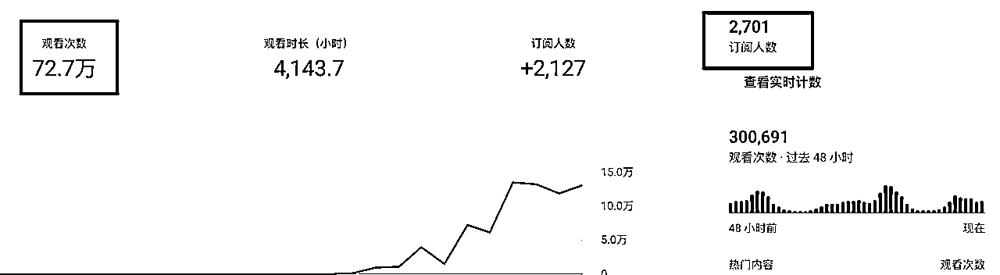

### 往期项目回顾：

去年在抖音做到AI绘画细分领域TOP 1的矩阵账号搭建，团队精华帖看这两篇，写今天的分享也算是给自己新项目整个总结帖，两个项目有非常多类似的地方，亦仁的超级标让我嗅到了金钱💰的味道，咳咳咳

@竹子。：https://scys.com/articleDetail/xq_topic/814448141845482

@一棵小苗苗：

https://scys.com/articleDetail/xq_topic/588284841125154

### 为何看好YouTube平台

上周看了亦仁的超级标，他说：“同样的播放，在国内视频平台可能一文不值，在YouTube上可能有几千美金的收益”。看到这句话我是既激动又心痛的，我也做过国内短视频平台：抖音，视频号，小红书，甚至B站（第一桶金来自这里），我相信生财做过短视频项目的都很清楚这句话的含金量，生态的选择很重要，因为我们往往无法改变环境，只能在自己能力范围内尽量挑选好的环境，并适应它；

当我们卷抖音短视频，追风口的时候，其实做YouTuber的念头在我脑海里闪现过几次，但也仅此而已，亦仁这句话击中了卷国内短视频平台的各位不？我自己抖音平台单个视频最高播放50万+，团队竹哥有百万播放，我们也只能通过后端产品变现，流量本身几乎不值钱。

我平常也上YouTube看老高与小茉，以及其他国外博主的分享，在国内被和谐的博主，几乎都在YouTube聚齐了，又想到亦仁说：

“这是一个非常长周期的事情，从我那个时期开始做，已经十年过去了，仍然可以在YouTube赚钱，而且越来越强，值得你当作事业认真去做，当然，肯定不简单，请永远记住：赚钱的多少和你克服的困难大小成正比。”

所以试试看，国内能卷出来，国外也行啊，谁能有国人自带卷？哈哈哈

综上我就下场干活了，昨天团队小伙伴搭建了4个新账号，每个账号发布1-3条不同类型的视频，一起是5个账号了，我们又要开拖拉机了；坐稳接下来分享实操干货：我是如何利用生财资源，从0到1搭建账号干法，以及心法，以及目前我看到团队小伙伴搭建账号遇到的坑，也给大家分享避一避坑。

# 项目实操

## 一、选择赛道

大家起号的时候，都容易被：怎么选题困扰；在生财完全不用愁，去航海和风向标看看，总有一款适合你的选题：

亦仁推荐：YouTube shorts，AI工具类制作，无需真人出镜；解决了素人n多包袱卡点，去找AI航海项目看看，参考2024年9月热乎的AI航海：

https://scys.com/view/docx/FDiAdEKoioYSxGxxTJGcIRz2njd

航海文档放眼望去都是项目：AI老照片、AI写真、AI宝宝走秀，AI赛博机车、AI头像、AI壁纸等等，国内短视频“无缝衔接”到YouTube，选一个你喜欢的先干了再说，想太多也是空想；我选了一个AI宝宝走秀作为切入点，按照航海文档实操，操作层面有指导大纲了，稳。

### 更新：

首先声明儿童赛道可以开通YPP。

目前AI宝贝赛道容易被YouTube判定为「面向儿童」，因为YouTube此前有过向儿童投放不合适广告的诉讼，所以现在【儿童赛道】广告投放比较窄（向成年人可展示的广告更多更广），YPP收入相对来说比较低。

如果我们前期单纯想靠YPP的广告收入赚钱，AI宝宝秀方向建议大家更换，账号不需要变更，可以在原有基础上开始切换赛道，原有视频可以主动设置为面向儿童。

如果在儿童赛道有后端产品对接，卖产品，做儿童玩具开箱等，也可以继续做这个赛道，也能通过其他方式变现。

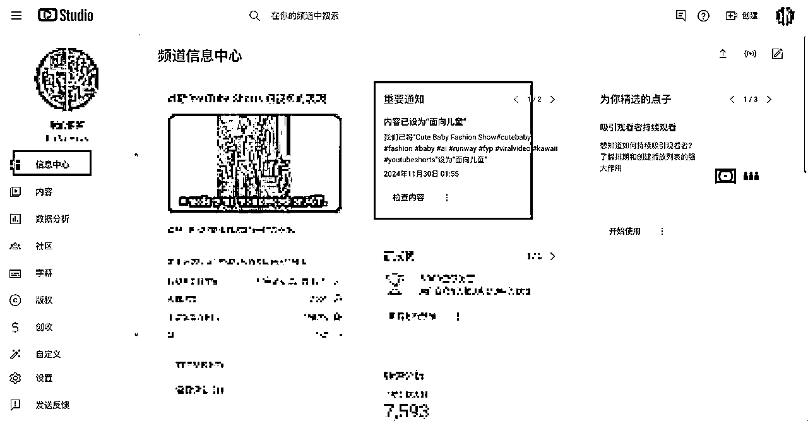

## 二、项目工具

### 0、上网魔法：

某宝咨询下，不方便公开分享。

### 1、写提示词工具：chatGPT、kimi、豆包

专业工具：chatGPT、kimi、豆包等协助写提示词。

手戳党：用谷歌翻译，自己写中文描述，翻译成英文，核心就是主谓宾这套逻辑，先描述主体，再描述次要，以此类推；

*   chaGPT国内镜像（免费30次使用，可用来体验，无需上网魔法）：https://mlyyai.com/，（感谢 分享）有免费额度，大家可以注册用着；或者某宝购买一个，chaGPT稍贵点，也可以使用国内产品替代：kimi、豆包。（其他小伙伴有资源欢迎分享）

*   原版国外chatGPT，注册一个免费版本的教程：（我去年写的老教程，如有更新的教程可飞书私聊我，感谢）

### 2、图片制作：MJ（Midjourney）绘画

某宝上买个日抛账号，1-2元/天，先小成本用起来；月订共享账号大概18块钱，官网直接订购10美刀起步，适合长期深耕shorts的小伙伴。

### 3、视频制作：runway 或者 国内可灵软件

*   runway：某宝买个日抛账号，2-3 元/天，先小成本用起来；官网直接订购 20 美刀起步，适合长期深耕 shorts 的小伙伴。

https://runwayml.com/

*   国内可灵：试用免费。

https://klingai.kuaishou.com/

### 4、剪辑方面：剪映+qq音乐

剪映会简单添加视频+配乐即可；

爆款配乐识别：

用qq音乐的【听歌识曲】功能。

或者用下面👇这个工具下载爆款视频，顺便就下载了爆款音乐。

### 5、下载视频工具

为方便模仿对标账号，可以下载YouTube等平台的视频，可以用这个网站（免费）：

##### 工具一：

https://vtool.pro/youtube.html


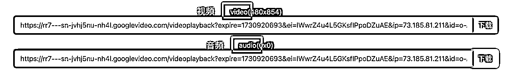

##### 工具二：

https://shortsnoob.com/zh

##### 工具下载常见问题：

需要切换魔法的节点，再尝试下载，有些节点下载不了，会有底部的提示（重开浏览器，清理浏览器缓存）。


## 三、从0到1搭建YouTube账号

我这篇分享属于精简版，目的是分享如何快速起号，大家有时间依然要多看各种航海文档和精华帖，才能不断优化账号和做矩阵账号。

不得不感叹生财资源不仅走在最前沿，还能经久耐用，请看VCR：

2022年YouTube航海：https://scys.com/view/docx/doxcnPgun49EUoAyPo60slrnNIe

一切皆可生财找，现找现用，咱们按照航海就可以搭建YouTube账号了，先不要追求完美，“弄个简单的YouTube账号框架”就可以上视频了，

不要被：头像怎么弄？封面怎么制作？我做的视频好丑？我怎么这么笨？

头像不会制作，手机相册找一张宠物的，或者风景照，或者MJ制作一张，先完成再优化；封面同理；停止我觉得xxx，模仿爆款让市场检验下，非常好的原创，也有可能打不过丑丑的模仿爆款。事实证明丑的东西也有人喜欢，笨的同理。放掉这种念头，视频发起来，先有再优化。

我的25万+播放爆款，做的效果可以说是很拙劣，但就是爆了...所以大家加油，技术都是慢慢优化起来的，接纳刚开始的不完美（十多天过去了，依然心安理得的不完美中...），实操部分我会分享这类视频怎么制作。

## 四、如何筛选爆款视频模仿

本来这一步应该放在搭建账号前面，但先从简单的开始比较符合人性，正在下场干，肯定不止搭建一个账号，所以第一个重要也不重要，先干最重要。

*   和国内平台一样，当一个正常用户去刷YouTube shorts，他会给你推荐优质视频，然后你就可以点赞、收藏，关注一条龙，加入自己的收藏夹留着模仿；或者在YouTube搜索栏，主动搜某些关键词，查看YouTube推荐shorts内容。（我常用的方法，国外平台同理）

*   以上适合新手，简单快捷上手；老手请移步这里，查找爆款视频模仿：

生财圈友钱塘江鲤：利用RPA自动化流程分析YouTube Shorts上的热门AI视频

https://scys.com/articleDetail/xq_topic/5121541548888524

比如我找对标账号标准：

*   YouTuber快速起号（证明有市场，快速起号，好的模仿对象）

*   订阅过万

*   单视频播放过百万（证明爆过）

*   有重复发某类型视频（证明是被验证过的爆款样式）

对标案例一：（我的25w+播放爆款模仿的它。）

www.youtube.com/@Babyfashionstar

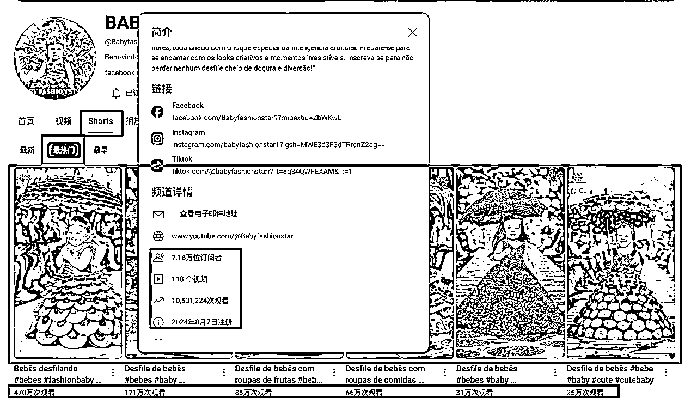

对标案例二：可爱宝贝类型

www.youtube.com/@littleclassics7988

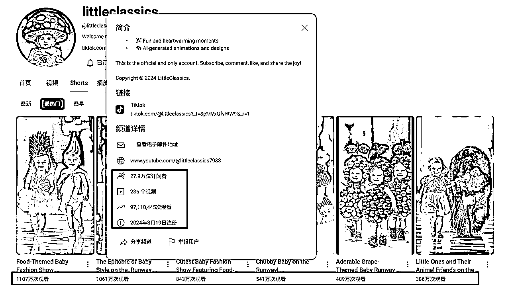

对标案例三：可爱类型的老虎

www.youtube.com/@pets-dog-cat

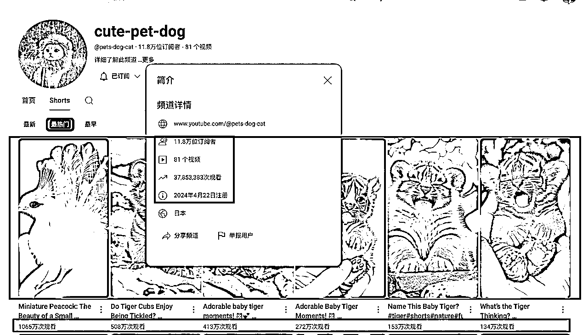

## 五、如何制作第一个视频

### 1⃣️前言：

先完成，后完美；AI工具有缺陷，咱们素人手法也不灵光，制作并不完美，所以咱们先完成，先保持一天1-3个视频，找找发布的感觉，不要删除视频，如果发错了，改为仅自己可见就行。

先尝试，后面再优化，重要的是多找爆款抄它！

比如：我上面找了三个对标账号，我们可以每个类型都试试看，刚开始不要有洁癖，觉得某个账号只能发一种类型的视频，前期都可以试试，可爱动物和可爱小孩都可以尝试。

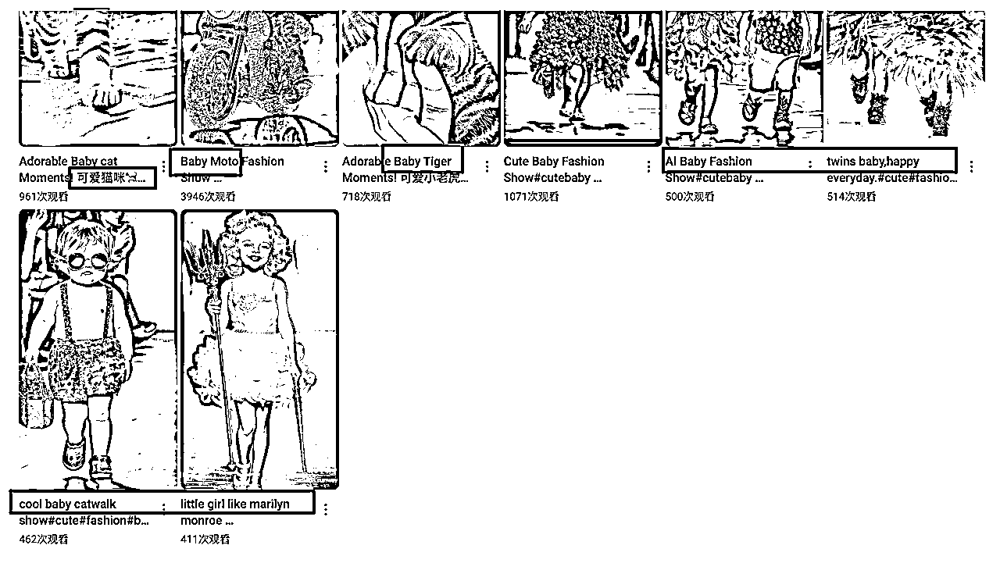

多多尝试，然后找到数据好的视频，重复做。


### 2⃣️案例：AI宝宝T台秀：

本案例所用工具：国内版本chatGPT+MJ+runway+剪映

#### 1、找到对标账号的某个爆款播放视频：

这个博主2024年8月19号注册账号，目前已经有27万粉丝，最高千万播放，普通日常百万播放，抄它！（她也在小红书，应该是国人）

https://www.youtube.com/@littleclassics7988

例如YouTube千万播放的视频（图中第一个热门shorts）：https://www.youtube.com/shorts/RKPRROl642o

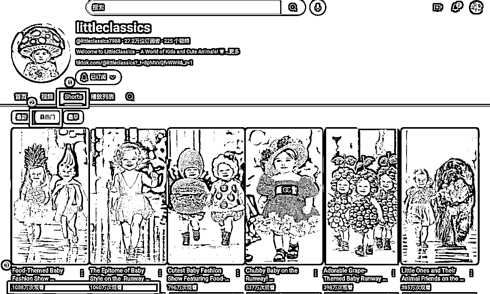

用下载视频工具，把视频和音频下载下来，方便后续截图视频图片和使用它的音乐进行模仿。

https://vtool.pro/youtube.html

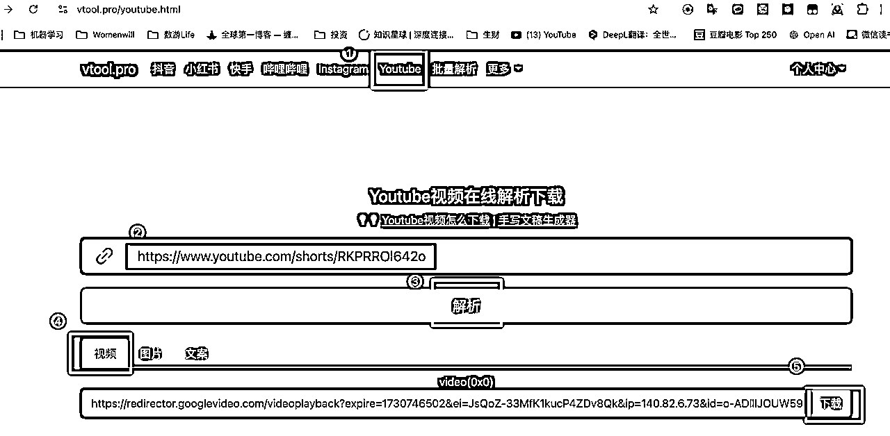


#### 2、用MJ模仿视频里面的图片

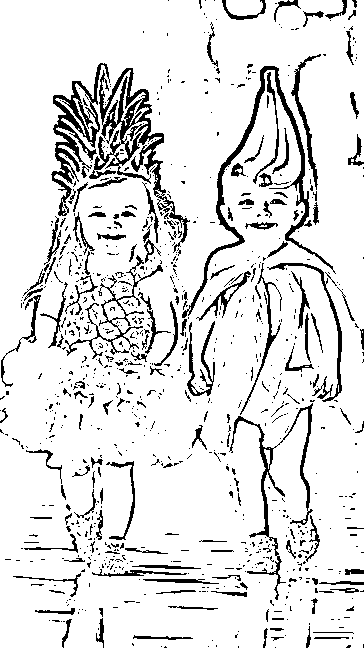

##### 方法一：

用MJ的/describe功能，让MJ描述图片里面的内容，然后自己用生成的MJ提示词生成新的图片。（效果还行）

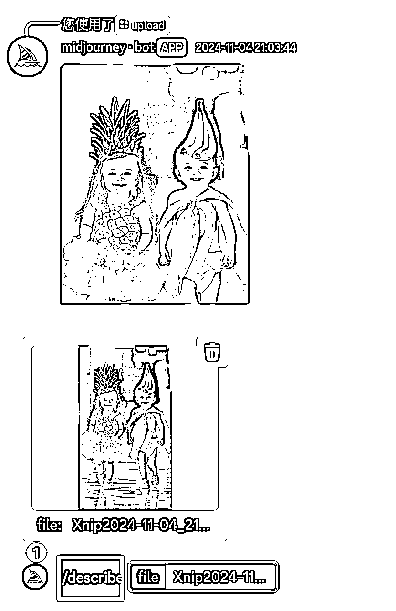

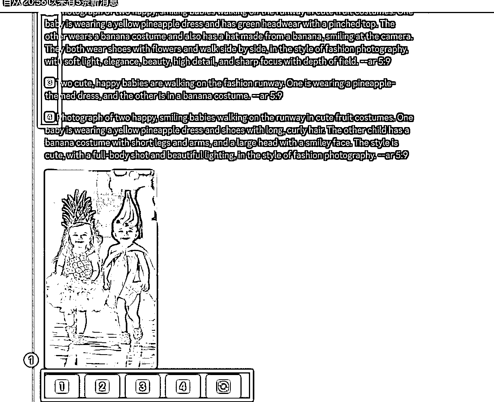

###### 视频解说：（建议1.5倍速播放）

##### 方法二：

用chatGPT写提示词，再在MJ制作图片。

chatGPT提示词：

我想在 Midjorney 创建下面的图像，所以请用英语写下提示词，再用中文翻译一遍提示词。

---

男孩和女孩在巴黎时装秀上走秀；女孩穿着菠萝样式的礼服裙子，头戴绿色菠萝叶头饰；男孩穿着香蕉样式的衣服，头戴逼真的香蕉头饰；她们非常开心，正在牵手走秀

照片必须非常真实

尽可能详细

图像质量超高，4K

背景应该位于明亮的巴黎时装秀舞台上。

请详细写出提示

仅发送提示

在末尾添加“,--ar 9:16”

```
A nowborn baby boy and newborn baby girl walking hand-in-hand on a Paris fashion show runway; the girl is wearing a dress styled like a pineapple, complete with a green pineapple leaf headpiece, while the boy is dressed in an outfit inspired by a banana, with a realistic banana headpiece. Both are smiling happily, exuding joy as they walk the runway together. The photo should be highly realistic, capturing fine details like the textures of their costumes, their expressions, and the lively atmosphere. Ultra-high image quality, 4K resolution, set against a bright Paris fashion show stage. --ar 9:16 
```

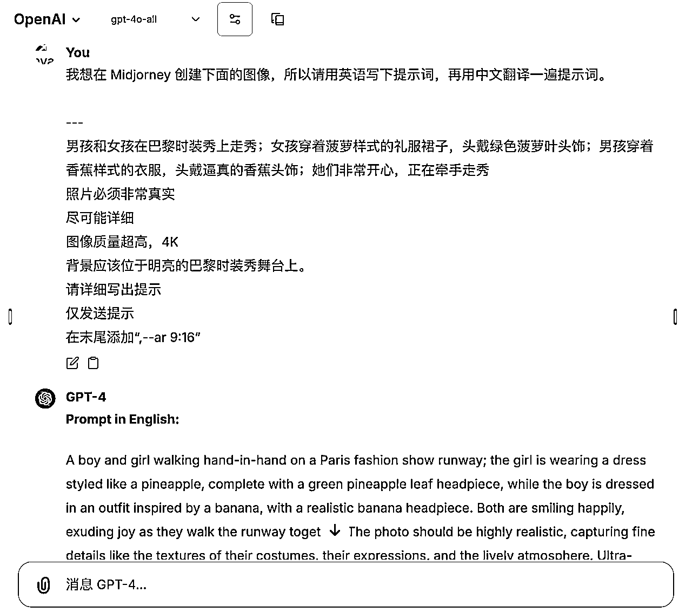

###### 视频解说：（建议1.5倍速播放）

#### 3、用runway制作小孩走秀视频

先用chatGPT写制作runway视频的提示词：

我想在视频生成平台AI Runway gen3 创建一个以附图作为起始的视频，因此请输出英文提示，再用中文翻译一遍。请仔细根据附图绘制描述。

――――――――――

在附图中，小男孩和女孩在巴黎时装秀上，他们牵手一起走秀，非常开心。

请用英文写出 400 个字符以内的提示。

```
starting with the scene depicted in the uploaded image where a young boy and girl are walking hand-in-hand on the Paris fashion show runway, smiling joyfully. Capture their cheerful expressions and the stylish, themed outfits as they confidently stride down the runway. The video should maintain this high-spirited and fashionable atmosphere, focusing on their interactions, the details of their pineapple and banana-themed attire, and the vibrant Paris runway setting.
```

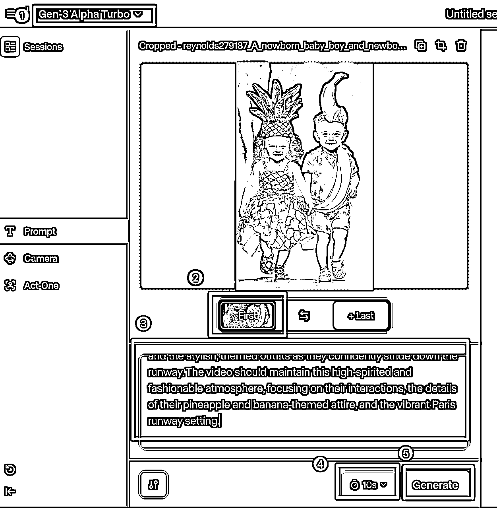

###### 视频解说：

#### 4、剪映剪辑视频+qq音乐识别

###### 视频解说：

###### 音乐版权主张问题：（content ID）

更新

除了 YouTube 提供的比较少的免费的音乐库，其他商用音乐都会有可能涉及版权，如果被 YouTube 识别，会有版权主张提醒 Content ID，但并不是表示侵权哈

你还没有开通 ypp 前都可以免费使用商用音乐，YouTube 识别后，因为版权保护，会打上 Content ID，等你开通 YPP 以后，音乐版权方会从你的 YPP 收入里面扣除他的音乐版权费。(费用可能会比较多)

如果不想用 YouTube 音乐库比较少的音乐，也不想用有版权主张的商用音乐，网上有免费的音乐网站，可以试试，或者自己 AI 音乐suno等。

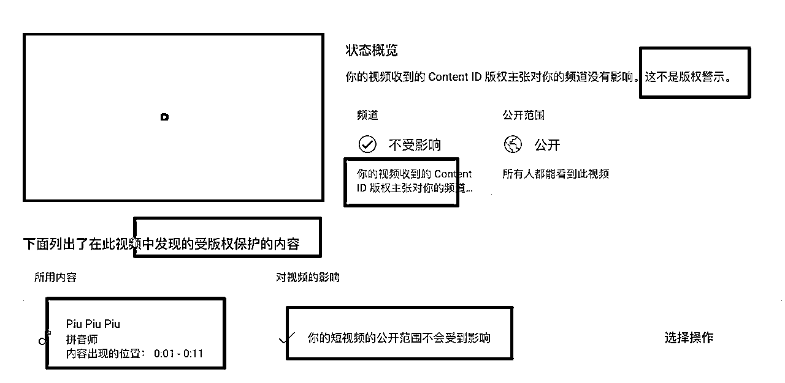

### 3⃣️案例：AI魔法秀

###### 最后演示的视频拆解可以查看 的生财分享帖：

https://scys.com/articleDetail/xq_topic/2858241885558511

## 六、 小伙伴起号遇到的问题 & 总结

### 小伙伴起号遇到的问题

以下提到的小伙伴截图，目前有三个小伙伴上道，视频跑起来了，大家加油，搞定以下问题，其他项目通用。

#### 1、对标账号没找对

对标账号尽量去YouTube平台找，而不是国内xx平台，大家可以想想为什么？

国内平台用户99%是国人，国外YouTube90%是外国人（华人和国人占比相对较小），用户不同喜好自然有差别，所以咱们有条件尽量模仿YouTube账号。

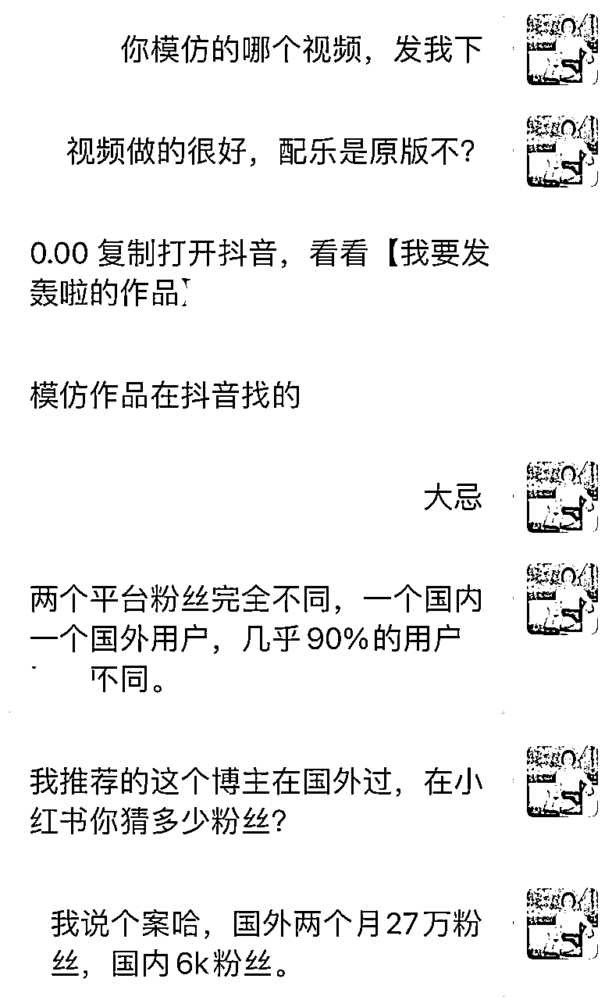

#### 2、模仿爆款只模仿一半，或者自己原创

模仿爆款分为两部分：

*   爆款视频内容，这个大家基本上会按照模板模仿，极个别会自己原创，原创没问题，就是出爆款比较长时间，而且大概率出不了爆款，还是老老实实走别人跑通的路，等自己有体感了，再去原创。

*   爆款音乐（博主常用的音乐）：爆款视频的博主有个特点，同一个音乐+爆款变型的动画；就像看鬼片，如果配乐不对或者没有配乐，恐怖效果会大打折扣...所以咱们配乐也用爆款，抄都抄了，不差个配乐了哈。

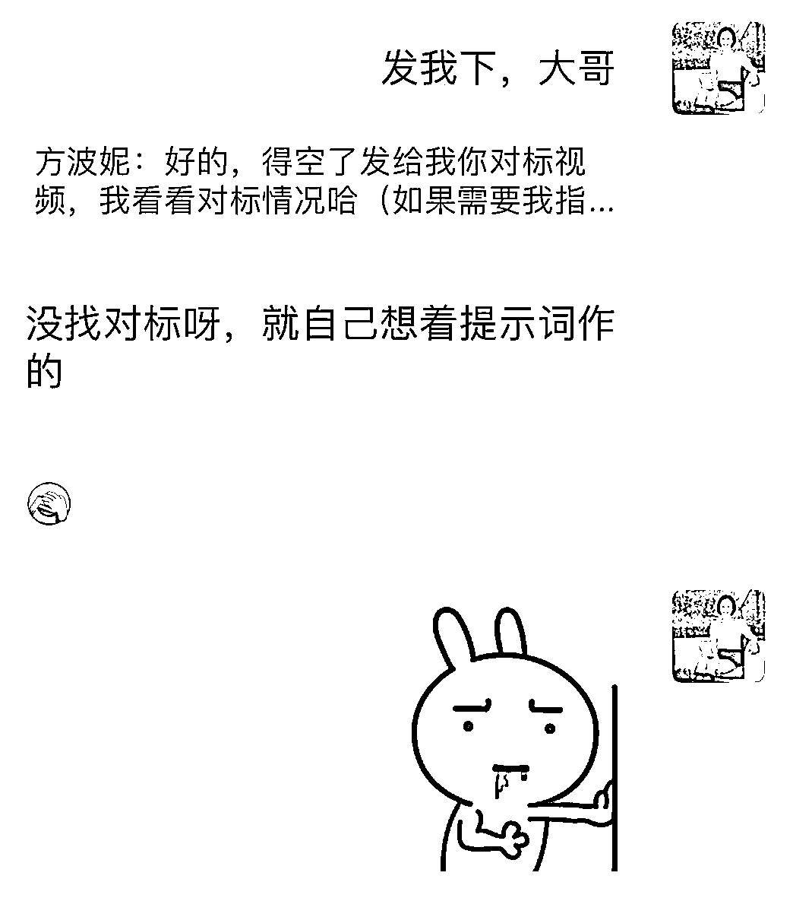

还有让我哭笑不得的模仿方式：感谢我小伙伴贡献案例，我想素人真的有可能遇到这种问题，所以请看VCR:

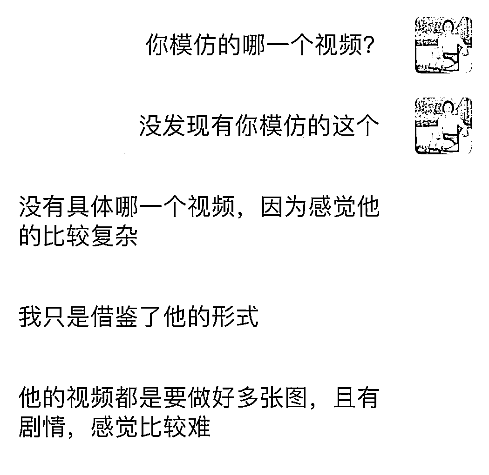

如果模仿不了，找资源模仿（生财圈子或者网上），实在没有，换个对标账号，换个自己能模仿的对标账号（不然就不叫对标账号了）

##### 给大家看看复刻案例：

正确的复刻模板，不正确的就不给大家发案例了哈...有些真的毫不相干...

真的是旱的旱死涝的涝死（这位小伙伴还觉得复刻的不够要求，我此时已经觉得分不清东施还是西施了）

无奖竞猜，谁是原视频？可以在文档最后留言。

#### 3、出图工具设置错误，出图效果欠佳

首先这是小问题哈，但设置不对出来的图是真的差别大...有小伙伴跑了两个视频个位数播放，都想玉玉了，改过来后，第三个视频就亮了。

先按照以下链接创建自己的服务器，再在输入框输入：/setting ，再回车，调整为V6.1版本或者对标账号的绘画风格

https://blog.csdn.net/xutongbao/article/details/136214194

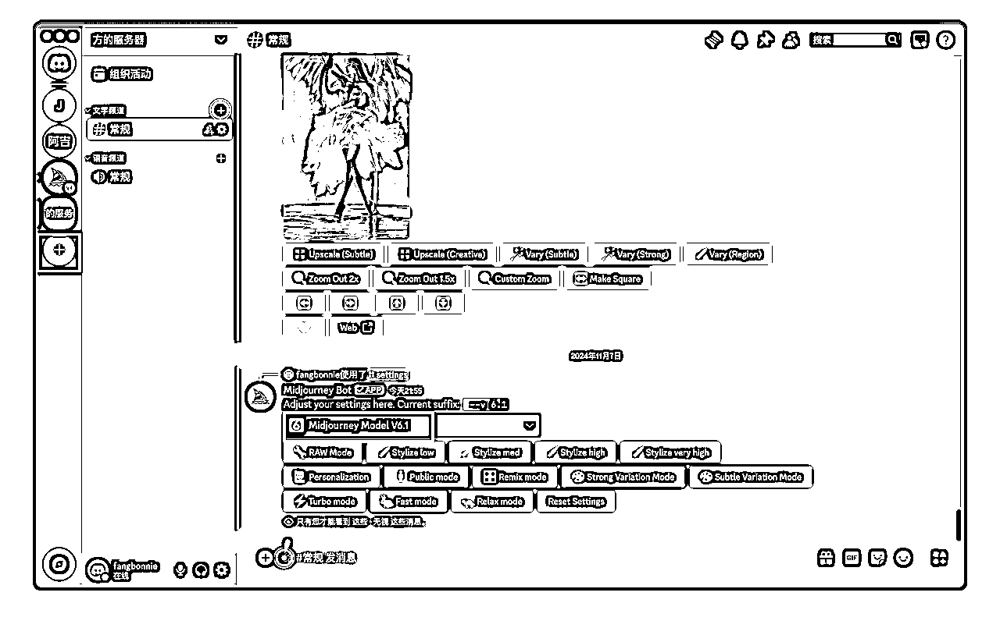

### 项目如何拿结果：（核心要点）

去年在生财跑通了很多项目，可以说是只要下场干就能拿到结果（钱），抖音AI绘画，闲鱼二手书，黄金代购等等，还有些外面的项目，前提条件是对项目筛选判断，简单分享下吧，感觉对大家会有帮助。

#### 1、如何筛选项目

最重要的一点：这个项目有人赚到过钱

二：项目可复制（生财项目基本都满足哈，再次给生财点赞👍）

三：项目我能够复制，我满足复制项目的各项能力，暂时不满足的我预估也能短时间学会（长时间素人真的等不了，我遇到过好几次评论区留言：我发布了一个视频，0播放/个位数播放啊，然后怎么怎么的...）

满足以上三点，素人可以跑项目了（这里特指素人，大佬筛选项目要求更多，因为每个人时间成本不一样，对项目预期收益不一样）

#### 2、下场干活：

起号：放弃高大上的原创情节，老老实实模仿对标账号，模仿别人不寒碜，大不了东施效颦嘛，要赚钱，面子放一放，赚钱了，自然有面子。

包袱放下了，愿意模仿别人了，请像素级别模仿，能模仿的都模仿了，模仿不了的想办法模仿，刚开始我相信大家都做不到，但没关系，先抓重点，再优化，什么是重点？

第一：视频内容样式

力求先做到东施效颦，再慢慢变西施；做到什么程度呢？就是你把对标账号视频和你的视频放在一起看，你能看出来你的视频就是抄的对标视频样子，但可能还差点意思，有瑕疵；不能说做出来的视频和原视频一看就没关系，只能说是同一个物种...那咱们模仿了个寂寞...

第二：配乐

看鬼片把音乐关掉，你试试恐怖恐怖？吓不吓人？少了音效加成，恐怖片效果大打折扣，所以请把爆款视频音乐扒下来，本文档有分享工具。

有小伙伴在这里就又跑偏了，搞了一个自己觉得好听的音乐，然后就发布了...嗯，也会打折扣，搞不清楚状况之前，像素级别模仿吧，等以后咱们再原创，创造属于自己的爆款。

#### 3、多一些耐心

视频发布了，几小时过去了，0播放/个位数播放，玉玉了怎么办：

心放在肚子里，不能凉拌，如果是素人遇到这种情况太正常了，正反馈这么快，又不是chuan销...

首先：咱们才过去了几小时，YouTube平台给流量比国内稍微慢点儿，但好在持久，也就是内容做的好，持续给你播放量；我最高一条视频破30w了，还在持续给流量。

其次：先检查自己上一个步骤做到位了没：是否做到了视频70%以上的相似度模仿？包括视频内容+配乐。（能99%更好嘛，此时谁还能分清谁是真西施！我觉得你就是）

最后：咱们多发几个视频，一天怼三个视频，早中晚各一条；至少怼三天吧，提高概率嘛，就像买彩票，多买提高中奖概率（啊我不提倡买啊，举例子）

综上：做到了，但账号就是起不来，换下一个项目，下一个更乖；所有项目都这样跑跑，我相信你会找到属于你的搞钱项目，加油哈，素人赚钱不容易，但也没有太难，在生财多挖掘。

以上是我个人想法，如果相左，欢迎评论区交流。

## 七、接下来行动目标：批量起号

三个月内：

第一个月目标：

*   开通YouTube合作伙伴创收计划，赚到第一块美金；

*   带领小伙伴做YouTube账号，跑矩阵，预期第一个月先跑十几个账号做标杆（目前有5个了）。

第二个月目标：

*   跑通账号赚到美金，批量复制账号，找不同的AI赛道去复制。

*   带领第一批小伙伴开通创收计划。

第三个月目标：

项目沉淀，复盘优化，扩张。

## 八、做YouTube参考文章：

### 1、亦仁的超级标2：

https://scys.com/articleDetail/xq_topic/5121542448454444

### 2、竹子。AI宝宝走秀与Magic变身视频制作：YouTube Shorts实操指南

https://scys.com/articleDetail/xq_topic/2858241885558511

### 3、老马AI内容出海：YouTube Shorts项目崛起：小作坊的机遇与挑战

https://scys.com/articleDetail/xq_topic/4848528158581518

YouTube shorts的播放和收益截图：

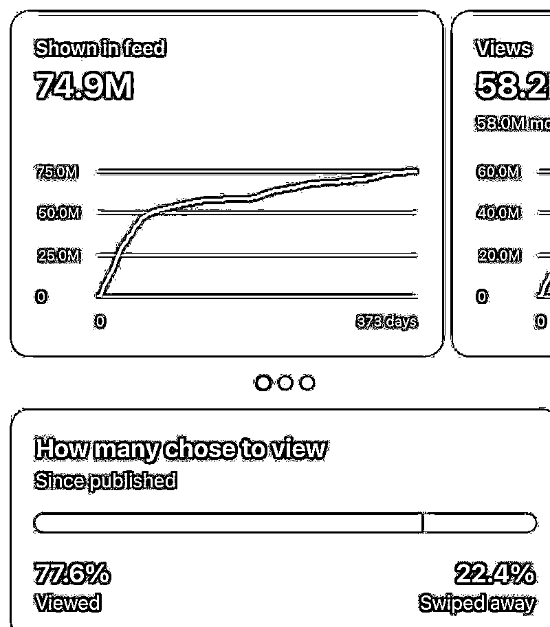

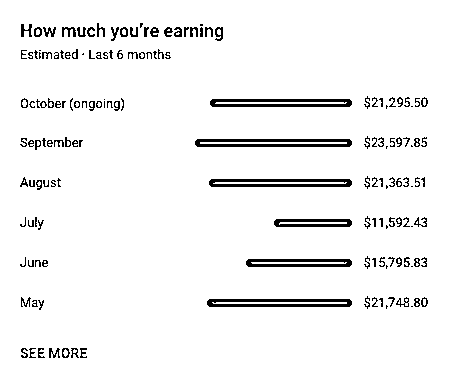

### 4、钱塘江鲤：利用RPA自动化流程分析YouTube Shorts上的热门AI视频

https://scys.com/articleDetail/xq_topic/5121541548888524

### 5、老马AI内容出海：YouTube Shorts 赛道选择与收益解读

https://scys.com/articleDetail/xq_topic/5121545551845854

### 6、浅笑分享YouTube大博主教人做油管的方法：

https://scys.com/articleDetail/xq_topic/2858245152412811

### 7、AI进化论-花生YouTube创收计划：YPP条件与分成机制解析

https://scys.com/articleDetail/xq_topic/5121541222242884

### 8、竹子。生财精华帖：

https://scys.com/articleDetail/xq_topic/814448141845482

### 9、一棵小苗苗生财精华帖：

https://scys.com/articleDetail/xq_topic/588284841125154

### 10、2024年9月热乎的AI航海：

https://scys.com/view/docx/FDiAdEKoioYSxGxxTJGcIRz2njd

### 11、2022年YouTube航海：

https://scys.com/view/docx/doxcnPgun49EUoAyPo60slrnNIe