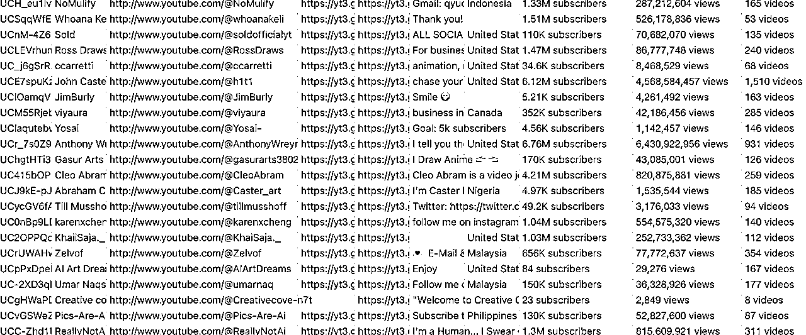
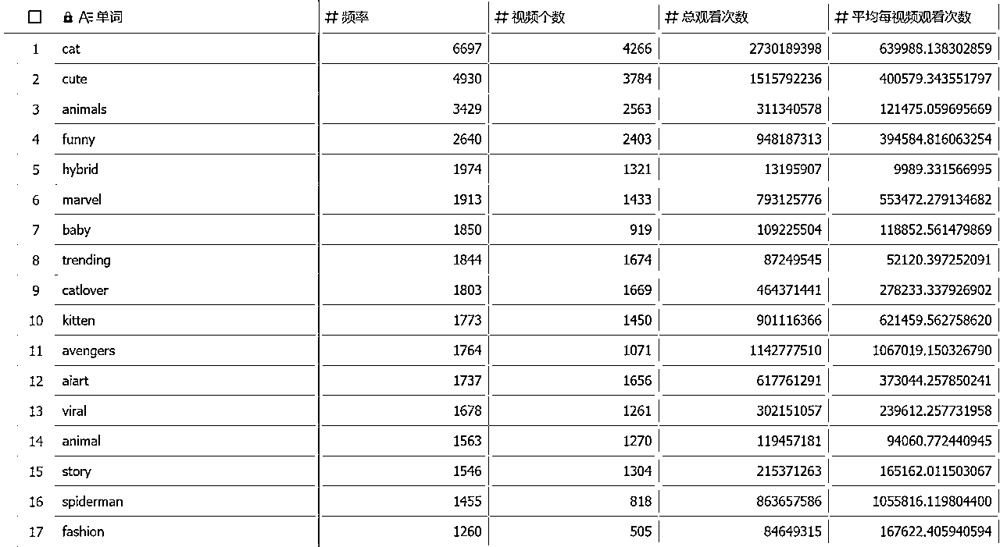
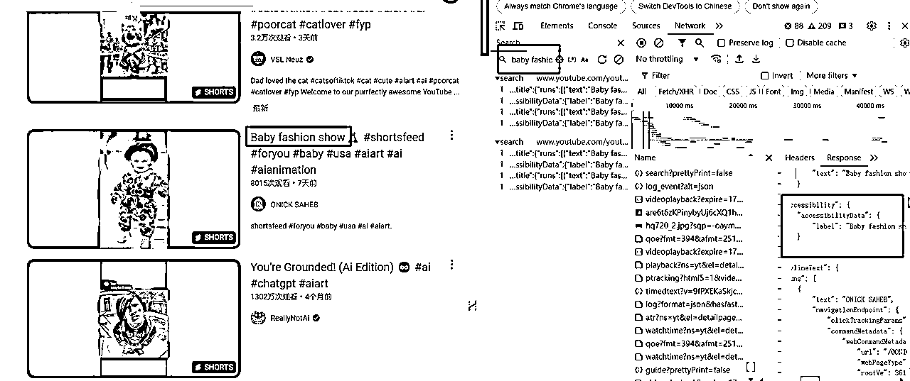
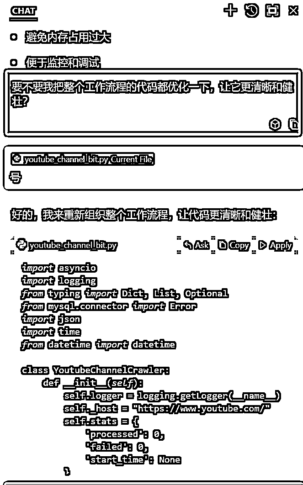
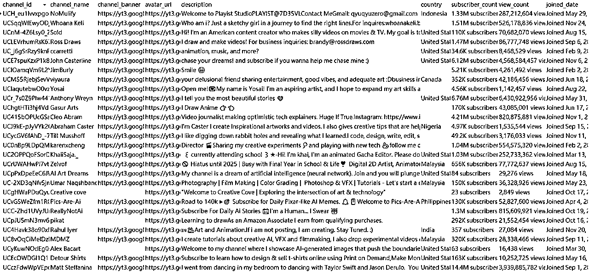
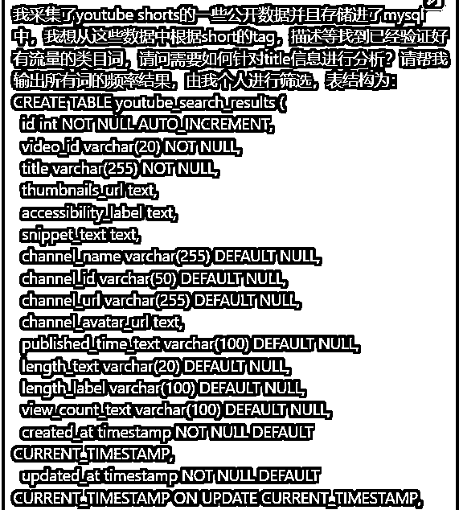
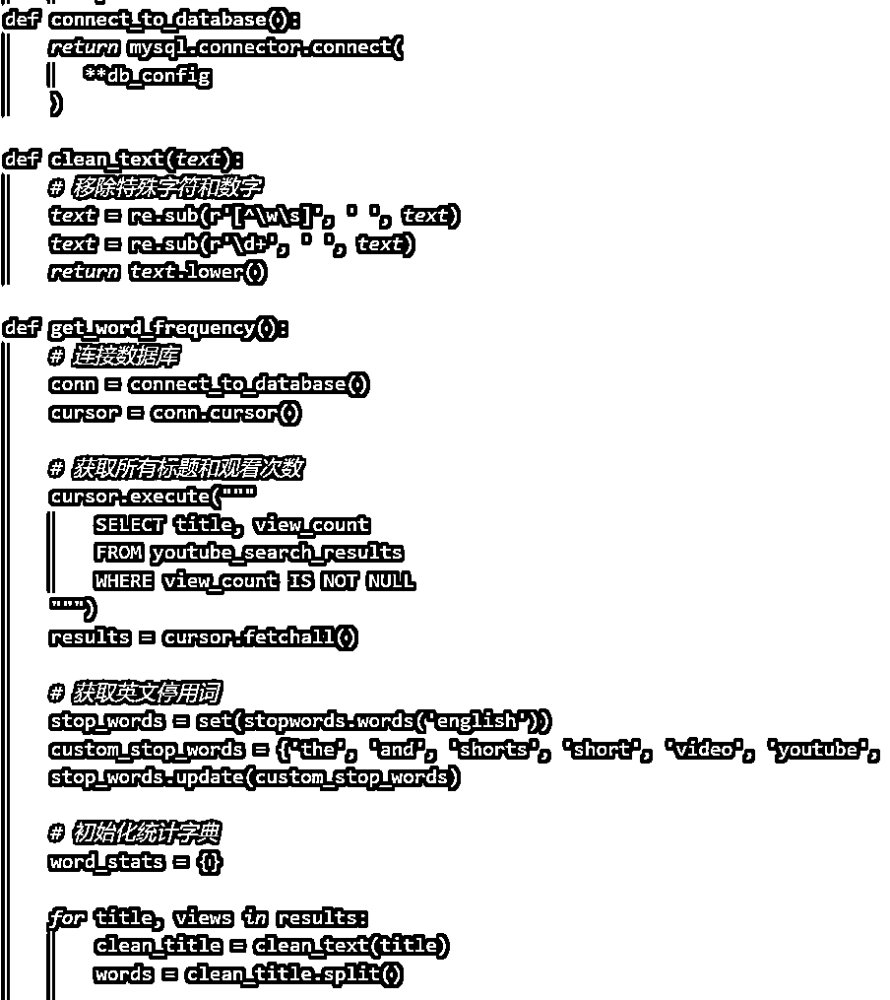
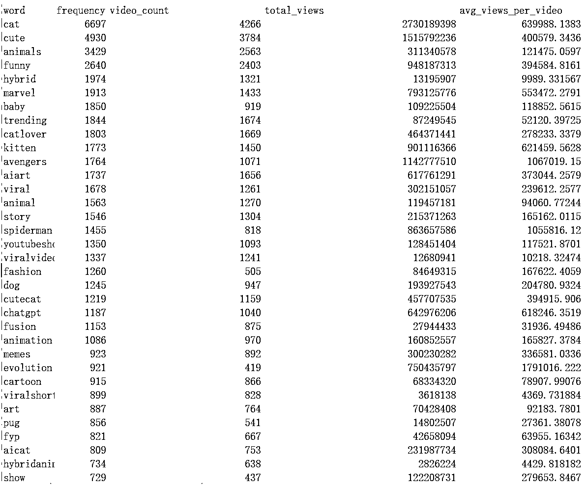

# 1万个YouTube AI shorts 对标账号

> 来源：[https://ia0969wpr2.feishu.cn/docx/WssEddk9Yoi4k9x8tJVcelxfnKg](https://ia0969wpr2.feishu.cn/docx/WssEddk9Yoi4k9x8tJVcelxfnKg)

上周亦仁分享了第二条超级标，YouTube shorts ai video，在超级标的最后，亦仁说道：

"如何挖掘到已经在shorts和YouTube上火爆的ai视频？通过找到一个视频，进入对方的描述区，通过他的tag，描述，以及评论，找到更多关键词，通过这些关键词进一步向外扩展，最后你就能找到成千上万个别人已经验证好有流量的类目词。"

基于亦仁提供的这一思路，我写了一个RPA自动化流程分析youtube shorts 上的热门AI视频，首先定位到一些对标视频之后，采集视频详情，收集所有的描述和tag信息，通过描述和tag搜索short，点击tag页采集short，扩展tag后不断循环，最后进入到对应的channel采集详情，在采集过程中使用了不同国家和地区的IP，尽可能兼顾到不同文化下的各类meme。

经过筛选最后收集到了一万个左右的channel账号信息，其中注册时间在一年内且粉丝大于1000的有1657条。对于每个channel，都保留了原始信息，包括channel基本信息、注册时间、总视频数、总订阅数、总观看数、所在地区、推特ig个人信息等字段，方便进一步筛选和找精准对标。

链接信息：



另外对采集到的高观看量和高点赞量的视频描述进行分词，列出了每个分词对应的视频数量和总观看量，方便充分发掘YouTube Shorts AI视频的流量机会。

链接：



完整数据：

channel信息：

关键词频次：

short视频信息：

以下是实现过程

首先我们分析下流程，总体上有几种思路，第一我们需要找到一条AI生成的视频，然后点击描述区采集到对应的tag，我们手动点击short tag，发现会跳转到对应的tag主页，以#aiart 为例，我们点击后会直接进入到这个页面：


可以看到url格式为 https://www.youtube.com/hashtag/{tag}/shorts ，也就是说我们可以先采集一部分视频，通过聚合关键词跳转URL进行采集，这样避免了我们模拟点击的过程，可以明显地加快速度。

然后每个tag逐个进行采集，tag 采集可以直接通过tag页采集，也可以从YouTube直接搜索然后选中shorts采集，我们可以两种方式并行。

我们接下来再试一下搜索，输入关键词搜索后直接点击“shorts”，可以跳转到只查看shorts视频，说明这两种方式都是行得通的。那我们的思路基本也就可以明确了，首先手动通过关键词找到几个对标视频，然后RPA根据关键词不断裂变采集新的关键词，这样循环下去我们基本上就可以找到我们想要的数据了。


下面就是采集了，为了简单，还有考虑到后面可能使用到影刀进行自动化定时上传和多矩阵账号数据拉取，所以就统一使用RPA的方式进行采集了。这样上手也比较快，最快一两小时就可以搞定整体的流程。当然YouTube官方是支持API的，可以直接申请就可以：https://developers.google.com/youtube/v3/，但是官方API有配额限制，数据整体也没有网页全，根据实际需求选择即可。

## 数据采集

首先是采集前的准备，我们以搜索出来的baby fashion show 为例，直接在控制台中关键词查找，发现搜索时的数据是通过youtube/search接口返回的，那最简单的方式就来了，我们直接使用影刀滑动页面，然后网络拦截https://www.youtube.com/youtubei/v1/search这个接口，对返回的数据进行解析。



我们直接在影刀中写一个无限循环，输入关键词切换shorts视频之后不断滚动，判断出现“无更多结果”的时候跳出循环终结当前流程，然后继续下一个关键词的采集。


整体上监听一下search接口，调用模块进行解析即可，解析的时候是针对影响的JSON进行解析，代码如下，注意，解析后需要存储，因为我有个人的数据库，所以我直接落到了表中，如果对数据库不了解的要自己把数据保存到excel或者JSON中：

```
import json
import os
import mysql.connector
from mysql.connector import Error

def extract_youtube_search():
    with open('youtube_search.json', 'r', encoding='utf-8') as file:
        data = json.load(file)
    effective_contents = data.get('onResponseReceivedCommands', [{}])[0] \
                   .get('reloadContinuationItemsCommand', {}) \
                   .get('continuationItems', [{}])[0] \
                   .get('twoColumnSearchResultsRenderer', {}) \
                   .get('primaryContents', {}) \
                   .get('sectionListRenderer', {}) \
                   .get('contents', [{}])[0] \
                   .get('itemSectionRenderer', {}) \
                   .get('contents', [])

    results = []

    for item in effective_contents:
        videoRenderer = item.get('videoRenderer', {})
        print(videoRenderer)
        if not videoRenderer:
            continue

        video_data = {
            'videoId': videoRenderer.get('videoId', ''),
            'video_url':f'https://www.youtube.com/watch?v={videoRenderer["videoId"]}',
            'thumbnails_url': videoRenderer.get('thumbnail', {}).get('thumbnails', [{}])[-1].get('url', ''),
            'cover_url':f'https://i.ytimg.com/vi/{videoRenderer["videoId"]}/frame0.jpg',
            'default_thumb_url':f'https://i.ytimg.com/vi/{videoRenderer["videoId"]}/default.jpg',
            'title': videoRenderer.get('title', {}).get('runs', [{}])[0].get('text', ''),
            'accessibility_label': videoRenderer.get('title', {}).get('accessibility', {}).get('accessibilityData', {}).get('label', ''),
            'snippet_text': ''.join(run.get('text', '') for snippet in videoRenderer.get('detailedMetadataSnippets', []) 
                                    for run in snippet.get('snippetText', {}).get('runs', [])),
            'channel_name': videoRenderer.get('longBylineText', {}).get('runs', [{}])[0].get('text', ''),
            'channel_id': videoRenderer.get('longBylineText', {}).get('runs', [{}])[0].get('navigationEndpoint', {}).get('browseEndpoint', {}).get('browseId', ''),
            'channel_url': f"https://www.youtube.com{videoRenderer.get('longBylineText', {}).get('runs', [{}])[0].get('navigationEndpoint', {}).get('browseEndpoint', {}).get('canonicalBaseUrl', '')}",
            'channel_avatar_url': videoRenderer.get('avatar', {}).get('decoratedAvatarViewModel', {}).get('avatar', {}).get('avatarViewModel', {}).get('image', {}).get('sources', [{}])[0].get('url', ''),
            'published_time_text': videoRenderer.get('publishedTimeText', {}).get('simpleText', ''),
            'lengthText': videoRenderer.get('lengthText', {}).get('simpleText', ''),
            'length_label': videoRenderer.get('lengthText', {}).get('accessibility', {}).get('accessibilityData', {}).get('label', ''),
            'viewCountText': videoRenderer.get('viewCountText', {}).get('simpleText', ''),
            'meta_url': videoRenderer.get('navigationEndpoint', {}).get('commandMetadata', {}).get('webCommandMetadata', {}).get('url', '')
        }

        results.append(video_data)
    return results
```

这时候就可以正常采集了，但是单个采集速度还是太慢了，我们之前在推特矩阵中分享过多独立环境矩阵操作，链接在这：https://t.zsxq.com/8alhb，我们直接迁移下，打开十个浏览器同步进行关键词挖掘和数据采集，效率直接X10，单个浏览器大概每3秒采集20条，一小时轻松一两万条数据，通过这种RPA方对于临时性采集来说已经足够了，而且后面如果做矩阵一样可以10个浏览器并行隔离运行，方便我们养号和统计。


后面的tag和channel 也同理，解析后保存即可。采集完成后我们把描述区的词都集中分析一下，这里还是使用cursor，让他根据我们的提示词写代码就行，这里的过程索然无味，我也不贴各种没有用的提示词了，如果自己写不出长篇大论的prompt的话直接去claude官方的 https://console.anthropic.com/ 优化下提示词，嘎嘎好用。

写代码过程中发现了一个有意思的事，相同的提示词下，我发现sonnet3.5 升级后比以前更适合写代码了，比如下面，他会主动询问是否需要重构代码，确定性回复之后它直接把以前一坨将近300行脚本优化到了177行，方法名等也都做了语义化处理，执行完全没问题，实在是太强了。



采集完成后对channel账号去重后发现大概有9266条账号信息，这部分大多数都是可以用来做对标的，继续用cursor统计下tag情况就可以了



我采集了youtube shorts的一些公开数据并且存储进了mysql中，我想从这些数据中根据short的tag，描述等找到已经验证好有流量的类目词，请问需要如何针对title信息进行分析？请分析完成后输出表格。





还是忍不住感慨下，claude模型实在是好用，现在代码输出相当稳定，百分之九十的情况下都能bug free 一遍通过。执行后输出excel表格：



完整代码：

```
import mysql.connector
from collections import Counter
import jieba
import re
from nltk.corpus import stopwords
import nltk
import pandas as pd

# 下载停用词
nltk.download('stopwords')
db_config = {
        }
def connect_to_database():
    return mysql.connector.connect(
       **db_config
    )

def clean_text(text):
    # 移除特殊字符和数字
    text = re.sub(r'[^\w\s]', ' ', text)
    text = re.sub(r'\d+', ' ', text)
    return text.lower()

def get_word_frequency():
    # 连接数据库
    conn = connect_to_database()
    cursor = conn.cursor()

    # 获取所有标题和观看次数
    cursor.execute("""
        SELECT title, view_count 
        FROM youtube_search_results 
        WHERE view_count IS NOT NULL
    """)
    results = cursor.fetchall()

    # 获取英文停用词
    stop_words = set(stopwords.words('english'))
    custom_stop_words = {'the', 'and', 'shorts', 'short', 'video', 'youtube', 'a', 'of', 'to', 'in'}
    stop_words.update(custom_stop_words)

    # 初始化统计字典
    word_stats = {}

    for title, views in results:
        clean_title = clean_text(title)
        words = clean_title.split()

        valid_words = [word for word in words if word not in stop_words and len(word) > 2]

        for word in valid_words:
            if word not in word_stats:
                word_stats[word] = {
                    'frequency': 0,
                    'total_views': 0,
                    'videos': set()  # 用于统计包含该词的视频数量
                }

            word_stats[word]['frequency'] += 1
            word_stats[word]['total_views'] += (views or 0)
            word_stats[word]['videos'].add(title)  # 添加视频标题到集合中

    # 创建DataFrame
    data = []
    for word, stats in word_stats.items():
        video_count = len(stats['videos'])
        avg_views = stats['total_views'] / video_count if video_count > 0 else 0

        data.append({
            'word': word,
            'frequency': stats['frequency'],
            'video_count': video_count,
            'total_views': stats['total_views'],
            'avg_views_per_video': avg_views
        })

    results_df = pd.DataFrame(data)

    # 按频率降序排序
    results_df = results_df.sort_values('frequency', ascending=False)

    # 关闭数据库连接
    cursor.close()
    conn.close()

    return results_df

def main():
    # 获取词频统计结果
    results_df = get_word_frequency()

    # 输出前20个结果作为预览
    print("\n前20个最常见的词及其统计信息:")
    print(results_df.head(20).to_string())

    # 保存完整结果到CSV文件
    results_df.to_csv('youtube_shorts_word_analysis.csv', index=False, encoding='utf-8')
    print("\n完整结果已保存到 youtube_shorts_word_analysis.csv")

if __name__ == "__main__":
    main()
```

完整数据：

channel信息：

访问链接：https://www.youtube.com/channel/+channel_id 即可，channel_id就是第一列

访问频次：

short视频信息：