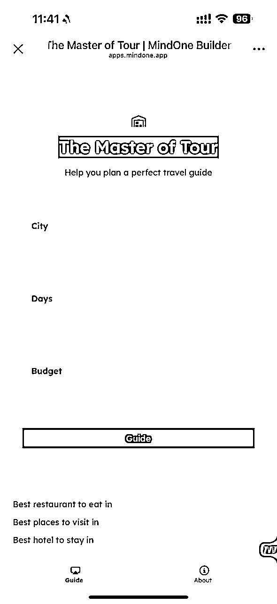
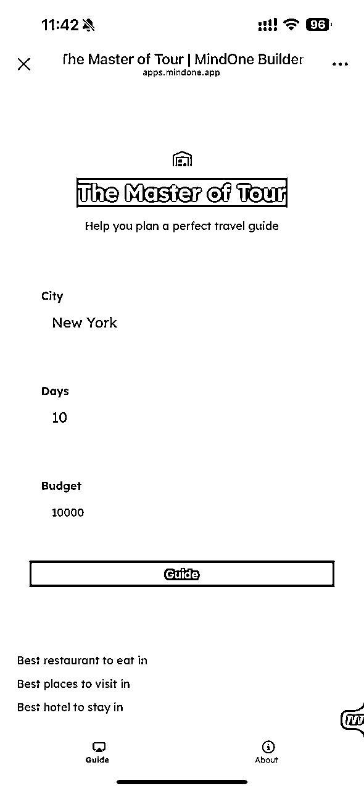
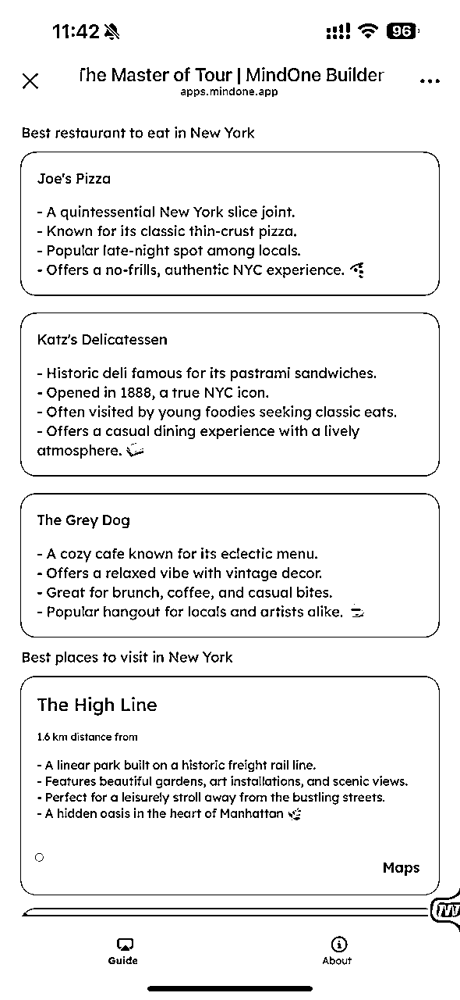
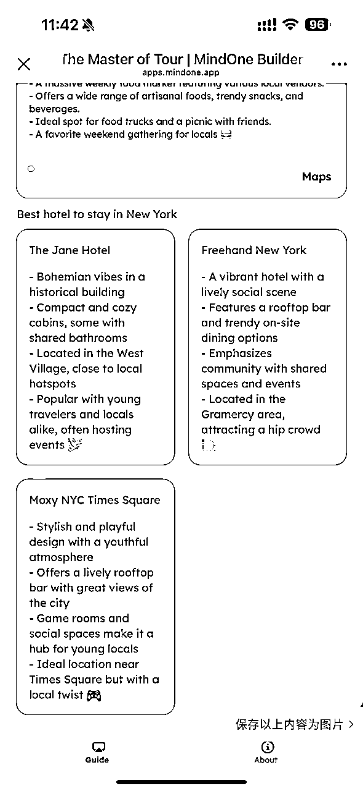
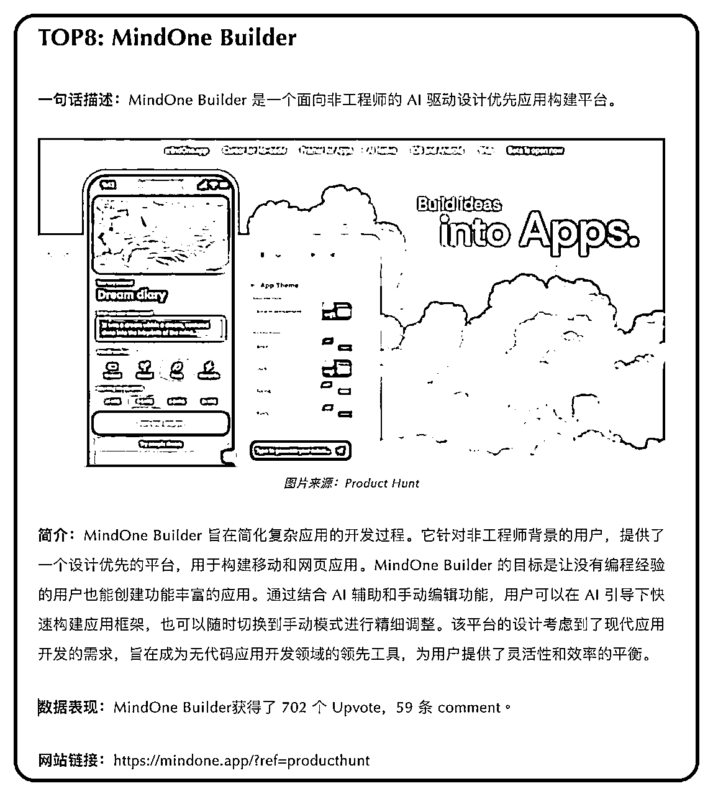
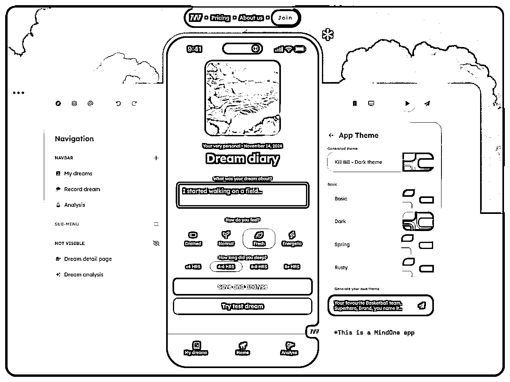
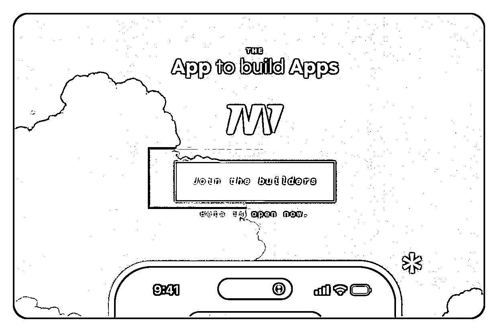
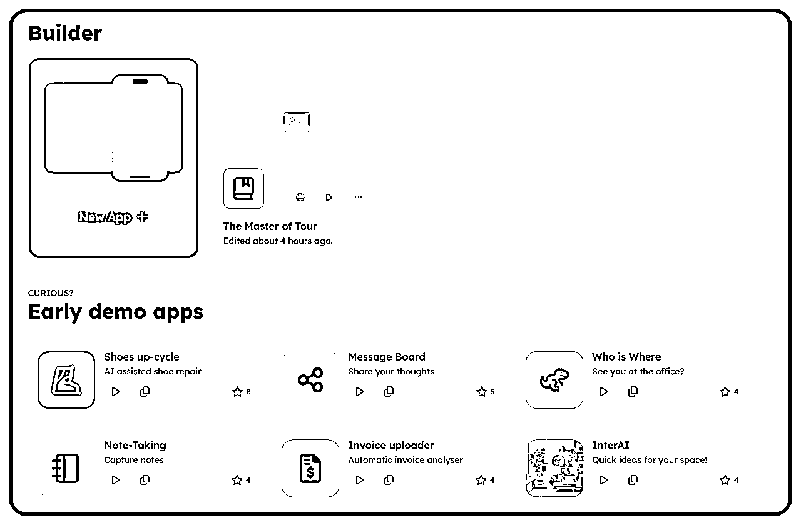
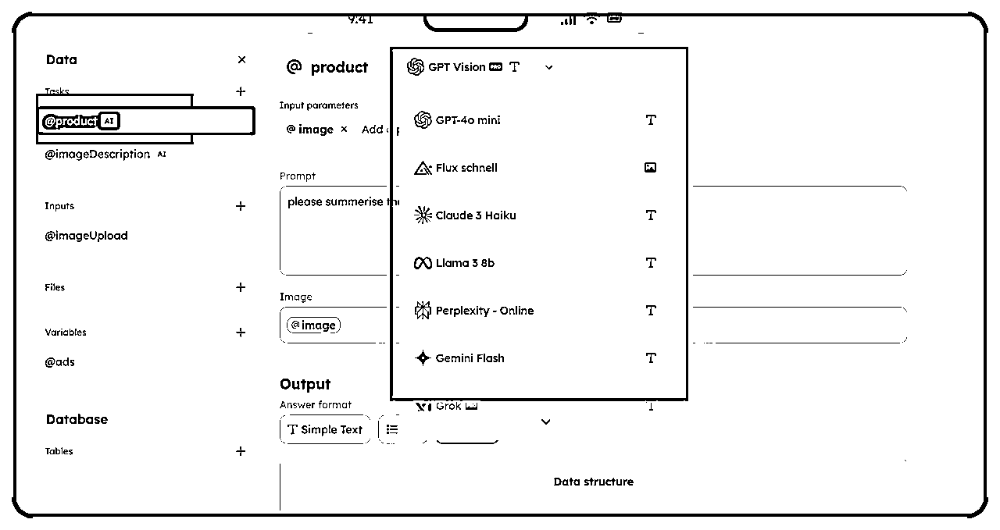

# AI出海应用，只需要拖拉拽就可以做出一款AI应用网站？无需编码，无需部署。太帅了有木有？

> 来源：[https://vnjnntym6m.feishu.cn/docx/XPnzdF8MwovA4wx5PWcc9hVPnUh](https://vnjnntym6m.feishu.cn/docx/XPnzdF8MwovA4wx5PWcc9hVPnUh)

# 第一、背景

加入生财一个月之久了，这也是我的第一篇文章，如果表达欠佳，敬请见谅。我们直接说背景，昨天亦仁大大发布了第三个超级标。制作AI应用，包括不限于AI网站、AIAPP、AI插件。

其实大家也知道，亦仁大大发布的三个超级标都是和AI有关，可见AI的一个大趋势，以及未来市场的空间有多大，这个就不用多说了。在发布第二个超级标的时候，在youtobe上发布AI短视频变现，大家都积极输出自己的想法和教程，真的收获蛮大，但是有一点就是同质化有点严重，只是本质上是一样的，就是每个人的想法略微有些不同，光是吸收大家的精华，不给大家分享自己的东西，感觉怪不好意思的。

所以昨天在发布第三个超级标后，顺着AI应用的线索，找到一个在线制作出海APP的网站，这个网站的神奇之处在于不用编程，只需要拖拉拽，并且内嵌了语言和图像大模型可以直接使用。废话不多说。咱们直接看！

网址：https://mindone.app/?ref=producthunt

# 第二、我的第一款AI出海APP

首先先给大家看我花了1个小时做出来的第一个出海的APP（访问需要魔法）：旅游大师

鉴于有些有些圈友无法访问，所有我就把样式和效果给你大家贴出来：

*   设计思路：

整体的外观其实很简洁，这个外观其实可塑性很大，如果一个审美好的可以做出来非常好看的外观的。我设计的一个启发是大家出行都需要找旅游攻略，包括有的人还要进行付费购买攻略，其实那些攻略不就是用chatgpt 写好提示词，然后就可以生成的吗？

那么做好一个旅游攻略，到底涉及哪些方面呢？ 我自己的想到的就是出行工具、当地美景、当地美食等，但是还有一些限制就是，每个人他的出行人数、出行天数、预算都是不一样的。那么可以不可以制作一个旅游私人定制的app，只要输入想要去城市，出行天数、预算。就可以给到推荐一个比较好的旅游攻略呢？

*   关于AI 应用的思考：

经过昨天亦仁大大的启发，和自己做app的一个思考，万物皆可用AI解决的思路感觉一下子在脑子里通了。想了好了，是不是所有帮人们解决问题的工具都可以用AI解决呢？ 出行是这样，那么其他的呢？比如上传一张自拍照，是不是可以用AI输出一下你今天应该画什么样的状呢？并且给出一个如何化妆的方法？

再比如，上传一个你家还没装修的房子的照片 用AI是不是就可以给你生成一个装修的方案呢？这个思路一通的话确实，所有的事情，后面其实都可以用AI来做。如果AI的底层基建搭好了。上层的AI应用我相信会百花齐放的。

*   演示效果：

应用里面呢有三个输入，第一个是城市，第二个是出游天数，第三个是预算。输入里面后 点击 就会给出具体的建议。

这里呢我只是让他输出了 推荐的 饭店、景点、以及住宿。模型用的也是免费的chatgpt mini。当然我只是没有先有后优的思考，这个东西大家可以随便涉及和配置以及优化提示词等。

# 第三、网站简单介绍

昨天也是随便逛了一些关注的AI相关公众号。然后就看到了这

Product Hunter 本周排行榜，每个产品都是惊艳到我，但是呢，又觉得离我很远，没有使用场景，直到我看到了这个产品，本来是刚看完超级标过来的，好巧不巧就刷到了。怎么说的呢，前面看到了用Cursor写程序 搭建网站对于好多不同代码的人真的是有点门槛的，虽然我之前写过一阵子Python,但是一时间写需求，看代码，再部署。想想也是挺头疼的。

但是这个网站就是无脑的拖拉拽。唯一的要求就是你要有自己的设计思路。想想也是如果你连想法都没有，那就不要做自己的产品啦，哈哈哈

网站页面：

网站整体很简洁，并且不得不说一下这个字体，我觉一个产品好不好的点。一定是第一眼就让人看下去很舒服。我比较看中排版和字体。不喜欢很花里胡哨的产品。这款产品比较击中我的心趴（新学的词）。所以才有让我继续使用的欲望。

所以我再想是不是咱们自己做的产品也要满足大众的使用需求，而不是做一下反人类的设计呢?

点击 Join the builders 进入

会直接出现设计APP的入口，下面还有对应最开其他开发者上传的demo供大家参考。

这里我说一下，大家在设计的时候，建议还是先参考别人设计的，在做二次修改，不然自己空白设计会有点不知道做，进去的时候它会让你选择要不要用模版。和Xmind类似。

这个是可以使用的大模型。最下面是开会员才可以使用的模型，不过我觉得大家可以在设计熟练了，优化的时候开一个PRO版比较好，因为也是内侧功能，会员每月10刀。我觉得如果你的想法比较多的话。开一个会员价值很比较大

# 第四、优劣势

*   优势：

真的没需要任何工程基础，代码基础，甚至你都不用去学习Cursor不用接触代码，就可以把一个app设计出来。想想其实都不可思议， 每个人都可以发挥自己的想法，并且实现到应用上，这个可比简单的套壳帅多了，有没有？百花齐放，去发挥想想就好了。

*   劣势：

你设计应用的所有权还是在这个网站上面，一旦网上有什么风吹草动，也直接会影响你的应用，其实本质上还是属于一个托管模式。没有代码，没有服务器。

# 第五、说到最后

我觉所有的事物都具有两面性，只不过是衡量以后取其重罢了。希望这次分享能给大家带来一些帮助，感谢@亦仁大大分享出来的超级风向标。感谢@AI进化论-花生 分享的文章，给了我一些很好的帮助。

如果大家喜欢这个网站，后续我可以在分享一篇我做app的一些详细教程出来，其实也算不上详细啦，刚接触不到两天。后续如果有人做出更好的产品可以分享出来。

我觉得分享的这个过程很美妙。希望后面能给大家带来更多有用的知识！！！