# 小白入局youtube长视频，0基础也能上手的AI音乐玩法

> 来源：[https://qjv17b58t3.feishu.cn/docx/NkoZdYO75oujnrxMPhfcmreZnah](https://qjv17b58t3.feishu.cn/docx/NkoZdYO75oujnrxMPhfcmreZnah)

# 写在前面：

简单说点，然后进入主题。

1、0视频基础，0海外平台经验

2、剪辑类的赛道直接排除（做不来），从AI类的赛道寻求入口

3、通过精华帖、风向标、以及在各大内容平台搜索“不露脸赛道”“AI赛道”等关键词，把大多数AI赛道都进行了尝试，最后个人体感，AI音乐Lofi赛道是门槛最低的赛道，没有之一

4、门槛低的赛道，当然有很多的缺点，问题是门槛高的赛道我也做不来啊，能找到一两个自己能够做得来，且近期有一定赚钱案例的账号，已然是幸运。

# 我们先来看案例吧

## 案例一：

1个月前开始发布，账号创建于9月中下旬

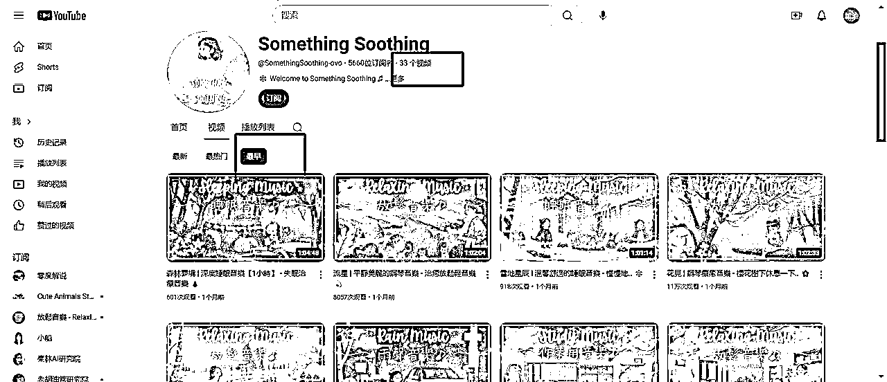

收益预判最高每月2.2万美元

## 案例二：

1个月前开始发布，账号创建于10月份

收益预判最高每月3.3万美元

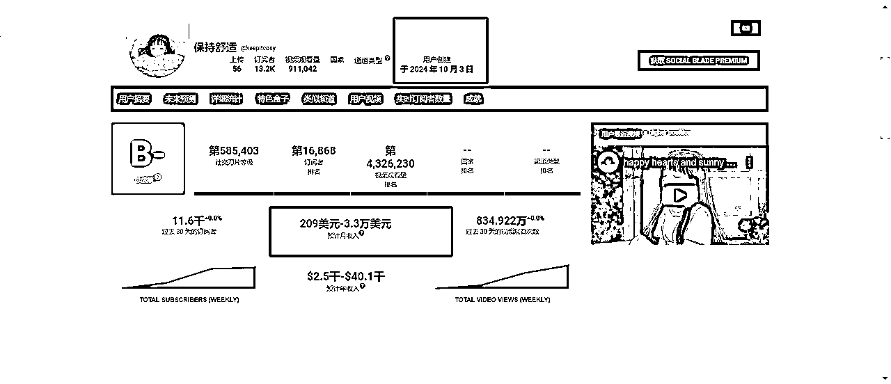

## 类似这样的案例还有很多：

https://www.youtube.com/channel/UCkK2B6D3imy6EnpqfrYm-5A

https://www.youtube.com/@HealingWithMe.

https://www.youtube.com/@Lofi1980s

https://www.youtube.com/@LofiKittychannel

https://www.youtube.com/@CalmCity-channel

我筛选的标准大概是这样：一年内订阅数不超过10w的素人号，已经开通ypp，然后视频制作难度不大，最好是AI制作的，并且视频小白也能模仿，没有技术壁垒的

## 以案例一作为举例：

1）缩略图：即封面 图片加大字 简单 略过

2）图片：治愈插画 可用AI完成像素级模仿

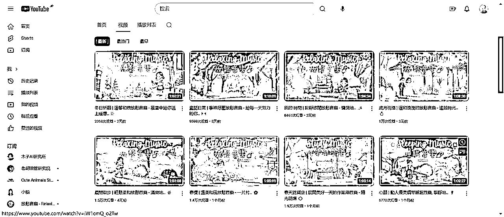

1）歌曲：两首 Lofi clam音乐风格 循环 拉时长

2）画面：特效 开场淡入 开屏文字 爆款元素

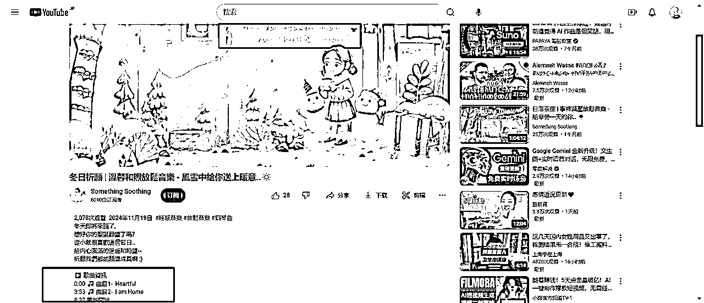

对音乐进行二次剪辑，来完成像素级模仿，在这个频道我觉得不太适合。其实这类音乐，只要找准风格，舒服放松，听感上是差不多的。我觉得，更重要的是满足用户的需求，陪伴他们，做好他们的搜索关键词，同时叠加适当的爆款元素，在视频的前三秒留住用户，或许就有机会跑出来。话不多说，直接进入复刻环节吧。

# 复制

## 一、生成图片

选择我们要复刻的爆款视频，拿对标的举例，通常是筛选视频里的最热门（也是筛选爆款选题的过程）

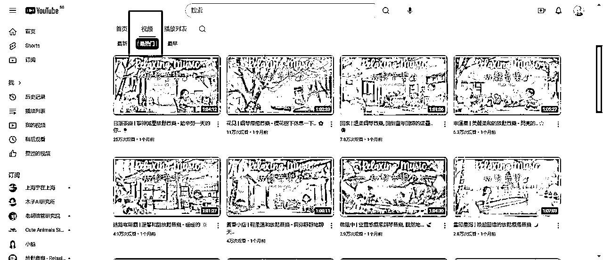

选择好爆款视频后，打开全屏，点击播放，两秒钟后标题和时间序会淡出，这时候Alt+A截图保存

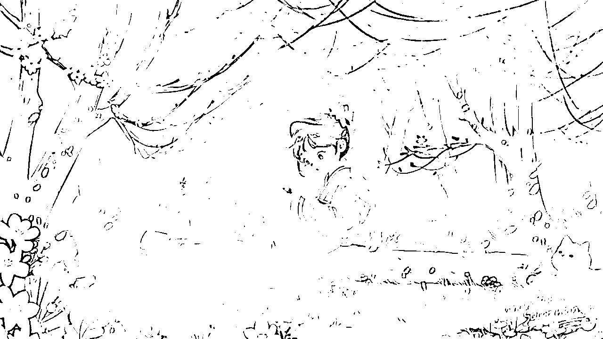

然后打开ChatGPT，点击左侧“探索GPT”，然后搜索栏输入“DALL”，找到“DALL, Eの 3 Prompt Craft”

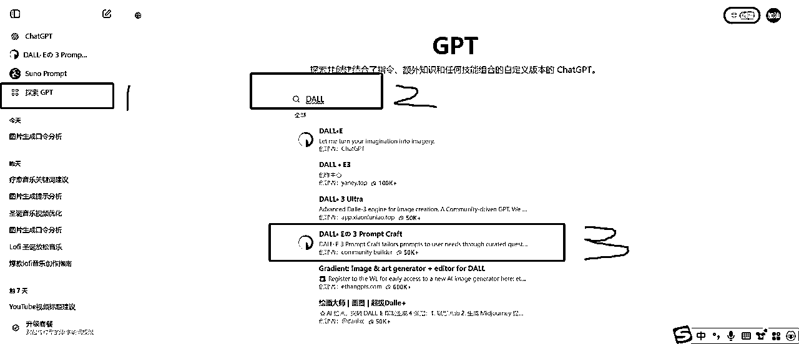

接着上传图片，并根据像素级模仿的需求进行提问，话术仅供参考：

现在设定你是一名精通图片制作、精通文生图口令的专家，请你分析这张图片的特点，并给出一段可以生成90%相似度的口令

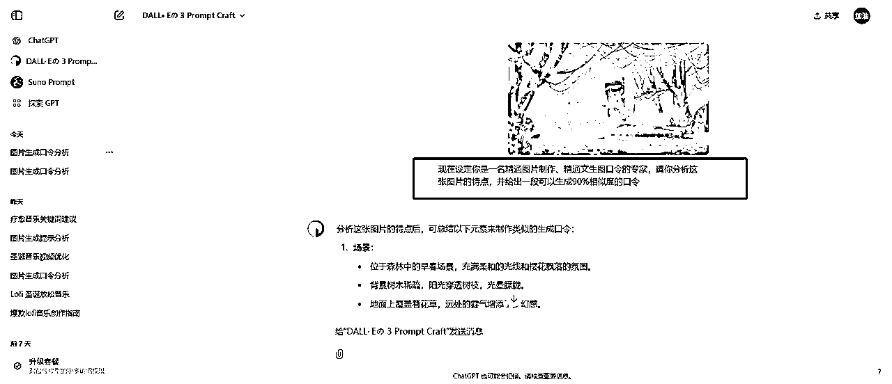

最后打开快手可灵，选择文生图板块，输入获取到的口令，以及上传图片作为垫图，生成图片

可灵网站：https://klingai.kuaishou.com/

可灵会赠送几百个积分，文生图一次最多1积分，完全够用到精通掌握

其实用midjourney可能更好，但最后还是选择了一种免费的方式

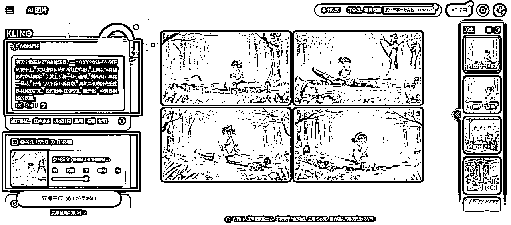

至于图片水印，用美图秀秀就可以了，通常我还会给图片加一层滤镜，诸如亚暗或治愈，用剪映也可以加滤镜，总之就是让图片变得更自然更符合自己想要的效果即可。

## 二、生成音乐

### 1、获取音乐口令

打开ChatGPT，在“探索GPT”里找到“suno prompt”，如果曾经用过会直接显示在ChatGPT的下方，然后上传图片和话术，获取符合图片意境的音乐口令，以下是参考话术：

现在设定你是一名suno prompt的顶级专家，请你根据这张图片的意境，生成一首舒服放松、没有歌词的音乐，请告诉我你的口令是什么

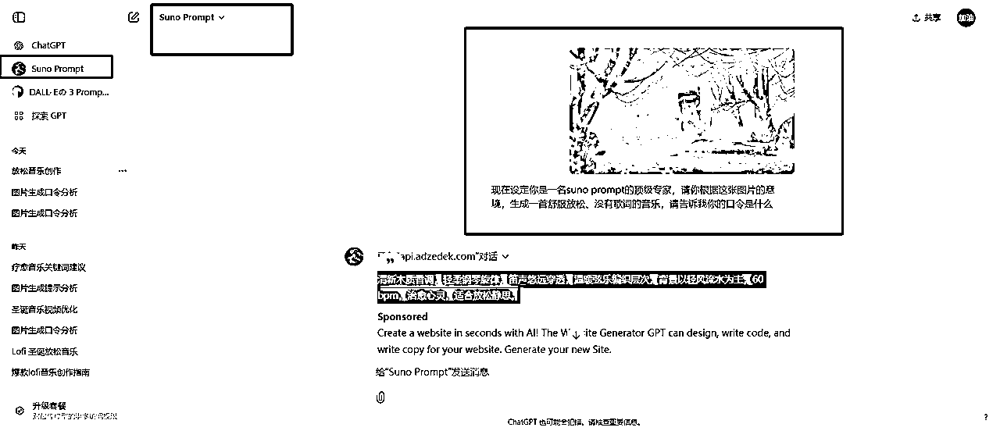

### 2、用suno生成音乐

打开suno，点击左侧的“创造”，然后输入口令，记得打开“器乐”选项才能生成纯音乐，最后会生成两首歌曲，一般是三四分钟，觉得好听可以延长（如果不满意，针对性的修改口令，重新生成即可）

suno官网：suno.com

要买会员，音乐才能商用，但不贵，我是上闲鱼买的，才10块一个月

满意的音乐，可以鼠标右键音乐进行下载

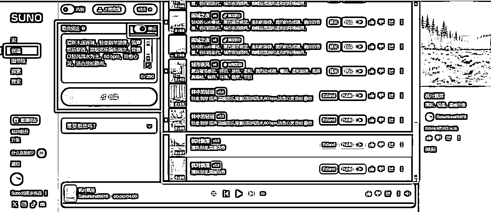

音乐怎么样像素级模仿，以上是我暂时想到的解决方案，欢迎大家补充更好的思路。

## 三、制作可视化模块

在suno找到两首满意的音乐后，导入剪映，都设置淡入淡出10s，让音乐衔接更自然，然后合并导出。

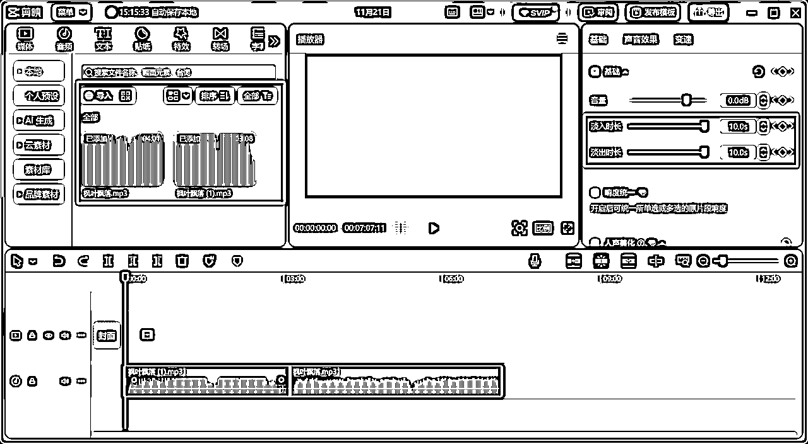

打开音乐可视化工具网站Tuneform，找到如下图的光谱

网站链接：https://tuneform.com/

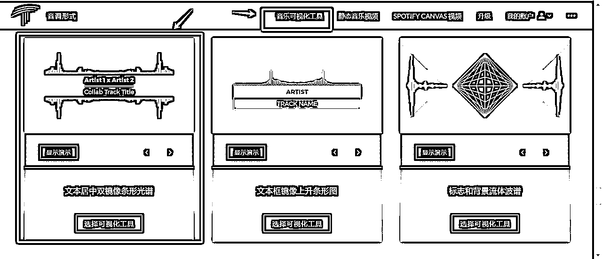

按照提示流程，上传音乐文件，第一个颜色通常选白色，第二个颜色通常选深色，文字随便填，后面都会扣掉。

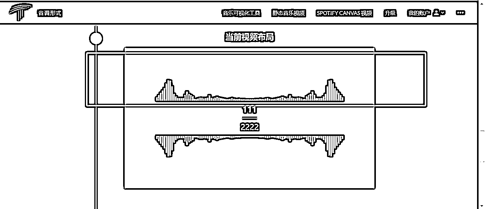

与快手可灵一样，刚开始都有积分赠送，可以免费生成。

## 四、剪映剪辑

先导入图片和音频，并将图片拉长至同样时长，并根据画面适当地添加特效和贴纸

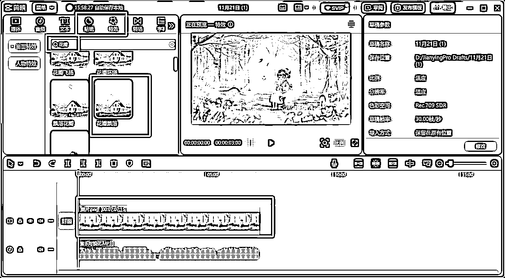

然后导入可视化模块，并放置在最上方

对可视化模块进行编辑，点击“抠像-色度抠图”，鼠标移至蓝色画面会自动消失

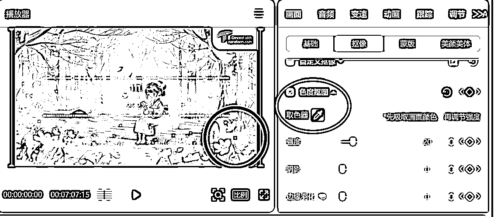

然后点击“蒙版-矩形”，框住一条长方形的可视化模块，再点击“基础-放大”，然后将模块移至屏幕最下方（对了，记得把它的音乐声量调成静音）

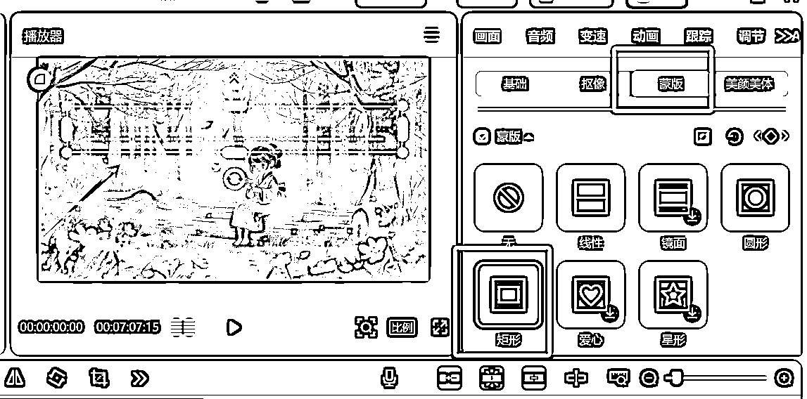

最后将这些画面合成一个片段，不断复制粘贴，延长至1h小时左右

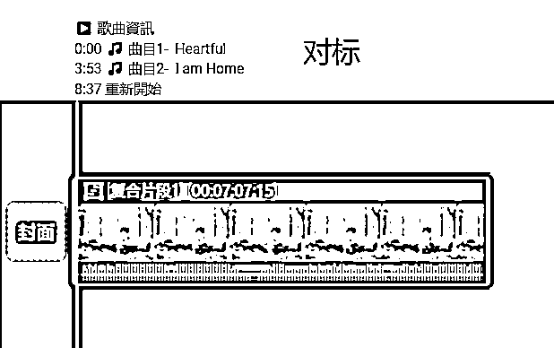

最后可以模仿同行给音频添加了一些爆款元素，比如白噪音、开头的入场画面、能引起共鸣的文字等，想办法在前三秒留住用户。

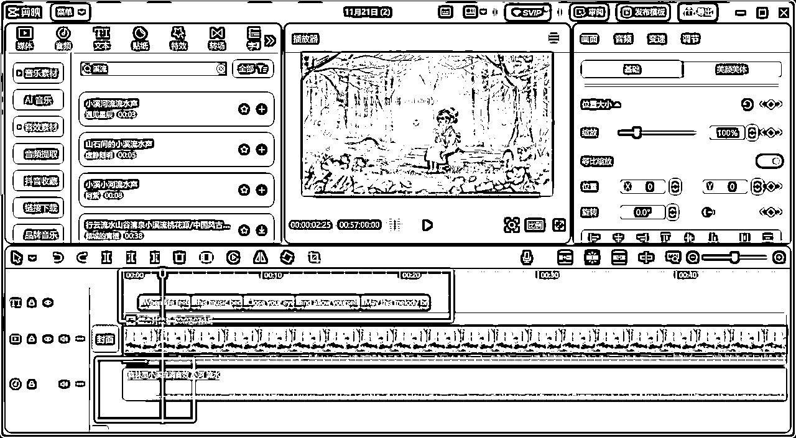

以上，讲了这么多，留下一份demo来结束吧，demo的人物脸部还可以优化，仅做举例，就不打磨细节啦。

# 题外话

如果这个赛道要往矩阵化发展，我觉得可以叠加爆款模板做出差异化，比如时钟的爆款模板，加上Lofi clam的音乐

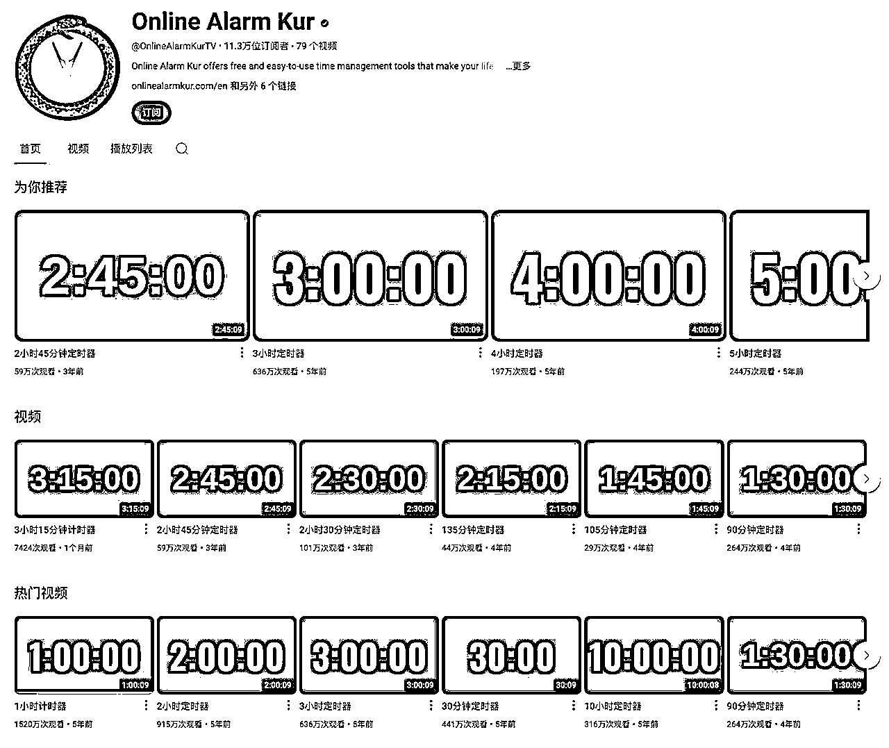