# 素人youtube shorts起号经验分享

> 来源：[https://sq0dwuhqqog.feishu.cn/docx/Y1wBd7YPkoT9uGxJ28ucrFxdn4k](https://sq0dwuhqqog.feishu.cn/docx/Y1wBd7YPkoT9uGxJ28ucrFxdn4k)

大家好，我是茜茜，今年年初来到生财，是经验为零的纯素人，上半年已经在生财通过AI写作赚到第一桶金，并且该项目目前还在持续进行，仍然有收益。

之前也想过要赚美元更划算，但没有后续，刚好最近我的引路人@方波妮 在做YouTube，听她介绍YouTube收益相当不错，亦仁老大也说“通过 AI 生成的各种视频，上传到Youtube和shorts，获取广告分成或者电商带货，空间无限大”。

说干就干，文档分享YouTube 爆火的小猫咪跳科目三➕洗脑神曲制作教程，今天是跑YouTube的第三天，总共发布6个视频，11人订阅，2745次观看。

下面就直接进入正题，分享我的起号过程

# 一、账号搭建

可以参考航海搭建账号：2022年YouTube航海

https://scys.com/view/docx/doxcnPgun49EUoAyPo60slrnNIe

# 二、找对标账号

平时刷短视频的时候，我个人觉得萌宠的热度比较高，在我在选择账号，博主每个视频都一样，动作一样，音乐一样，我就想只要做出一个模板来，就可以模仿她出爆款。

对标YouTube博主：https://www.youtube.com/@CatKitten99/shorts

选择理由：萌宠的热度比较高流量不错，同时视频简单制作难度较低。对标博主的每个视频都一样，动作一样，音乐一样，我就想只要做出一个模板来，就可以模仿她出爆款。

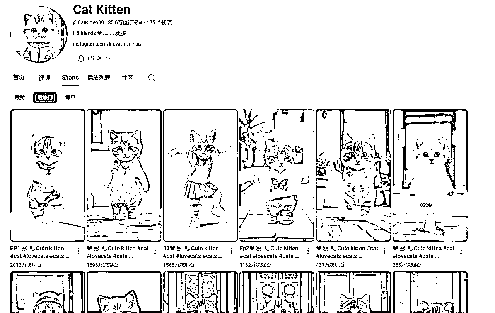

# 三、复刻爆款视频

## 1、下载爆款视频

为方便模仿对标账号，可以下载YouTube等平台的视频，可以用这个网站（免费）：

https://vtool.pro/youtube.html

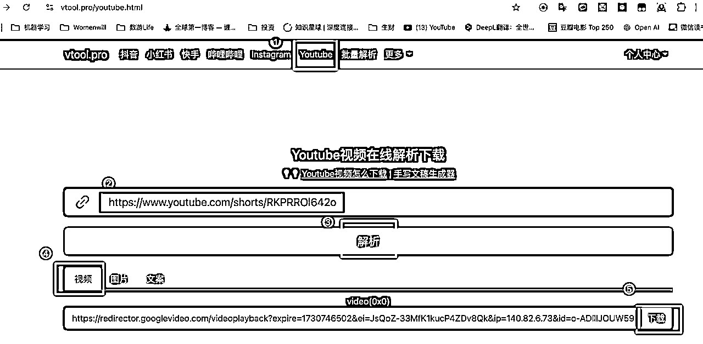

我从上面的网站上下了第一个对标视频，截取了其中一张图片

## 2、MJ/豆包/kimi 制作图片

### 步骤一：

打开豆包图片生成，上传模板图片为对标视频截图，并输入自己需要修改和润色的提示词，选定图片格式，生成新的图片。

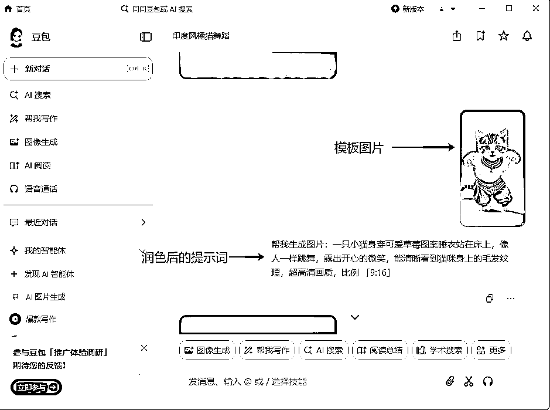

### 步骤二：

将豆包生成的个人比较满意的图片保存到手机上，作为视频模板图片。

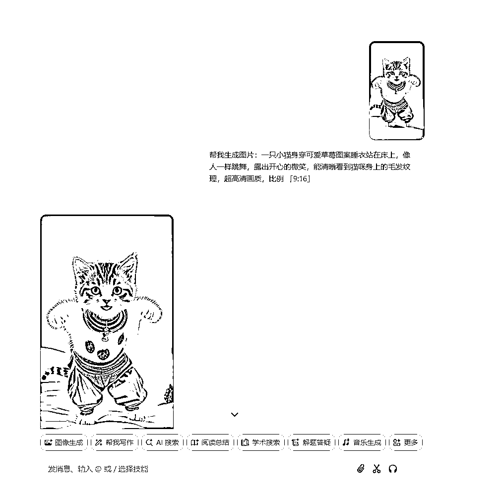

## 3、小猫咪跳科目三视频

### 步骤一：

打开手机端通义APP，在全民舞台里面的全民舞王里面选取你想生成同款猫咪舞蹈的视频，排队大概3分钟左右就能出同款猫咪舞蹈视频了。

### 步骤二：

打开剪映，对通义生成的跳舞视频进行剪辑和音频替换工作，导出视频就可以发表辣！！

## 4、其他经验分享

用RUNWAY生成小猫跳舞视频的方法：https://app.runwayml.com/login

#### 步骤一：生成模板图片

把爆款视频截图放到MJ，让MJ描述图片里面的内容并给出指令：用MJ的/describe功能。然后根据指令重新生成图片，或者可复制MJ分析的指令进行谷歌翻译成中文指令，通过润色增加描述词，将润色后的中文指令放到KIMI上翻译成英文指令，复制英文指令到MJ中，用MJ的/image功能生成图片。

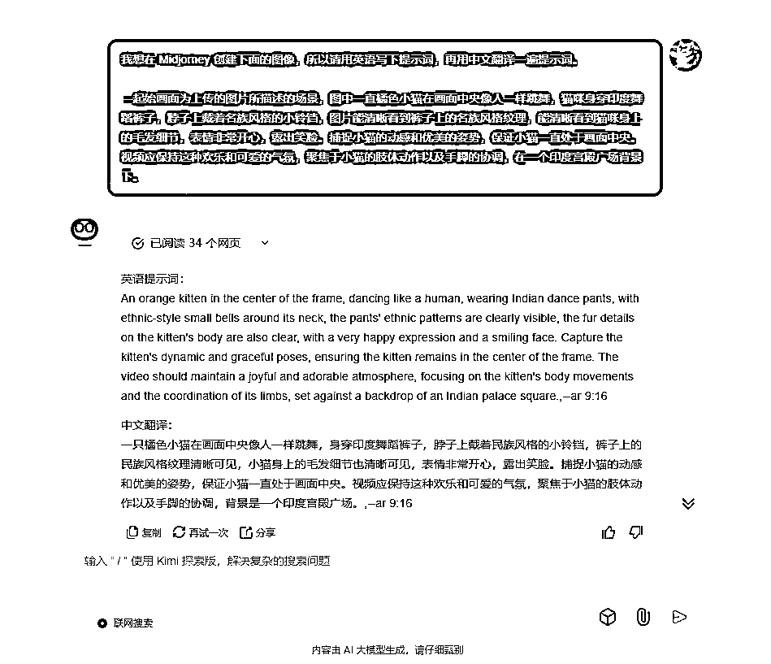

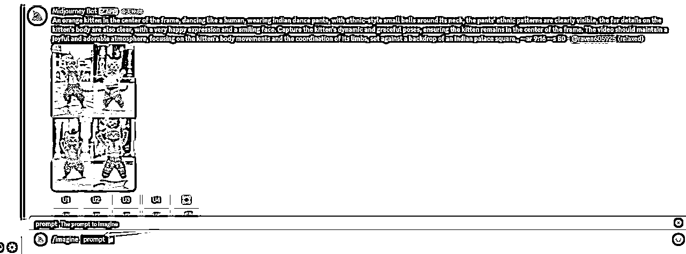

```
An orange kitten in the center of the frame, dancing like a human, wearing Indian dance pants, with ethnic-style small bells around its neck, the pants' ethnic patterns are clearly visible, the fur details on the kitten's body are also clear, with a very happy expression and a smiling face. Capture the kitten's dynamic and graceful poses, ensuring the kitten remains in the center of the frame. The video should maintain a joyful and adorable atmosphere, focusing on the kitten's body movements and the coordination of its limbs, set against a backdrop of an Indian palace square., --ar 9:16
```

#### 步骤二：生成视频

1、将之前在KIMI发送的中文提示词进行润色，增加对动作和肢体等细节的描述词，将润色后的中文指令放到KIMI上翻译成英文指令，复制英文指令到RUNWAY中，上传视频模板图片，粘贴KIMI复制的英文指令，记得加上视频尺寸。

2、打开剪映，对RUNWAY生成的跳舞视频进行剪辑和音频替换工作，导出视频就可以发表辣！！

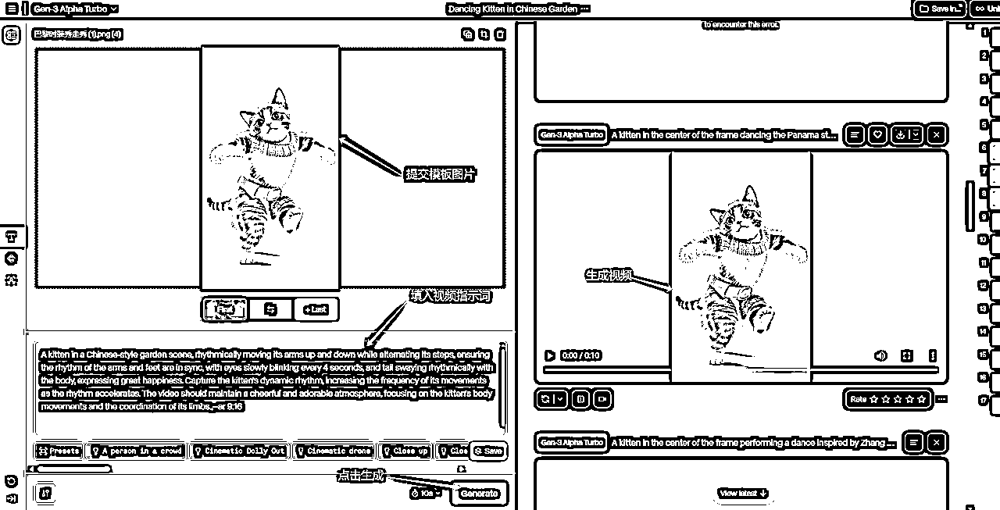

```
A kitten in a Chinese-style garden scene, rhythmically moving its arms up and down while alternating its steps, ensuring the rhythm of the arms and feet are in sync, with eyes slowly blinking every 4 seconds, and tail swaying rhythmically with the body, expressing great happiness. Capture the kitten's dynamic rhythm, increasing the frequency of its movements as the rhythm accelerates. The video should maintain a cheerful and adorable atmosphere, focusing on the kitten's body movements and the coordination of its limbs.,--ar 9:16
```

但整体上，Runway做出的视频流畅度上没有豆包的高(仅指小猫跳舞这个动作)

另外经过分析，我发现猫咪跳舞的视频爆款背后爆的是音乐和动作，猫咪的形象关系不大。所以我常用豆包作图。而且豆包相对MJ更简单，很容易上手。

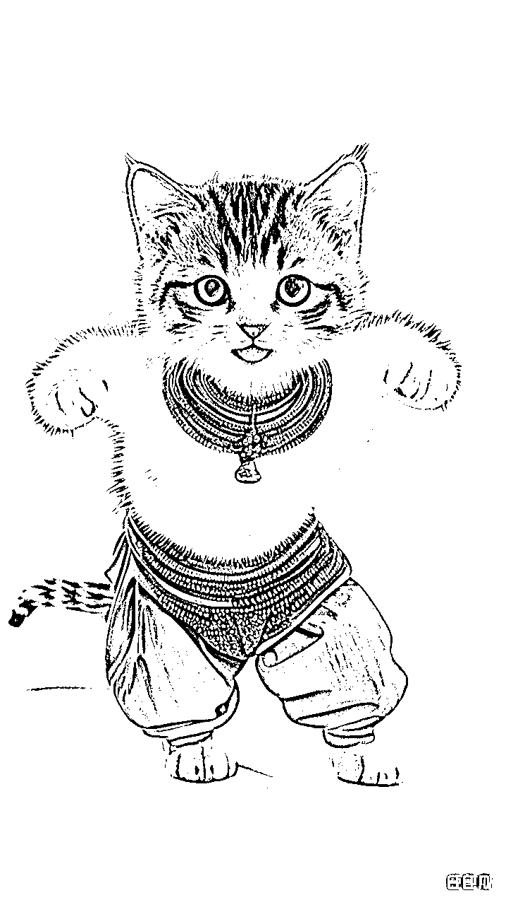

```
帮我生成图片：一只小猫身穿可爱草莓图案睡衣站在床上，像人一样跳舞，露出开心的微笑，能清晰看到猫咪身上的毛发纹理，超高清画质，比例 「9:16」
```

# 四、 类似爆款账号模仿：​

举一反三，找到一些类似的频道模仿，多多益善

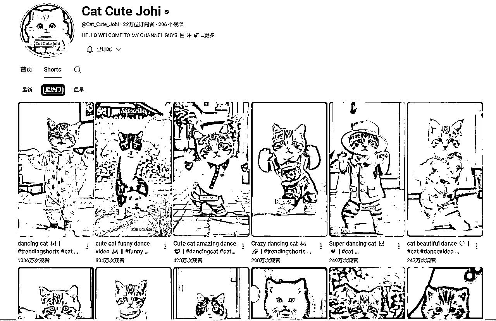

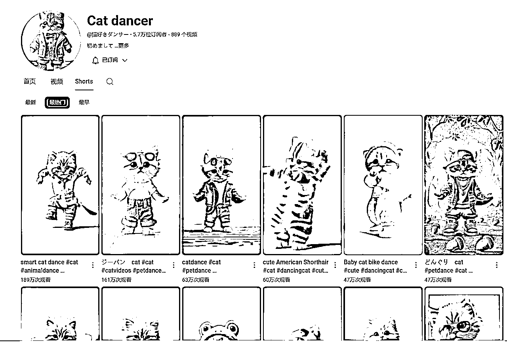

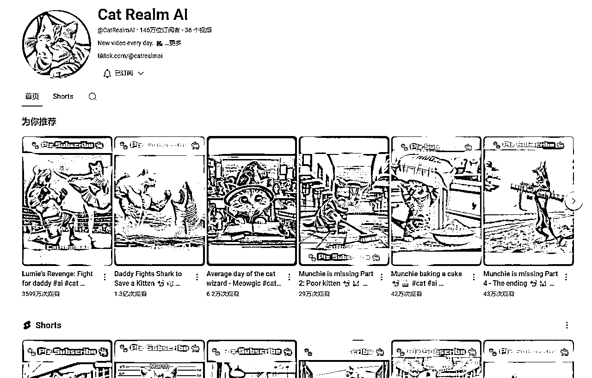

# 五、三个月的规划

1、目前账号每天发三个视频

2、另开一个新号：做小猫动画

我在油管发现同样的一个小猫剧情动画给两个博主带来了1.3亿的播放量，仅仅做了非常简单的改变。我也计划模仿这个爆款制作视频🐶。

3、达成 500订阅/300万播放：赚第一美刀

最后感谢亦仁的超级标，给我们领路，以及新出的龙珠悬赏玩法，越来越喜欢生财平台，总是有惊喜，大家一起生财有术！