# 

> 来源：[https://ga48invstw.feishu.cn/docx/YAsMdChCcoJRgFxf2G7cBqpEnSp](https://ga48invstw.feishu.cn/docx/YAsMdChCcoJRgFxf2G7cBqpEnSp)

丁邱洁律师：跨境电商/出海企业老板如何不唱铁窗泪，避免被「远洋捕捞」 20241101

「远洋捕捞」已被官媒报道，有官方注解，也意味着陆续有大量案件可能爆出水面。

这篇文章一来警示跨境/出海老板，二来提示各位及早排查风险。避免祸之不避。

等待立法或者设定条例、规定、办法来被动解决这类问题，于老板来说太慢了，老板能发挥主观能动性的地方还在于自救，自己先提升意识，尽可能了解出现问题后如何有效应对，是为有效。

本文目录：

1、什么是远洋捕捞？

2、为什么会出现远洋捕捞？

3、有哪些有名的「远洋捕捞」案件或新闻？

4、丁邱洁律师团队有办过「远洋捕捞」案件吗？有何心得体会？

4.1、骗取出口退税罪：深圳工厂主被带到内地四线城市、获刑5年多

4.2、深圳跨境卖家被合作方民事诉讼两次、在省内某城市控告2个不同罪名

5、怎样有效避免被「远洋捕捞」？

5.1、事前风控远比事后辩护效果好

1）严格且全面梳理排查，避免供应链涉罪

2）与税相关，紧密隔离，必须隔绝！

3）合规出口要做好，没有许可证千万别乱出口！

4）产品别乱采，供应链贩售的可能是非法产品！

5）精准辩护而非精准踩坑

6）员工关系管理好！！！避免被举报！

7）配偶工作要做好！！！避免被举报！

5.2、事发后辩护怎么做？

1）被传唤的第一时间不是到场，而是与律师联系！！！

2）越早越好vs 越快越好???

3）合规出口要做好，没有许可证千万别乱出口！

4）产品别乱采，供应链贩售的可能是非法产品！

5）跨国集团的电信诈骗要擦亮眼睛，看清楚！

6）爱家人

6、远洋捕捞与普通刑事案件有何不同？为何谈「远洋捕捞」色变？民企老板为何瑟瑟发抖？

7、丁邱洁律师第一次公开呼吁：保护民营企业刻不容缓，必须严厉打击「远洋捕捞」

# 1、什么是远洋捕捞？

民间定义：指出于利益驱动，部分地区的公安机关违法违规异地抓捕、查封、冻结、甚至划转外地民营企业财产和个人财产的做法。近年来，此类现象多有发生，较大地影响了民营企业的安全感和发展信心。「来源：经济观察报」

这些年我们面向跨境电商以及出海企业做辅导，深刻体会到传统的估值树理论并不完全适用。

以下面的估值树为例，过去我们更关注1-3，但这三年深耕跨境大外贸领域，我们反而更关注最后一项，如何让创业赚到的钱落袋为安。

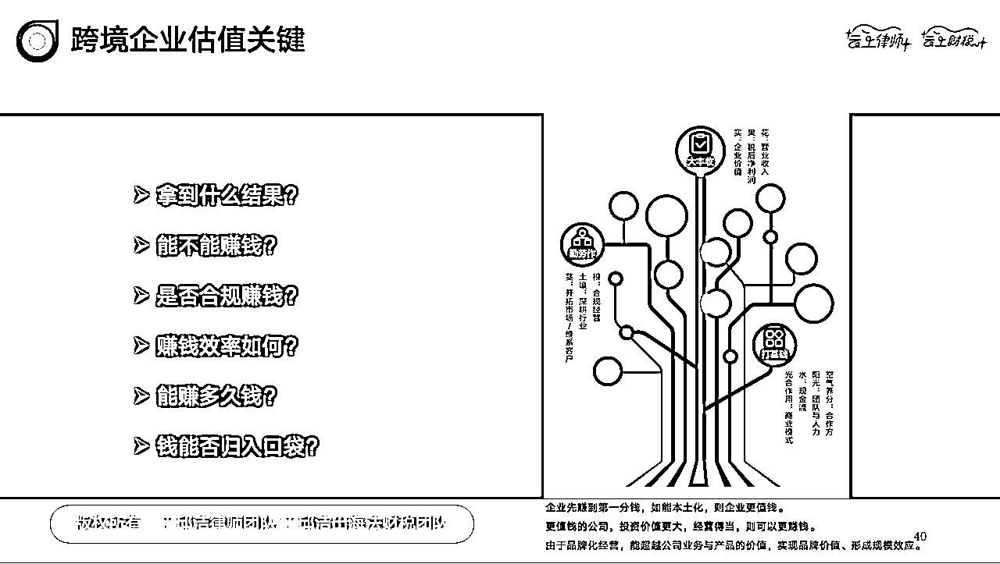

结合行业大趋势，在上一篇加精华的文章里，我们分析了跨境电商的四个阶段，眼下究竟属于哪种合规，并无明确指征，但无疑，跨境电商的双边、多边监管日趋严格，最近冒头的是跨境领域的涉罪风险，老板们必须重视，不唱铁窗泪是创业的前提。

# 2、为什么会出现远洋捕捞？

地方执法与司法的暗战：利益首当其中。刑事案件沾边就管，管辖权往往意味着背后的经济收益「罚金、罚款、罚息、追缴违法所得」，地方税局有地方创收考量，其他法检公有财政收入。考核指标也是硬门槛，能否顺利完成今年的立案、结案、定罪、量刑指标，等同于是否尽职尽责。

沾边就能管：“犯罪地”包括犯罪行为地（犯罪行为的实施地以及预备地、开始地、途经地、结束地等与犯罪行为有关的地点）以及犯罪结果地（犯罪对象被侵害地、犯罪所得的实际取得地、藏匿地、转移地、使用地、销售地）

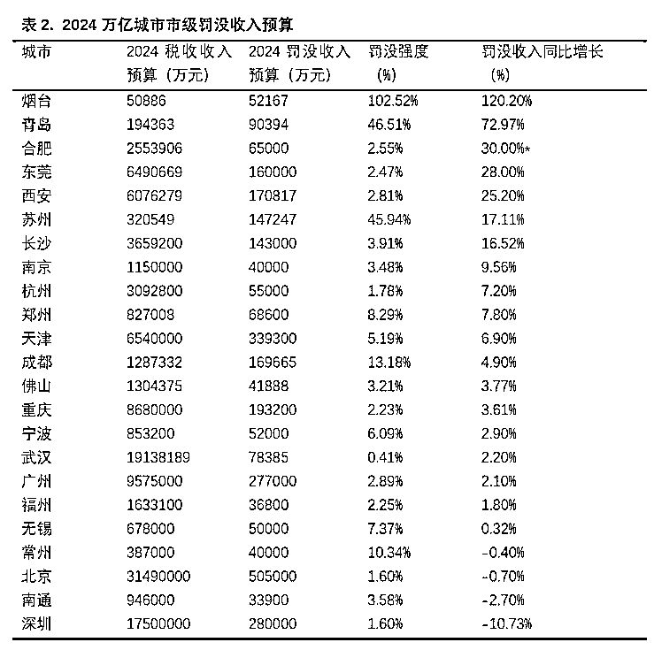

「数据来源：澎湃研究所」

# 3、有哪些有名的「远洋捕捞」案件或新闻？

1、最近官媒播报的广东某大健康企业，一组数据触目惊心：

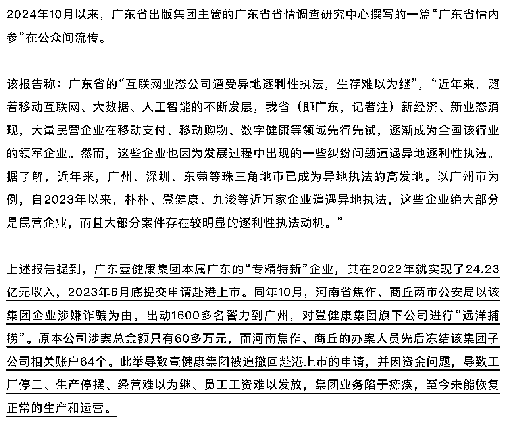

「来源：经济观察报」

2、9月知名深耕非洲的跨境电商企业传音控股CFO被留置，至今未披露案件详情；

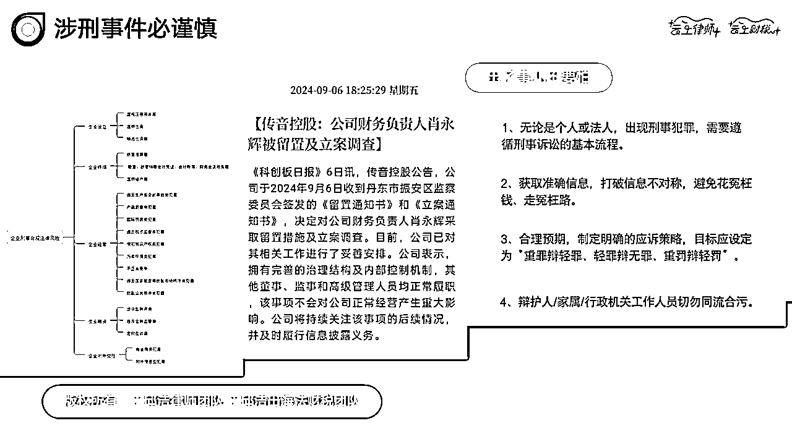

3、杭州某公安局、深圳某公安局发布的通告，禁止无本地民警协查下强行掳人，保护本地企业等新闻。

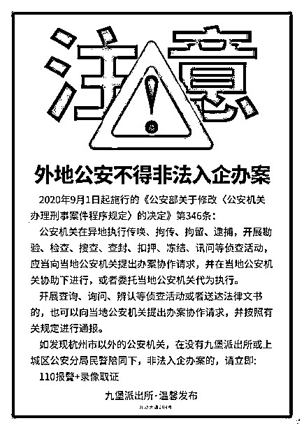

「来源：网络」

# 4、丁邱洁律师团队有办过「远洋捕捞」案件吗？有何心得体会？

## 4.1、骗取出口退税罪：深圳工厂主被带到内地四线城市、获刑5年多

有，一起骗取出口退税罪的再审翻案，我们1月接受咨询，3月介入接受委托，5月正式递交再审申请书，9月取得意料之中的驳回再审申请结果。直到8月开始兴起远洋捕捞提法，我们才发现这起案件背后是2020年典型的远洋捕捞。简而言之，内地某四线城市经侦大队长，将深圳民营外贸老板带走，经历两年多一审二审，最终由可能缓刑、判处有期徒刑五年多。从骗取出口退税罪的罪名看，涉案当事人并非具备出口退税主体，即没有退税资格，怎么会成为一起骗税罪的主犯呢？其中出现刑事案件意料之外、情理之中的情节：威逼利诱改口供、认罪认罚无辩护律师在场、疑似开始办理缓刑手续突然变成判决五年半，可能还存在一些行贿受贿情节。案件证据也令人大跌眼镜。直呼意外。该市检首次办理骗税案件，被质疑判决不公时，疑似曾向家属硬气表态，不需要参照有经验的广东省案例。

所思所想：

对于刑案再审程序，辩护指数是难上加难。对于具有诈骗属性、与税相关的犯罪，更是一经定罪，难以翻盘，基本为铁案。不同地区办案水平不同，具体到个案，每个案件审判过程中的每个证据异常关键，当事人本人能掌控的证据，核心是口供，这个案件中改了一字口供，刑期变成五年多。不要轻易更改口吻，一字之差，从犯变主犯。

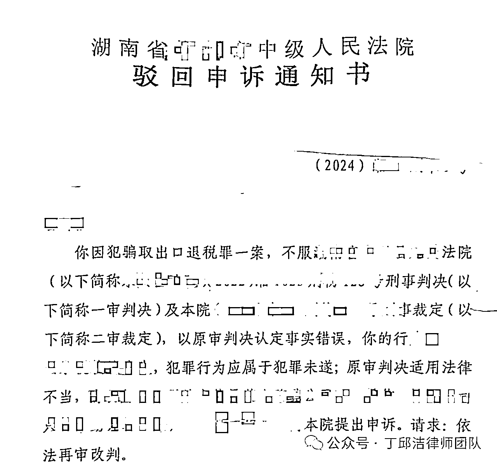

「再审申请被驳回的通知书」

## 4.2、深圳跨境卖家被合作方民事诉讼两次、在省内某城市控告2个不同罪名

有，一起跨境卖家股权的民事纠纷，前员工想动老板奶酪，从店铺分走一个亿，老板强硬还击。员工立案认定股东身份，被法院判决驳回，又打起老板身边人主意，在异地控告老板身边人职务侵占罪，被我们成功狙击在第一次传唤讯问，讯问结束当天人释放、未被拘留，职务侵占罪不了了之；员工咬死不放，又开始以诈骗罪继续进攻，目前处于搜集材料过程中。

所思所想：

应对野蛮人，民事股权狙击战绝不手软。两年下来，官司打了三场，前员工开庭当日撤诉一次，另诉一审二审败诉。刑事狙击战绝不能慌，第一时间扑灭任何涉罪风险，性价比最高。等到人被拘留，营救的最佳时间早已经过，而涉刑案件，每晚一步结局大有不同。在职务侵占涉罪被控告时，如身边人第一时间未能释放，转而拘留，后续营救难度将倍数增加。对于老板而言，不仅折损大将，还将面临后续被讯问时牵扯自己，民事纠纷变为刑事犯罪，创业风险陡增，细思极恐。

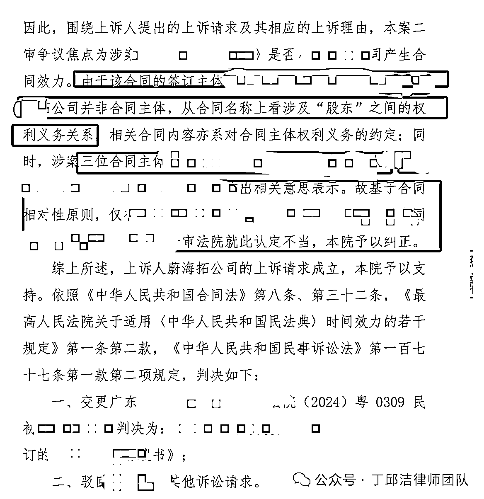

「二审深圳中院民事判决明确并非股东身份」

# 5、怎样有效避免被「远洋捕捞」？

## 5.1、事前风控远比事后辩护效果好

针对跨境电商卖家：

### 1）严格且全面梳理排查，避免供应链涉罪

跨境卖家典型的商贸型企业，自身价值不高，眼下跨境电商的竞争阶段尚处于供应链竞争，需要跨境卖家把供应链合规放在首要位置，并将供应链合规的涉罪风险放在首要位置：

切勿虚开发票！

切勿参与虚开发票的任何环节！

切勿协助骗取出口退税！

切勿收受不明来源的钱！

切勿与非正常账户交易！

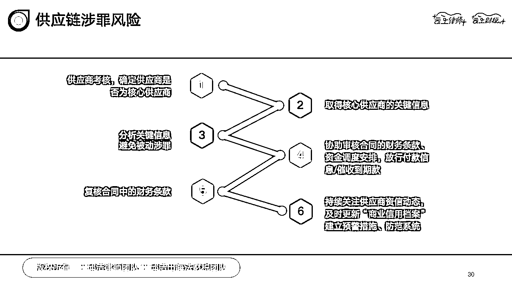

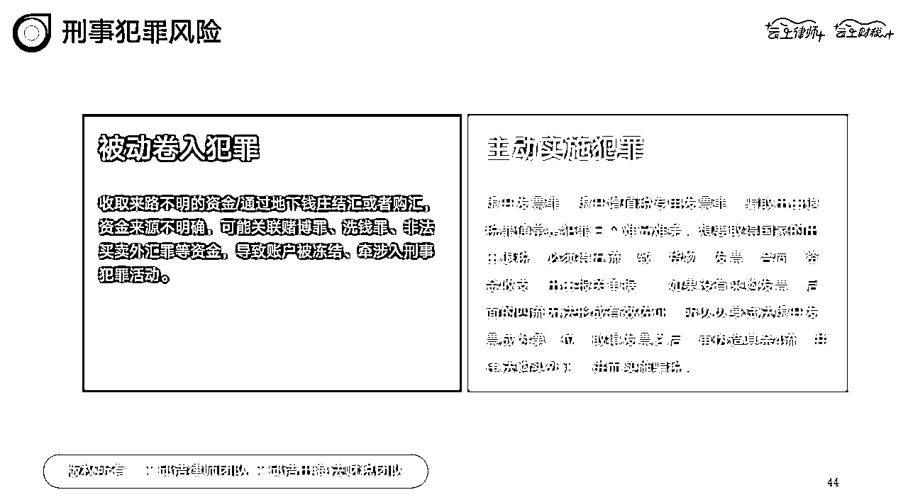

### 2）与税相关，紧密隔离，必须隔绝！

偷逃漏骗抗，一样都不要有，偷税首罚免罪！被罚了就不要再犯，必须合规！

拿补贴吗？要做出口退税吗？要参与奖金项目申报吗？三思而后行，避免吃了我的给我吐出来，还可能涉嫌犯罪。

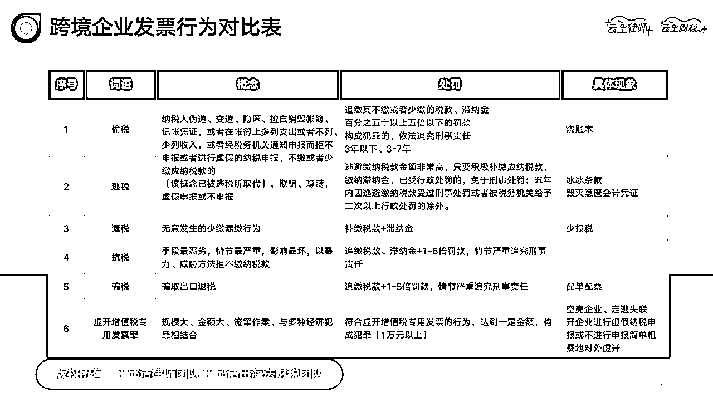

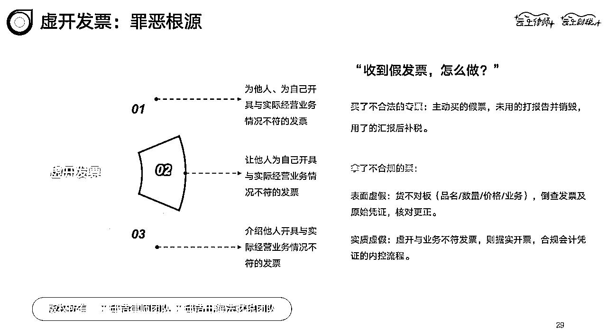

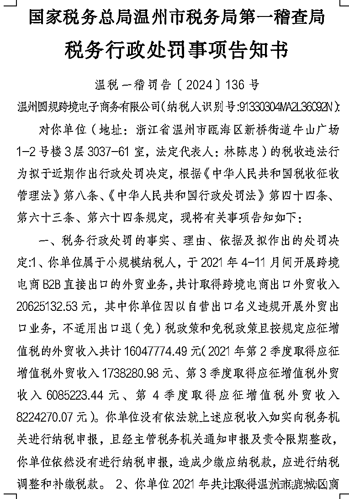

「近期税局对温州一起跨境电商企业的批量征税处罚、涉罪追究」

### 3）合规出口要做好，没有许可证千万别乱出口！

逃避海关监管 ，非法运输、携带、邮寄：通过各种方式非法将物品运输、携带或邮寄进出——货代说，没问题，可以出，报关行也不以为意，结果货就这样上了柜子，不巧，海关缉私，打开一看，全是没有出口许可证的违禁品，怎么办？罚款是好事儿，涉嫌走私罪可不得了，最终的问题都是卖家承担，报关行甩锅，货代隐身，只有卖家含泪自己咽。

### 4）产品别乱采，供应链贩售的可能是非法产品！

为维护客户关系，很多事不能做，比如采购针孔摄像头，不是违法而是犯罪行为！

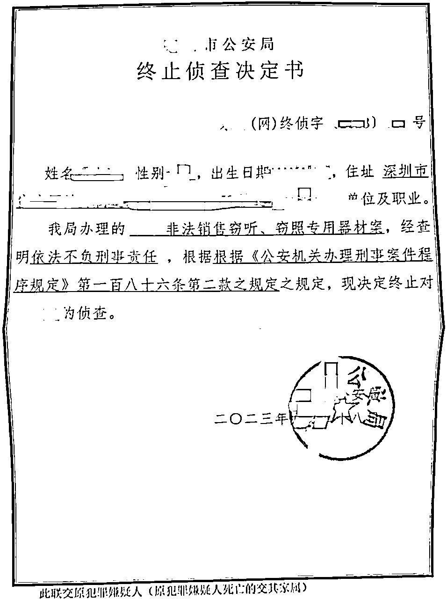

案例摘要: 被告在互联网上非法销售窃听、窃照专用器材，数额巨大，情节严重。经法院审理，被告被判处有期徒刑五年，并处罚金。该案例成为对非法销售窃听、窃照专用器材罪的一次重要裁决，也起到了警示和震慑作用。

### 5）跨国集团的电信诈骗要擦亮眼睛，看清楚！

那些被红通的人，在异国他乡引诱犯罪，设下重重圈套，等你上钩，这种一定要远离并小心，可能会以卖货的名义，也有可能会是恋爱交友，跨境老板不仅要注意货，也要控制好人性大门。

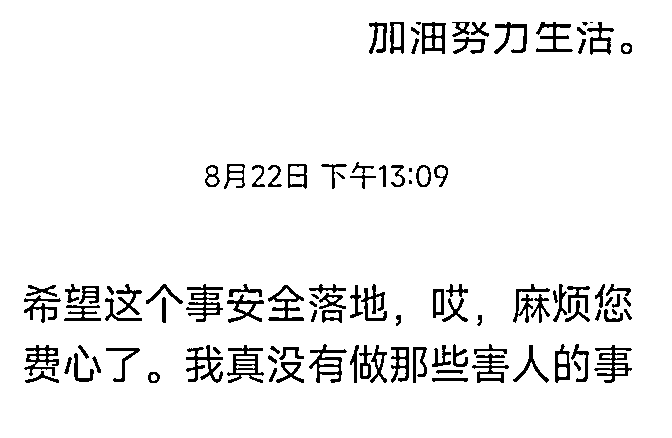

「误入跨国诈骗集团，最终顺利转行政处罚，平安脱罪」

最后两条最重要！！！这反而成了跨境老板唱铁窗泪的根本原因！！

### 6）员工关系管理好！！！避免被举报！

懂得都懂，不需要展开吧。

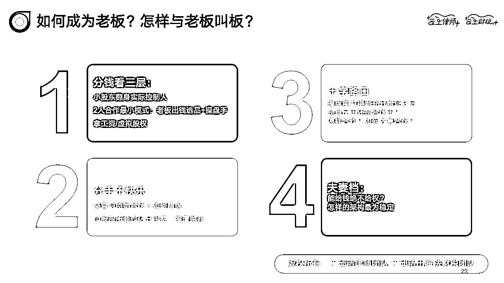

### 7）配偶工作要做好！！！避免被举报！

懂得都懂，不需要展开吧！

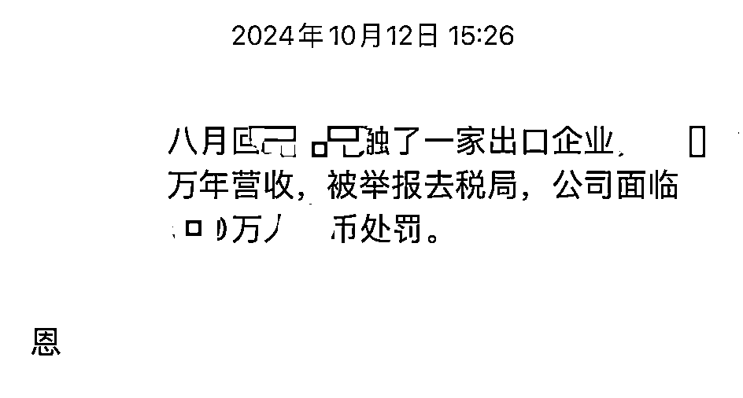

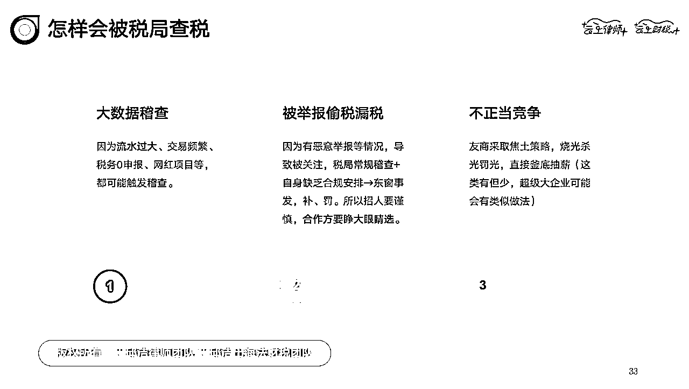

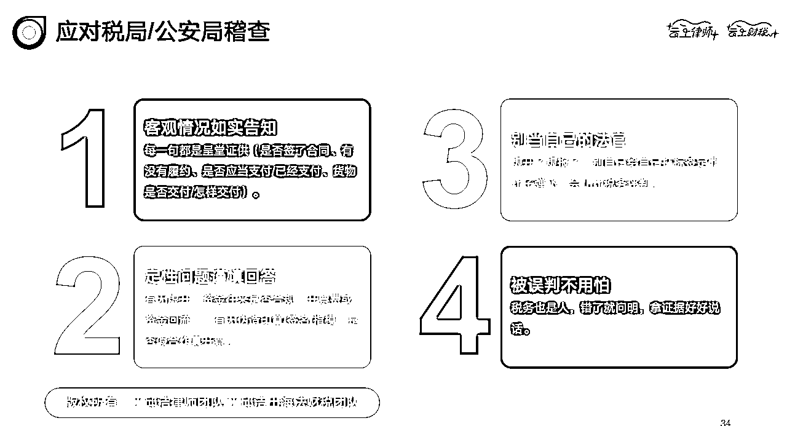

## 5.2、事发后辩护怎么做？

### 1）被传唤的第一时间不是到场，而是与律师联系！！！

如果你就是那个倒霉蛋时：找律师评估是否涉案，是否属实，控告人可能有哪些证据材料及清单，推演讯问场景，必要时模拟讯问，提前准备有利于自己的资料！！

切记：有银行公章的材料提前预备，最有用！！！

如果自己非当事人，可能是证人，或者配合调查的其他案外人，可以通过电话或书面向异地办案机关说明情况，或要求到当地办案机关说明情况。

异地公安直接上门办案：他来了，他来逮人了！可以报警，体面自救，让本地警方介入，平衡利益关系，避免被捞走。

「《公安机关办理刑事案件程序规定》第三百四十六条规定：“公安机关在异地执行传唤、拘传、拘留、逮捕，开展勘验、检查、搜查、查封、扣押、冻结、讯问等侦查活动，应当向当地公安机关提出办案协作请求，并在当地公安机关协助下进行，或者委托当地公安机关代为执行。” 」

找律师固定证据！提前要把手机换好，提前留存关键证据及记录，提前做好心理预警，做最坏的打算。同时，记住，应对讯问区分定性事项与常规事项，大原则：定性事项谨慎回答！！！

公安说要转账，转了立马没事儿，真的吗？公安机关仅能冻结涉案公司、人员的财物，而不能直接划转，划走违法！但是老板也要尽量沟通，避免公司帐户被冻结，影响公司正常经营！

### 2）越早越好vs 越快越好???

找律师越早越好！

做上述准备越早越好！

提前反应，做好心理建设越快越好！

但

回答讯问中的问题、签笔录不是越快越好！一定要谨慎看过才可以签字，确定与实际情况相符！

笔录不要留空不要留空不要留空！！！

### 3）当事人、家属、辩护律师形成三方合力

当事人不作死不会死，自以为是、自作聪明往往让自己会被定罪、罪刑变重、罪责不相适应！！

家属不信任不会好运，反复摇摆、测试律师、自行冒进、自作主张毁灭或者隐藏证据，最后家人含泪铁窗，再见已不是阿朗！！！

辩护律师必须与当事人、家属齐心协力，才能保住老板的家业与事业，不然人财两空，为了钱入罪最不值当。当日百人首，一朝阶下囚，老板必须提前储备靠谱、专业、及时、高效的律师朋友。

### 4）不能走错任何一步

出判决前法官让你给钱打麻将，给还是不给？

害怕判决书不利于自己，给了是行贿罪，不给又担惊受怕。选择之间，泪不停歇。

别人都在找关系，我不找会吃亏，要不要找？

找了，就是行贿罪，不找，可能还有生路，自己葬送了光明，只能含泪铁窗。

辩护律师不行，换了又换，找了又找，对不对？

自己的锅自己背，没有谁为你分忧，耽误辩护好时机，神仙难救，学会信任很重要。

### 5）精准辩护而非精准踩坑

回归案件本身，一看：

是不是归这个公安局管

二看：来者是不是刑警，有合法证件，两人两人两人为公！

三看：讯问笔录是不是合规记载，有无先备好笔录+我签字的违法行为？

四看：啥罪名，谁控告，为了什么，怎么会有关系？

五看：跟自己有关，还是跟公司有关，还是公司员工的个人行为？

六看：让律师找找，有啥证据，证据经得起推敲吗，如何与证据博弈分解？

七看：强大的心理建设！必须从容面对，还有一大家子家人员工等你凯旋出来！不抛弃、不放弃

八看：公安查完了吗，到检察院了吗，认罪认罚具结要签吗，问清楚签字的法律后果吗，怎样避免悔不终生？

九看：确实定罪了，如何争取缓刑，如何避免重罚重罪，如何减刑假释，如何提早出狱重归社会？

十看：永不回头，再不入狱，如何预防？

### 6）爱家人

老板犯罪，有情有义的家人最难受

无论何时，老板始终记得，家人是你唯一的指望

# 6、远洋捕捞与普通刑事案件有何不同？为何谈「远洋捕捞」色变？民企老板为何瑟瑟发抖？

这三个问题要放在一起看，本质上存在因果关系。

一个刑事案件是否能立案、符合起诉条件、得到公平公正判决，往往需要以最严格的法律程序保障，这是刑事辩护被认为律师“掌上明珠”业务的根本原因。但：

1）难不代表必然公正

企业主必须认识到：刑事案件的办案水平一样因人、因地、因案而异，大部分能被看见的不公平判决，往往需要耗费大量的时间精力与金钱才能取得较为彻底的翻盘效果。而这只是总体样板量的极小极少数一部份；

企业主应知应会：让企业免于沾边刑事犯罪，是防范这类风险的关键，出事儿之后精准踩坑只会让人财两空；我们普法这类风险，并非为了业务转化，更大的理念在于有效扶植一家民营企业有序有效存活，使得市场健康，大家好法律服务才好，才有可能实现个体职业抱负与梦想；

2）企业主要防范的是基于企业经营的系统的涉罪风险，不是照单全收或完全漠视

因为所处跨境出海行业，面对的涉罪风险指数更大、情形更复杂、警戒线更高；由于远洋捕捞案件本身并非为了防控犯罪或者维护经济秩序、金融安全，不排除以刑事防范手段解决地方创收问题的可能性，因此办案过程中是否能秉承公平、公正、维护法律尊严与秩序的法治理念与精神，比起一般案件更具备趋利性、对企业主也就更有趋害性；

3）民营企业是「远洋捕捞」重灾地，也是滋生不公正办案的温床

民营企业风控意识太薄弱，老板一个贪念，就葬送自己和企业寿命，得不偿失！但现实是，大部份老板忙于业务，急于解决活下来的问题后，才有精力考虑如何活。这是常情常理，只是需要加多常识的学习与认知，才有可能真正的活得好、活得久、走得稳、走得远。

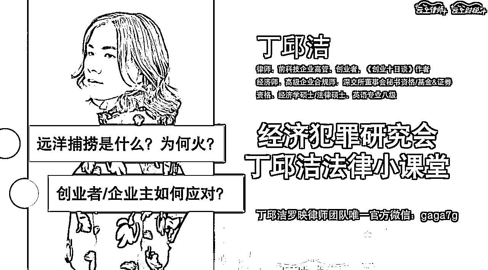

# 7、丁邱洁律师第一次公开呼吁：保护民营企业刻不容缓，必须严厉打击「远洋捕捞」

## 发刊词：保护民营企业刻不容缓，必须严厉打击远洋捕捞（2024跨境电商太空漫游）

我旗帜鲜明的反对远洋捕捞，成就一个企业要历经千辛万苦，九九八十一难都不够，但毁掉一个企业只在顷刻之间。

直到今年五月份办一起骗取出口退税罪的再审案件，我才意识到，中国的民营企业家、小企业主，出海的创业者们，到底面临着怎样的风险，又应该有着怎样的担当。

民营企业的成长九死一生，资金、信息、资源的竞争，任何一个环节都有可能让民营企业就此死亡。对于出海企业跨境电商来讲，双边乃至多边监管更加困难重重。

企业主要突破的不只是别国的小院高墙，还有本国的不当监管。

我无比痛心的看到，一些企业有些还没走出国门，就在国内被通过远洋捕捞的形式所击倒。呜呼哀哉，不胜扼腕。

作为法律人，我们更多考虑的是合规和风控。想要让这些企业高效的出海，以较低的代价、较小的成本取得较高的成绩和较大的结果，并让企业不断打磨供应链，塑造品牌价值，形成真正具有国际竞争力的企业。

复盘办理的相关刑事案件，研读各地陆续爆出的涉刑案件，我不得不问：这些企业是有多大的罪需要用刑事手段三年又三年的追究打击，是否真的就没有办法能及时化解企业经营中的不合规？如果企业真犯错了、出事儿了、涉罪了，有没有更好的方式能让企业成长？

冻结账户是最初最浅最暴力的手段。一个辖区的派出所拿了一纸公函，就能够让一个十几年的企业大厦毁于一旦。是谁的权利需要被限制在牢笼里？

我过去觉得，我们辅导单个民营企业就能够解决一大群人的就业问题，解决星罗棋布的中国企业在海外的声量问题。

但我现在发现，一家民营企业在经营中出现各类问题太过容易，下一纸立案文件也太过轻易。如果我们仅仅着眼还后知后觉的去解决已发生的辩护问题和难题，那么刑事风险控制企业刑事合规将只是一纸空谈。

我们必须让声音发出来，被看见，让民营企业的举步维艰能够真正被重视。

放眼全球，眼下中国企业尤其是中国供应链出海，横亘在眼前最大的问题和难题已经不再是供应链本身的质量、口碑、生产制造问题，更多的已经上升到国内监管端的源源不断，走刑事似乎成了打压企业的高质量手段。而在国际层面，各类贸易调查、封锁、管制、禁令数不胜数，地方保护主义频起。

一个普通的民营企业哪有能力应对，如何有还手之力？

我再次声明，我旗帜鲜明的反对远洋捕捞。

我坚定的站在民营企业一边，希望为更多民营企业发出自己的声音。只有无数的民营企业，尤其是中小微企业能站起来，才有可能真正的让市场有市场，让市场真的成为市场，让市场回归健康的市场。