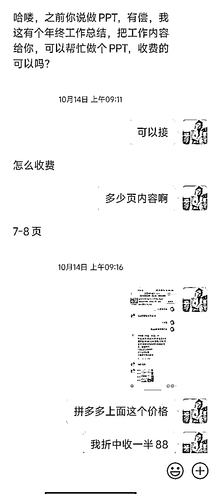

# 生财新人从亦仁大大说的"面包屑"里面搜集资料到月入一万的复盘

> 来源：[https://gqzeasgh7z.feishu.cn/docx/YPaKdk6cSoBTR5xgjPIcjUK2n4f](https://gqzeasgh7z.feishu.cn/docx/YPaKdk6cSoBTR5xgjPIcjUK2n4f)

汇报人：张微笑（郑州）

时间：2024/9/18日

# 写在前面

我是今年418刚加入生财的新人，很感谢遇到这个社群。

最近读到亦仁大大说到的寻找“面包屑”。我恍然大悟。因为我是一开始只做了1.0版本，就相当于是个面包屑，后面通过生财资源和方法论里面的学习，自己不断的迭代，然后升级到了4.0版本，更加轻松的赚钱模式。

从小红书引流卖低客单的旅游攻略，到不断衍生其他服务盈利翻倍的模式。

这个项目一个月只帮助我挣了一万多，但是未来的空间很大，我也在研究。

1.  写这篇笔记的初衷是，因为这个是靠1.2.3步，然后勤奋的执行，三天就一定可以变现的，可以树立小白或者新圈友对于网赚项目的信心。

1.  建议大家初期在实操的时候，目标应该是如何勤奋的去加够100个微信，而不是如何先挣到第一块钱。因为你刚入手不可能那么快就挣到钱，所以通过设立低预期的目标，来持续干下去。

1.  这个项目会很长久，但是会很费你的账号，建议大家注册一个新号直接干就行。前期一个账号一样干，一样挣，先不考虑矩阵。

先给大家放两张成交截图：

（1.0版本，直接卖百度网盘里面的成品） （2.0版本，通过AI去生成定制攻略）

### 1.0版本——直接卖百度网盘里面的成品旅游攻略

说白了就是网上整理了一些资料，或者拼多多上面9.9元买个全国旅游攻略的网盘链接。并不适用于每个人，总是被骂是电子垃圾。但是因为价格低，所以更容易拿到正反馈。

附上网盘链接：

国内外旅游攻略合集

链接: https://pan.baidu.com/s/1ojx6drFnhGWg-vYOCZcqxA?pwd=wrbc

提取码: wrbc

### 2.0版本——通过AI去生成定制攻略

文案直接是AI（豆包）写的，然后我再补充一些住宿截图，几乎约等于0成本，大家价格自己定就行。

拼多多上面定价是定制攻略按天收费，20元每天，所以我卖39，49是性价比很高的。优势是客单价高，并且有客户黏性，顾客复购率高。

### 3.0版本——做二转或者三转

当顾客到一个城市旅游的时候，我们可以对接一下，做高端酒店代定业务，这个可以赚取200-300一晚的差价。或者是可以对接一些，当地的特色项目。

以青岛为例，可以对接一些海钓项目，也是挣取200-400的代理销售佣金。

这个的利润是比单纯卖攻略要高的。

↑如图所示，我这边给船长600元，实收用户800元。

其实也不用担心游客上船以后，和其他用户一聊天发现自己被割。因为船长本身是希望有人帮他们代理销售的，所以船长会帮你找理由去给用户解释。

### 4.0版本——拓展衍生业务

需要旅游攻略的粉丝群体多以年轻为主，然后同类目的产品，例如职场PPT代写，LW代写，也是可以做的。

# 实操SOP

## 一、账号搭建

其实很简单，大家做那个城市的旅游攻略，去发那个城市的作品就行。

### 素材寻找方法

1.  可以去抖音或者其他平台，找一些这个城市的美景图。

1.  最好带人物，这样更真实。

1.  注意事项：

1.  因为是要发在小红书，所以不能在小红书上找。

1.  有水印记得去水印，可以复制链接，去微信小程序搜“轻抖”去水印。

### 文案建议

文案的话内容大概意思就是：我去这个城市玩了，没抱团，自己做攻略也玩的很开心。

去玩了.......，去吃了........。

## 二、截流步骤及其话术模板

### 截流步骤

1.  选好一两个热门旅游城市，直接去小红书搜索！

以青岛为例，可以搜“青岛旅游攻略，青岛三日游，青岛自驾游”等等

1.  选什么样的作品呢？

1.  第一，点赞高的，起码要一千赞以上

1.  第二，作品发布时间越近越好

1.  第三，评论区还热乎，就是评论区最好出现最近一天的评论

1.  第四，避开那种作者回复评论多的

1.  确定好目标作品以后，就可以直接去评论了

### 截流话术模板

至于怎么评论？我发几个例子：

案例1

之前在威海上了四年大学，对威海的各个景点都了如指掌，需要威海旅游攻略的宝子们，可以滴滴，自己做了一份攻略

案例2

之前在青岛呆了七八年，对青岛的各个景点都了如指掌，前段时间刚做好一份攻略

案例3

上个月全家去了一趟青岛，临行前做的攻略，全都用上啦，需要的宝子可以滴我

案例4

前几天一家三口去了一趟青岛，我老公花了两天时间做的攻略，真的超详细，一点没让我踩坑

案例5

之前没有去过青岛，去之前联系了一个本地人，花点米让她给我做了一份攻略，真的超赞超详细，需要的宝子可以滴

### 注意事项

*   千万不要在评论里提及“私信，私聊，加v”等字眼

如果有人回复你的评论，你可以回复“厚台思，宝子思我”等，反正就是不能表现的太明显

*   有人后台私信你了，千万不要直接说加微信，也不要提及v

那怎么样让他们加我们呢？

直接发图片或者视频过去（常用的引流图片视频也是需要换一换，然后给客户发了之后，问她看到你发的图片了没有）

当然这个图片如果一直发的话，也会被官方发现，从而把你的消息给吞了（你看着你发了，其实客户那边收不到，所以要问一下客户收到没）

### 常用引流方式

我现在常用的引流方式是，我让客户发他的微信，然后我加他。

如果用户长时间没有给你发她的微信号，有两种可能：

1.  用户反感加微信，所以就不搭理我们了。也有一种用户会在小红书上面问收费么？千万不要在上面谈钱和价格，会被封号。

1.  用户发了之后，但是被官方吞了，以至于我们这边没有收到。所以过5个小时之后，可以追问一句“宝子发了么，我这边没有收到，我不是旅行社”

关于如何引流的方式，生财上有很多，大家去一搜一大把。

虽然开了蓝V之后是可以随便发微信，但开蓝V600元，加上注册个体工商户，还有聚光投放的费用1000元+，我试过没有必要。

## 三、微信私域成交转化

成交的概率，到后期可以做到15%，但是聊天是个很费功夫的事情，这也是我没有继续做下去的原因。

我会把陆续成交的订单，实时的在朋友圈发，所以部分客户加上好友之后，看完朋友圈之后都会知道不能白嫖。

在聊天中我们只需记住多聊，然后不断迭代就行，我也是在不断的迭代我自己的聊天方式。

切记不要一上来就发广告。

可以先大概问一下对方：

*   去那个城市旅游（因为我不单单只在一个城市的小红书作品下面埋钩子）

*   大概什么时候出发（如果是近期出发就正常聊，如果是未来几个月出发，可以以正常闲聊）

*   有没有特别想游玩的项目或者美食（我们可以小红书上面搜一些内容然后去和他说，建立信任和专业）

下面我给大家分享三个，从加上好友，到成功转账的案例：

聊天中提到的案例模板，也可以去淘宝或者拼多多上面，找同行的展示案例，借鉴一下。

## 四、百问百答

### 关于如何用AI写攻略

我自己用的是豆包，然后在AI使用方面也不是专家，但是我给他的提示词大家可以参考一下。我提示词的逻辑就是：身份，背景，目标，限制

### 关于如何去对接本地的项目商家

大家这些可以去小红书，搜城市名字+相关项目（例如青岛海钓）然后你给他留个资，他就会联系你

### 关于如何选择是旅游旺季的城市

1.  通过旅游网站查询

大家随便打开一个旅游网站，首页推荐的城市都是可以做的，以去哪儿APP为例

像北京，基本上一年四季的热度都很高。

1.  小红书搜索每个月适合旅游的城市

直接小红书上面搜：全国各城市适合旅游的月份，就会得到下面的这张图片。

### 关于每天评论截留的数量

不同的话术换着来，然后不同时间段，一天评论个20条左右就行。

并且这个钩子是有复利的，比如我八月份评论的钩子，现在十月份了还在不断给我引流，所以是越到后面，越觉得每天回不完的私信。

### 如何给用户推荐住宿

我自己常用的是美团，大概的步骤就是：

1.  可以先问一下客户每晚的住宿预算

1.  顺口表述一下，自己可以帮忙代定五星酒店

#### 关于酒店代定

需要询问顾客的酒店名字，入住时间，房型这些信息。

生财里面是有圈友做酒店代定业务的，大家用生财的搜索引擎搜索关键词“酒店代定”，会有做相关的圈友做这方面的业务写的文章，大家通过鱼丸去对接一下就可以。

先不要轻易向圈友付费，可以前期先和对方商议做他的分销，后面起量了再做规划。前期让帮你对接酒店资源的圈友挣一点，我觉得也合理。

#### 关于普通酒店推推荐

注意哦，这里不是代定！

美团的操作步骤如下：

1.  选择入住城市和时间

1.  位置距离找热门的推荐的就行

1.  选择评分4.7-5.0之间，参与评分的用户比较多的就行

一般选择评分4.7-5.0之间，参与评分的用户比较多的就行，然后复制酒店链接，分享给用户。

做了这么久我发现一个事情，用户自己在网上找酒店一个小时，找不到。

你随便花一分钟给她一个，她都会容易接受。

就是他们都有一个心理，就是好像其他人找的更靠谱，更何况你还是定制旅游专家。