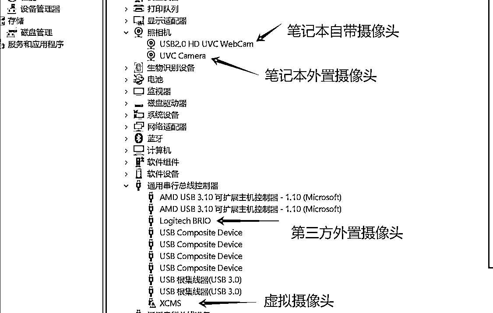
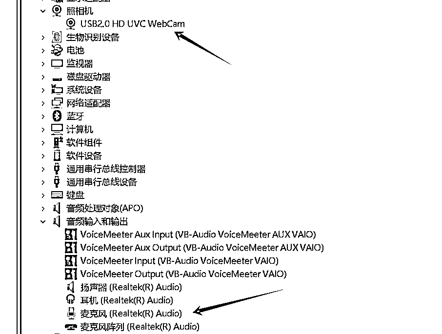
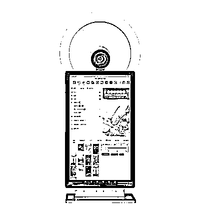
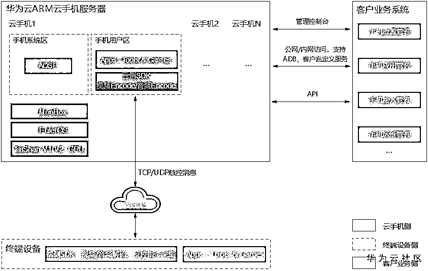
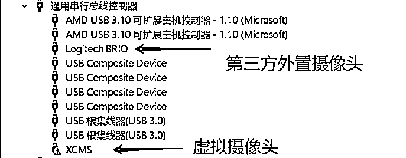

# 聊一聊无人直播攻防，帮你少踩一点坑

> 来源：[https://sbu67xqbm4.feishu.cn/docx/VKZUdmYPdoufrExlvTGcRLPUnGd](https://sbu67xqbm4.feishu.cn/docx/VKZUdmYPdoufrExlvTGcRLPUnGd)

这是一篇科普文，多是经验之谈和踩多坑后的总结，想到哪写到哪，帮大家避一避坑。如有理解不准确的地方，可以留言讨论指正。本文在知识星球生财有术首发。

自我介绍：我是杨永，08年到现在做了10几年的外贸和跨境电商，近4年放弃B端全部转到C端业务，主线tiktok和独立站业务，其中一块获客渠道来自直播矩阵。著有图书《人人都能玩赚跨境电商：AI实战宝典,跨境一本通》。

以下正文。

# 一、直播基础原理

做直播，先从深入了解直播采推流原理做起，要干得好，要从了解平台及用户对内容的需求上着手（内容侧在这篇里面暂不讨论）。

AI定义：直播是一种实时的音视频传播技术，允许内容创作者（主播）通过摄像头传感器和音频模块分别采集画面和音频，通过APP、PC应用/web端或者RTMP地址实时将音频和视频内容传输到服务器端，再通过CDN分发到观众端。这种传输是即时的，观众可以在内容被创建的同时观看和互动。

下面画了一张简图，描述这个过程。

所以，据此，我们可以看到，整个主播端直播推流简单包括以下几个方面：

1、内容

1）画面

2）音频

2、硬件采集

3、网络IP

4、推流路径

5、实时互动

# 二、无人直播 VS 平台攻防

这个部分，我们分别从主播和平台角度来聊一下大概的攻防。

## （一）从平台角度

从平台的角度来看，作为内容平台，在上述推流路径中，内容是平台核心，在所有点位中处于最核心位置，其他遵循平台标准路径，就没有错。当然，条条大路通罗马，总有很多人不走大路。

从平台对直播间的考核，可以认为，平台对直播间是有很多指标综合起来的综合得分值考核，分数的高低或者某些关键指标是决定是否给予流量的关键点，所以平台考核直播间其实是综合考核直播间的画面/音频的内容质量以及带来的用户活跃、停留或者效益，都低的那就是低质直播间，当然了如果被平台因为某些关键指标判为无人直播的话，那肯定是低质的其中一种。这里，我们讨论一下我们常认为平台可能重点考核直播间的几个因素：

### 1、内容

这里不考虑画面分辨率差，场景搭建违和等因素，因为这些是基础。

相比较画面，音频可能是平台最先重点考虑的一点。一般来说，平台可考虑主播声纹、音频脚本、限时音频存储。在这里面，音频脚本则是最容易存储和比对的一种方式，理论上来说，也可能是平台最先考虑的一个方面，这就是说，在直播间内，使用他人相同的直播脚本，或者反复重复同一段脚本，都是极其危险的事情，也可以侧面反映出，有些直播间确实是真人直播，却被判重或无人直播的其中一个原因。

画面重复（包括静态画面）、人脸对比可能是平台在画面上对内容的检验指标。在大众认知里，平台在成本上考虑，可能会抽帧比对画面元素或者二进制比对，例如，静止画面，循环重复的画面（例如，单转盘循环转动）会增加封控风险，而多个直播间采用相同的人脸也是极其危险的行为，当然各个平台的策略都不相同，可能有平台不作为考核指标，有些平台把大主播或者名人脸作为考核指标，或者有平台把所有人脸作为考核指标。举例，大部分AI直播数字人平台都会软性或者硬性的要求客户不要一直使用公用数字人人脸做直播，也是这么个考虑。

我们要知道的是，所有的直播间考核和封控指标上都会带来平台在服务器、研发、开发周期、实际回报率等的综合考虑，而且也并不是一成不变的。例如，人脸比对和OBS无人直播，早期直播间根本不管，所有就有很多IP几十个直播间同时录播开播，例如有声书的某登、将管理的某某强等都采用了这些策略而迅速发展起来。

### 2、内容采集方式

常规直播是直接通过摄像头模块与音频模块硬件采集后，直接通过协议传给平台APP/PC应用/web，所以平台需要获取到硬件的基本信息，包括摄像头模块、音频模块等等。

不过，由于客户端(APP/PC应用/web)与服务端是通过协议传输音视频流，所以如果获取到推流地址和密钥，是可以直接绕过客户端(APP/PC应用/web)，通过其他软件或硬件传到服务端对应的地址。但是，每个平台的政策不同，有些禁止，有些对某些客户开白，而也有平台则完全放开。所以，我们会看到某些第三方推流软件可以直接推流直播，例如OBS，云导播，以及各种形形色色包装后的商业APP或PC软件。

（这是一个安卓手机的所有权限列表，作为参考，当然上架平台对哪些应用可以获取哪些权限是有规则限制的，这里不讨论。https://www.jianshu.com/p/636b0f3fea83）

如果平台探测不到硬件信息或检测到虚拟硬件信息，而主播侧推流渠道又没有开白，是会在这个要素上失分，间接增加直播间的风控风险，例如，在直播伴侣或者APP推流过程中劫持RTMP地址与密钥，然后自行推流其他内容到平台服务端，绕开实时采流这个过程，常见的就是各种“硬改”推流手机。

而在PC端，一般来说，较正统的方向是，采用官方直播伴侣添加摄像头，所以一般会在摄像头及其端口上做工作，常见方式是，模拟USB Camera端口以假乱真，或者在非摄像头硬件上使用软件USB Camera协议，让直播伴侣误以为是接入真实摄像头，或者在真实的摄像头上二次开发。

举例：

以下是几种常见PC端物理 USB 端口与虚拟USB端口的对比：从操作系统的角度来看，它们都被抽象为标准的串行接口（如COM端口），然而从设备管理信息（例如主板芯片）、USB设备描述符、驱动程序信息、硬件ID以及性能上，是可以被区分出来，这也是平台端可以去辨别是否接入真实摄像头的切入点。

除采集类硬件外，推流硬件也是平台考核的一个方面，因为APP和PC软件会获取其所在的硬件固件码，频繁更换某个ID的承载硬件，一定是一个异常值，不符合正常行为模式。

### 3、网络IP

和推流硬件相似，作为承载ID和推流内容的媒介，网络IP不可能一直不变，因为使用者是在移动的，所以，排除异常值的情况下，某个ID在多个IP下活动也是正常的。不正常的是，与异常ID在同一个网络下被平台标记确实很惨。

### 4、推流路径

正常硬件推流路径是APP、PC软件、WEB端通过RTMP/ webrtc推流到服务端。

所以，非正常推流路径就一条，就是撇开平台端任何前端，而直接将内容推流到平台服务端。这当然也是平台可控的，在各个平台发展的过程中，都会从不管、微管到严管。毕竟，平台的前后端是可以知道音视频流从哪里来到哪里去了。

### 5、实时互动

这也是从直播内容性质和质量上的考量，到并不是必须和用户实时互动。

### 6、举报

不细聊。因为每个平台在各个发展阶段的策略都不相同，对不同内容严格程度也不相同。比如现在视频号对换脸直播基本上是有举必封。用户的举报涉及到的不同理由，都作为平台考核直播间健康度的不同程度的指标，这也是为什么我们去举报某个直播间，有时候直播间一点事也没有，而有的举报理由则直接导致直播间被封控的原因之一。

## （二）从主播侧角度

根据以上的简单拆解，那如果直播要避开真人参与的话，那么需要在内容、硬件、互动、以及网络IP、推流路径等方面与平台去做攻防。

### 1、内容生产

常见的内容生产在没有人参与的情况下，可以有以下形式：

1）画面：

*   实际场景下机器自动运行，例如开局画面静态画面或动态画面（如转盘、机械运转），剩下全靠音频去编；

*   虚拟场景下内容自动运行，例如游戏脚本自动打游戏，互动游戏；

*   预制视频（狭义概念下的无人直播内容，常见形式是主播真实制作的内容视频，以及采集非主播的视频（露脸或不露脸）），可以是预先预先拍好的视频，可以是以前直播视频的二次创作，或者多渠道素材的创作整合；

*   AI 实时生产画面，如数字人阿凡达或无人驱动数字人；

2）音频

*   预制音频；

*   AI 实时互动音频；

那么在直播搭配上，无人画面 + 无人音频一种或多种搭配。

如果要半无人，就可以是有人画面+无人音频，无人画面 + 有人音频，以及多种混搭。

其实，从“无人”的角度来说，应该是对优秀内容的多场放大和对优秀主播无法维持长时间高质状态的一种替代，从而去实现单IP的利益最大化，而不是去“盗窃”他人内容。从另一个角度来说，视频切片授权也是同样的一个目的。

### 2、硬件采集

从上面，我们可以看到，硬件采集是平台考核直播的一个指标。

在APP端，采集的硬件是摄像头传感器和音频模块，除非替换这两个硬件，并在硬件上二次开发，否则难以绕开。目前，常规采用的xposed框架上，hook硬件摄像头的模式，也就是市面常见的“软”/“硬”改手机摄像头，没有多大作用，而且只能基于某些型号的手机以及某些版本安卓系统去做开发，极其容易被一窝打。

在PC端，也是同样，hook硬件摄像头，并虚拟出摄像头及其USB Port有一定的作用，但并不能突破平台审核，平台稍一用力，就扼杀了。或者例如OBS等虚拟摄像头。传说中的修改虚拟摄像头的名称为硬件厂商名称，则毫无意义。

如果要说一定“合规的”，那一定是遵循平台所有的采流和推流规则和路径，在PC端的采流硬件上做文章，这是平台无法感知和触达的。目前，市面上看到的模拟USB Camera的黑盒，以及在真实摄像头中做二次开发，都是这样一种模式。

除摄像头外，还有音频，正常情况下，画面与音频是分开采集的，在硬件及其驱动上也有明显的区分，在PC上可以明显的看到，所以在输入时，在摄像头和麦克风有输入保证音画分开才是合理的。

### 3、推流

前面聊到，平台前后端一般是通过RTMP推流的。那么，无人直播切入角度，无非推流是要么通过平台的前端或者不通过平台。

不通过平台前端推流的模式，目前体现在以下几个现象上：

1）手机端第三方软件，要么通过劫持，要么开白获取推流码自行推流，例如云导播，各种宣称“手机端OBS”的APP；

2）PC端OBS以及包装了OBS的软件，例如某象、各种数字人软件PC端等。

### 4、实时互动

无人直播由于是没有真人参与，所以互动方式一般是如下几种：

1）制作视频内容中，预先考虑到可能互动的内容，在准备视频时，就加入回答这些问题或应对这些互动的脚本文字，让用户在直播过程感觉到有回复，但并非实时；

2）同1，预先考虑到观众可能要互动的点，设置关键词和关键词回复内容，在直播过程中，实时抓取直播间弹幕内容，与预设关键词比对，依次来触发文字回复。这些软件非常多了，不举例了。

3）数字人直播，原理上也是实时抓取直播间弹幕内容，利用大模型获得文字回答后，再用数字人的声音模型生成音频文件，插入到原先数字人播报的音频序列中，驱动数字人口型读出来，从而营造一个实时回复的假象。这个在头部直播数字人平台基本都有。而单纯采用手机实景+语音播报的数字人音频直播方式中，由于没有数字人唇形驱动，成本则更低，在目前的本地生活直播业务中有非常多的大小厂商参与进来，良莠不齐。

下面我们来看一下，在直播流采集和推流的链路中，旁路出来哪些无人直播的模式。

# 三、常见无人直播模式

按直播推流的设备来区分，可以看到市面上存在以下这些种无人直播的方式。并非穷举，可能还有更多其他的模式，基本上都是基于以下这些衍生出来的。

## （一）手机端

### 1、手机+4K屏

这就比较古老了，方式就是：4K分辨率的电脑屏幕播放视频，手机拍摄显示屏，音频从电脑直通手机。

显示屏的参数至少4K 144HZ以上，摩尔纹肉眼才不太可见。

优点：操作简单和逻辑简单，完全遵守直播平台采流和推流链路。

缺点：成本相对高，2000+，某些平台应该可以识别肉眼不可见的细微摩尔纹。经历多次封号潮。

衍生：混合环境音，在内容上排除非自然环境的贴片等。

### 2、手机+实景+(AI脚本)语音

最近2年比较火的模式。多用在本地生活、工厂以及自搭环境。

其模式：

手机摄像头实时采集真实环境，而声音则是来自于手机端播放的声音，这种就通过插在手机上的内录头来实现，内录头的原理比较简单，就是将外置耳机的两个声道与麦克风连在一起就可以了（淘宝很多，即使自己用一根有线耳机制作也很容易，手机播放的声音通过有线耳机的2个声道传出，如果将声道与麦克风连在一起，则又将声音传给了麦克风回手机，让平台APP误以为插入的麦克风有真实实时的声音。）

所以，在不考虑关键词互动的情况下，这种直播形式就显得非常简单，甚至不需要任何的科技，直接插上内录头，播放手机端无论是手机本地、WEB页面，还是从哪里APP上播放的声音就可以了，画面则是从摄像头实时拍摄的，这就太适合有实景的场景了，所以这就是为什么这种模式在本地生活中非常畅销的原因。

而加上AI，则是用来生产脚本的，脚本也并不是实时播放，而是在AI生成文本后，服务端文本转成语音，在直播时，实时播放这些语音文件。这样就有了一些AI科技了，实际成本还是极低，对于普通商家来说，可是解决了素材来源的大问题了。

目前市面出现的手机直/智播魔盒，AI手机直播等等，通通是这种模式。当然，这些工具在软件上，加上了关键词互动，这些很多平台都有开放接口，即使开发也比较简单，是很成熟的业务模式了。

总结：A-手机 + 实景 + 语音 = 正常手机直播 + 内录头 + 手机播放音频

B- 手机+实景+ AI语音 = 正常手机直播 + 内录头 + 手机播放AI生成文本的语音音频

会自己用AI生成脚本再转音频的话，那主要成本就是一个内录头，动手能力强的朋友5块钱搞定，淘宝估计10块，手机和软件都不需要有任何的改变，并没有所谓的AI直播手机。不过，对于B场景，现在的普遍价格是6000多一年，自己核算下成本。

优势：当然是简单易用又便宜了（只针对A场景和会AI的朋友）

劣势：只支持有实际场景的直播，所以最适合本地生活直播，而自己搭建的小转盘或者一张图片都是相对劣质的直播内容，不太推荐，胆大的可以玩。其次是很多平台已开启跳人脸读文验证，遇到这种情况，实时场景直播很难实时切换到真人音视频过风控。

注：某些商家会宣称他们是获得了平台开白授权，这个就不清楚了，理论上来说，平台不太可能允许这种大面积制造垃圾内容的形式存在。

### 3、手机+硬改摄像头

这个也比较久了。

通过抖音很多轮的打击，现在仅存的就是某米的某个版本了，这就以安卓为例来讨论以下。

其原理：某些安卓固件系统留有hook摄像头的驱动接口，在root后通过xposed框架，可以直接拦截摄像头的打开、关闭、拍照、录制等操作，等于是在不修改系统应用的情况下实现对摄像头行为的深度定制。这个是科技满满。配合上面的内录头，来实现画面与音频的蒙混过关。

手机+硬改摄像头简图

问题是，优点也是缺点，开发需要在某些特定型号和系统版本的安卓机上，并且要root，例如经过无数次的封杀后，现在最新的应该是红米12PRO。平台封控非常简单，就是针对特定型号的安卓手机，定向爆破，常规特征是0推和暂停直播功能。历史经历的硬改手机有很多，举例，摩托罗拉Z2, G5，小米6,9,note8,12,12pro、K30,K30PRO（所以说小米是发烧友手机没错的吧）等等，不断攻防和换手机型号。

软改就是不在手机驱动上开发，不root手机，已经完全不行了，不讨论了。

说说有缺点。

优点：手机端直播，要求较低，视频和画面都是预先录制，只需要一次买手机的投入。

缺点：被封之后，就只能当“手机”用了。

我办公室还有好多台各种型号的，无人直播是做不了了，发视频还是可以的。

### 4、手机OBS

现在有很多自称手机OBS的软件，还贴心的提供了很多素材，甚至还有实时互动，实际上也确实是做到了直播间画面的拼搭和互动，功能上也就到此为止了。想想电脑端OBS无人直播为什么容易被封（下一节会讨论），就能明白，这种形式除非内容极其优质，否则很难存活。

不举例。

### 5、直播一体机

自推流的大号安卓机，与上4使用手机+自推流软件毫无区别，满满噱头，除了增加一台不常用的硬件外，没啥用处，不推荐。

## （二）云手机

单独拉出来讨论云手机，是因为如果是远程真机的话，确实是有很大的操作空间，因为我们都知道，平台对于地理位置、网络环境、实体硬件等要求比较苛刻，但是如果可以在满足条件的地方布置大量的手机或手机模块，远程操控，就实现了批量操作与真实的完美结合，真是完美。

目前，主要是两种技术，一种ARM服务器虚拟化技术+真机硬件编号，另外一种是远程操控真机/主板机。下图是引用华为云ARM云手机的图作为演示。

ARM虚拟化，实际上就是使用ARM服务器硬件虚拟出来手机，为了保真，购买大量的真机硬件编号，配置到这些虚拟手机上，让平台认为其是真手机。其模式同上3类似，不过由于是全软件，所以更加容易。目前来说，由于直播对硬件要求消耗很大，使用ARM云手机并不划算，采用这种模式直播并不多，但，在短视频矩阵上应用较广，因为相对真机来说，确实投入很低。

远程真机的无人直播就同上3毫无区别了，区别是手机完全在目标地理位置和IP位置，以及批量操控，多用于跨境直播，当然缺点也同上3，活就活一批，死也是全军覆没。尤其适合短视频矩阵。这里不再讨论。

## （三）PC 软件加推流码

### 1、OBC+ 推流码

各直播平台对于推流码的控制不一样，不管不问的平台，随便用，对无人直播的管理也很松。而严格的平台，推流码都是定向提供，也就是说，能拿到推流码都是开白的，其他方式拿到的推流码上去就死。能开白的账号也不会做无人直播。

所以，能顺利拿到推流码，那就无所谓推流的工具是啥了，是不是OBS，还是芯像啥的包装OBS，都不要紧。

### 2、OBS + 直播伴侣

先说结论，能保证强互动，优质内容，无论真人直播还是无人直播，用OBS都没有问题。

我们上面有讨论过，一切脱离了正规采流和推流路径的都会增加风险。而使用OBS虚拟摄像头本身就脱离了正常路径。

正常直播过程中，平台会查验是否有来自于硬件摄像头和麦克风的音视频流，以及核验硬件音视频流的真实度。完全来自软件和虚拟端口的内容相对来说，会被增加更高的查重和内容审核比例。也就是说，只是用OBS直播，查重率更高，死得更快。

为了保证真实度，除了OBS音频视频流外，在直播伴侣上引入来自硬件的音视频流将大大降低封控程度，当然，平台照样会审核硬件音视频流的。有大聪明会将在OBS中播放视频，插入一个真实摄像头，摄像头放在一边不动，就会发现，这毫无卵用。那如果有真实场景，就会好很多，例如有个真人在不断说话，那就是下面要讨论的半无人了。

### 3、OBS + 真人（半无人）

这个在生财有过一次训练营，可以去翻看一下。目前对来自真实摄像头的内容要求逐渐提高 ，例如抖音要求人要占画面的50%。

### 4、OBS/直播伴侣 + 互动游戏

这种直播间互动性很高，画面的重复率较低。如果平台没有特定要求的情况下，即使没有真人出镜，内容其实很好了，封控率也不会很高。当然，像抖音这样的平台已经明确要求互动直播必须有真人出镜，那么就真的需要从硬件摄像头和麦克风传出有人音视频流。对于没要求的平台，到时无所谓。

## （四）PC直播伴侣

### 1、直播伴侣 + 虚拟端口

我们上面讨论过，平台对于硬件的检测是通过USB Port的，那么就有大聪明想到，如果虚拟出来一个摄像头和音频USB Port，那不就解决了嘛。看起来似乎是的。

比如以下这个XCMS。

其原理参考如下：

实际上，所有的USP Port都会带有硬件信息。平台是否升级封控，要看具体的平台了，那某音、某某号呢，肯定是率先做到了。其他平台还不知道。不过其他平台呢目前用OBS也是可以的。

### 2、直播伴侣 + 硬改真实摄像头

我们回忆一下之前提到的直播正统路径：

*   从真实硬件摄像头和真实麦克风端口获得视频和音频

*   通过平台APP/软件推流到平台服务器端

也就是下图：

能保持不对这个路径有任何干扰，就只能从真实的摄像头和真实麦克风上下功夫了，那我们上面在第三掌第1.2中有讨论过从麦克风的语音上采取的策略。

这一节，我们探讨同时从真实的摄像头和真实麦克风上入手。

一种方式，在硬件中模拟真实摄像头，并在连接电脑时，提供真实的USB端口。

目前，在很多平台都是有效的。

缺点是：同上面虚拟USB端口类似，USB端口带有硬件信息，在不升级风控的情况下，是没有问题的。其次是很多平台已开启跳人脸读文验证，遇到这种情况，号就死了。

第二种方式，在真实摄像头的主板上做开发。所有的硬件都是真实的。

优点是：硬件真实，可以录播，也可以真人直播，也可以随时无人直播和切换到摄像头做真人直播。其价值是，可以在无人直播过程中间歇穿插真人做直播，减小封控风险。另外，对于类似视频号这样的平台，会不时跳出真人验证，如果纯无人直播，那就死号了，用真实摄像头硬改后，可以一键切换到摄像头采集模式，真人介入过审。

缺点：同其他所有的无人直播模式一样，因为播放的是视频，主播无法互动，所以互动方式主要是预录脚本加模拟互动，关键词互动工具，如需真人介入可通过插入麦克风做助播喊麦。

以下是工控摄像头示例。

### 3、直播伴侣 + 数字人（音画）

目前，所有的数字人直播在推流模式上都类似于OBS生成虚拟摄像头或者直接用直播伴侣采集窗口。

数字人直播的原理如下所示：

节选自图书《人人都能玩赚跨境电商》

数字人直播不赘述。

优点：无人，实时互动（相对纯无人直播来说，数字人直播的互动随有滞后，但也非常快）

缺点：口播为主，非口播会需要训练大量的真实场景模型，成本极高。内容要求高的平台禁止纯无人数字，例如抖音和视频号。数字人直播成本较高，起点也高，不适合对直播运营理解较低的团队。目前，基于成本考虑，低训练模型数字人直播是主流，因为模型训练程度低，可以被用户一眼看出来，之后，再播啥都显得索然无味。

## （五）WEB 数字人推流

举例百度电商和快手电商的数字人，目前都是免费使用（有条件免费，前者要交保证金成为平台商家，后者要磁力金牛日投流500元），主要通过平台的WEB直接推流，感兴趣的朋友可以去看一看。

对于主流平台的无人直播管控严格程度从严到松依次如下所示，道听途说提一下：

*   某音和某某号、TT

*   某手、某某书、FB

*   所有电商平台（某宝、某东、某某宝、某团）、油管

# 总结一下

想要在内容平台上通过直播间长期公域获利，以上说的都没用，因为内容是核心，不好好搞内容，搞运营，投机取巧，并不长久，包括数字人直播。一定要做的话，须遵循平台采流推流路径规则，在硬件摄像头上着手，还是有机会的。

无人直播，当然是有其利用价值的。可以体现在：1是Ip的矩阵获利，2是私域引流，目的非公域获利，3是测试商业模式，短时获得正向反馈。

以上分享，你我共勉。