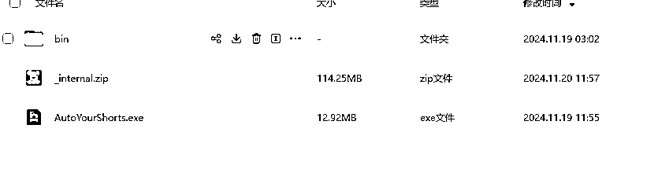

# 利用cursor辅助，爆肝10天做了款shorts自动化制作工具

> 来源：[https://wqm8iq5gs4a.feishu.cn/docx/YzrFdUfypoGEHLx8i2lc7jZvnvb](https://wqm8iq5gs4a.feishu.cn/docx/YzrFdUfypoGEHLx8i2lc7jZvnvb)

# 一、关于

大家好，我是阿威，来生财不久，这是我的第一篇帖子，每天看大佬们的精彩文章，琳琅满目，都不知道该从哪入手，我也思考了一下，我能做点什么事情。自从亦仁老大发布了shorts超级标以来，这个话题每天都有好多帖子，我几乎是一条不落的看了（哈哈，每天花一两个小时来阅读大家的帖子，学到了不少东西，当然也不仅仅只阅读，我也自己动手实操了一些）

受众多大佬的分享的启发，叉叉敌，钱塘江鲤，老马内容出海，土豆君，方妮波，竹子，星吟Singing，python大大，大铭等等，这里我就不一一列举了，趁着搞了两个号都被封了的时间，来开发了这款软件（文末附网盘链接）。在做咱们生财上的项目我还是太小白了，不过慢慢研究，我先给大家展示一下我做的这款工具，目前大体上有个框架，但还有诸多问题，不过先放出来，拖久了怕到时候就搁置了。

整体的流程参考了大佬们的文章，以及自己也手搓了几个视频，复刻别的shorts大概是这么个流程：下载视频、1、视频抽帧 2、图片描述（这里我设置了两种，一种描述是用于文生图，另外一种是用于图生视频） 3、利用图片描述生成图片 4、利用生成图片+描述2生成视频片段 5、合成视频

目前我自己测试了一下，还有点问题，背景音乐提取不出来，在cursor上跑是没问题的，还有siliconflow的生图报错，不知道是打包哪里出问题了，后面我在解决

在这几天吭哧吭哧地搞这个软件的期间，咱们的亦仁大大又发布了第三条超级标 - AI应用，咱这个是不是也算沾点边，这是我深度使用cursor的第一个项目，前几个月的时候看到有人拿来写个功能不复杂的浏览器插件，当时只觉得能拿来写点小demo什么的，没在意，进了生财之后看到好多人都在分享，亦仁老大也分享了他使用cursor跟v0的感受，这次就拿来用上了，效率上确实是有一个很大的提升，大概能提高三到五倍，之前我都是自己拆解成小任务让gpt给我写，我再粘贴到自己的项目中，这已经比之前没有AI的时候要快的多了，面对的困难要小得多。如今的AI时代，基本只要愿意花时间，人人都能开发出自己的产品。要是在几年前自己一点一点啃编程教程的时候就有这些东西，不知道有多少头发能保住性命（狗头）。

另外前俩天看了钱塘江鲤大佬的最新文章，也是做shorts自动化的，各种操作，秀的我头皮发麻，不过我还没有实际操作上，不得不说前端界面什么的还是得用网站的形式，做qt这类的ui，cursor并不能很好地胜任

这是打开之后软件的首页，一个输入框，下面是执行命令的日志，在输入框里面我们可以输入shorts链接，点击确定即可下载（先别急着这么做，看一下下面的设置先，我们需要先做一些配置才能顺利进行，另外记得打开魔法），或者点击下面的浏览本地文件 按钮，即可选择本地的视频

注意：在第一步之前，记得先来这设置页面进行配置，1\. 设置可灵的cookie，这个即使暂时不生成视频，也得填上，因为我们的图床白嫖的他们的，之前看叉叉敌大佬用的github的，后面发现可以白嫖可灵的，其实只要有图片上传功能的网站都能白嫖。2\. 设置阿里通义前文qwen的api key。3\. 设置你的youtube cookie。步骤如下各图，设置好后记得保存才能生效

### 获取可灵的cookie步骤：

打开可灵的这个页面，按F12进入开发者工具，也就是右侧这个东西，点击 ”网络“

这个时候，上传一张图片试试，找到token开头的东西，并且复制这一长串cookie到我们的设置页面，并保存

### 获取youtube的cookie：

安装一个浏览器插件 Get cookies.txt Clean https://chromewebstore.google.com/detail/get-cookiestxt-clean/ahmnmhfbokciafffnknlekllgcnafnie?hl=zh-CN&utm_source=ext_sidebar

打开YouTube网页，点击这个扩展，点击copy即可复制，把复制的内容放到软件设置页面的对应位置并保存

### 获取阿里qwen的api key

因为除了生成视频用的可灵，其他流程，翻译，图片描述，图片生成默认我都选择了走阿里的api，这样大家配置起来也方便，就配置这个api就可以开始了（阿里的api总体上还行，就是文生图太慢了，还经常超时，因为它用的flux的模型，自己的万象模型，效果很垃），后面想换的话，设置好自己的api key，在工作流页面可以切换平台与模型

进入阿里云百炼网站，点击右上角头像，点击 API KEY，然后创建API KEY即可，把这个key复制到我们的设置页面对应的位置，并保存

https://bailian.console.aliyun.com/#/home

然后就可以愉快的进行接下来各个的流程了，首页输入好shorts网址或者选择好本地视频路径后，点击确定，稍等片刻，就会进入第二个页面，提取关键帧页面，这里我参考了老马-内容出海大佬的代码，如下图，在这里，你可以自动提取视频的关键帧，可以调整阈值，要手动添加/删除关键帧，拖动那个蓝色矩形方块，上面的视频画面会动，点击添加就能添加关键帧了，如果想要删掉某张，点击右侧已选好的关键帧，然后点击删除即可

选择好关键帧之后，就可以进入到工作流页面了，在这里你可以任意设置所有参数，当然，如果你前面只配置了阿里的api，这里就先不要动

注意看下面的三个大按钮，默认第一个图片描述是选择的，其他两个需要自己按下，生效中就代表这个流程会自动执行，只要所需的信息满足了，就立马生成，再按下按钮即可取消这个流程的执行

下方右侧俩按钮，就是当所有视频都生成好了，可以将它们合成，但是由于前面提取音乐有误，这里暂时用不了，可以去这个文件夹里面找到生成的视频片段

都设置好后静静地等待生成即可，由于阿里的文生图很慢，所以需要等一段时间，如果设置了别的api key，也可以用别的，siliconflow我前几天测试还是好的，速度很快，效果也不错，不知道为什么现在不行了，老是返回501代码，我这几天再看看研究一下

按下这三个按钮，就能从图片描述到图片生成到视频生成一步到位，但是最好视频生成先还是不要自动化，因为出来的图不稳定的话，可能会浪费自己的可灵积分，如果出图稳定，那没问题

效果展示，原视频与复刻视频：

这是前面几个步骤都用阿里api生成的，换更好的api效果还能提升，后面如果大家有需求，我就再把其他的api接口接入进来

后面如果大家对软件内部的实现感兴趣，我也可以分享分享

在打包成exe文件遇到了一个问题，调了一整天才调出来：没打包之前跑的一点问题没有，跑exe文件就有问题，一直没找出来，cursor跟gpt也没帮我解决，找这个bug找了一天了，最后发现是因为打包出来的文件，执行前忘记设置可灵cookie了，导致一直报uicode解码的错，最后发现是打包出来没设置cookie，默认的又是中文，导致字符有问题，试了几十遍都不行，心态都快崩了，然后发现是因为自己没设置，哭笑不得

我先放出来，大家想用的话可以先下载着，后续如果有更新的话就只要下个十几M的exe文件，替换掉即可

通过网盘分享的文件：AutoYourShorts 20241118

链接: https://pan.baidu.com/s/1dXobmR-u-FQ9G8BrK9gPDQ?pwd=r1mj 提取码: r1mj

下载之后，把这个压缩包解压一下，双击exe文件即可执行

后续的想法：

修复一下存在的bug

角色一致性的问题，想办法优化一下

多项目，多账号支持