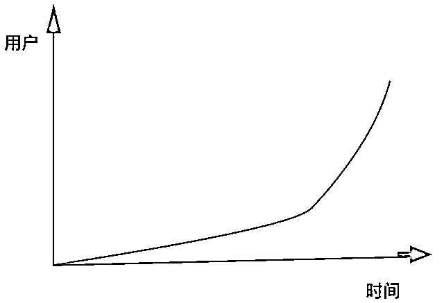

# 理解赚钱的复利效应，你的成长会加速 10 倍！

> 来源：[https://pznme756ly.feishu.cn/docx/Z0s1dpeDHoM8QKxTOGlclIg6nnc](https://pznme756ly.feishu.cn/docx/Z0s1dpeDHoM8QKxTOGlclIg6nnc)

前几天亦仁分享了一个帖子：https://t.zsxq.com/XPfLs，里面有一段话：我坚信，任何时候都能独立面向市场赚到钱的能力，是一个人最大的底气和自信。我同时坚信，任何一个生财有术圈友，只要持续学习和实战，都可以拥有这样的能力，都可以持续赚到钱。

这段话我非常有感触。因为我从一个只会写代码的程序员，到现在能够独立面向市场赚到钱，就是在生财有术里面从0到1，一步一步学习、实践、复盘、改进，锻炼出来的。

在这个过程中，有一个概念「复利效应」对我的影响非常大。

正是因为想通了这个概念，所以我确定、一定、以及肯定的相信，用正确的方法，做正确的事情，我未来一定能赚到钱。于是，我才能在前期很长一段时间，没有正反馈（涨粉、变现）的阶段，依然很坚定、有动力的学习精华帖、思考、行动、复盘，让自己不断的成长。

并且在这之后，我在赚钱方面的学习效率、进步速度，都提高了 10 倍。

我把它称为：赚钱的复利效应。

如果当时不懂复利这个概念，我一定无法单纯凭主观的「我想坚持，我想赚钱」就真的获得结果。

不符合客观规律的事情，一定不可能实现。

所以，我觉得这个概念，对于很多刚加入生财，还在成长阶段，无法立刻获得正反馈（比如涨粉、变现）的朋友，会有非常大的帮助。

这个帖子我就来分享一下，我对于这个概念的思考，希望可以带给你一些力量。

今天的主题是：复利效应。

千万别误会，我不是要告诉你，往银行存多少钱，过多少年就能获得多少收益。

或者那个鸡汤的故事：往棋盘第一个格子放一粒米，第二个格子放 2 粒米，4、8、16……然后无穷大。

我要分享的复利效应，是真实的和每个人的赚钱、工作、成长，息息相关的内容。

# 1 什么是复利？

爱因斯坦说过：

“Compound interest is the eighth wonder of the world. He who understands it, earns it ... he who doesn't ... pays it.”

复利是世界第八大奇迹。知之者赚、不知之者被赚。

复利效应在很多领域都能看到，比如：

*   银行存款的复利增长曲线

*   道琼斯指数过去两百年的增长曲线

*   世界人口增长曲线

*   明白的爬虫课增长曲线

别急，后面会讲。下面这个公式，你肯定见过 ——

对应还有一句鸡汤：如果一个人每天都能进步 1%，一年之后他的能力会提升 38 倍。

这就是复利的概念，看到这里，你是不是没啥感觉，别急。

# 2 相信复利效应有什么好处？

## 1 相信复利能让你不焦虑

我在 2016-2019 年之间经常焦虑。

比如，我看到粥左罗老师写的一篇文章，感觉写的太好了，我也想写出这样的文章，但是想到自己的能力不够，我就不由自主开始焦虑。

你仔细想一下，你上次焦虑的情形，是不是和我很像？

看到身边优秀的人，他们轻轻松松写出好文章、做出好课程，参加航海能获得结果，变现，自己也想和他一样，但发现自己能力不够，好像有种不管怎么努力，都无法做到的感觉。

于是，强烈的焦虑感产生了。

但是，如果你相信复利效应，焦虑就会消失一大半。

为什么？

我们看到别人的成绩，觉得自己不可能达到他的高度，是因为觉得他「轻轻松松」做到事情，自己现在拼尽全力也不到 10 分之 1。

但其实，我们一开始就错了，他看起来现在轻轻松松，是因为他已经到达了「复利拐点」。

啥是复利拐点？再来看一个图：

我之前有一篇文章，里面写过一句话 ——

如果一个人到达复利拐点（图中小人站的地方），那他的收益，会急剧增长，可能比之前所有时间的收益总和还要多。

这里的收益，是钱，是能力，是认知。

还说粥左罗老师 —— 他为什么能每篇文章都阅读量很高？

2015 年 8 月，他进入了新媒体行业，开始写文章，一直到 2018 年 3 月，开始出来创业，一直到现在，他每天都在写新媒体文章，没有一天中断过。

他经过很时间的积累，到达了复利拐点，所以他写文章的能力变得非常高。

所以，他现在写文章阅读量很高，而且他出来创业的收入，比之前上班的总和还要多很多。

你可能要问，这和我有什么关系？

嗯，有非常大的关系，因为：复利效应是客观事实，它对每个人都是绝对公平。

只要我们相信这个理论，并且按照正确的方法，不打折扣的执行，未来的某一天，你也会到达复利拐点，这时候，你的能力和收入都会急剧增长。

既然我们知道，按照正确的方法，一定能达到自己想要的高度。

你的未来完全掌握在你手里，这时候，你还会焦虑吗？

可能情绪上来时，你还是会焦虑。但当你用理性去思考一下，焦虑就会一下平息很多，我每次就是这样梳理情绪的。嗯。

## 2 相信复利能让你更自信

一个人之所以自信，是因为知道自己知道：

*   知道哪些事情自己能做到，哪些做不到

*   知道哪些事情现在做不到，未来也做不到

*   知道哪些事情现在做不到，未来一定能做到

如果你相信复利，就应该明白，那些很厉害的人，都是经过时间的积累，然后达到复利拐点，取得很好的成绩。

而复利对每个人都绝对公平。也就是说，你如果现在开始积累，你所期望达到的高度，虽然此刻看似遥不可及，但在复利的作用下，在可见的日子里，它一定会实现，毫无疑问。

再看下这张图片，看看那个小人站的地方。

虽然你现在看起来进步缓慢，但这是正常现象。在拐点之前，你需要一段积累期，当你积累足够时，拐点就会自动降临。

当你清楚这点后，再开始学习、积累时，你就会很有底气。当你遇到一些困境，你会更坦然的面对，

因为你知道，这些都是暂时的。

因为你知道，现在付出的努力，都是值得的。

因为你知道，你的未来完全由自己掌控，时间会给你答案。

我在 2019 年，为了升级《不用写代码的爬虫课》，一整年都在大量读书、学习、练习、拆解赚钱案例，然后把学到的知识、方法，用到自己的课程、网站上。

虽然前期就是很枯燥，没收益。但我因为相信复利效应，我知道自己学到的东西，未来会用到哪里，会对赚钱有哪些帮助，我就会更有信心，也会更有耐心。

## 3 相信复利，能让你进步更快

前面讲了：如果一个人到达复利拐点，那他的收益，会急剧增长，可能比之前所有时间的收益总和还要多。

这里的收益也包括财富，说直白点，如果达到拐点，你赚的钱，会比之前所有时间的总和还要多。

如果你相信复利，你现在所做的事情，就是为了早日达到复利拐点，早点赚到更多钱。

而你，为了早日能赚到更多钱，肯定会花更多时间去积累、去学习，这样你的知识，你的能力也会飞速提升。

相信复利的话，你对于看抖音，刷朋友圈这类事情，会毫无兴趣，因为这些事情对你达到拐点，没有任何帮助。

做这些事情花 1 天时间，那你就晚 1 天达到复利拐点，也就晚 1 天达到高收入的状态。

如果你把时间拉长，你现在的每一天，都能赚很多钱，你还会花时间去刷抖音吗？如果你相信复利，你会知道，未来的每一秒，如果不去积累，都是浪费。

## 4 相信复利能让你有更多好运

*   如果一个人学 10 个知识，能碰到一个赚钱的思路；

*   如果一个人做 10 件事，能找到一个适合他的机会；

*   如果一个人见 10 个人，能遇到一个愿意帮他的人；

假如把上面的结果称为好运，那如果你相信复利，你的好运会更多。因为你如果相信复利，你就知道，未来你一定会有所成就，这样你才会在还没有成绩的时候，安心做一些积累 ——

*   你才会更努力学习，

*   你才会做更多尝试，

*   你就会接触到更多人。

和身边不相信复利的人相比 ——

*   你会学习更多知识，也就会有更多赚钱思路；

*   你会做更多事情，也就会有更多选择的机会；

*   你会接触更多的人，也就会碰到更多贵人。

而这更多的赚钱思路，更多的机会，更多的贵人，会让你更早取得成功。

我有个朋友，就叫他小明吧。

他不甘于上班拿死工资，所以在业余时间，也开始学习一些其他东西。

小明为了学习，加了一些付费星球，在里面他看到很多以前不懂的信息。

最开始，小明特别焦虑，因为看案例，感觉别人轻轻松松就能赚到钱，而他对于那些信息，几乎一个都看不懂。他也很努力的学习，可要学的东西太多，几个月过去了，依然没有啥收获。

小明无数次在内心挣扎：「要不就这样吧，反正也学不会」。

偶然一次，他接触到李笑来在得到的专栏：《财富自由之路》，看到了复利的概念，看到了下面这个图片里的小人，小明好像看到了希望。

因为按照专栏里复利的说法，他只要认真努力学习，肯定会变的很厉害，现在之所以还没有成绩，是积累不够。

小明什么也没多想，死死拽住了这根救命稻草。

从那开始，小明每天都花更多时间学习，虽然基础差，但好在够勤奋，而且随着学习增多，他的焦虑也慢慢减少了。

他练习写作、学产品、运营、营销、增长黑客，慢慢的，之前不懂的信息，他开始熟悉了。小明也开始有点自信了，他尝试着在知识星球分享一些心得，偶尔还会得到大佬的赞赏，这让他更坚信复利的作用了。

学了一年，虽然能力还是不够好，但小明慢慢有点感觉了，于是他模仿其他案例，做了一个课程，但是做完后，傻眼了。他光想着做课程，但如何把课程卖出去，小明完全不懂。他又想到之前一个案例，有人把课程免费送了一些给朋友。于是他又模仿别人，打算也送一些给朋友。

他到常去的知识星球里发帖，本来送个课程，2 句话能完成的事，他当时头脑一热，不知不觉写了 1000 多字，他把在星球的学习过程，课程的研发思路等都写了出来。后来，这个帖子被知识星球的作者看到，作者觉得小明很努力，于是就联合知识星球的朋友，帮他宣传了一下，小明的课程因此完成了冷启动。为什么大佬愿意帮助小明？

一个财务自由的投资人李晨，他在生财有术做了一个分享，里面讲到 ——

人们更愿意帮助努力的人，这是线性成长转变成跳跃性成长的门槛。你的努力对你的能力成长是线性的，但是你的努力被别人欣赏，有人愿意拉你一把，那就是跳跃性成长。

我想，可能大佬是欣赏小明的努力，因此愿意拉他一把。后来，小明在这个课程的迭代过程中，能力得到飞速提升。

试想一下，如果小明不够努力，没有做这个课程，没有模仿别人送课程的思维，没有练好写作能力写出那个帖子，那他还会有这个好运吗？

而他之所以能做出上面的行为，就是因为他相信复利，相信自己现在的积累，未来会有很大回报。

2021 年，那个知识星球新一期开放，小明帮星球带了 400+ 新用户。按星球价格算，小明带货 100w+，也获得了 20 万的佣金奖励。大佬当时的欣赏，是对的。

小明因为相信复利，所以变的不焦虑，开始认真学习，能力得到提升，最后碰到好运，得到大佬帮助。

嗯，我就是小明，星球就是生财有术，大佬就是亦仁。

还是回到一句话：复利效应是客观事实，它对每个人都是绝对公平。

# 3 我们如何做，能收获复利成果？

要收获复利成果，我们首先要了解一下，哪些东西具有复利效应。

## 1 知识的复利

### （1）知识联结的通汇贯通

我们通常认为，学习的过程是——

学到 1 个知识，收获 1 个知识

学到 2 个知识，收获 2 个知识

学到 3 个知识，收获 3 个知识

……

这忽略了一个关键点：知识之间的联结。

知识之间如果发生联结，就不是上面这种情况，而是下面——

假设你的基础知识为 0，

学到 1 个知识，收获 1 个知识

学到 2 个知识，收获 3 个知识（其中 2 个发生联结）——

学到 3 个知识，收获 7 个知识（其中多个发生联结）——

学到 4 个知识，收获 15 个知识（我就不画图了……）

于是，从理论上，我们就能推出——

学到 N 个知识，能收获 N^2-1 个知识。

（N^2-1 的函数曲线）

收获曲线和前面的复利曲线形状相似。

当然，这是理想情况。

事实上，我们无法将每 2(n) 个知识都联结到一起，也不是所有的知识都可以、有必要联结在一起，但也足以说明一个问题——

如果你能将学到的知识、即便是部分知识联结起来，那你的知识量也会比之前增加很多，因而产生「突飞猛进」的感觉。

很多人开始很长一段时间学到的知识根本连不起来，有 2 个原因——

（1）知识量太少，能联结的点太少

不是每个知识都可以和其他知识产生联结，因此掌握的知识越多，你就有更大概率碰到自己熟悉的知识，并把他们联结起来。

所谓，广撒网，不用技巧也有鱼。

如果不够勤奋，学的慢，知识量就少，它们之间就更难以产生联结。

（2）不够深入，没能力把知识联结起来

除了知识量要大，还需要对知识了解更深入，才能创造出新联结。这点后面有讲。

更为重要的一点：真实世界中有价值的事情，都需要多个知识组合才能完成。

比如，你要做一个海报，需要：文案、用户视角、心理学、研究能力、模仿能力、沟通能力……

你要写一篇文章，需要：写作、读书、思考、逻辑、心理学、学习能力、用户视角、模仿能力……

你要做一个课程，需要：写作、逻辑、模板能力、用户视角、学习能力、设计、沟通能力、模仿能力……

一个个独立的知识，是无法解决真实问题的。

当我们把知识联结起来，并且应用于生活中，解决了真实问题，就能获得实质收益，我们就更能感受到「学习带来的收获」，也因此「突飞猛进」的感觉更强烈。

刚开始学习的一段时间，我们感觉不到进步，因为我们的知识量太少，没法产生联结。随着学习时间加长，知识量在增多，它们之间产生联结的可能性就更大，按照 N^2-1 的趋势，从知识量上我们就感觉到进步，而且知识联结更可能帮我们解决真实问题，更进一步增强收获感。

因此，我们才能在某一刻有「突飞猛进」的感觉，因为那一阶段，知识之间产生大量联结，并且解决了真实问题。

所以，学习的时候，「开始进步很小，后面进步很大」并不是玄学，而是有据可依。

看一张图片：

当我们只有少量知识，它们之间没有发生联系，这时候知识的作用就很小，比如蓝点。

当我们的知识增多，它们之间有的会发生联系，这时候就能产生一些效果，比如绿点。

当我们的知识继续增多，到达知识的复利拐点（红色），大量知识之间发生联系，就会产生巨大的效果。

有个客观事实，不是每个知识，都一定会和其他知识产生联系——

*   如果你有 5 个知识，可能有 2 个之间会产生联系。

*   如果你有 10 个知识，可能有 4 个之间会产生联系。

*   ……

*   如果你有 100 个知识，可能有 40 个之间会产生联系。

发现什么了吗？你拥有的知识越多，他们之间发生联系的可能性就越大，发挥的作用就越大。

如果你只有 1 个知识，即使它们想产生联系，也不可能。所以，不要因为暂时看不到效果，而停止学习。

只要你一直学，总有一天，积累到一定程度，知识之间大量产生联系，它们会自动融会贯通。

这就是知识的复利效应。

### （2） 理解原理的触类旁通

前面第 1 点讲过，如果能把知识联结起来，我们收获会更大。

那具体该如何联结？

除了多学习，提高知识量，增加知识间联结的概率。

还有一点，就是理解不同知识背后的原理，因为只有理解原理，才能知道如何把知识运用到其他领域，和其他知识产生联结。

我们先看个图——

图片从上往下，是不同领域的知识结构，

1 知识：比如概念、公式、理论等，不同领域的知识不一样。

2 方法：比如写文章、裂变、设计海报等，不同领域的部分方法，可以通用。

3 原理：比如从众、锚定效应、价格歧视等，涉及心理学、经济学等理论，大部分原理，都可以运用到多个领域。

当你理解了 A 领域的某个原理，你再去学习 B 领域，就会有一种「这个东西好像在哪里见过」的感觉。

这就是触类旁通。

这个「类」，就是「类型」，就是「领域」。

当你掌握（触）了 A 领域的「原理」，就更容易用这个「原理」，去「旁通」B 「类」（领域）的原理，就更容易掌握方法、知识，也就更容易将不同的知识、方法联结在一起，产生通汇贯通的感觉。

这也能解释为什么有的人，明明只在 A 领域是专家，但当他看到其他 BCDE 领域的知识，也能很快给出「这个也能用 XX (A领域) 的方法做」，因为他理解 A 领域的原理，这些原理在 BCDE 是相通的，所以他能「旁通」到其他领域，让知识产生联结。

比如，涛哥是做电商的，有次我和他讨论爬虫，他竟然能准确说出一些技术相关的东西，而他的确不懂编程。后来我想通了，因为他在电商领域深耕多年，理解了原理，而这些原理可以拓展到爬虫领域。

所以，理解原理，就更容易触类旁通。

那为什么很多人做不到？

因为辛苦。

知识在表面，用眼睛就能看到，最容易学到。了解知识，才能总结出方法怎么使用 。了解方法，才能研究出背后原理 。

要理解原理，就需要在同一个领域深入，花更多时间、精力思考、分析、研究。

但很多人掌握表面知识后，就离开去学习其他领域的新知识了，因为学习知识更轻松，而且可以向别人炫耀：「我又读了几本书，又学到几个概念」，相比耗费精力的思考，他们更喜欢这种即时满足感。

这也是很多人，学了很长时间，依然感觉不到进步的原因。

所以，如果我们能慢一点，在学到知识的时候深入一点，理解原理，就更容易触类旁通。理解的原理更多，就容易把更多知识联结起来，也就更容易体会到「突飞猛进」的感觉。

## 2 能力的复利

### （1）生财有术学习的复利效应

我以前是个程序员，除了写代码其他什么都不懂，不会写作，不会产品，不会营销，不懂商业……

2017 年，我加入「生财有术」。

我在里面的学习进展，和上面讲的一样 ——

第 1 年，10 个帖子里，9 个看不懂。

第 2 年，10 个帖子里，8 个看不懂。

第 3 年，10 个帖子里，突然全部能看懂了。

真的是突然就全部懂了，我当时也不知道为什么。

最近写这方面文章，我才仔细回忆、思考了一下，发现就是因为我在第 3 年，感觉到把知识联结到一起的好处，所以刻意加大了这方面的投入力度。

我当时还和亦仁聊过我这个状态，翻了一下聊天记录——

我当时还只是一种朦胧的感觉，现在看来，我的感觉没错。

后来，我在 2019 年拿到了 10 颗龙珠，都是通过分享精华帖拿到的。

很多在生财星球认识的大佬在那年都说，明白突然进步好大。

这也在事实上层面，说明我到了那个复利效应的「突飞猛进」的阶段。

很多朋友说，学一个东西要 3 年才有收获，太久了吧。

不是的。

我用了 3 年，是因为我之前 2 年并没有想通这点，所以很多知识是浅尝辄止，第 3 年模糊感觉到这个道理后，才开始大力实施。

如果是现在，任何一个新领域，我都有信心，可以在 1-3 个月之内，快速学会搞懂做出成绩，因为我已经在一些领域「触」到了原理，可以「旁通」很多领域。

所以，如果你按照本文的思路，多下功夫，一年时间，即便你现在一无所知，是个小白，你也能凭自己的努力，获得快速进步，变成一个高手，然后赚到钱。

* * *

### （2）爬虫课的复利效应

在比如，我的爬虫课，迭代了 3 版，2019 年升级了第 4 版。升级爬虫课的过程，我的能力也在不断提升。做课程之前，我对产品、运营、营销都毫无概念。

*   第 1 版课程时，我从 0 学习这些技能。

*   第 2 版课程时，我能把这些技能硬套到课程上了。

*   第 3 版课程时，我能熟练运用这些技能。

第 4 版的时候，我有信心，新版的课程质量，能做到比第 3 版好不止一个等级，而且用户量也能比前 3 版总和还多很多。

因为经过前 3 期课程的积累，经过在微信群里无数次的答疑，经过一次次课程文案的改进，我对用户、对产品、对营销，都有了不一样认知。

就像下面这个图片：

因为练习的足够久，所以这些技能到了复利拐点，也因此，它们能发挥出更大的效果。如果我以后做其他产品，那新产品的质量，就会从第 4 版课程的位置开始，而不是从 0 开始。

比如，我后来做知识星球网站，写公众号，做社群，做cps带货。都是因为之前的积累，才做的非常顺利。

这就是能力的复利效果。

# 4 赚钱的复利效应，如何达成？

知识有复利效应，

能力有复利效应，

这两个东西，都是对成长有帮助的事情。

所以，如果一件事不能让自己得到成长，就说明它没有复利效应。

重温一下这句话：如果一个人到达复利拐点（图中小人站的地方），那他的收益，会急剧增长，可能比之前所有时间的收益总和还要多。

再来看看这个图片：

理解复利效应后，我们再去看生财的精华帖，或者参加航海实战，就不会单纯的只看当下 ——

这个帖子的知识、方法、思路，能让我变现，就是有用。不能让我变现，就是没用。

这个航海实战，能让我变现，我就是成功的。不能让我变现，我就是失败的。

而是会更深入的思考 ——

这个帖子的知识、方法、思路，能加深我 ——

*   对某个行业的了解，

*   对流量的理解，

*   对用户需求的洞察，

*   对平台机制的熟悉，

*   对商业模式的认知，

*   ……

那它对我未来做新的项目，就一定有帮助。我做下一个项目，就一定能做的更好。

这个航海实战，让我增加了 ——

*   一个项目更系统的了解，

*   一篇笔记会爆的原因，

*   别人是如何面对困难的，

*   拿到结果的人，是如何行动的？

*   我需要补上哪些能力？

*   我在哪些方面需要改变？

*   ……

那它对我下一次航海，就一定有帮助。我参加下一次航海，成功概率一定会增大。

每一次的学习、思考、行动、复盘，都让我们的知识、能力、经验，获得进一步的积累。

假设，原来我的赚钱的知识、能力、经验都是0。

学习 1 篇精华帖，参加 1 次航海，我的知识、能力、经验，会变成 10。

……

学习 10 篇精华帖，参加 3 次航海，我的知识、能力、经验，会变成 30。

……

学习 50 篇精华帖，参加 6 次航海，我的知识、能力、经验，会变成 70。

……

某一天，你去参加航海实战，一定突然会发现 ——

*   以前觉得很陌生的平台，现在变得熟悉了。

*   以前觉得写一篇笔记很难，现在变得容易了。

*   以前遇到一个问题，觉得很难，不知道怎么解决，现在能熟悉的搜索、思考、实践，轻松解决掉。

*   以前不知道怎么卖一个东西，现在能很轻松的把产品价值，传达给用户，获得成交。

*   ……

一切美好的结果，都会在我们积累到一定程度后，而然的出现。

这就是，复利效应。

如果你希望自己在未来，3 个月，或者半年，一年，可获得大的成长、和收入的增长，一定要牢记这 3 句话 ——

*   1 复利效应是客观事实，它对每个人都是绝对公平。

*   2 如果你相信复利，未来你一定能变成一个很厉害的人。

*   3 只有持续做对成长有帮助的事情，才能收获复利成果。

希望看完这篇文章，你也能更坚定的

*   相信复利效应，

*   相信时间的力量，

*   相信坚持的力量，

*   相信积累的力量，

开始每天更认真的学习、实践，提升自己。

未来你必然可以锻炼出，独立面向市场赚到钱的能力，可以持续赚到钱。

你现在每一天的努力，都会在未来帮助到你。

* * *

# 小尾巴：历史介绍~

我是明白，生财有术 8 期老圈友，星球编号 20。

程序员出身，目前自己创业，做一个成长社群《日新月异俱乐部》

以下是我在生财的历史 28 篇精华帖合集

也代表我的一个成长轨迹，

如果有兴趣，点击链接直达 ——

2024年（x1）

1.  《详解：写作和赚钱的 4 个关系！看完你一定会忍不住想开始写！》 https://t.zsxq.com/192OLDlds

1.  《7 年生财拉新 1100 +，我只做对了一件事》https://t.zsxq.com/19SqL7McC

1.  《赚钱急于求成的心态，该如何破除？》https://t.zsxq.com/wD6k5

1.  《如何借鉴其他行业经验拓展赚钱思路》https://t.zsxq.com/3wd8r

1.  《参加航海实战，如何让自己每天都有正反馈？》https://t.zsxq.com/9e2ns

1.  《当思考成为习惯，赚钱会更容易》https://t.zsxq.com/19vgy7kcp

2023年（x1）

1.  《身体残疾卧床 3 年，我在人生最低谷加入生财有术，有哪些成长？》 https://t.zsxq.com/19KWDvzz0

2021年（x3）

1.  《复盘 | 亦仁 3 年前的帖子，帮我每月被动收入 1 万块》 https://t.zsxq.com/19jaotwbv

1.  《嘉宾问答|“想去更好的公司，我该如何利用好时间？”》 https://t.zsxq.com/1952Q3a92

1.  《2883 人向朋友介绍生财有术时，说的最多是 16 个词！》 https://t.zsxq.com/19MYWwvCl

2020年（x6）

1.  《产品想要获得更大收益，应该不断向用户的真实需求靠近》 https://t.zsxq.com/19kQ7NILy

1.  《 我的2019：普通人如何培养自己的用户视角？》 https://t.zsxq.com/19fyFdZRL

1.  《如何通过分析成功案例，帮自己建立赚钱清单》 https://t.zsxq.com/19FNjtIjB

1.  《思路详解：如何为某个细分领域用户提供产品，并赚钱》 https://t.zsxq.com/19qoI1QQB

1.  《学习和赚钱是什么关系？》 https://t.zsxq.com/19uQcuMzJ

1.  《5000 字深度拆解 | Manchuan 公众号 2 个月涨粉百万，普通人如何复制？》 https://t.zsxq.com/19cD1keUB

2019年（x8）

1.  《在生财有术，普通人如何从 0 到 1，培养赚钱思维》 https://t.zsxq.com/19rA0kWrD

1.  《生财有术第 3 期，我是如果做到邀请 245 个用户的？》 https://t.zsxq.com/1968tlTAx

1.  《公众号和抖音之间的赚钱机会》 https://t.zsxq.com/19OfzDckK

1.  《可复制，零门槛 | 如何借别人的流量，打造一个稳定的被动收入系统》 https://t.zsxq.com/19sVRn6Yx

1.  《做自己擅长的事，把技能树打通，然后再去赚钱》 https://t.zsxq.com/19evWC1Xl

1.  《信息整合：一个可复用，低门槛的成熟商业模式》 https://t.zsxq.com/192zoSooT

1.  《产品名字，只有一个目的：降低用户认知成本》 https://t.zsxq.com/19QUBrDOT

1.  《数据是需求的抽象化 | 帮你快速找到 100 个赚钱思路 》 https://t.zsxq.com/19QrIpsuC

2018年（x3）

1.  《分享一下，抓取其他微信号的方式，而且是精准粉》 https://t.zsxq.com/19sKQT9bF

1.  《如何几乎零成本做到1w多付费学员？》 https://t.zsxq.com/198XWAGhV

1.  《36 个小而美赚钱项目之一：蛋黄酥白皮书》 https://t.zsxq.com/19G4PKUXr

2017年（x2）

1.  《一个零成本，为公众号增粉，并高转化率为付费社群，进而再次付费转化加入小密圈的案例》 https://t.zsxq.com/19WJ8NILt

1.  《一款软件，webscraper，帮助非技术领域的朋友，做到爬虫可以做的事情》 https://t.zsxq.com/19RSl40n5