# 小红书直播带货数据大屏复盘

> 来源：[https://eulbg0ph20.feishu.cn/docx/ZI1DdJ2oWoV3CxxvFDXcStmfnyh](https://eulbg0ph20.feishu.cn/docx/ZI1DdJ2oWoV3CxxvFDXcStmfnyh)

哈喽各位好，我是陶金金

V：a91669

（深耕互联网6年，当前专注小红书赛道，多个类目单月破百万营收）

在星球发过很多小红书干货帖子，最近一段时间的陪跑/实操中，双十一前夕，在小红书卖美妆产品，连续直播7天破千单，让我对直播带货有了很多新的看法，跟大家简单的分享分享～

# 关于小红书直播带货

## 小红书的直播带货，没那么容易也没那么困难

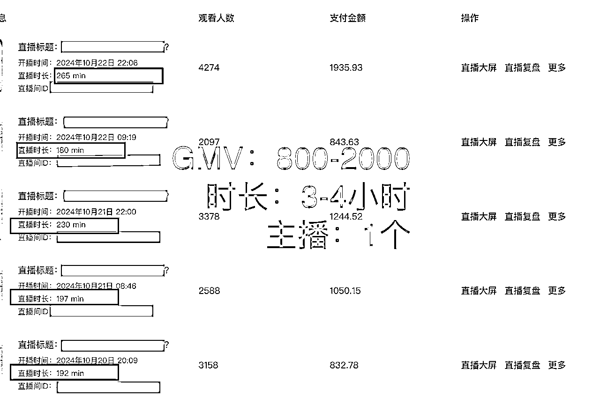

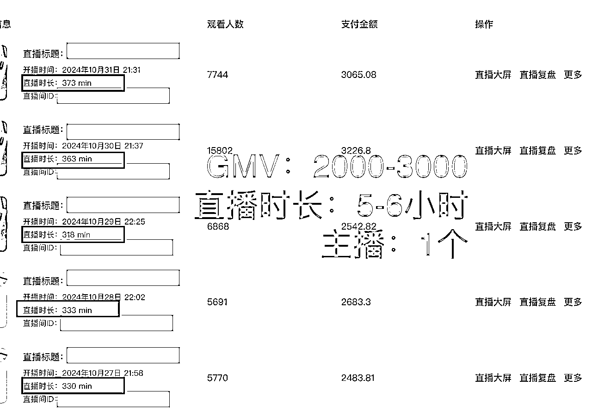

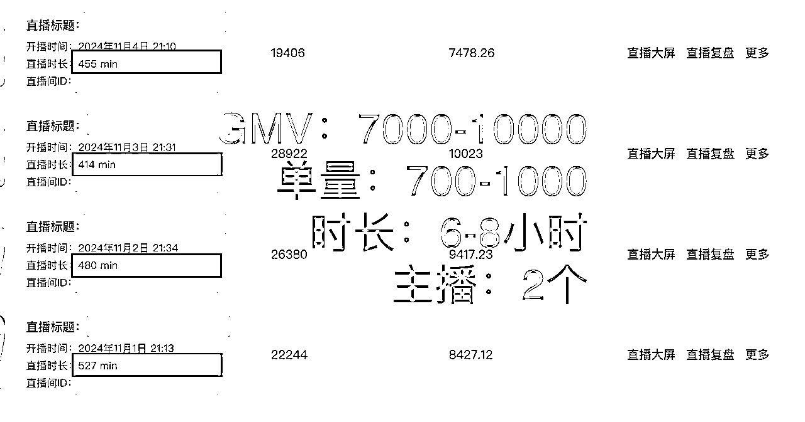

大家可以看上面的3张图（对比）

10月中旬，刚开播的策略：时长3-4小时，场均1000-2000GMV，单量100-300单

10月末，优化策略：时5-6小时（拉时长），场均2000-3000GMV，单量300-500单

结论：拉时长是有效果的，也是最简单粗暴拉GMV增长的方式，但一个主播会很容易精疲力尽，直播的精神状态会愈发不好，也会影响成交率

11月初：继续优化策略：6-8小时（拉时长），主播两位（多一个副播），场均7000-10000GMV，单量700-1000单，同时积极报名官方活动

*   结论1：主播的状态很重要，不需要像抖音设计太多的直播话术套路，更多的是平播，但只依赖一个主播，小红书的在线人数的天花板很低的情况 ，在线人数看起来会很少，很容易影响主播心态了，加上时长问题主播状态很容易懈怠，拉时长也要保证主播状态OK下再拉，要不然就是纯纯耗时间

*   结论2: 官方的活动一定要及时参与，为什么很多的个人店营收并不高，但直播的排行榜很高？有的是新号扶持，而有的就是参加官方活动，每个月官方后台都会有新的官方活动，积极参与，在直播推荐上会有一定的扶持力度

*   结论3: 数据断层式增长，不是直播上热门，而是笔记上热门，平播模式，在小红书，如果你是买手/明星，有一定的知名度，直播广场的流量池你是能分到一杯羹的，但如果没有人设/背书，我们普通人更多还是要靠笔记，可以往下看【笔直联动】的相关数据：

## 笔直联动有多重要！

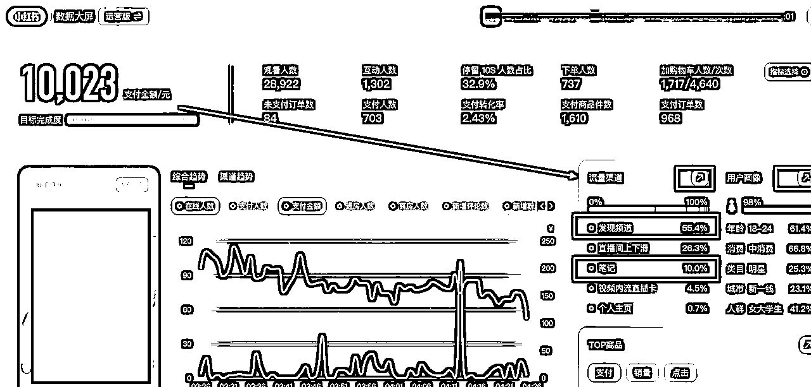

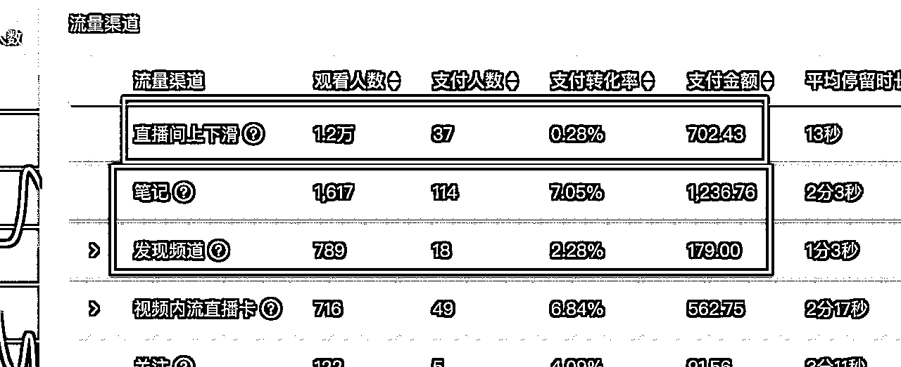

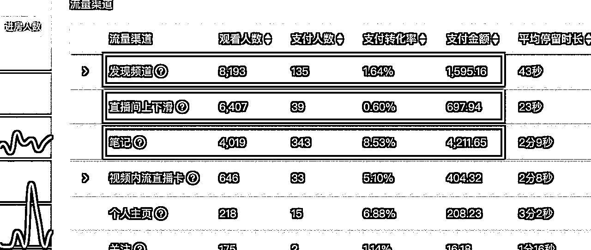

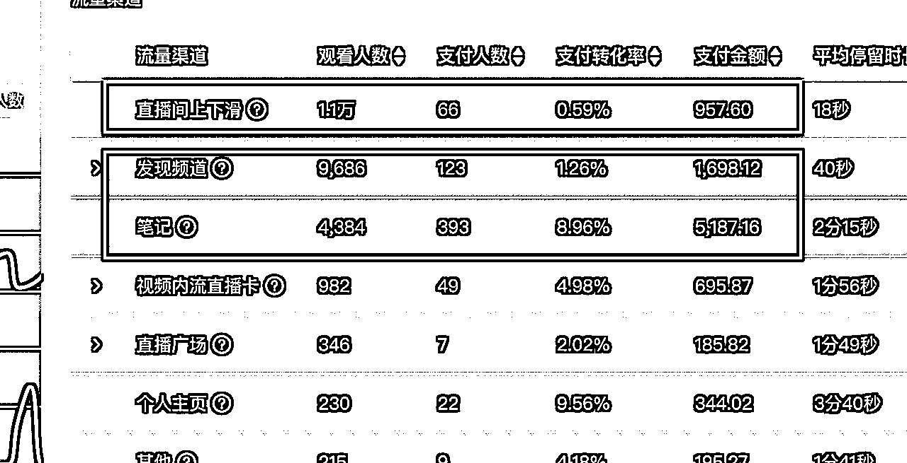

单场直播带货占比80%销量1000+单的个人店铺是如此，（发现频道+笔记，>直播上下滑）

### 直播带货功劳最大的流量来源，依然是笔记！笔记！ 笔记！

（这和抖音或者视频号的直播暴力起号不同，纯直播起号在小红书并不奏效）

单月直播带货占比90%卖了700万的的品牌店铺是如此

详情可以看这个视频⬇️

## 不断拉群，死戳私域流量

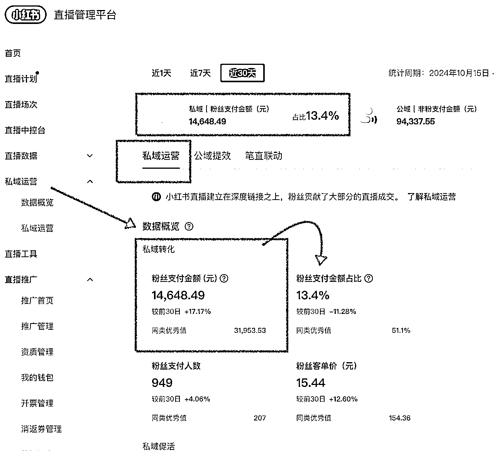

一定要拉群聊！一定要建群聊，不管低客单/高客单，在群聊里面多触达客户，

#### 拉群有什么好处？

1.群主开播后，群内有直播提示，有效增加直播在线人数。

2.作品更新后转发到群内可以快速获取到初始数据推动作品尽快进入下一个流量池。（尤其是直播的第一小时，在开播前在群聊里面做预热，促成第一波数据成交，给直播流量的人群画像做好基础，大数据算法也会提供更多更相似的人群，进一步拉高GMV层级，带动直播热度。）

3.有群内购功能（开通了店铺的账号），在不直播，没有笔记带货等情况下依然可以通过群内发布商品高效卖货。

#### 怎么拉群？可以用一些方法引导粉丝进群。

1.群内可以有日常答疑

2.设置抽奖环节，进群后刷屏一句话截屏抽奖。

3.不定期清仓产品，大甩卖，群内购价格更优惠引导直播间人进粉丝群

4.平时发布的笔记热门了可以重新编辑笔记挂上群聊链接，评论区置顶引导

通过这样的方式基本上一场直播可以快速拉满一个 500 人的群。

## 维护钟爱粉

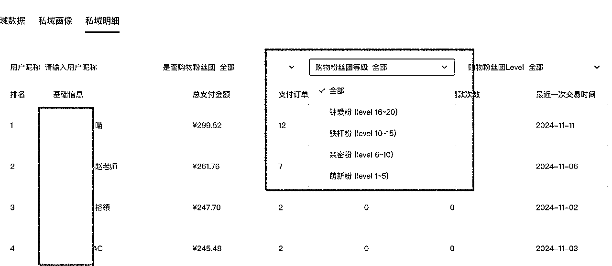

在私域里面，我们能够看到哪些客户充值度比较高（这个功能我敢说，99%的玩家都没有仔细好好研究，全网也没有人说过哈哈，反正真的在私域这块亏大发了），可以定期甚至点对点的维护起来，尤其是做高客单（护肤品等），比如要上线一些新款，可以跟粉丝聊他们对新品的体验程度。比如已经买过的一些品，可以做回访调研，这些用户，都是产品的精神股东，他们的喜好，可以更好的研发/排品/选品。

在跟大家透露一下，这个功能很炸裂的一个地方。看视频⬇️（我在抖音讲的，小红书偷私域，不需要解密手机号码也可以加，99%的人都不知道的功能，就是在直播数据后台的私域明细！）

## 其他

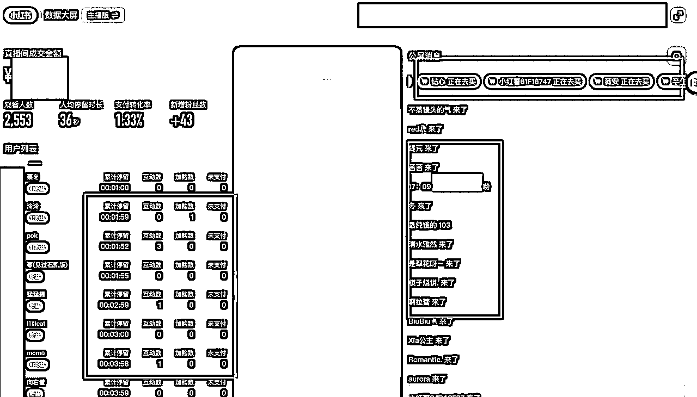

还有很多一些运营细节

比如，直播间人气少的时候，主播可以看（主播版）的数据大屏，做一系列互动优化，指标可以是“加入粉丝团”“加购未付款的点对点提醒”“问问题的及时答疑”“根据停留率换款/逼单”根据直播间数据时时做一系列动作优化

跟很多小白老板提醒的是，小红书即使是真人直播，也不需要露脸的。规则很友好，门槛很低！播就完了

关于小红书的直播带货还有很多，等我后续补充～～～

# 2.关于小红书卖货形式

## 以下内容是我7月份时写的数据随笔，粘贴过来了，放在这也很有用，大家可以看一看

## 关于，到底重心是发笔记/发挂车笔记/做直播？（99%的人的疑问）

## 跟大家分享近期的一些小红书（个体）电商看法～

1.水果3个月174万

2.品牌店播单月713万

3.家居服单日订单过千

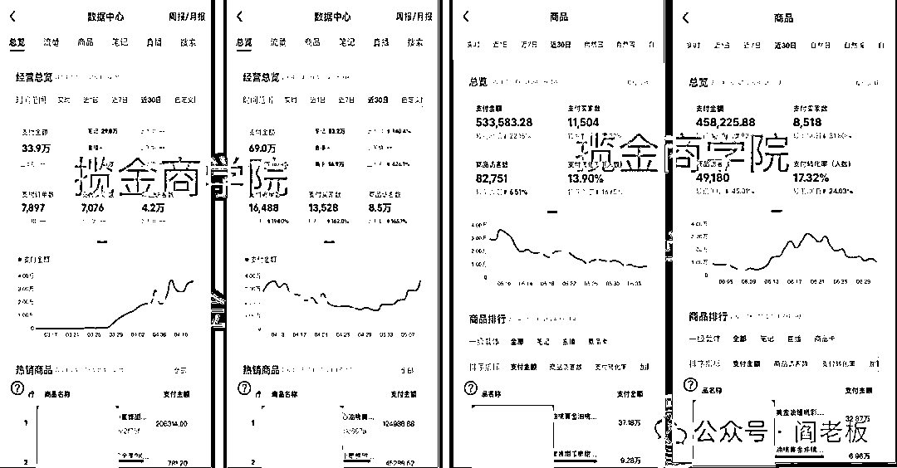

（图1）

（图1）水果老板的优势，自己本身是供应链，可以控价控品控量，比如做预售比如物流用顺丰比如售后处理比如不断上架新品。

3个月数据174万，74%靠笔记挂车，0直播，25%笔记撬动商品卡（官方扶持），纯自然流。

做法：每日发布1-2条挂车笔记，全部挂车。任何水果的笔记模版，都是围绕“多、大、满、真”字面意思，去体现水果的质。（大家自己在小红书随意搜索某种水果，看看封面，就明白了）

1个店起来后已经在矩阵第2家第3家了

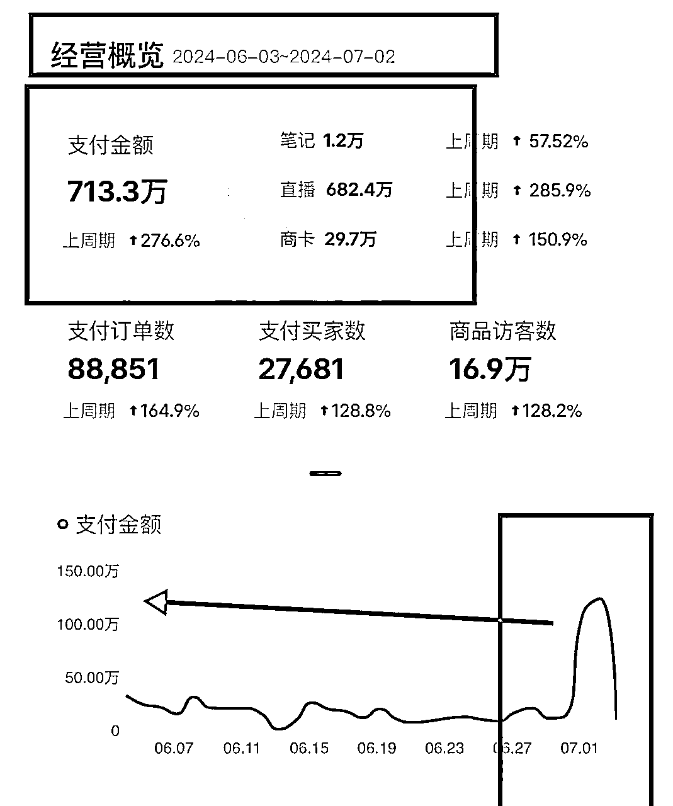

（图2）

2.（图2）品牌店播，优势在于品，品牌势能在，以及有主播团队接力拉时长直播，主播能力强，有多个主播多个店铺，接力做店播

这是其中一个店，713万，95%靠直播带货（50%笔直联动，笔记不挂车），纯自然流。单日GMV可达120万+，直播没啥技巧，就是牌子货平播，不需要破价，品牌方也完全可以尝试，因为现在很多的赛道还是空缺的，很少品牌入驻小红书直播板块，不像个人竞争的大。

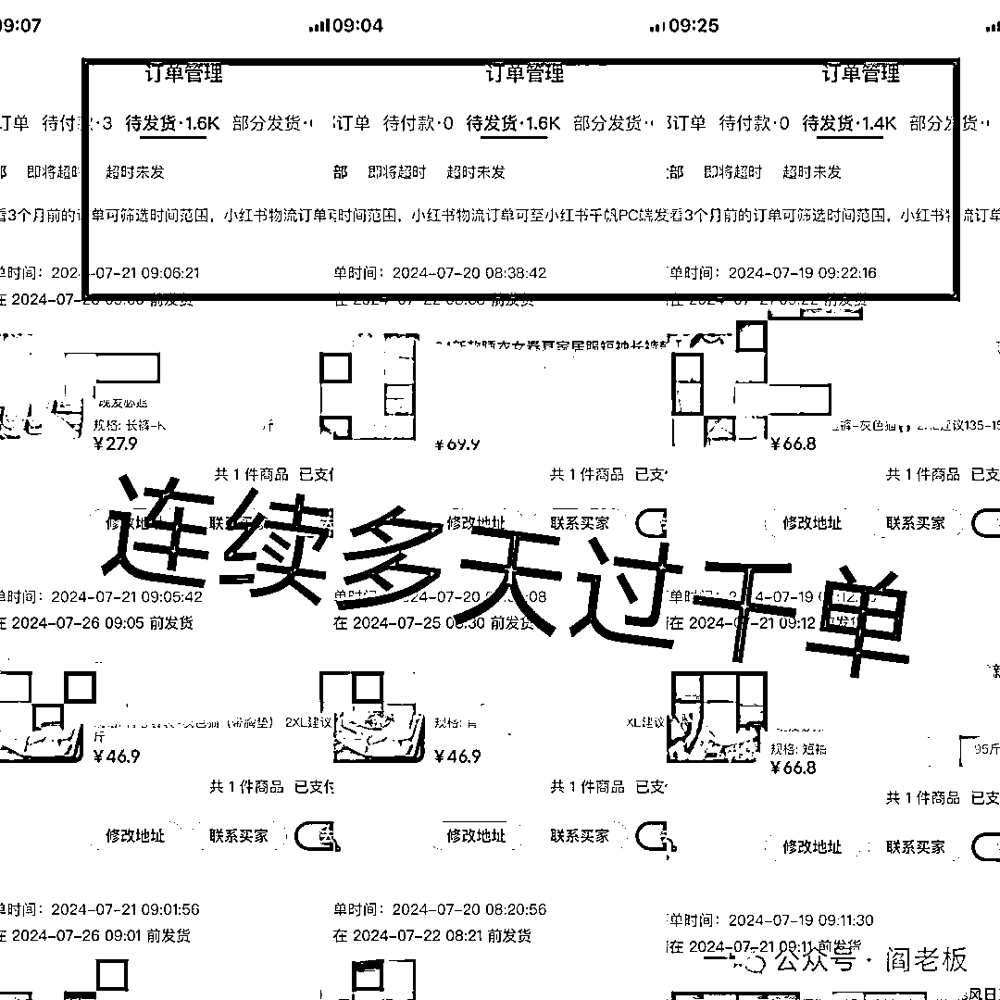

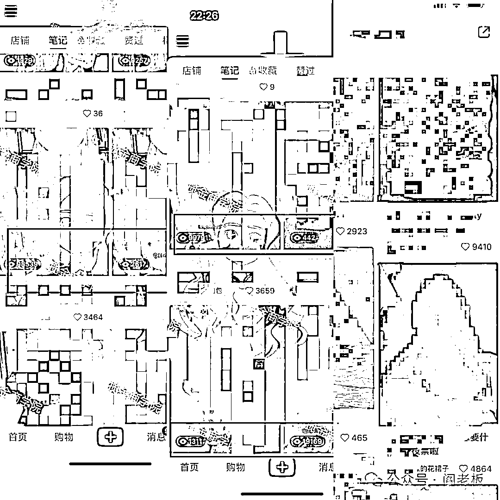

3.（图345）卖家居裤，单日连续多天出单1-3千单，80%靠的是笔记导流直播间卖货（笔直联动），笔记照样发，依然是电商笔记写法，但是不挂车。

不挂车的笔记一定是比挂车的笔记流量池更大的。这个没有啥优势，就是靠高度的执行力。

可以看到，直播时长超过了10小时，这个就单纯拉时长，可以说是一种妥妥的“笨”方法，只要你做，钱包一定有进账。

———————————————

以上3种案例很鲜明我们的变现形式，可以分为3种

1.纯笔记挂车，0直播（重笔记0直播多账号运营）

2.纯直播带货，0笔记（重直播同时非商业化笔记布局）

3.全部不挂车笔记导流直播间（笔直联动，笔记直播相互结合）

以上3种并不是绝对的，多测试，知道自己的账号重心该放在什么地方就可以。

这里也非常推荐大家尝试第3种，尤其是低客单价，打性价比的大众品，很适合，用户决策成本低

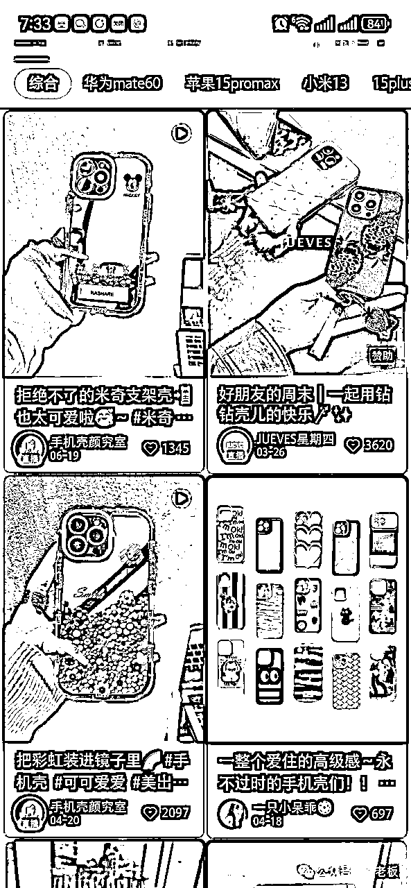

（图6）同样的品，同样的粉丝量级，同样的销售量级，你的同行不直播，你在直播（左下角头像正在闪烁就是直播呼吸灯，有呼吸灯会继续加持爆款笔记热度，继续登顶首页），你的意向客户一定会优先看到你，因为直播的推荐算法，会优先推荐在直播的号。比如这个手机壳，我用我一个经常刷电商的号去刷，会发现排在前面的都是在直播的（对于有电商属性标签的人群，直播间扶持很大）

大家做小红书直播，一定要耐的住寂寞，参考白天日常时段排行前3的几乎在线是1000人左右，这个数值跟抖音没法比的，抖音是10万+，小红书是1000+（品牌榜的在线明显会少一些，但这既是机遇也是挑战）

我们在做直播，参考主理人榜和店铺榜，看看自己卖的品的同行在线有多少，其实大差不差都是几十在线或几百。人数不多，所以要耐的住性子。拉时长的意义也在于，能让更多的人看见，只要能坚持，每天靠直播单量千单没问题

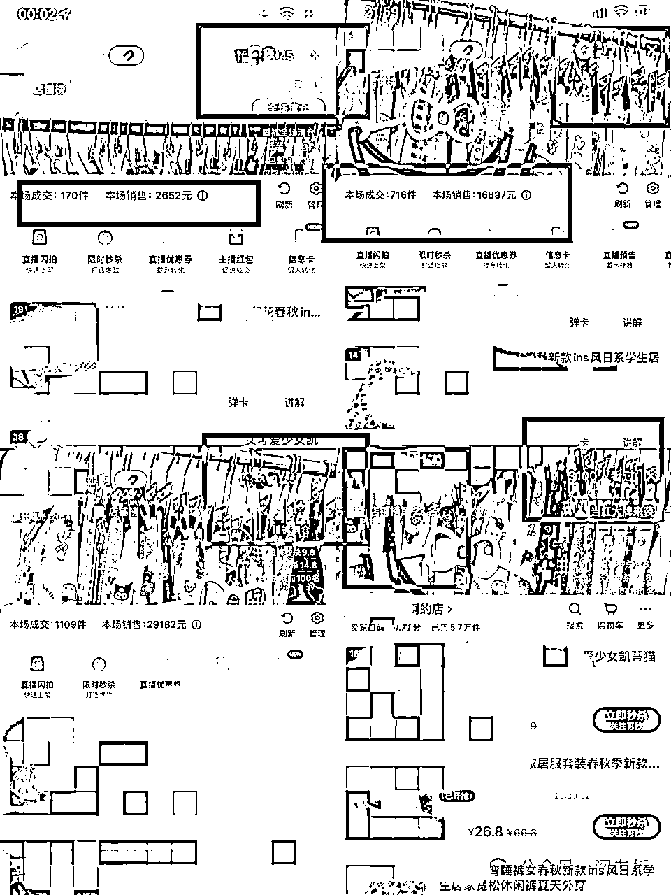

（图7）直播间10-50，也可以成就千单，哪怕咱就是直播小白，只要你讲话，就会有人买，小红书人群的消费力还是在的。只有几千人看过，也可以登陆小红书店铺前30排行榜，小红书排行榜并不是仅仅看销售额的，几乎刚开播的都会有扶持，官方希望让更多的人看到你

————————————————

最后，平时怎么看直播？直接去搜一个产品，比如女装/珠宝等，就直接一直往下翻就能翻到头像在闪烁（呼吸灯）在直播的直播间，进入直播间左上角会有排行榜，可以随意看排行榜 或者搜一个产品，在用户里面，也能看到有直播的

大家多多测试，

## 适合自己的变现形式才是最好的～