# 终于实现了，同时支持公众号文章、小绿书的一键生成+自动配图+自动排版+自动发布（附：最新RPA脚本）

> 来源：[https://b121w2zgwyx.feishu.cn/docx/ZRROd7bhBoYoYUxlUbOcAYMBnRh](https://b121w2zgwyx.feishu.cn/docx/ZRROd7bhBoYoYUxlUbOcAYMBnRh)

前段时间分别做了公众号的自动发布，小绿书的一键生成，还有小红书自动转换小绿书等一系列的工作流和脚本。

在大家使用和部署过程中还是发现了许多问题：

首先，工具使用不统一，感觉乱乱的。

其次，没有coze基础的，迁移照搬我的工作流，还是挺困难的。

最后，有ip隔离需求的，之前的方案都不太适用。

另外，大家希望文章可以自动排版

于是，我一拍脑袋，爆肝了一周，我把之前所有的工具全部给统一了。经过改进后，目前的方案可以实现：

1、根据主题自动生成文章

2、支持自定义提示词生成文章内容。

3、根据主题题自动生成小绿书（金句类型）

4、自动提取关键词生成配图

5、自动对文章进行排版

6、自动发布（同时支持图文类型和小绿书类型的发布）

7、同时兼容之前的爬取小红色内容转换为小绿书的脚本

来看一下我的操作演示吧

接下来，我们来详细介绍一下这套脚本的部署和使用

# 整体流程思路

1、在飞书的选题表格中，提前设置好你要发布的主题。

2、通过RPA脚本触发coze工作流，coze工作流会拉取选题进行批量的生成文章和配图。

3、通过rpa触发公众号的发布，rpa会拉取飞书中生成好的文章内容，进行排版和发布。

# 一、首先，飞书申请与权限配置。

请看 ，飞书这个配置要仔细看，没做好，工具无法使用

# 二、脚本工具环境配置

## 1、比特浏览器安装

https://www.bitbrowser.cn/ 没什么特别说明的，直接安装就是了

## 2、比特浏览器配置

### ①、打开比特浏览器，做个基础配置

点击系统配置=》找到文件下载目录配置 改成你想要的目录

这个目录是后面下载图片时要用到的。

### ②、导入rpa脚本

需要导入的脚本为3个

分别下载以上三个脚本到本地。

然后, 打开比特浏览器=》 点击 “RPA自动化” =》进入流程设计

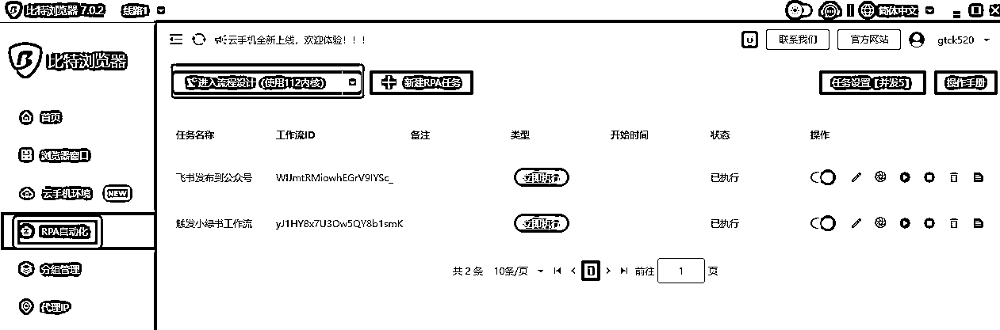

浏览器会初始化，并打开一个用于调试的RPA窗口，以及自带安装好的Automa 插件。

打开automa窗口，进入工作流页面=》点击下拉标志=》点击导入工作流，将前面下载的工作流导入

## 3、排版工具的准备

我们的脚本使用了一个叫做墨滴的markdown排版工具，AI生成的内容会自动生成markdown格式。我们通过这个工具进行转换排版，并发布公众号。

### ①、登录墨滴

https://www.mdnice.com/ 没有账号的去注册一个；

### ②、新建一个文章页面

标题随便输入就行了

### ③、设置一个自己喜欢的主题排版

在内容中，随便输入一些内容，如图：

接着我们选择一个我们喜欢的主题，后续文章就会使用这个主题排版

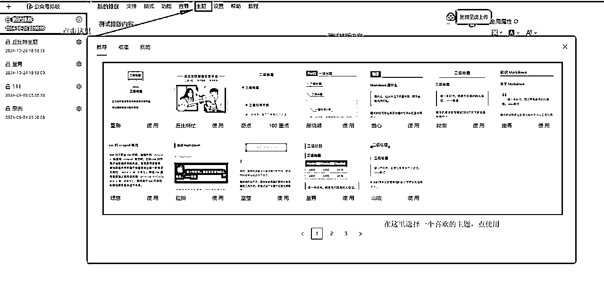

④、保存一下当前文章的链接地址

接下来我们保存一下，然后将这个文章地址复制下来，后续要配置到脚本当中，复制完就可以关闭了。

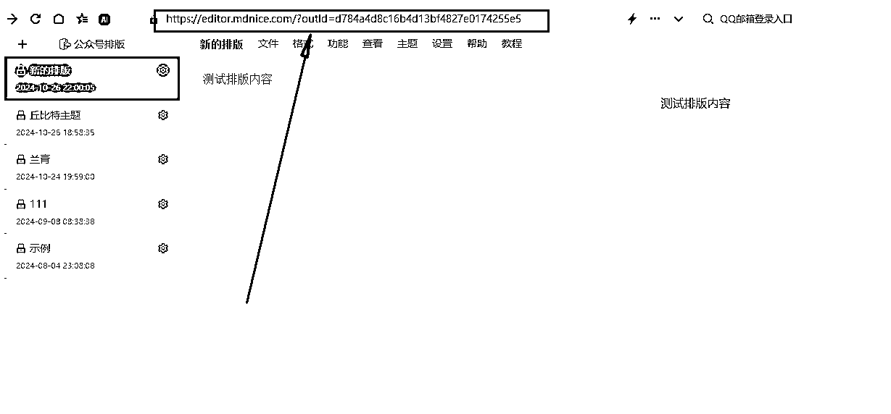

## 4、rpa配置

### ①、拷贝我最新的飞书模版

进入我的飞书表格

创建一下副本

然后获取飞书表格链接，注意了，每个表单点击一下，链接都不一样的，后面的配置会用到，一定要对应正确的表格链接

### ②、脚本默认配置

接下来，我们开始进行脚本的基本配置，每个脚本都要配置哦。我们首先打开比特浏览器=》 点击 “RPA自动化” =》进入流程设计。

然后进入工作流页面找到我们的刚刚导入的脚本，点击进入脚本编辑页面。找到触发器的后面一个节点叫做“插入数据”，我们双击“插入数据”，然后点击左边的 “insert data”按钮；

我们会看到这个配置页面，我们把这里里面的值，全部替换成我们自己的值就行了。切记变量名不要去修改，否则会出错

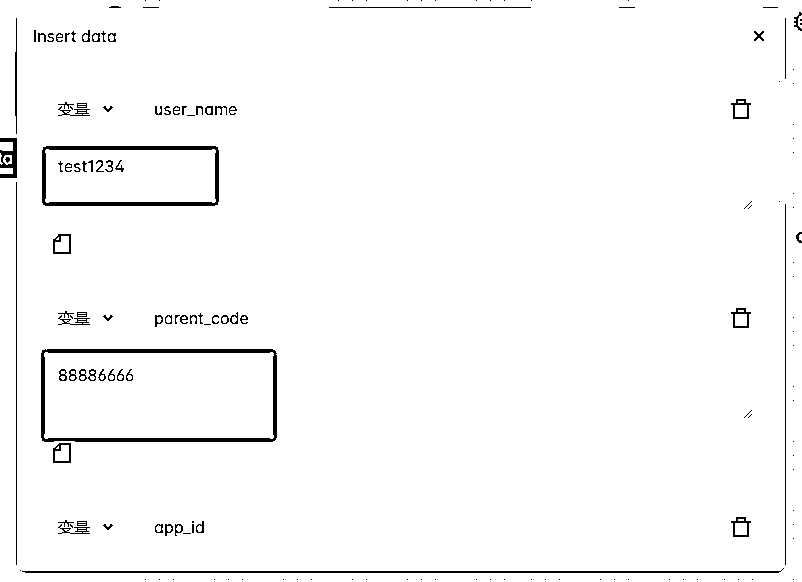

字段对应如下，配置的时候注意对应清楚，不是每个脚本都要这么多配置，找到对应填写就行了；

| app_id | 填你前面飞书得到的app_id; |
| app_secret | 填你前面飞书得到的app_secret ; |
| daifabu_sheet_url | 填你的飞书待发布表单的url（前面有说明过了） |
| yifabu_sheet_url | 填你的飞书已发布表单的url |
| zhanhao_sheet_url | 填你的飞书账号配置表单的url |
| sheet_url,xhs_sheet_url | 填你的飞书的小红书爬取表单的url |
| save_draft | 这个填1 代表发布到草稿箱，填0代表直接发布（待测试完善） |
| download_path | 这个填前面第2步，比特浏览器的下载目录就行了 |
| is_bite | 如果是其他浏览器或者在比特浏览器rpa调试时这里设置为0； 如果是正式绑定到窗口使用时，记得设置为1； |
| markdown_theme | 排版主题文章链接，这里填写第3步墨滴排版配置好的地址 |
| user_name | 账号用户名（请查看最后的账号领取） |
| parent_code | 上级邀请码（请查看最后的账号领取） |

每个脚本都有插入数据配置项，记得修改！！

### ③、调试脚本（请调试没问题之后再进行绑定到窗口）

每个脚本配置完成之后，请先点保存，再运行调试。调试没问题之后，再进行下一个脚本。

如何看有没有问题？

点击运行之后请点击这个日志

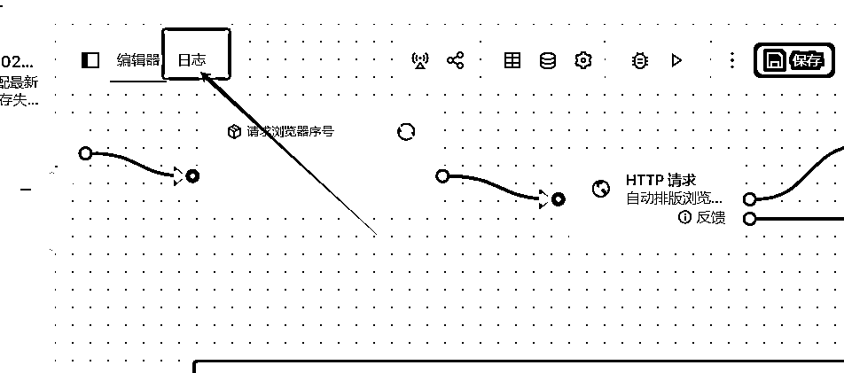

脚本运行失败一般都会出现如下报错：

请根据报错问题调整，实在不会调整，请点开详情，找到红色的报错的位置，把具体信息反馈到交流群，如：

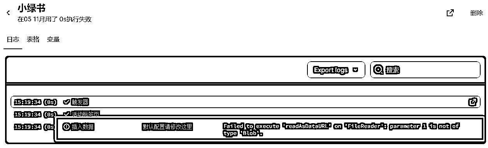

## 4、将rpa配置到比特浏览器，以实现定时执行，和ip隔离。

上面的配置完，其实直接运行就可以用了。不过为了实现多账号，以及定时执行，我们还需要将rpa脚本绑定到浏览器的窗口中。

### ①、点击浏览器窗口=》创建窗口

### ②、设置一下窗口名称，其他的用一键随机生成就行了

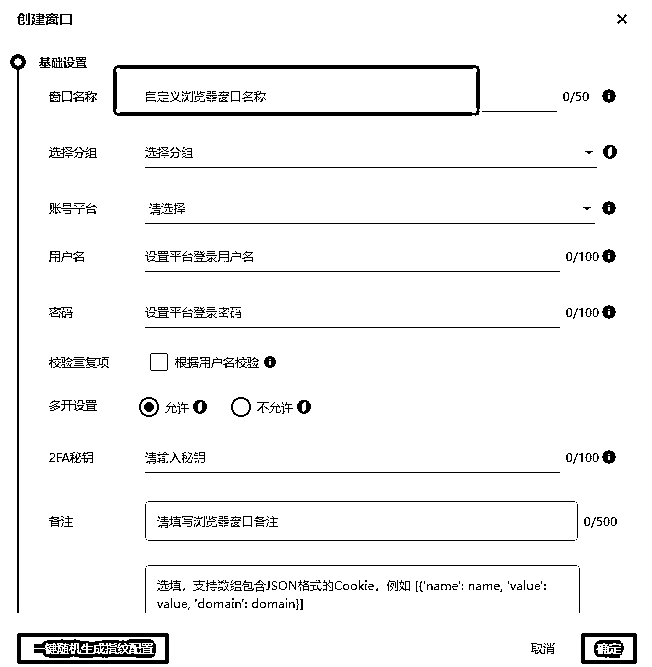

创建成功的话，这里会出现你命名的窗口

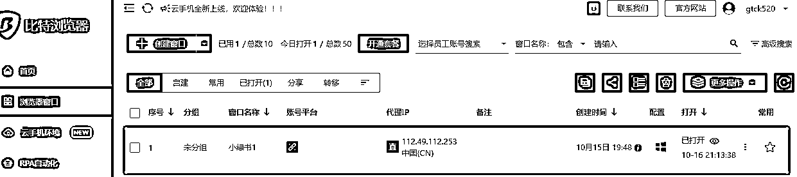

这里的窗口，你们就理解成一台小电脑吧，他只运行了一个浏览器。 但是每个窗口可以有不同的ip地址，这样你如果有不同的账号，就能模拟出不同电脑登录的效果了。

因此，你要做几个账号，就创建几个窗口，然后将不同的微信在不同的窗口里面登录就行了。

### ③、点击rpa自动化=》新建rpa任务

### ④、填写任务名称，工作流ID：见第⑦点，然后点击绑定：

### ⑤、在弹出的绑定窗口中，选择你要绑定的窗口

脚本就绑定好了，其他脚本一样的操作，不过要注意，采集小红书的脚本，运行前有个输入参数要填，如果绑定到窗口执行会不方便。建议暂时不要绑定。除非你知道怎么优化脚本。

### ⑥、两个脚本都绑定后，会出现如下页面

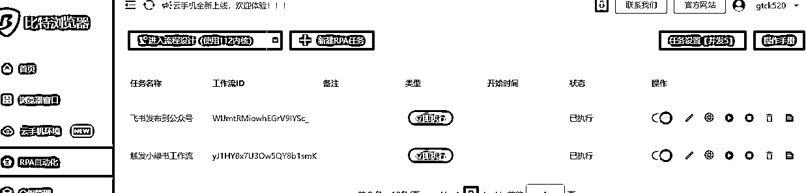

### ⑦、这里提一下重点注意项

以上绑定脚本时，有个工作流id是从这里复制的：

绑定到默认的窗口后，“从飞书发布到小绿书”和“飞书发布到公众号”这两个脚本里面，有个保存资源的控件，默认没有写入下载目录的权限，我们要去修改一下。

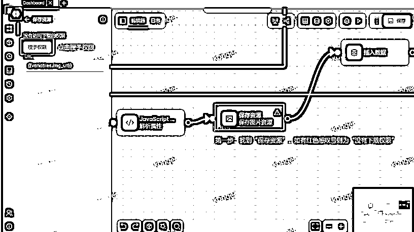

另外发布到公众号的脚本，有两个剪切板的节点，同样的需要授予一下权限

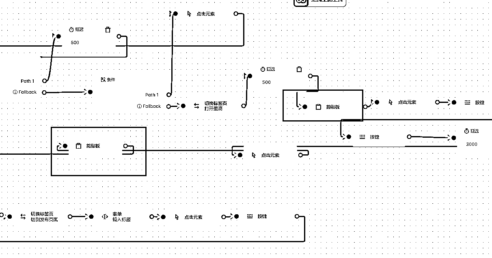

到这里脚本就准备好了。

# 三、工具使用说明

模版表格的标题，不要改动，否则会导致内容识别失败

## 1、每个表格的作用

我的飞书模板总共有用的表单为以下五个：

### ① 选题库

选题库是用来存放需要发布的主题的，大家主要需要配置的就是这里，需要生成什么内容就往这里加。（后期，还会增加，自动爬取热点到选题，真正实现，连选题都不需要自己录入）

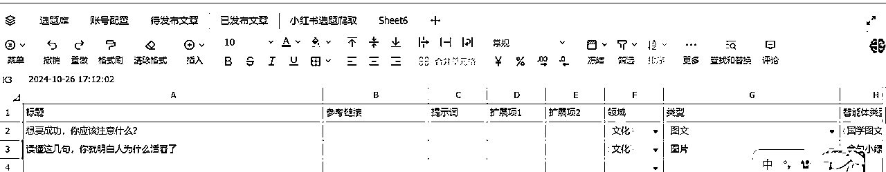

| 标题 | 就是你需要生成的标题 |
| 参考链接 | 添入需要仿写的文章链接（目前测试是支持公众号的文章链接的），如果直接填入文章内容而不是链接的话，将会进行风格仿写（如果用是用智能体来写，这里必须为空，因为填了内容，系统就认为需要仿写） |
| 领域 | 就是账号的运行领域，是必填的，只有当领域跟 账号的对应，内容才会发到该账号中 |
| 类型 | 文章的类型，图文：就是公众号的文章；图片：就是小绿书形式的内容； |
| 智能体类型 | 就是这个主题，你需要生成什么类型的内容，目前支持的类型 小绿书形式的：金句小绿书题材； |
| 是否可直接发布 | 待开发 |
| 是否需要生成 | 默认否，选是的话 每次都生成 |
| 最后一次生成时间 | 有生成时间，说明标题生成过，后续不会再生成。如果你需要再生成，可以把时间删除，也可以把上面的设置成“是” |
| 提示词 | 当智能体类型，选择为“自定义” 时必须要填，将会使用提示词里设置的提示词进行内容生成 |
| 扩展项1 | 当智能体类型，选择为“自定义” 时必须要填，用于控制配图的生成模型 可选项：通用、人像 |
| 扩展项2 | 当智能体类型，选择为“自定义” 时必须要填，用于控制配图的个数，填数字 |

### ② 账号配置

账号配置用来控制发布的账号配置

| 账号ID | 必填项，填数字，每个账号id需要不一样，用于过滤已发布文章 |
| 账号名称 | 必填项，公众号就是公众号名称，rpa脚本发布时，会根据账号名称跟窗口里的账号进行匹配，匹配成功才会发布 |
| app_id | 之前工作流发布需要配置，最新这个脚本不需要 |
| app_secret | 之前工作流发布需要配置，最新这个脚本不需要 |
| 领域 | 必填项，跟待发布领域对应的才发布 |
| 平台 | 目前只支持微信公众号，其他平台待开发 |
| 发布类型 | 必填项，文章的类型，图文：就是公众号的文章；图片：就是小绿书形式的内容；跟待发布属于相同的发布类型，才发布。如果你这个账号，文章跟小绿书都发，请复制一条账号配置，改个发布类型就行了。注意，ID号也不能重复了。 |
| 是否启用 | 之前工作流发布使用，最新这个脚本不需要 |

### ③ 其他

待发布文章，就是生成好的文章，用来发布的，基本不需要动，而且内容一看就知道了，不做特别说明了

已发布文章，就是已经发布过的文章，用来过滤，防止重复发布，基本也不需要动，

小红书选题爬取， 这个是上一篇：

用到的。

# 四、账号领取

目前，我的AI一键发布到公众号的工作流，需要用到邀请码

邀请码的领取见如下步骤：

1、进入coze团队空间，找到以下名称的智能体，点击账号领取

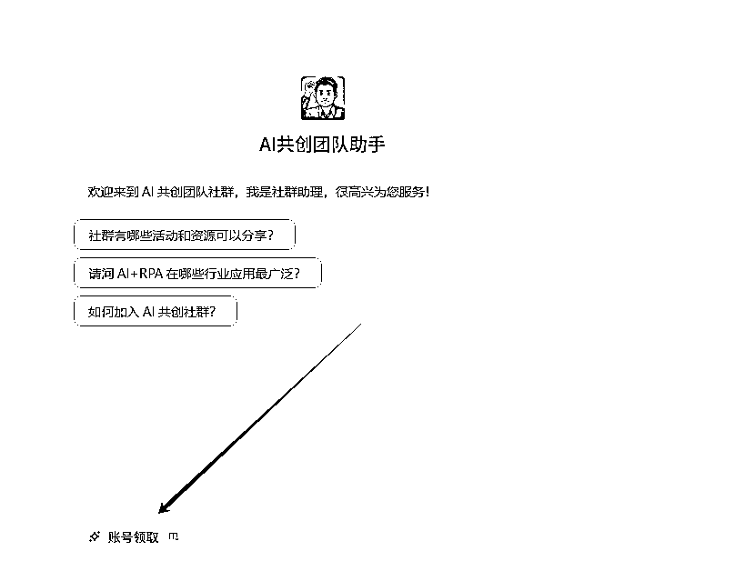

## 2、点击进入机器人，点右下角的账号领取，填入邀请码，和用户名，生成自己的邀请码！

注意了，用户名其实相当于用户凭证，后续一些插件搭建需要同时用上级邀请码和自己的用户名才能使用，大家要保管好。

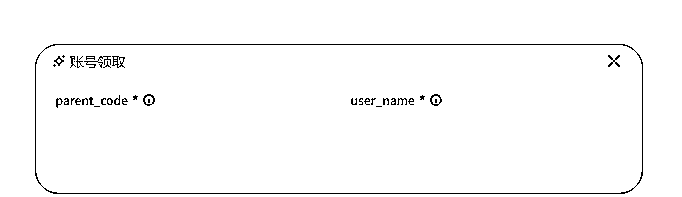

## 3、保存好自己的

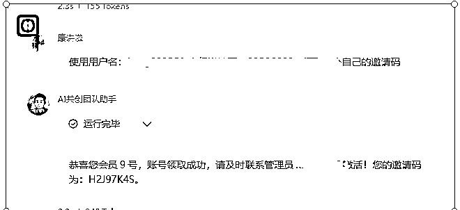

领取之后，记得发给我激活哦！（无上级邀请码的用88886666）

# 五、常见问题

## 1、采集小红书运行成功，但没有录入到飞书。

所有不能正常录入飞书的情况，99%是权限配置和表格没对应的问题，请先排查配置情况。我已经增加了一篇飞书的详细配置教程，自行参照操作：

## 2、小绿书或者公众号工作流触发脚本运行报错

“很抱歉，同步失败。请检查网络连接是否正常，或者稍后再试。” 或者 运行中止 之类的。 只要脚本不是一运行就失败。而是转圈圈，转了很久才失败的话，基本是因为coze工作流的超时导致的。 但是，超时了，实际上飞书可以正常生成文章内容，大家检查飞书待发布表格是否有内容。有内容就忽略报错就好了。

## 3、飞书发布小绿书脚本报错：Cannot read properties of undefined (reading '账号名称')

还有类似的Cannot read properties of undefined (reading '标题') 。是因为读取的表格里没有内容。请先检查内容是否为空！或者待发布文章表格链接是否配置正确

## 4、脚本运行无报错，但公众号没有执行发布

账号配置里面有 领域和 类型， 只有当待发布的文章，领域跟类型跟账号配置的能对应上，才会发布。并且账号配置里的 账号名称 要跟公众号的名称一致才行。脚本靠名称识别是否发布。

## 5、Mac电脑路径构造跟windows是不一样，请修改脚本里面 提取图片内容 代码块 的路径格式

找到 这个 JavaScript代码 块 把 里面的 \\ 改成 / 再试试。

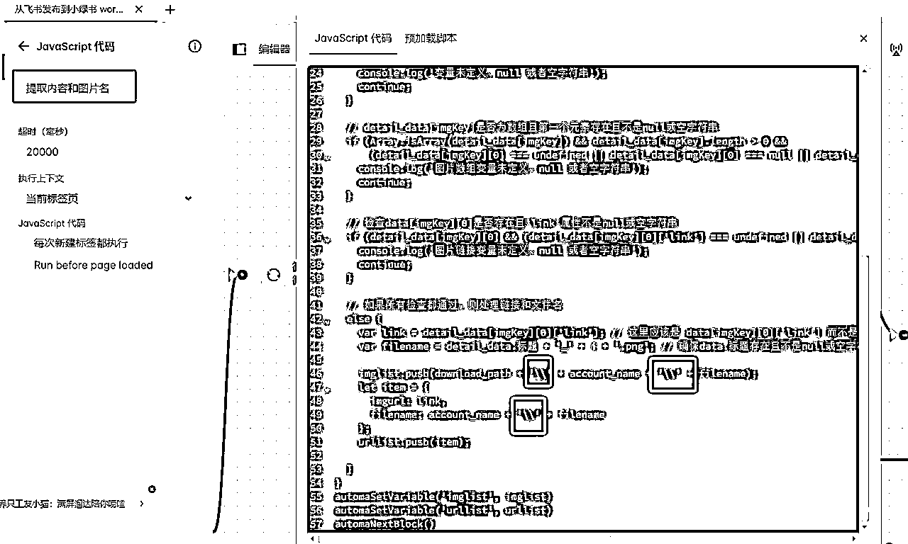

## 6、本人暂无服务号，未做服务号兼容。服务号的暂不能用。

## 7、比特浏览器，进入流程设计，不要用最高的内核，有时候脚本不会触发，内核112会比较稳定点。

## 8、问题反馈，请大家反馈问题的时候，交代清楚哪个脚本，然后把错误日志发出来，不要跟我说运行不了，没反应，这样我也解决不了问题。

# 七、待改进

1、配图不够稳定，虽然现在的配图可以根据文中的大意进行配图。但也因为是实时生成的提示词。出图不是特别稳定。

而且固定使用的coze的通用模型，经常出现2d的。

2、coze的图片录入草稿不稳定，有时会出现系统繁忙或者插入图片失败的情况，导致无封面图，或者无法保存成功的情况。