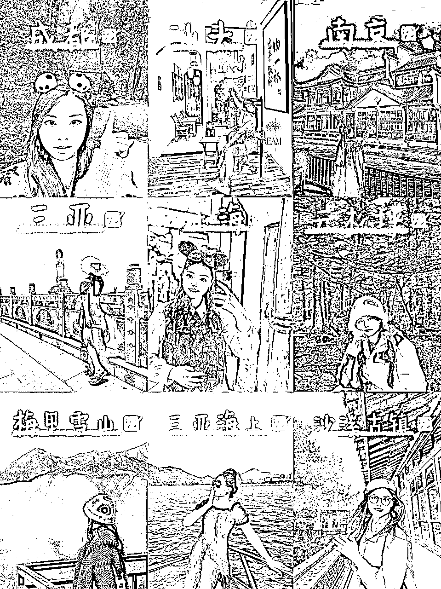
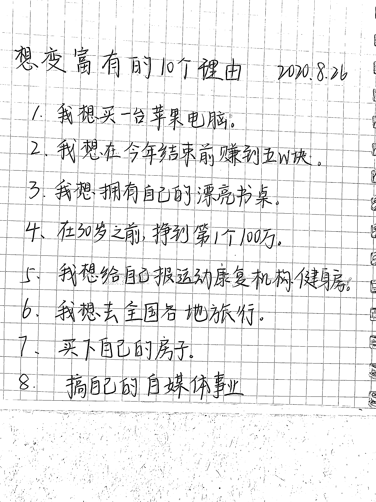
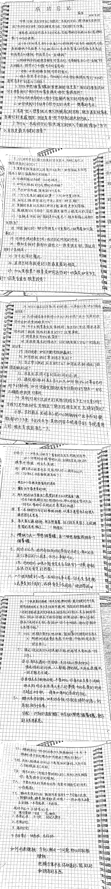
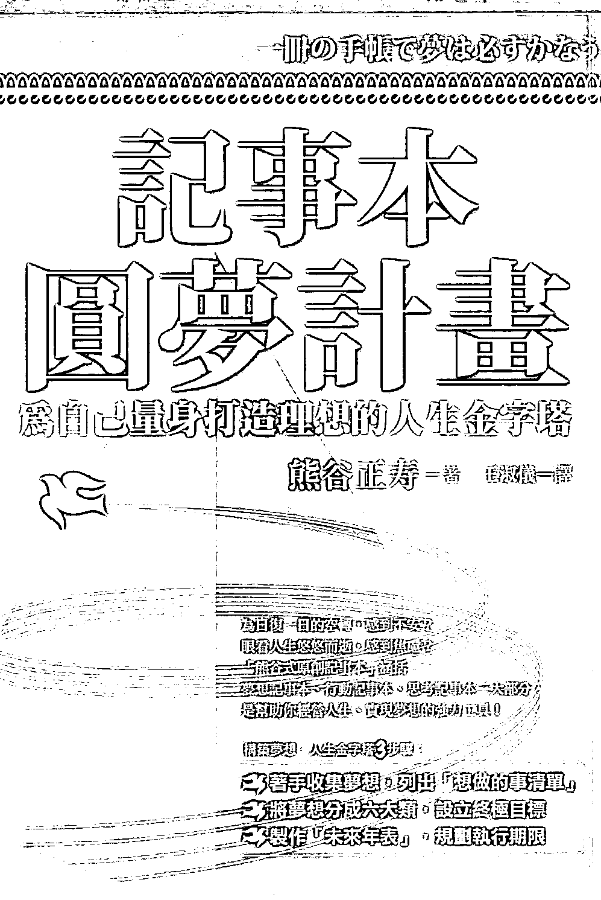
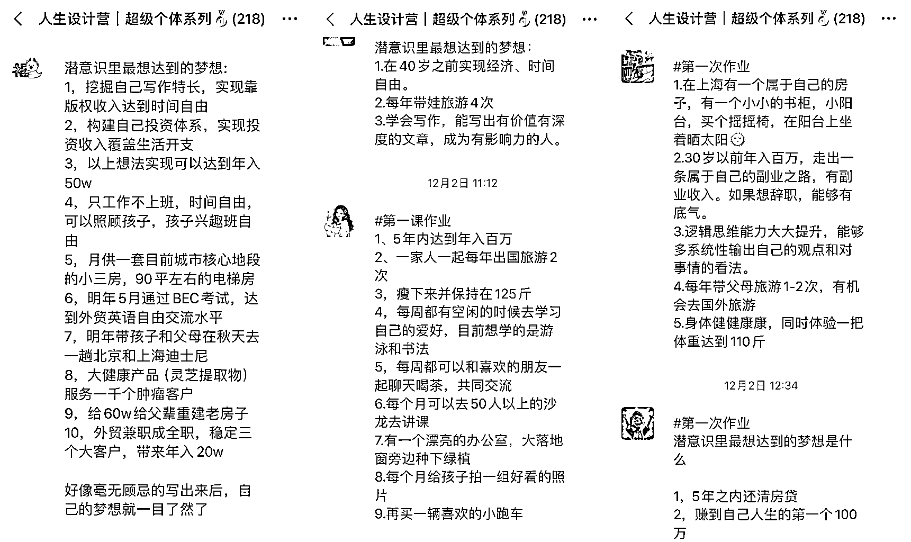
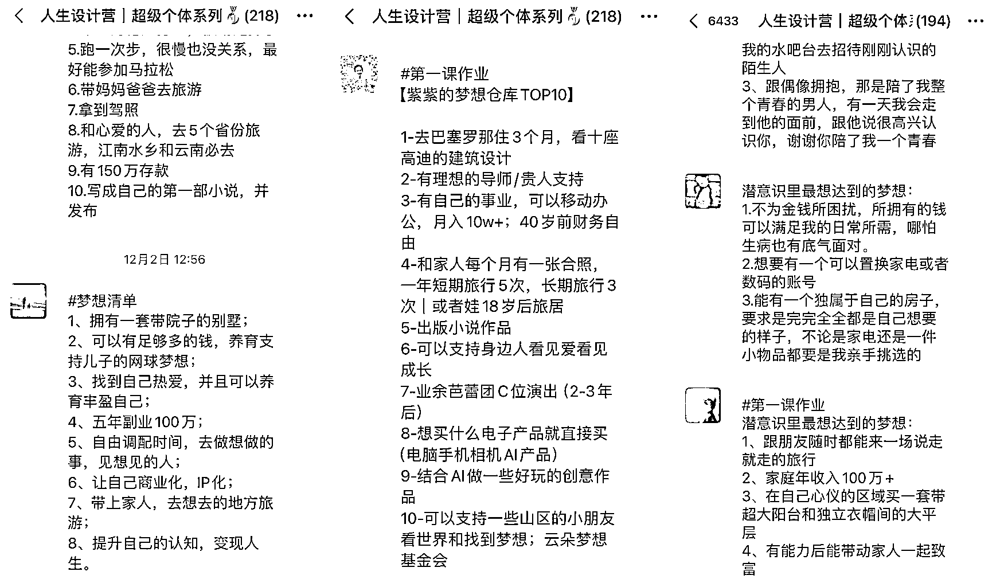
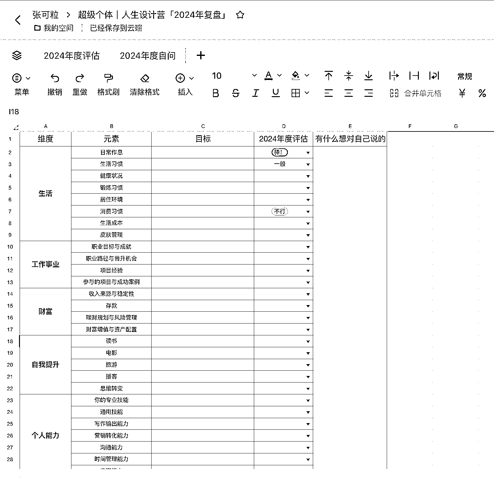
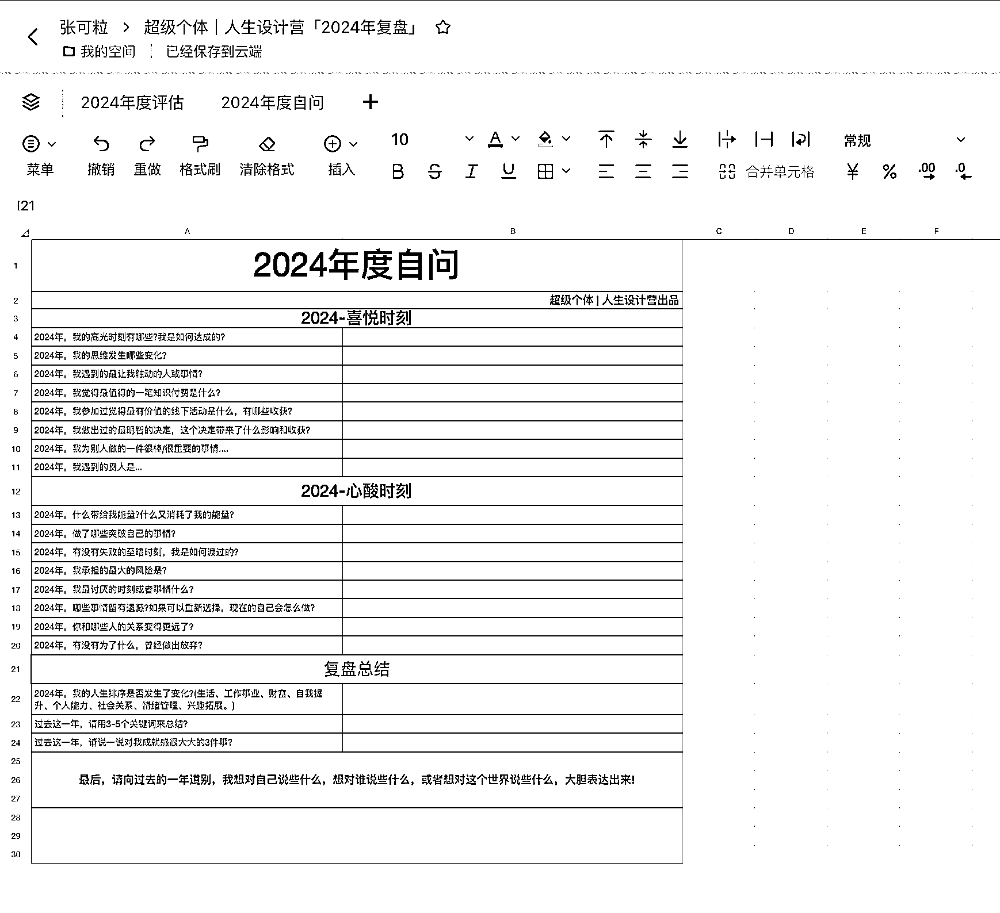
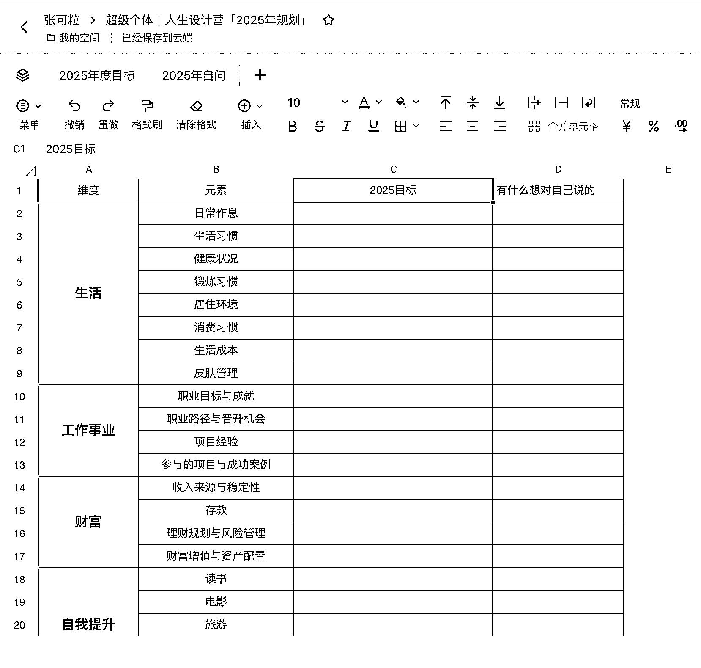
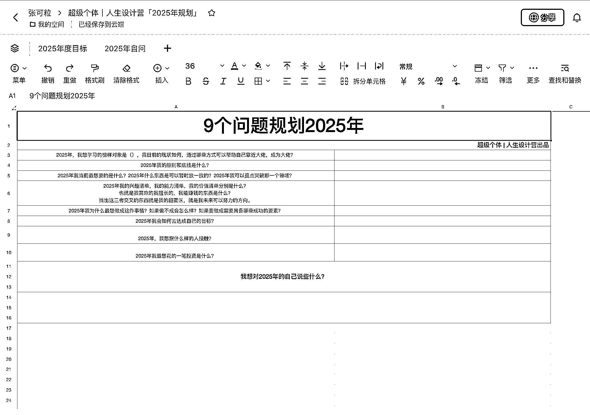

# 普通人如何用「人生设计」思维，彻底改写你的人生命运？（喂饭版）

> 原文：[`www.yuque.com/for_lazy/zhoubao/pwaedrzgstxgy8np`](https://www.yuque.com/for_lazy/zhoubao/pwaedrzgstxgy8np)

## (53 赞)普通人如何用「人生设计」思维，彻底改写你的人生命运？（喂饭版）

作者： 张可粒

日期：2024-12-24

嗨，生财的搞钱圈友们，你们好呀，见字如面，见我发财，我是专注自媒体 IP 孵化和新个体创业的张可粒。

来到这里和大家见面，其实我努力了 27 年，值得高兴的是，在 27 岁这一年——

我有了 200 万存款，今年 10 月份刚办完梦幻的海边草坪婚礼。

**27 岁之前的 4 年，我的经历充满了灰暗和痛苦，我一度以为自己的人生就要这么挫败和平庸下去了，那到底是什么契机、什么际遇让我的命运发生了翻天覆地的变化呢？**

我一直在尝试总结这套思维和方法论。

直到今年 12 月底，我真的想通了，我把过往可粒做过的事件一点点串联起来，做那些事情时的决策和心态，是它们串联成了我此时此刻的命运。

于是，我脑海里一直有一个强烈的声音，在鞭策我——

张可粒，你为什么不把你的故事和你的创业经历，你的得失成败分享出来，让更多年轻创业者看到，倘若你写的内容能启发、点醒小部分人，让别人因你的故事而受益、成长，那你又完成了人生路上非常重要的一个闭环，**用生命影响生命。**

于是我提笔写下了这近 6500 多字的内容分享，当然也有一个小小的不情之请，倘若看完这篇文章，你感觉有收获/启发的话，欢迎你评论区留言，跟我一起探讨。

大言不惭的说，我觉得，一定是会有很大很大很大收获的，所以我希望你能找个安静的地方，静静花上一点时间，去阅读。

感谢停留，祝愿诸君 2025 年顺利，所愿皆所得。

# 一、你的人生是工业品，还是艺术品？

毫不夸张地说，一开始，我对于「人生设计」思维也是半信半疑的，我觉得这不就是成功学鸡汤吗？

可是当我开始践行的时候，我的人生命运发生了巨大的改变，太不可思议了。

如果你也很好奇究竟是如何利用「人生设计思维」达成的，请你继续耐心往下看。

*先给大家看看我开局的颠牌：*

**出生：** 福建某个落后山村，父母也是山村里长大的，无法托举我什么

**小学：** 父亲为了谋求发展，来到县城开车，把妈妈和我都带出来了，我得以见到更繁华的世界

**初中：** 本来生性开朗，却被同学**霸凌** ，不敢告诉老师父母，从此变得自卑、内向

**高中：** 想要努力学习改变处境，结果高一**早恋** 了，高考发挥失常，只能读民办本科

**大学：** 以为可以开启新征程，结果学校把我和不同班的学生规划到一个宿舍，我一个人又被**孤立** 了，所以我干脆更加奋力跟随学院活动，去学习自媒体

那会真的以为自己的人生就这样了，平庸一辈子。唯一的期待就是谈了好几年恋爱，以为会顺理成章在毕业后结婚，结果**前任劈腿** 了。

**这或许就是我人生中首次觉醒，所谓爱情，依附男人，就是一个笑话。**

**2019 年大学毕业，我 22 岁：** 失恋，毕业之际找工作却充满迷茫，不知道何去何从。

且工作半年后，**身体就不舒服** 了，不想继续上班，耗费生命，于是我选择了**裸辞** 。

裸辞是一个非常大胆的决定，毕竟那会的我兜比脸干净。

**但是，张可粒从不认输，靠自己努力改写了“人生剧本”：**

**23 岁裸辞：** 裸辞第一年，做自媒体很快实现了月入过万

**24 岁-25 岁：** 裸辞第二年，做知乎好物，又实现了月入几万，真正成为自由职业者

**26 岁：** 裸辞第三年，做好物博主+知识付费+产品分销，到人生中第一个百万，全网 20 万粉丝，成为高客单价 IP 教练

**27 岁：****裸辞第四年，办了自己梦想中的海边草坪婚礼，拥有 7 位数的存款，持续边玩边赚。**

**已经走过 20 多个城市，上海、广州、大理、丽江、成都、重庆……**

#### 图：边玩边赚的可粒

我一直觉得自己能这么快实现人生命运的逆转，真的全靠「人生设计」思维。

然后前段时间看到粥左罗老师说到了“导演思维”，和“人生设计思维”有异曲同工之妙，没想到不知不觉中，我也一直践行着这个理念“导演思维——让坏事逆袭”。

作为一个导演，电影故事怎么往下发展，全是导演说了算。

每一次，一个坏事，上半部分已经发生了，你是无法改变的，但是下部分怎么讲，确实是你说了算，因为你是自己人生的导演，**那我们就可以行使我们做导演的权利，让坏事尽可能地都逆袭成好事。**

我给大家举个例子吧。

——谈了 6 年恋爱的男朋友背叛了我，我特别伤心欲绝，这是故事的上半部分，那下半部分呢，**如果我一直哭哭啼啼，不肯放手，那就任凭渣男糟践我了。**

——但是我用了导演思维，我不想自己堕落下去，我就对自己狠心，离开渣男，就算他后来求复合，我也没有答应，**而是离开后，也好好提升自己，多搞钱，而不是沉迷于恋爱，所以你们才能看到现在的可粒，有钱有爱有闲。**

这就是导演思维的魅力所在，你是自己人生故事的主宰，一件事情的发生你无法预判，但是后续的走向如何，是掌握在你手上，由你决定的。

这样，你还会觉得改变命运变得很难吗？

这是我活到 27 岁的故事，利用自媒体赚到了 200 多万，**未来的故事正在书写中，我很有信心，我会赚到一千万。**

想问大家一个问题，你有没有想过自己人生会以什么样结局呢？

说实话，我大学毕业之前真的没有想过。因为也没有人教过我，父母没教，大学没教，好像读书那几年只学会了应试考试。

我的两次觉醒分别是在 2019 年和 2020 年的时候。

**一次是恋爱失败，谈了 6 年的男友背叛我。**

**一次是工作的失败，拼命工作，身体生病，没钱没健康。**

我就重新在思考自己的命运应该怎么去践行，难道我未来就要这样子去生活吗？

按部就班的毕业找工作，结婚，打工一辈子，然后生娃，帮孩子建立他的人生体系，让孩子、孙子走上跟我们毫无区别的道路。

我的答案是——NO。

所以我跳出了职场，成为了一个自由职业者，我知道这是一件不容易的事情。

**但比起不容易，我更不甘心，我最好的年华就这么贫穷地度过。**

我大学读的是中文专业，我的父母都希望我成为一个语文老师，理由是工作稳定好找对象。

好像小的时候梦想是天马行空的，想成为一个小卖部老板或者说成为一个大明星，在舞台上闪闪发光。

成年后的梦想就难以找寻了。

我很庆幸，我还能重新坐下来思考自己的梦想到底是什么，** *什么时候让我最快乐？什么时候让我最有能量？***

** *什么东西能让我快乐，还能让我赚到钱？***

当然，我一开始也没有那么远大的梦想，只是想先谋生，不去上班也能养活自己。

**然后就开始了投稿写作，做知乎博主，做课程讲师，做自媒体教练，从月入 4k 到月入 10 万。**

当我真的带付费学员做出了成绩，我发现我特别快乐，原来用「热爱」赚钱是这么一回事，原来用「人生设计」去设计自己的命运，会有这么多奇妙的反应。

**四年前，我的人生是失恋、负债、生病、没有工作。**

**四年后，我的人生剧本是梦幻婚礼，存款七位数，全网 20 万粉丝，自由职业，边玩边赚。**

我开始相信，人定胜天，吸引力法则，命运是可以由自己主宰的。

传统的职业规划是，专注初心，找到最适合自己的选项，做出决定并且把事情做成。

而人生设计课的思维是，重新定义问题，找到尽可能多的选项，选择一个进行快速尝试，直到成功。

前者是做人生工程，后者是做人生设计。

你想选择哪一种人生呢？

# 二、3 种方式教会你制订自己的人生计划

你真的甘心一辈子碌碌无为么？

你真的甘心得过且过么？

我不甘心，所以 4 年前我就在自己的笔记本写下，想要变富有的 10 个理由。

还给自己写了不少指导核心理论。（长图预警）

四年后，因为这些核心方法论+可粒超绝执行力，我成为了百万富婆。

可粒当初在记事本写下的梦想，靠着**相信的力量** 和**努力的执行** 达成了，而第一次给我灵感的书籍就是《小狗钱钱》。

《小狗钱钱〉说了，想要赚钱，最重要的就是自信。

难道仅靠着自信就能达成梦想了吗？

其实也不仅仅如此，更要重要的有计划的执行。

然后我就在想，这一套理论可以被广泛应用吗？

答案是可以的。

可粒为此总结了实现人生计划的三种路径，分别是记事本圆梦计划、奥德赛计划、复盘和规划。

## **（1）记事本圆梦计划**

今年，有一位环游世界过的摄影师加入了可粒的超级个体孵化基地，她叫当小时，现在是播客主理人。

一开始，我只知道她是个摄影师、还环游过世界。

看到这里的你，一定和我之前的想法一样，**她肯定很有钱，所以才能去环游世界。**

结果线下见面的时候，她跟我说自己，最初月薪几千，而且语言不通，还是靠摄影边玩边赚的。

又跟我分享了“记事本圆梦计划”，这也是日本一个作家“熊谷正寿”写的书，他从二十一岁在记事本写下梦想和圆梦计划起，十五年后终于实现自创公司股票上市的第一个梦想，公司也是最具影响力的网络公司 GMO 集团。

他最初只是一个高中辍学的穷小子，后来通过记事本的力量，彻底扭转人生的困境！

非常奇妙的是，我靠着《小狗钱钱》实现了自己的梦想，小时靠着《记事本圆梦计划》实现了自己的梦想。

从某种程度上来说，我们殊途同归。于是我和小时一拍即合，决定推出《人生设计营》。

**我们都相信，人生是可以被设计的，梦想是可以实现的。**

毕竟可粒穿越暴风雨，站在这里，就是最好的答案。

在训练营里，我也亲眼见证了很多人的梦想，他们不同年纪、不同职业、不同性别，但我相信，从此刻开始就是成功的一半。

就像摩西奶奶说的：**人生永远没有太晚的开始，做自己喜欢的事，上帝会高兴地帮你打开成功之门，哪怕你已经 80 岁。_**

但我更希望看到文章的你，大器晚成也好，年少有为不自卑也挺好。

## （2）人生设计课，又教会了我奥德赛计划

设计人生时，最有效的办法就是设计多种人生选择，你可以针对未来 5 年设计三种完全不同的人生计划，作者把这种方法称之为“奥德赛计划”，这个灵感来源于斯坦福大学备受欢迎的《人生设计课》。

其实我一开始很好奇，为啥取这么拗口的名称，不就是五年计划么，后来查了下《奥德赛》是自幼失明的古希腊诗人荷马创作的，一部激荡人心、富于想象和浪漫色彩的海上历险史诗。我们的人生又何尝不是一场充满未知的探险呢？

那接下来我们一起来设计拥有三个版本的人生计划。

**第一种人生选项，你已经在做的事。** 把你的第一个计划放在你已有的想法上，它也许就是你当前生活的延展，也有可能是你一个头脑中已酝酿很久的好主意。

**第二种人生选项，如果你突然无法从事正在做的工作（第一种选择），那么第二种选择就是你接下来想要做的事情。**

**第三种人生选项，在不考虑金钱和形象的前提下，你想做的事情或者你想过的生活。**

如果你知道你会有不错的收入，而且这份工作也不会被人嘲笑，那你想做什么？

这个真的完全打开我的思路，我以前规划未来，都是一条路走到底，且害怕做不成。

就像有一句话说的：

你害怕花的凋零，所以你宁愿不种花。

你害怕自己做不成，于是你拒绝一切的开始。

逃避可耻也无用，当我抛弃脑子那些乱七八糟的念头，当我不想要按部就班的生活，我学人生设计，其实就是为了做出更加有趣、没有痛苦的决策。

不要害怕哪个人生选择会失败，其实你有能力获得更好的独特人生。

不管你的答案是什么，你都应该了解人生设计，毕竟，你的人生自己不设计，又有谁能设计呢？

## （3）年度复盘和年度规划

我在人生设计营里，给大家设计了 2024 年度复盘模版和 2025 年规划。

关于 2024 年复盘，从 8 个纬度：涵盖生活、工作事业、财富、自我提升、个人能力、社会关系、情绪管理、兴趣拓展：

还有 2024 年自问。

回答几个问题，回顾你 2024 年的喜悦时刻——

1.  2024 年，我的高光时刻有哪些？我是如何达成的？

2.  2024 年，我的思维发生哪些变化？

3.  2024 年，我遇到的最让我触动的人或事情？

4.  2024 年，我觉得最值得的一笔知识付费是什么？

5.  2024 年，我参加过觉得最有价值的线下活动是什么，有哪些收获？

6.  2024 年，我做出过的最明智的决定，这个决定带来了什么影响和收获？

7.  2024 年，我为别人做的一件很棒/很重要的事情……

8.  2024 年，我遇到的贵人是……

回答几个问题，回顾你 2024 年的心酸时刻——

1.  2024 年，什么带给我能量？什么又消耗了我的能量？

2.  2024 年，做了哪些突破自己的事情？

3.  2024 年，有没有失败的至暗时刻，我是如何渡过的？

4.  2024 年，我承担的最大的风险是……

5.  2024 年，我最讨厌的时刻或者事情什么？

6.  2024 年，哪些事情留有遗憾？如果可以重新选择，现在的自己会怎么做？

7.  2024 年，你和哪些人的关系变得更远了？

8.  2024 年， 有没有为了什么，曾经做出放弃？

#关于 2024 年总结

-2024 年，我的人生排序是否发生了变化？生活、工作事业、财富、自我提升、个人能力、社会关系、情绪管理、兴趣拓展。

-过去这一年，请用 3-5 个关键词来总结？

-过去这一年，请说一说对我成就感很大大的 3 件事？

-最后，请向过去的一年道别，我想对自己说些什么，想对谁说些什么，或者想对这个世界说些什么，大胆表达出来！

表格版是这样的：

我看到了很多同学写的复盘，都特别好，梳理过去一年的自己，也清晰了自己后续要发力的方向。

也给生财圈友一个复盘的模版：

[超级个体｜人生设计营「2024 年复盘」](https://b0attp331p.feishu.cn/sheets/YMjssTvJAhESudtbLUNcOmQSnxm?from=from_copylink)

ps：大家可以自行创建副本，就能自己编辑内容啦。

那么接下来，我们继续进入到 2025 年的规划。

然后制定 2025 目标的话，跟咱们 2024 年年度复盘的元素是接近的，因为人的一生不就这几件事吗？

关于事业、关于健康、关于家庭、关于社交等等。

**9 个问题，帮你规划 2025 年。**

1.  2025 年，我想学习的榜样对象是（），我目前的现状如何，通过哪些方式可以帮助自己靠近大佬，成为大佬？

2.  2025 年我的原则和底线是什么？

3.  2025 年我当前最想要的是什么？2025 年什么东西是可以暂时放一放的？2025 年我可以重点突破哪一个领域？

4.  2025 年我的兴趣清单，我的能力清单，我的价值清单分别是什么？也就是我喜欢的我擅长的，我能赚钱的东西是什么？以及找出这三者交叉的东西就是我的甜蜜区，就是我未来可以努力的方向。

5.  2025 年我为什么最想做成这件事情？如果做不成会怎么样？如果要做成需要具备哪些成功的要素？

6.  2025 年我会如何去达成自己的目标？

7.  2025 年，我想跟什么样的人接触？

8.  2025 年我最想花的一笔投资是什么？

9.  我想对 2025 年的自己说些什么？

[超级个体｜人生设计营「2025 年规划」](https://b0attp331p.feishu.cn/sheets/NhdLs8Zvjh96Dkt5qmucWYiZnxh?from=from_copylink) 

同样把 2025 年的规划模版送给生财圈友，操作方式同上。

很多人迷茫、焦虑，不知道从何下手，其实都是因为他们不曾想过「和自己对话」，不肯坐下来安静地花一两天时间去梳理自己的人生和未来，你以为这个时间成本很高，其实你焦虑，在犹豫中来回摆动的心力交瘁，更令人痛苦。

梳理自己，了解自己，重新定义问题，探索新方向，去尝试，就能帮助你找到更多的新选项。

# 三、相信你可以拥有不止一种人生

我很喜欢古典老师给《人生设计课》写序，说的一段话：

“你究竟最适合什么样的生活？

**其实，“最适合”本身就是一个坑，因为“最”是极限词，而“适合”是动词。**

随着你不断成长，做成了一件又一件事，能力和资源不断提升，“最适合”的答案也一天天在不断变化，永远定不下来。

再说了，即使你做成了某件事，你就能确定这件事最适合自己吗？

真正好的人生状态是：**我发现了很多适合自己的选择，而且决定从某个选择开始先试试看。** ”

所以，可粒不再执着于一个方向搞钱，甚至不执着于眼前的收入和眼前的事情，我不是要获得 10 倍增长吗？我不是要赚一千万吗？

我就按一千万的格局去谋划我未来 5 年要做的事情，有 3 个人生方向。

**a、5 年成为 100 万粉丝的家居博主。**

**b、开一家教育公司，做知识服务。**

**c、开一家 mcn 公司，孵化达人。**

这是我第一次这么郑重地写下三个人生方向。

我觉得第二个是我比较擅长的板块，知识付费我一直在做，如果开教育公司，做知识服务，帮助更多人成就自己的个人事业，打造品牌影响力，是可行的路径。

第一个也在尝试了，我原来是知乎的 10 万粉家居博主，我可以迁移一些能力，当然家居博主，最重要的还是要有一个好看的家，硬件条件，2025 年重新找房子，重新改造。

第三个选择会随着时间的累积，而慢慢实现，其实我的三个方向有时候也可以结合起来做的，但是我个人力量有限，从超级个体到超级团队，还有很长一段路要走。

**不管怎么样，我会先去做，带着更强大的野心去搞，不断提升能力，不断向上攀登。**

我太确信自己可以赚到一千万了，这不是一种盲目的自信，而是通过**「人生设计思维」** 和**「吸引力法则」** 去实现的。

就像《小狗钱钱》说的，因为你干的活，最多只值报酬的一半，另一半报酬源于你的想法和实施这个想法的勇气。

我一直在想我这几年如何披荆斩棘，一路不断升级自己的赚钱模式，变现了几百万。

真的不是因为我有多牛逼，而是我的野心和欲望倒逼能力一起上升了。

我不聪明，学历不高，我也没有父母扶持，长辈引路，我所有的一切，都是我赤手空拳打下来的江山。

这一路走来，我一直告诉自己：

**  **

**能力不足就学，学到了就去做，做到了赚到钱了，就拿钱再继续去投资，继续去赚钱，继续看更大的世界，继续钱生钱。**

所以成功看条件，但更重要的是「信念」。

我觉得人最大的筹码，不一定来于外界条件，不看你出身的家庭，你的学历，你的外貌长相，或者说你现在有多少钱。

当然有很好，如果没有，这也不重要，它不妨碍你追求自己的梦想人生。

这是所有强者必须清楚的东西。

说白了，成功就是看你的决心，看你的信念，看你一往无前，不达目的不罢休的魄力。

你什么时候下定决心要成功了，必须要成功了，一定要成功了，你就开始成功了。

这就是普通人成为强者的最大筹码，就这么简单，也不简单。

**感谢观看，我是张可粒，一人公司创业者，专注自媒体 IP 孵化和新个体创业，连续年入 7 位数，可粒等候你的链接。**

* * *

评论区：

郑自律 : 太棒啦，谢谢粒子的分享

戴智慧 : 可粒姐牛逼，分享太赞啦

刘海 : 可粒姐牛逼，分享太赞啦

Mr Leo : 鸡汤多了点，具体操作的 sop 有没有呢。

张可粒 : 不太会写，你教一下

天气 : 2025 年，希望向你看齐，你的当下的状态就是我理想中的状态

谦之 : 仔细思考了一下，我自己确实现在也在记日记，记录做好了什么没做好什么，方法有些类似，只是和小狗钱钱的方法比，我的不够完整，以后抽空会去看看这本书，可以细化一下自己的日记。

好奇先生 : 值得学习。