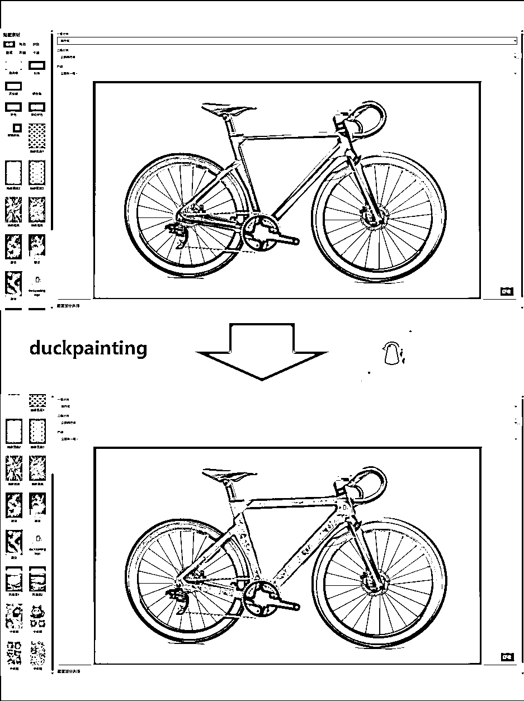
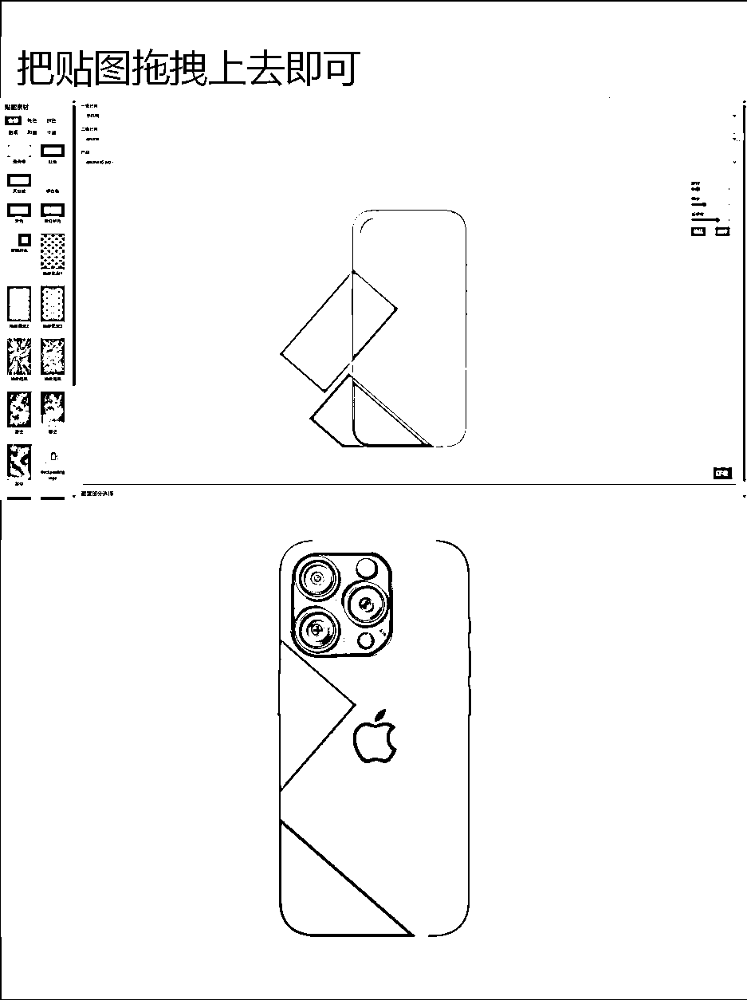
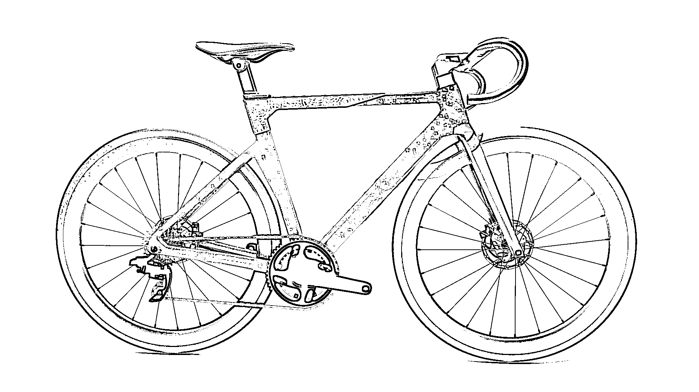
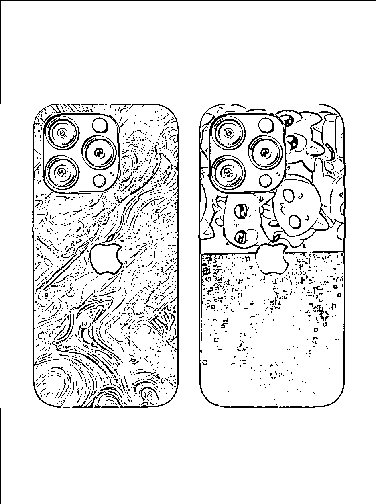

# 从 0 到 1：我完成并上线部署了一个网站

> 原文：[`www.yuque.com/for_lazy/zhoubao/alcxlh5wbaxdml5x`](https://www.yuque.com/for_lazy/zhoubao/alcxlh5wbaxdml5x)

## (精华帖)(45 赞)从 0 到 1：我完成并上线部署了一个网站

作者： 阿威

日期：2024-12-24

两周前，我还是个纯小白，对什么 React、Next.js、PostgreSQL、FastAPI 一无所知，也不懂如何在服务器上部署一个全栈网站。而今天，我已经完成了人生第一个全栈项目并上线部署。虽然目前用户寥寥，但这次经历让我在开发构建之路上迈出了重要的一步。

整个开发过程对我而言可以说是一段探索之旅。从使用 v0 设计前端界面原型，到借助 Cursor 开发后端代码；从与 Claude
AI 不断探讨技术细节，到在本地成功运行项目；从购买域名、租用服务器，到使用 Docker 部署完整的网站架构。不过还是使用 Supabase 处理数据库或通过 Netlify 部署更为便捷，虽然自主部署带来的自由度和掌控感是无可替代的，我是想着后面可能做一些更复杂的东西，就抱着晚学不如早学的态度去研究了一下。部署上花的时间最多，但是确确实实收获了很多。

也是看了小排老师@刘小排
的文章，就把最核心的功能先做了，什么用户认证，什么图片 CDN，统统先不做，先把整个项目跑起来。开发过程中虽然遇到了不少挑战，但在 AI 的帮助下，这些问题都变得不再困难。感觉非必要尽量还是不要选择自己去直接面对服务器，过程有问题的话很痛苦，像来来老师分享的那样，通过 netlify 去部署，会方便得多。

贴一下我的作品的访问地址：[`duckpainting.com`](https://duckpainting.com/)，目前只有电脑访问才正常，还没做自适应适配，就放了一个自行车一个手机壳定制上去，用法很简单，图片拖上去，调整位置，点击确定就行。

全文链接，我将我做这个网站并上线部署的整个流程大概梳理了一下：[`wqm8iq5gs4a.feishu.cn/docx/K8qldQkFMoXZ2VxlwbuceE5Mnhh?from=from_copylink`](https://wqm8iq5gs4a.feishu.cn/docx/K8qldQkFMoXZ2VxlwbuceE5Mnhh?from=from_copylink)

在这里感谢一下这次航海，小红书航海活动的木木教练@李子木 、十月领队老师@十月 、志愿者星星@星星子
以及群里分享经验的各位大佬。这次航海虽然没能完全践行所有任务，但我坚持分享了一些关于使用 Cursor 开发的图文内容，因为自己也一直在用，正好做点内容发小红书，涨了几十个粉丝，也渐渐找到了了一点内容创作的感觉。现在每次创作前，都会自然而然地去找对标去模仿了，也不会考虑那么多了，发了再说，管它有没有人看。第一次航海，也算是完成了开始的目标，就是走完这期航海。

当时没报 cursor 的航海，想着后面看下手册应该就差不多，也许去参加下能少走很多弯路的。

网站的一些截图：

* * *

评论区：

振 : 飞书打不开

阿威 : 哦哦忘记设置了[衰]谢谢提醒

亦仁 : 贴一下我的作品的访问地址：
，这个地方的域名后多加了一个空格[`duckpainting.com/`](https://duckpainting.com/)

阿威 : 我马上修改一下，都忘了检查[偷笑]粗心大意了，谢谢老大

星星✨ : 👍🏻👍🏻不是是我们的威，真厉害

阿威 : 嘿嘿[呲牙]还需努力