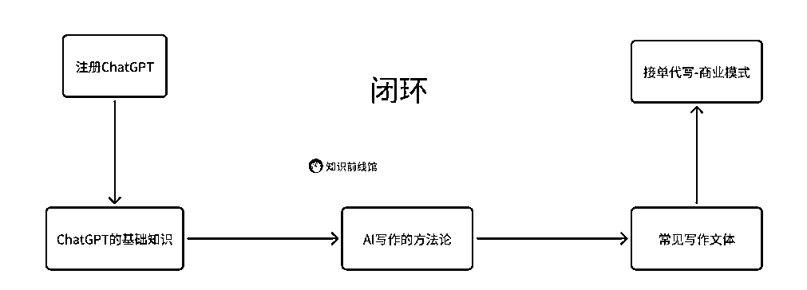

# AI 写作：接单代写~商业模式攻略！

> 原文：[`www.yuque.com/for_lazy/zhoubao/hf3ar7m2xnrbsb3e`](https://www.yuque.com/for_lazy/zhoubao/hf3ar7m2xnrbsb3e)

## (32 赞)AI 写作：接单代写~商业模式攻略！

作者： 馆主

日期：2024-12-24

你好呀！屏幕前的小伙伴们，我是你们的：馆主，今天馆主给小伙伴们带来的项目是：AI 写作-接单代写。

**什么是 AI 写作？**

随着这几年的 AI 人工智能大爆炸，市面上推出了很多 AI 领域：AI 写作、AI 绘画、AI 视频、AI 编程等...

普通人最容易入手的就是 AI 写作啦！如果你本身是一名写作高手，那么你可以通过 AI 来提高你的写作效率。如果你是一名写作小白，那么你可以通过 AI 来提高你的写作质量，AI 是你的（写作）智能小助理。

**什么是接单代写？**

接单代写就是我们通过在某宝、某鱼、微信等平台上，对接别人的写作要求进行变现。

案例：

马上年末了，小明接到老板要求写一份年末报告，可是小明懒得写，然后直接发到某鱼上，让别人来写并给一定的佣金。

馆主是一名 AI 写作高手，逛某鱼看到有人要求写一份年末报告，然后就码住，加了小明的微信，然后按照小明的要求写完了年末报告，然后小明就给了馆主一定的佣金。

接单代写只是 AI 写作的变现方式之一，已经有很多人通过 AI 写作：在自媒体、公文写作、商业策划等领域实现了提效。

AI 写作的项目路径：

**目录：**

一、注册 ChatGPT

二、ChatGPT 的基础知识

三、AI 写作方法论

四、常见写作文体

五、商业模式（变现）

小结

全文 5 千字，请移步到飞书链接：[`fcnzyo4fd2j9.feishu.cn/wiki/TC5Ww7FshiMUrzk7SZgcRIDUnPg?from=from_copylink`](https://fcnzyo4fd2j9.feishu.cn/wiki/TC5Ww7FshiMUrzk7SZgcRIDUnPg?from=from_copylink)

* * *

评论区：

馆主 : 2024 年最后一篇项目拆解啦哈[好的][好的]

心净亦如心镜 : 写的好好，不过感觉注册好麻烦

馆主 : 我都保姆级拆解了，如果还觉得麻烦，自己折腾那不得几天时间才能注册成功

馆主 : 把第一个步骤打通了，你就可以访问外网啦，不单单只是访问 gpt，也可以是其他网站