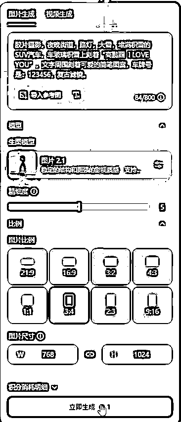
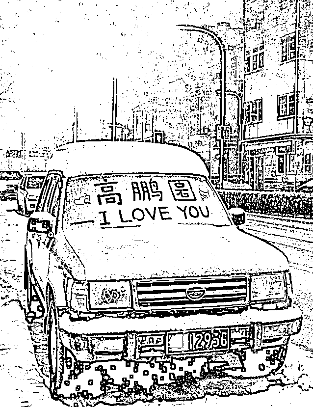

# 一条笔记 10w 赞，小红书的这个玩法可以复制，Ai 雪地写字玩法教程

> 原文：[`www.yuque.com/for_lazy/zhoubao/sg0yfxtf5hsxchk4`](https://www.yuque.com/for_lazy/zhoubao/sg0yfxtf5hsxchk4)

## (30 赞)一条笔记 10w 赞，小红书的这个玩法可以复制，Ai 雪地写字玩法教程

作者： 高鹏圈

日期：2024-12-23

大家好，我是高鹏。

今天继续分享一个热门玩法。

这个号就发了一个这样在雪地上写字的笔记，突然就火了。

有朋友说咱这儿也没下雪，那这种笔记咋做呢？

其实很简单，就是借助现在强大的 AI，完全可以搞定更完美的雪地写字效果。

用到的工具就是即梦 AI，打开首页，选择图片生成的功能。

进去之后，先选择大模型：图片 2.1。

接下来直接输入描述词，注意描述词前面一定要加上“胶片摄影”这个关键词。

后面继续写：雪地上刻着什么什么，比如我写的是“高鹏圈 ILOVE YOU”。然后选择绘图比例。接下来，直接点生成。

等待一会儿，就给了 4 张图，这里面有的效果不太好，直接忽略，选择效果好的就行，如果都不好，就重新再生成一次。

但是刚才这个描述词太简单了，生成的图片的效果也比较一般。

我们把描述词升级一下，在后面加上一句，周围刻着可爱的简笔画，是不是效果就更好了一些，周边多了一些装饰性的小图案。

我们可以继续发挥想象力，比如描述词里边加上一句，旁边有圣诞树，地上放着礼物，看效果。

再比如旁边有一个美女，手里拿着东西，画面就更加的丰富了。

最后如果能加入一些丰富场景的描述词啊，效果会更好。

比如说胶片摄影，夜晚的街道、路灯、大雪、堆满积雪的 SUV 汽车，车玻璃上还刻着高鹏圈 I love you 文字，周围刻着可爱的简笔画，复古滤镜。

选择好比例后，点立即生成。

这样的一个提示词下来，这效果就更加饱满，场景更加细腻了。

所以说只要你发挥想象力，AI 完全有能力帮你把这种想象力变成现实。

今天的分享就到这里了。

关于刚才提到的这个 AI 工具以及描述词，我统一放文档里了：[`svj4gxvm0v3.feishu.cn/docx/X7zcdK9FhoqHBMxt7hIc96VBnBd?from=from_copylink`](https://svj4gxvm0v3.feishu.cn/docx/X7zcdK9FhoqHBMxt7hIc96VBnBd?from=from_copylink)

我是高鹏，深耕网创 9 年，这是我拆解的第 701 个落地项目玩法，更多项目玩法，欢迎找我聊聊呀~

* * *

评论区：

元宝 : 這些 AI 工具是不是都要下載電腦版？手機版不一樣🤔