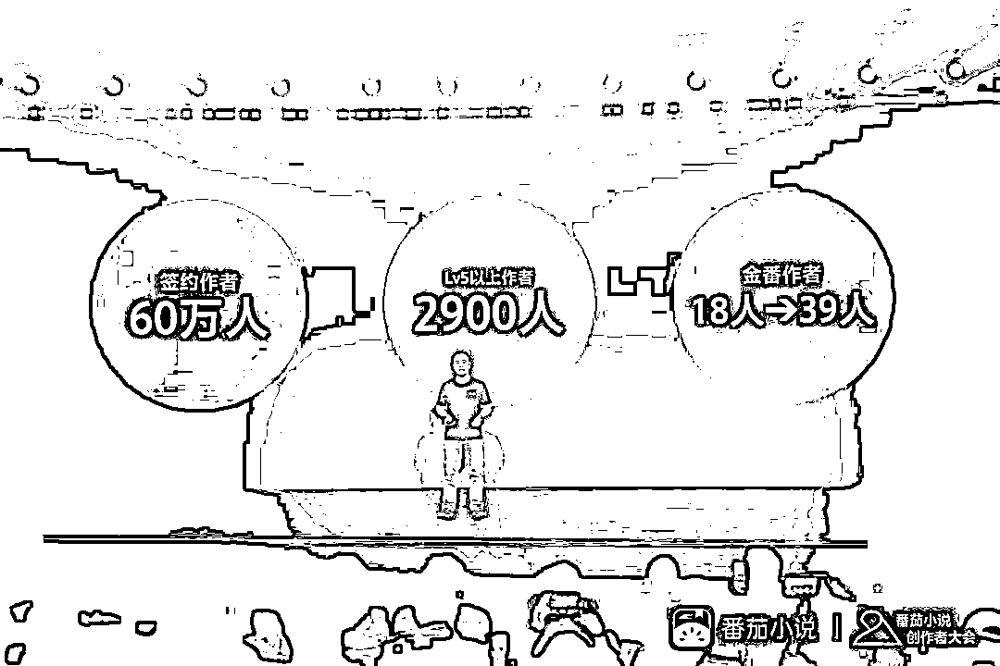
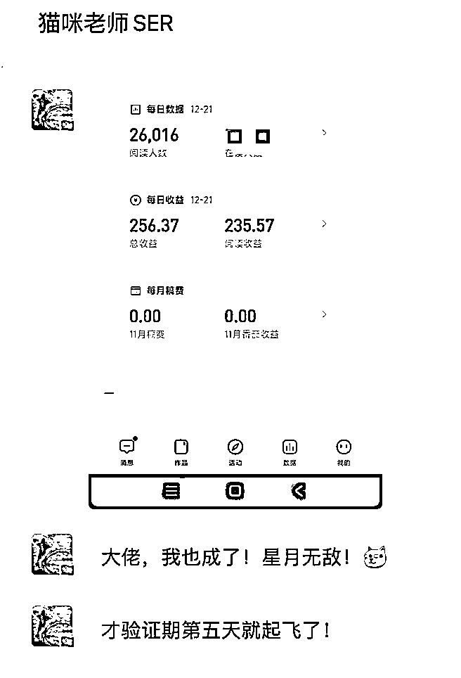
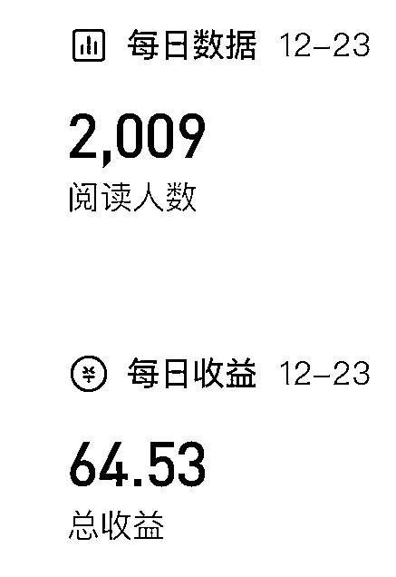

# 靠写小说慢慢变富，轻松写百万长篇小说月入过万，用 AI 一键生成

> 原文：[`www.yuque.com/for_lazy/zhoubao/fyw75nguarcdft6g`](https://www.yuque.com/for_lazy/zhoubao/fyw75nguarcdft6g)

## (27 赞)靠写小说慢慢变富，轻松写百万长篇小说月入过万，用 AI 一键生成

作者： 盟主君

日期：2024-12-25

大家好，我是盟主君，一个靠 AI 变现的 90 后实战派。

11 月和 12 月，我们分别跑通了两个项目。

一个是在百度百家写付费专栏，另一个是在小说平台写短篇小说。收益看起来还不错。

但是随着对网文市场的了解，我发现如今的网文市场还是一个非常有钱赚的地方，比如说前几天某小说平台公布了一个数据：

截至 2024 年 10 月，累计超 50 万作者在某平台获得收入。过去 12 个月，有 9374 位作者年收入超 3 万元，3228 位作者年收入超 10
万元。

我也换入了一些长篇小说大佬写作群，这些大佬虽然比不上顶流的一线网文作家，年入百万，但是他们可以做到日入 200+，我觉得对于普通人来说，不管任何时代写作都，是我们可以做一辈子的事情，AI 成了这件事最大的杠杆，可以提升我们百倍的效率，降低门槛。

先看 2 个群里晒出来的真实数据吧

在之前，盟主君也写过长篇小说，我用了将近用了 3 个月写了 40 万字，那基本是我码字的极限了，因为那时候还没有 AI，靠我一个字一个字敲出来的，写得很辛苦，也很畅快，也顺利签约了，但是没获得啥收益。当时觉得写小说这个事真是投入与产出不成正比，太 tm 累了。

两年过去了，如今有了 AI 写小说，那一切都变得简单了。只要你会使用工具，蹦说一天 1 万字，你一口气一天能写一本书。

废话少说，直接上干货，怎么使用工具写长篇小说。

#龙珠悬赏

请大家移步飞书观看

[`szxb4qbve7.feishu.cn/docx/B2xMdMgnZoCIZAxeNagcm5KInff?from=from_copylink`](https://szxb4qbve7.feishu.cn/docx/B2xMdMgnZoCIZAxeNagcm5KInff?from=from_copylink)

* * *

评论区：

一栗米范 : 你好，评论区那个就是示范使用的 AI 网站吗