# kitty 猫主题地铁视频爆火全网，可复制的快速起号打法，完整攻略送给你

> 原文：[`www.yuque.com/for_lazy/zhoubao/cwg7gks6pr1g4hrh`](https://www.yuque.com/for_lazy/zhoubao/cwg7gks6pr1g4hrh)

## (16 赞)kitty 猫主题地铁视频爆火全网，可复制的快速起号打法，完整攻略送给你

作者： 高鹏圈

日期：2024-12-25

大家好，我是高鹏。

今天继续分享一个热门玩法。

最近这种 AI 生成的，各种各样的交通工具都成了 hallo kity 的主题，非常受欢迎。

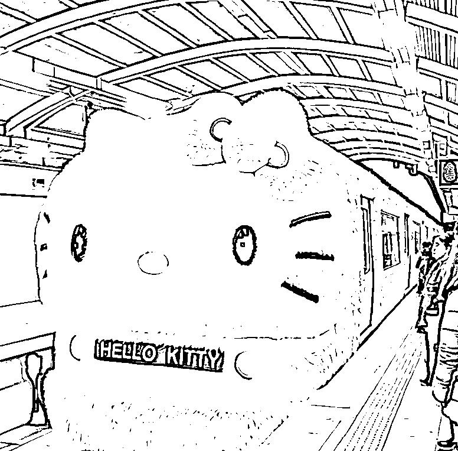

比如这个作者发的所有作品都是这种类型的，关键是都非常受欢迎，这个数据在小红书上来说，真的已经很夸张了。

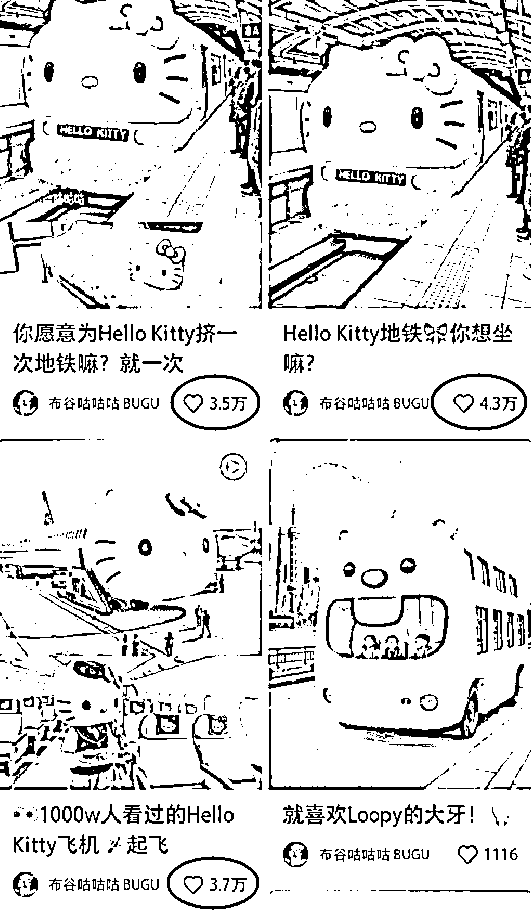

这些装扮看上去都非常精致，不是那种简单的贴点图案，而是整个车身都被毛绒绒的材质包裹，看上去非常可爱。

而小红书上受众大多是女生，对这种萌萌的装扮可以说是毫无抵抗力。

那这种作品是咋做出来的呢？其实借助 AI 五分钟就可以搞定。废话不多说，直接上实操。

用到的工具就是之前我给大家分享过的图片生成 AI-recraft。

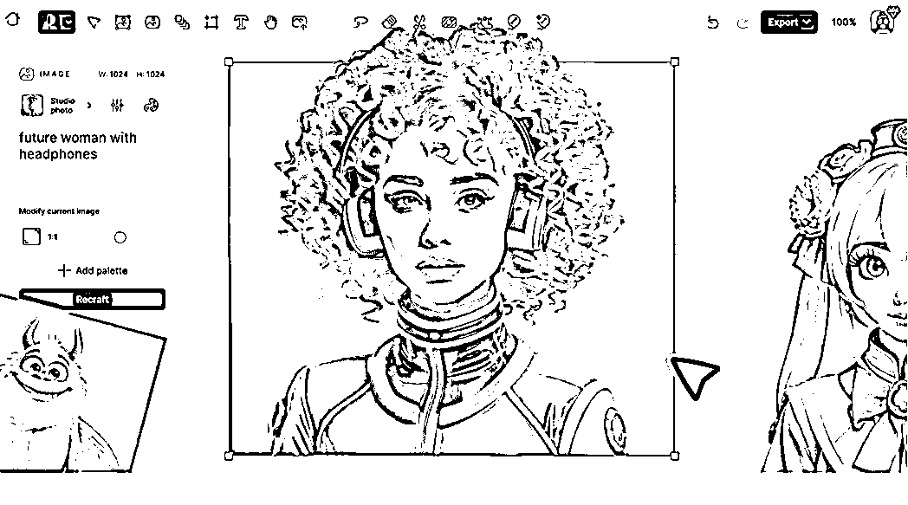

再加上能够把图片变成视频的 AI，可灵。

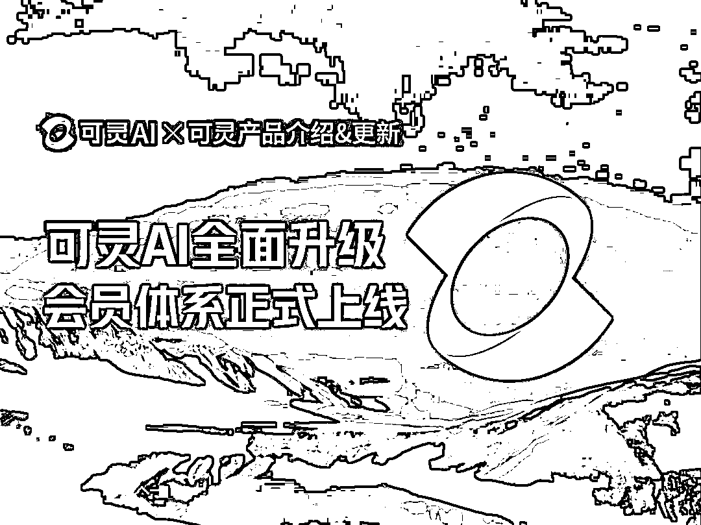

首先打开 recraft，点左边的加号创建新图片。

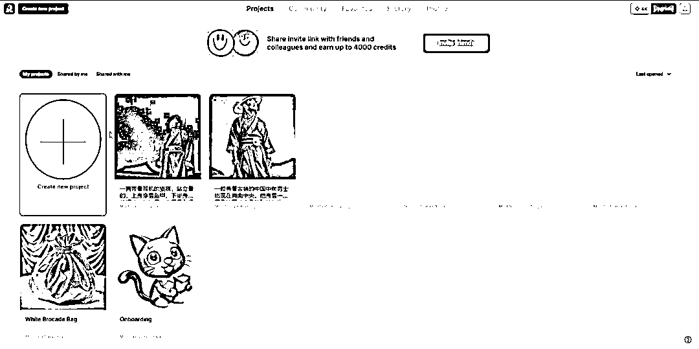

然后把这段车身外部拍摄效果的描述词直接丢进去，点生成。

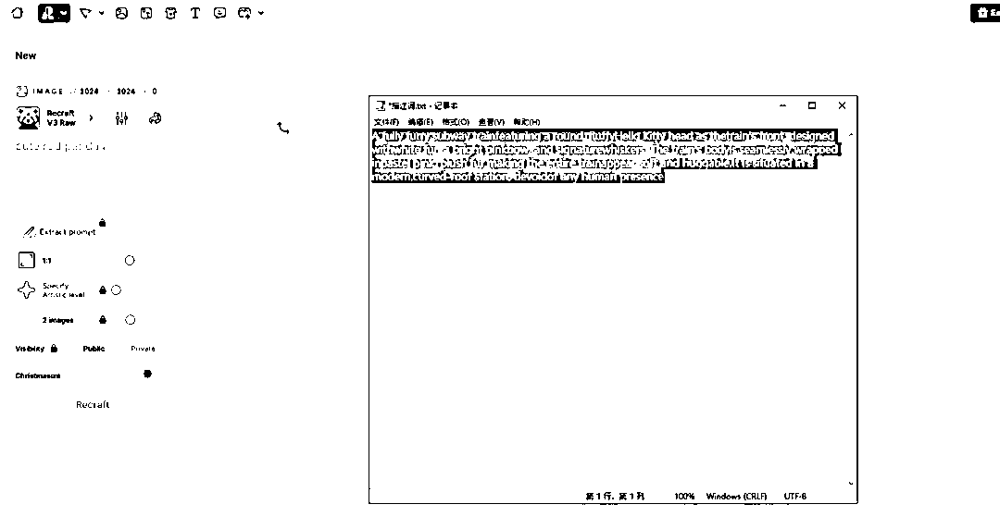

但是它给到的两张图全是车厢内部的场景，不符合我们的要求。

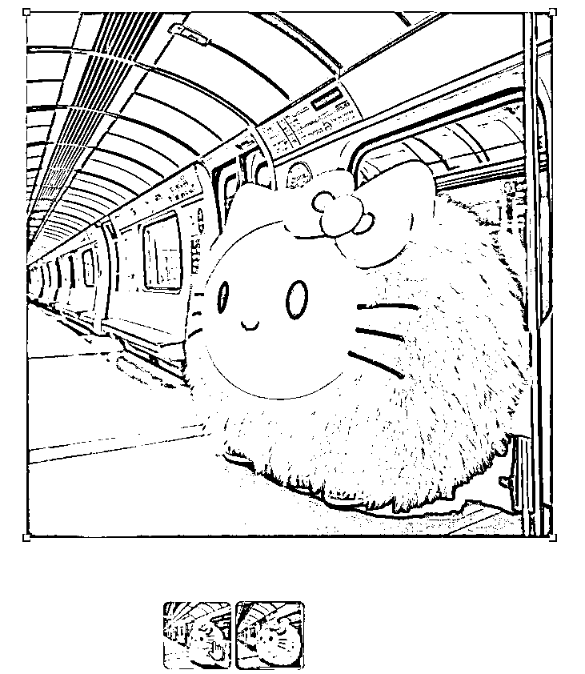

我们可以直接再点一次生成，直到满意为止。

比如这张效果就不错。

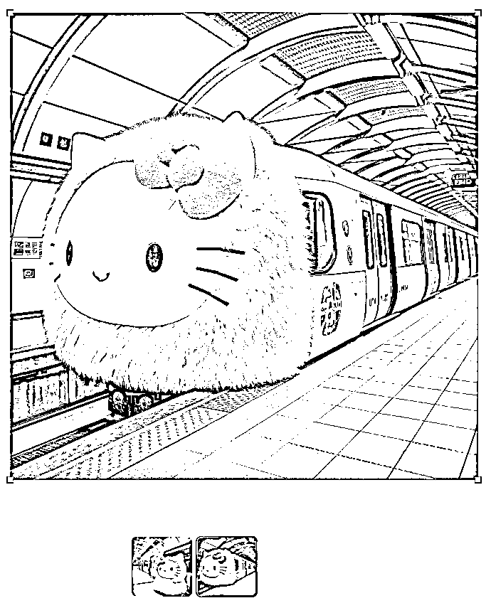

同样的，再把车厢内部拍摄效果的描述词丢进去，点生成，车内的场景图片就生成好了。

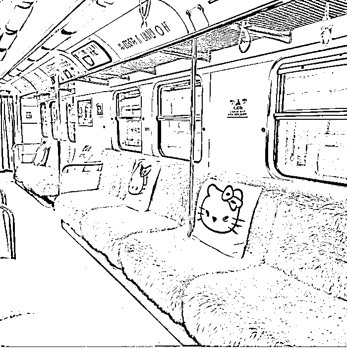

接下来，我们要让这个图片动起来。

打开可灵，用可灵的 1.5 模型就可以，最新的 1.6 模型等待的时间太长了，当然如果你愿意等，也可以用。

把上一步得到的图片拖进去，描述词就简单填写一下就行了，比如我写的是：地铁在移动。

然后直接点生成，等一会儿视频就生成了，效果还是很不错的。

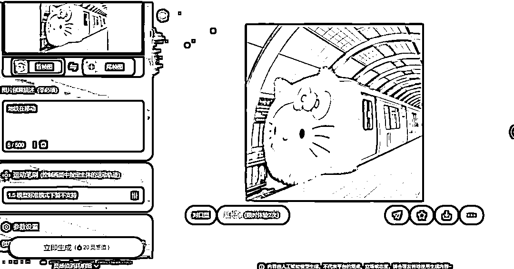

当然，你也不一定非要做这种地铁的效果，在实际操作中，你完全可以发挥想象力。

换其他的交通工具，做一个轮船的效果，飞机的效果，摩托车的效果等等，都是可以的。

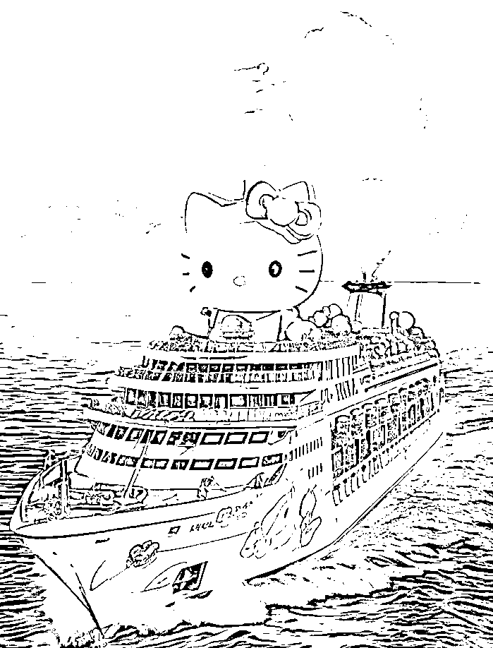

而且也不一定非要做 hallo kity 的主题，你可以做蜘蛛侠的主题、超人的主题、龙猫的主题等等。

还是那句话，只要你有想象力，AI 都可以帮你把它变成作品呈现出来。

OK，今天的分享就到这里了。

关于刚才提到的的 AI 工具，以及生成视频的描述词，统一放到文档里了：

[`svj4gxvm0v3.feishu.cn/docx/XCBfdOmz4oiP13xTwXFcIrnWnlb?from=from_copylink`](https://svj4gxvm0v3.feishu.cn/docx/XCBfdOmz4oiP13xTwXFcIrnWnlb?from=from_copylink)

我是高鹏，深耕网创 9 年，这是我拆解的第 703 个落地项目玩法，更多项目玩法，欢迎找我聊聊呀~

* * *

评论区：

暂无评论