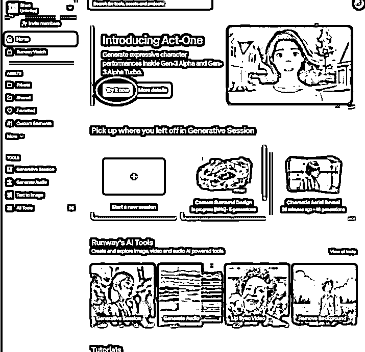
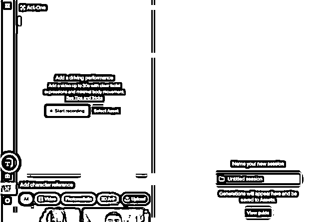
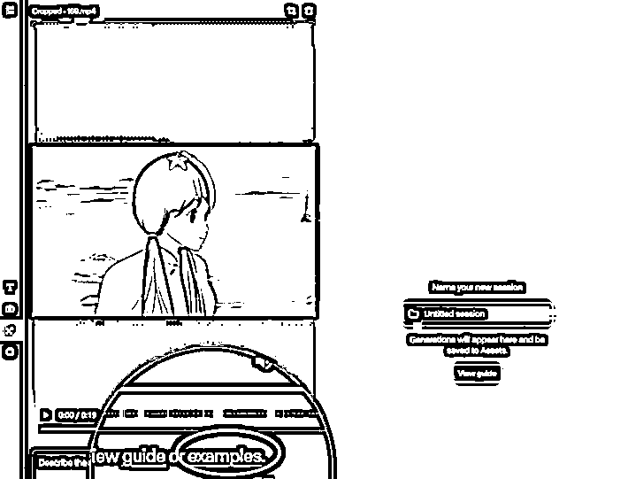
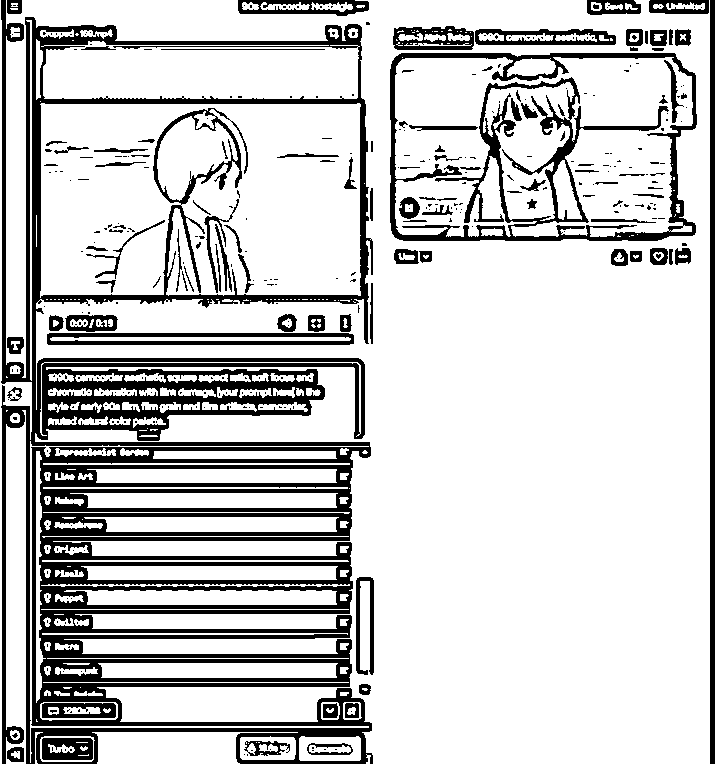

# 一条视频 30 万播放，AI+热梗视频玩法爆火，附教程

> 原文：[`www.yuque.com/for_lazy/zhoubao/aitx4hkt2011mw5y`](https://www.yuque.com/for_lazy/zhoubao/aitx4hkt2011mw5y)

## (10 赞)一条视频 30 万播放，AI+热梗视频玩法爆火，附教程

作者： 高鹏圈

日期：2024-12-24

​大家好，我是高鹏。

今天继续分享一个热门玩法。

最近这种 AI+热梗的抽象视频玩法太火了。不得不说，借助 AI 围绕热梗来做作品，的确是破圈的密码。

最近“美人鱼的夏天”这部电影里的热梗片段火爆全网，有懂 AI 的博主就用 AI 复刻了各种抽象的版本。

这种作品一下就火了，小红书上视频数据非常厉害，而且在某音上同类作品也都很火。

那么如何借助 AI 实现这种抽象的效果呢？

首先，我们用到的工具就是 runway。

打开首页之后，你会看到这样的一个蓝色选项，点一下。

然后来到作品生成页面，点一下文本按钮，也就是大写字母 T 的这个标志。

接下来把电影里的原视频片段上传到左上角这个地方。

上传成功后下面会出现一行英文提示，不用管什么意思，直接点一下这个“examples”，也就是选择示例的意思。

里面有 20 多种预设好的模型示例，各种各样的风格，你可以随便点一点，找一个喜欢的风格生成即可。

选好风格后，直接点生成，稍等一会儿，新风格的视频就生成了。

其实还有很多其他风格，不一定非要用它提供的 25 种。

这里我准备了 40 多种风格的关键词，你只需要把关键词输入进去，他就能生成对应的风格视频。

OK，今天的分享就到这里了。

关于我刚才提到的的 AI 工具，以及更多的模型关键词，这些统一放到文档里了：[`svj4gxvm0v3.feishu.cn/docx/XMUUdM6NgomFzux7iMsc3nZenFd?from=from_copylink`](https://svj4gxvm0v3.feishu.cn/docx/XMUUdM6NgomFzux7iMsc3nZenFd?from=from_copylink)

我是高鹏，深耕网创 9 年，这是我拆解的第 702 个落地项目玩法，更多项目玩法，欢迎找我聊聊呀~

* * *

评论区：

暂无评论