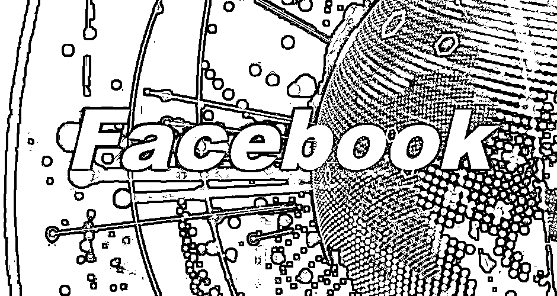
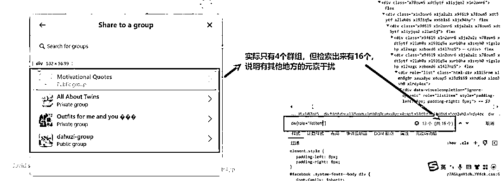
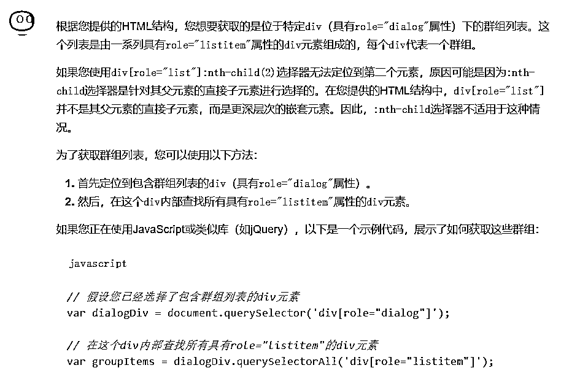
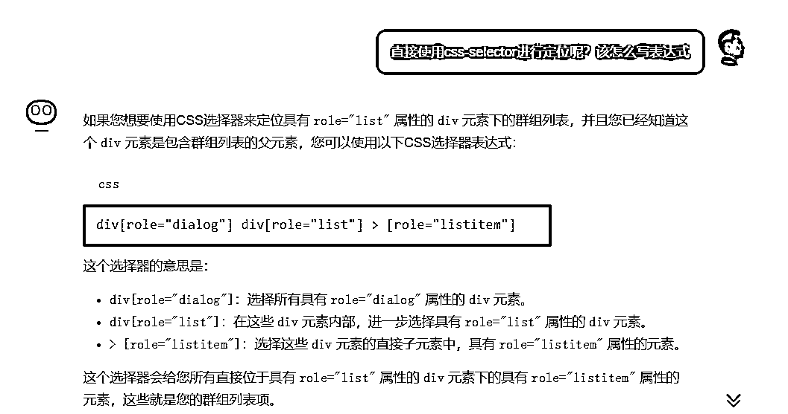

# kimi 提效 RPA，看我怎么用 AI 解决一个复杂的 facebook 元素定位问题

> 原文：[`www.yuque.com/for_lazy/zhoubao/biwlxh0w0ugnd1gg`](https://www.yuque.com/for_lazy/zhoubao/biwlxh0w0ugnd1gg)

## (7 赞)kimi 提效 RPA，看我怎么用 AI 解决一个复杂的 facebook 元素定位问题

作者： 大胡子 RPA

日期：2024-12-26

大家好，我是大胡子，专注于 RPA 课程与解决方案。

RPA 是高效辅助咱们城市牛马做重复工作的利器，它的实现原理就是**基于元素进行定位，从而再去实现点击/滚动/输入等操作** ，可以说**会元素定位，那么 RPA 项目就成功了一半** 。

今天咱们实战：识别 facebook 的帖子进行转发时弹出的群组列表。

看起来很简单吧，但实际上这个列表几乎不存在任何有关【群组】【group】的 css 标识，所有的 class 几乎都是看不懂的随机类名。

并且 listitem 的数量也不能对应上，所以也不能单纯的通过 listitem 进行定位，如下图：

那么，怎么才能准确的获取到该群组列表的第 1 个或第 2 个元素呢？

于是我就将这个对话框的元素发给 AI，让 AI 帮我找一找规律

我要获取这个元素下面的群组列表：

...

kimi 给了我一个 js 的写法，不错，有点头绪了，它会帮我找到 dialog listitem 之类的标签。  但这是 js，我想要的是最直接可以定位的 css 表达式，于是我又问 AI:  最终，它给我一个表达式，然后换上我的动态变量（第几个群组）： 1\. div[role="dialog"] div[role="list"] > [role="listitem"]:nth- child({{variables.curr_index}}) **最后总结一下：** 我的这个问题其实核心是因为元素太多，肉眼并不好找关键信息，于是我就借助 kimi，将这个对话框的元素直接发给 kimi，让他帮我找关键标签，从而达到 AI 提效的目的。 怎么样，你学会了吗？ *** 评论区： Anna 碧海心 : 我在用 chatGPT 编程找网页上元素的时候也是用的你的这个方法。