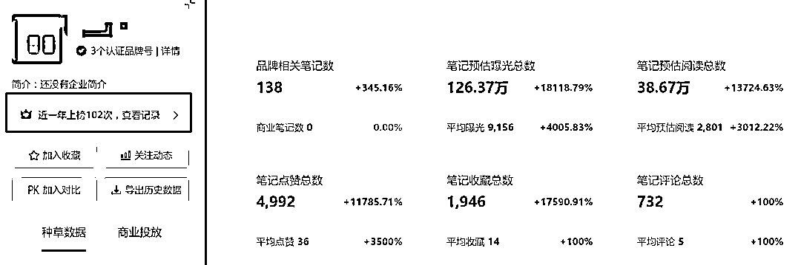
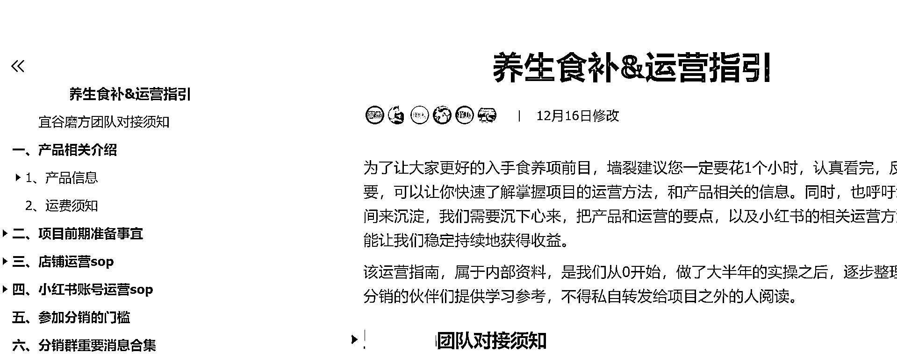
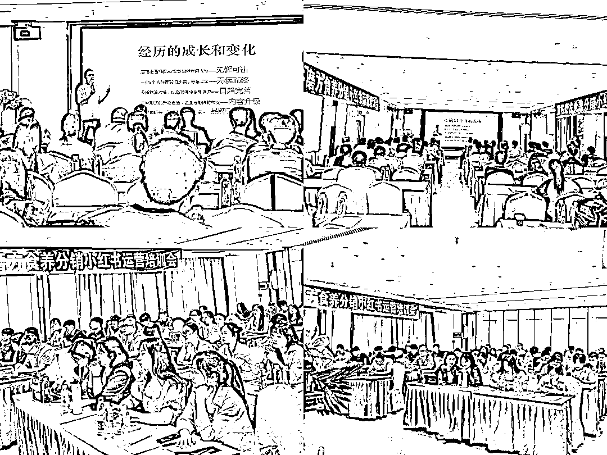

# 一年运营历程：从流量型生意到自建品牌与供应链的转型

> 原文：[`www.yuque.com/for_lazy/zhoubao/yy7a35n26ygl08rk`](https://www.yuque.com/for_lazy/zhoubao/yy7a35n26ygl08rk)

## (40 赞)一年运营历程：从流量型生意到自建品牌与供应链的转型

作者： 凯哥

日期：2024-12-23

大家好，我是凯哥，记得 23 年我在生财上写了 3 篇帖子，获得了大家的肯定，被加精了。

后来实在太忙，很少再发声了。

这次我想给大家分享一下近 1 年来的运营历程。先说说我这一年取得的成绩：

**1 年时间，将一个新品牌做到千万级的销量**

**开发了 21 个品，其中打造出 3 个大爆款**

**搭建中医教授研发团队和健康管理师队伍**

**独立生产供应链，开始筹备自建工厂**

在做食养大健康之前，我一直在做【流量型】的生意，虽然有合作的供应链，做女装、做瑜伽服、做过很多的产品，也赚了不少钱。但毕竟就是个搞流量卖货的，不是自己的品牌，没有自己的供应链，很容易被人拿捏，始终感觉没有归属感。

实质上，我也一直想找一个可以做一辈子的事业，等再过几十年，等我老得干不动了，最起码，我还可以传承一些东西给子女。

这个想法一度让我非常焦虑，铁了心要做自己的产业。

好在 2021 年到 2022 这 2 年时间，我一直做小红书代运营，接触并实操了很多品类，最高峰时做了 300 多个号，做了 N 个产品，对小红书平台和用户非常了解，也很清楚什么样的产品适合小红书，这为我积累了大量的经验。

所以，我一头扎进了食养赛道，花费了极大的精力，去探索一个陌生的领域，从研究分析市场，学习养生相关的专业知识，整合中医、营养师、健康管理师等资源，再到开发产品，最后用小红书矩阵的方式测试内容，销售，最后搭建私域，用了半年时间。

从去年 8 月 26 日发布第一篇笔记到现在，已经过去 1 年零 4 个月，虽说目前还不是超级头部，但在短短 1 年时间里，我做到了千万级的业绩，可能在众多大佬面前，算不了什么，但对我来说，这是一个非常欣慰的成绩了。

与此同时，有一批跟着我从 0 到 1 开始做食养产品的伙伴，也是收获满满，很多人都赚到了人生中的第一个 100w，也收获了非常多用户的真诚反馈，通过我们的产品，身体发生了非常好的变化。这让我们不仅收获了财富，更在精神世界里，得到了肯定，是一件功德的事业。

就目前的整体销售体量，从千瓜数据上的表现，短短 1 年时间里，我已经超越了 80%的同行品牌。

重点是，我没有花过 1 分钱做广告，完全靠内容矩阵，实现的自然流转化。

（千瓜数据 2023.06 数据）

做食养这个赛道，说起来还得感谢我的一位老友。他以前是某个知名微商团队的运营，后来自己出来创业做大健康产品，其中就有食养类的产品，他说这个赛道值得去深耕。

加上他自己也做的还不错，虽然只是做的养生零食类的产品，团队也不大，但一年也能干大几千万，已经相当不错了。

在他的影响下，我才开始深入研究食疗食养这个赛道的产品，发现感觉是挖到个宝藏品类。同行很多玩家，做的非常棒了。

像从天猫起家的五谷磨房一款“黑之养”的黑芝麻核桃粉已经卖了 10 几年，小红书上花姐的一款八珍粉，单链接也能做到 10w+的销量，类似的玩家还有至言良食、妈妈很忙，八珍粉都有上万的销量，复购和口碑都还不错。

前期通过研究他们我发现，这类夹杂着中医养生思路的产品，深受小红书一二线城市女性的喜爱，热衷养生的人群也越来越呈年轻化。加上近几年因为口罩的原因，大家对身体健康、对养生有了更深的认知和需求，是一个非常大的消费趋势。

于是我在他们的基础上，开发了以八珍粉、七白饮、七黑粉、五红粉为第一代的产品，对标同行的产品来做调试。

做产品是一件非常痛苦的事，根本不像别人说的那样，到处去抄。因为从口感、冲泡成品、功效、包装等诸多方面都要有考量。所有的产品都是我亲自动手，不断测试优化，连产品包装都是我自己设计的，20 来款产品，每一款都耗费了非常大的心思。

再就是口感问题，真的是众口难调，食材用好道地的好一点的，经常有人反馈说味道苦，不好吃。但如果为了追求口感，添加一些“黑科技”，食养的效果就会受影响。

我寻求了很多中医老师帮忙，请他们给我指导意见，包括中医食材的配伍，在保证效果的基础上，口感能好一些，最起码，是可以吃得下去的，不能像中药那样难以下咽。

后来在很多医生教授的指引下，我坚定了”只做道地食材，不添加任何额外添加剂”的高品质产品，跟市面上那些做低价的区分，避开在低质量的赛道上拼杀。

本来好吃的食物不一定健康，真正药食同源的食疗产品，就是天然的味道。事实证明，我的选择是对的，很多客户都认可喜欢我们的产品。

截止到目前，仅 1 年时间，我们已经收获了非常多客户的正向反馈，好评如潮。很多客户在尝试过我们的产品之后，都是 3 盒 5 盒地购买，和家人一起吃。退货率竟然低于 1%！

**我对食养产品的看法**

**1、大健康产业链非常深。**

产品的深度可以无限广，从最基础的食养粉、养生茶，到进阶的高端滋补品、保健品，再到深度定制陪跑的中医内调，可开辟的产品+服务线足够广，而且可以形成品牌矩阵+产品矩阵，做成一条从初级养生到私人治疗的完整产业链。

**2、养生赛道的利润率足够可观。**

我目前可以做到的是一件代发，分销每卖一单，利润大概可以做到 50%，不需要囤货，更不需要花费 1 分钱去做推广，纯粹的自然流量。加上中医加持的配方，有足够的溢价空间。

**3、养生人群的市场足够大**

自从口罩以来，养生的人群越来越年轻化，从 18 岁女大到 35 岁女性，以及每个家庭都有健康饮食的需求。且小红书的人群相对精准，综合素质认知与购买力足够强。

根据中商产业研究院近期发布的《2024-2029 年中国保健食品行业调查及发展前景分析报告》显示，2022 年中国保健食品销售额达 680 亿元，同比增长 8.45%，2023 年约为 720 亿元。2024 年保健食品销售额将进一步增长至 778 亿元，即将成为一个千亿级的市场容量。

**4、复购高售后低**

坚持做高品质的产品，不偷工减料，根据中医调理思路来配伍的产品，客户吃了有效果，复购率高。就目前按照我们日发 3000 单的发货量，售后率低于 1%。

为了弥补我在中医养生方面的知识空白，我除了每天阅读大量的中医书籍，养生的配方，研究食材。在专业领域的提升以外，我还正儿八经聘请了多位营养师专家，和中医专家来协助，开发产品的时候也会一起研究，调试。

并且在群里协助我的团队，给客户提供专业的问诊、产品搭配、调理建议，深受用户信赖，团队的业绩也至少翻了几倍，从以前单一的单品销售，到现在组合搭配销售，效果非常好。

这 1 年时间以来，经历了许多的不容易，也是迫使我不断优化产品，优化模式的动力。

**1、复制放大—具备赚钱的能力**

赚钱这个事，是一个非常复杂的事。每个人的综合能力不一样，起点也不一样，所以能让大多数人都赚钱，这本身是件非常有挑战的事。

**这里主要考验个人的 4 个能力**

**个人理解能力：** 对产品的理解，对小红书平台规则的理解，以及对我们的 sop 运营课程的理解，特别是第一次接触小红书的伙伴，刚开始会特别 emo，完全不知道该如何入手，可能很简单的一件事，需要讲解半天，所以做起来会有些吃力，这个需要时间来熬。所以，如果有一定互联网运营经验的人来做，成功率会高得多。

**个人执行能力：** 有的人一天可以写 12 篇笔记，有的人因为懒，一天下来连 4 篇笔记都完不成，执行力比较差的，是很难做起来的。

**抄作业的能力：** 其实做小红书根本没有什么深奥的技术，说白了就是找爆文、抄爆文、改编文案和作图的方法。

**个人抗压能力：** 有的人就是抱着试试的心态，搞几天没看到大的结果就放弃了，也有的坚持了 30 天，刚开始入门，还没有看到爆的迹象，但看到别人每天几十单，几百单，心态很容易崩，也就慢慢放弃了。

让人欣慰的是，目前 100 来位分销中，至少有 50%已经做到了赚钱。70%的人出单，10%的人赚到了 100w+，20%的人实现了月赚 10w[50w 的成绩，30%以上的人做到了月赚 1w]9w，月入 1w 以内的人也大有人在。

**有图有真相，牛皮可不是吹出来的**

↓↓↓

 iE95AAqwUfYN7pOZ1znX) images.zsxq.com/FnYXHlG8dbBrDm_WJGeoyQ3IPO3B) images.zsxq.com/FnfcSdM4oz6YAS2u5RLDtVkld4nF) images.zsxq.com/Fjw_5qWW6ywVesWSIY3-Spd1UdEf)

每个人的成绩，都是有共性的，要么理解能力强，善于分析总结，从别人的爆文中总结规律，经过消化以后变成自己的内容。要么足够勤奋，每天定好目标，坚持完成足够的笔记数量，不断优化自己的内容，别人写 6 篇，他能写 8 篇，12 篇。。。

要知道，经验都是通过实践+总结熬出来的，即使我们的课程方法已经写的非常详细了，但还是得要有人去做，去理解，认真去执行，才能看到数据和结果的。

我也是经历了很多过程，不断克服困难，逐渐优化成自己的优势的。

**2、让产品具备竞争力—产品端的把控**

我对品质的要求，是可以用“苛刻”来形容的。很多小伙伴都跟我说，没有必要用那么好的食材，追求道地（道地的意思就是原产地有药用价值的原材料）。

要把成本降下来，像其他很多品牌一样，可以用一些残次品，或者通用的食材就好了，这样我们的成本可以大大地降低，反正客户也吃不出来。

就拿山药来说，如果用普通食用的山药，成本比河南温县垆土的铁棍山药至少便宜 2 倍。

但这个做法被我坚决否定了，不是我不想多赚钱，我只是想着从我手里做出来的产品，就必须要经得起市场的验证，我自己也会安心，哪怕就算贵一点，用户吃了一阵子，就会有感觉的，甚至有的客户的专业性比我们还高。糊弄别人，就是对自己的不负责任。

我经常在超市里，在淘宝、拼多多上看到同类的产品，同样一罐 500g 的八珍粉，有的才卖 29 块钱，这种不用看，100%是有猫腻的。八珍粉里有 8 种食材，且不说这些食材有没有效果，就算是用大米做成的粉，按照大米的价格，少说也得 2~3 元/斤的成本，加上快递费、包装费、库存管理，以及运营费用，卖 29 块钱的成本，根本是不敢吃进肚子里的。

我宁愿牺牲一点利润，也要做良心产品，毕竟我自己平时也要吃，我给我家人都日常在吃。初心是健康行业，就要对得起“健康”这 2 个字。

**3、不断总结复盘——形成运营 sop 流程**

产品是搞出来了，卖出去成了最重要的事情。基于我之前做小红书矩阵引流的经验，我还是专注在小红书这个平台。

刚开始运营的时候，我亲自带队运营账号，我手里运营了 3 个账号，每天拍照片、写文案，做客服接待客户，优化复盘内容。最痛苦的是研究内容形式，既要能获得流量推荐，转化率高，还得满足可以批量化的复制特点。

我很清楚地记得，2023 年 8 月 26 日发的第一篇笔记，很庆幸，第一篇笔记就爆了 2000 多赞，卖了 500 多单的八珍粉。然后每天写 12 篇笔记，每个账号发 4 篇，一直坚持了 2 个月，从 0 开始，有了最初的 sop 运营流程，把方法教给我的团队和分销小伙伴们。

这是 1.0 版本的 sop，在这个 sop 基础上，第一批跟着我做的分销，也都开始拿到结果。典型的例子就是小雨，她是我们第一批的分销成员，从运营的第 1 个月赚了 900 多块钱，第二个月赚了 2000 多，到第三个月才赚 5000 多，具体的数字她都有统计出来，每月都在算账。

真正的小爆发，是在 2023 年过年的前夕，工厂都已经放假了，我们突然开始爆单，一下爆了几千单，为过年准备囤的货都发完了。厂长刚准备开车上高速回家过年，被我叫下来回工厂重新生产货，用顺丰把货寄到每个人家里，自己发。

过完年来的 4 月份开始，迎来真正的大爆发，至少有 6 个小伙伴，在 2 个月内赚到了 100w 的纯利润。

在此基础上，我们不断优化笔记内容，复盘成为 2.0 版本的运营 sop，到现在已经进阶到 3.0 版本的 sop 了，整套 sop 已经非常细节，事无巨细地小白也能看了就操作。

所以我们团队新加入的同事，以及新的分销小伙伴，开局首先就是要学习这套系统的课程，至少是要看三遍，从小红书平台养生类的规则、起号方法、图片、文案、找对标爆文、每个产品的详细介绍，到开店、店铺基础运营等等方面，都非常详尽。嫣然就是一套针对养生产品的百科全书。

为了让小伙伴们快速上手，凯哥已经连续举行了四次线下的培训研学会，都是免费的，现场面对面教学。

**有一个很奇怪的现象，就是做小红书电商，初创期，个人创业的成功率，比公司团队做起来的概率，至少要高 80%。**

**4、劣币驱逐良币——疯狂被抄袭**

被人抄袭，毫无底线地怼着截流，是我最难受的了，比吃了苍蝇还难受。

在我们爆起来之后，小红书、淘宝、拼多多这些平台上出现了非常多的抄袭搅局的人，直接 1:1 抄我的，不仅抄产品，连小红书笔记都直接抄，有的连包装都跟我一模一样，就 PS 了一个商标，然后价格直接比我还便宜一半。

一开始我还安排同事联系要求下架或改包装，后面发现根本搞不过来，天猫上还有几家店，做跟我一样的包装，价格卖 39 元，产品主图都是用我们的，每天用直通车来截流，有的客户买到的产品，收到之后发现跟小红书上完全不一样，对我影响贼大。

**既然改变不了别人，那就改变自己。**

迫于无奈，我开始意识到，需要升级包装和产品了。

因为之前用的罐装的包装，罐子都是公模，市面上很容易生产，且成本比较低，换个不干胶贴纸就可以生产了，抄袭成本特别低。

于是我足足花了 2 个月时间，亲自设计新的包装和品牌形象。把原来的罐子装，换成了便携式的盒装，颜值更高了，抄袭难度也在一定程度上有了门槛。毕竟包装盒的耗材都是定制的，印刷厂都是有量的要求，虽然无法从根本上避免被抄袭，但在抄袭成本上更高了。

而且我在专利上也有一定的防范，现在我不怕别人抄，就算抄我也暂时不管，等到他卖好了，我再出手，也有一笔意外的收获。

另外，升级了包装以后，不仅在转化率上有了提升，在售后层面，也大大降低了客服的售后成本。

之前罐装的产品，经常会遇到客户买回去开了封，一段时间没有吃，导致产品过期了，产生浪费的现象。更离谱的是，有些素质不高的客户，吃了一半了又说在罐子里发现了头发、指甲、碎布等异物，特别难扯皮。

新的包装，都是一小袋的便携装，一袋刚好吃一次，且产品在生产的时候，需要用精细的设备来注入包装袋中，从源头上杜绝了有异物的情况。

在一定程度上，也应该感谢抄袭的“竞争对手”们，有了竞争，才有不断进度的驱动力。

**5、不断被迫规范——直面打假人**

养生这个赛道，一直都是被打假的重灾区，我从去年开始做这个产品以来，已经被这些打假人打麻了。

被打假的方面，主要集中在药食材、包装规格、检测报告、产品详情页上的描述等方面。

特别是在我们今年 4 月份左右，销售开始大爆，每天发货 3000+单开始，产品火了是非多。我自己团队和分销们几乎每天都被这些烂事纠缠，真是不堪其扰。

好在我们及时且积极的应对，我自己亲自带着文案和设计，逐个产品，逐个字的去改，包括详情页和包装的描述，重新再梳理了几遍，把所有可能会涉嫌违规的地方，全都改了个遍。

打假人的存在，其实也是一个好事，他们就像一个质检员，总能在你忽略的地方找出问题，帮助我们及时去改正，做得更加规范，所以这是好事，只是会有点搞心态。

**6、好菜也有散席时——我是一个跳板**

从项目启动至今，跟着我一路成长过来的伙伴，已经有 100 多人，其中不乏赚到几百万的佼佼者。

有些有野心，有想法的伙伴，在我们食养这个赛道做起来，学到了经验，积累到了第一桶金之后，也开始自立门户了。

我自以为算是无私的了吧，我把大部分的利润都让出来了，然后整理方法，课件，无偿的培训，就连从快递公司谈下来的差价，都全部分配下来，就是希望能将大家的利润最大化。

有的人以为，反正就是搞个产品卖嘛，在 1688 上随便都能找个工厂合作，也能卖的。

确实也是如此，看着门槛并不高，但凡赚到点钱，都可以这样做。但很多人却忽略了一点，单纯只是模仿做个产品出来，根本不是个事儿。

重点是，能不能持续开发出爆款产品来，是否具备一直在内容上不断变化，快速优化和响应，升级。要知道，我卖的绝不仅仅是一款产品而已，我的运营打法和产品思维，是难以复制的，是有一套完整的体系。

所以从一开始那么多人抄袭模仿我的产品和内容，那只是一时的，时间长了，过 1 个月，2 个月，我悄悄地完成了升级，把门槛变更高了，或者我换了个新品，原来的那一套已经玩不转了。

事实证明，那些抄袭者和搅局者，现在几乎也都销声匿迹了，赚了点小钱，最后可能又把钱亏在了库存里。

这世上唯一不变的就是变化，我有几十年的运营经验，产品开发能力和应变能力，最起码在市场分析判断能力，就已经远超很多人，并且承担了大量的风险，而你要做的，就是专注跟着搞流量，卖货就可以了，创业成本和风险已经足够低！

万事开头难，其实过程更艰难，我把最难的事情已经做完了。在这 1 年里，我像是变了个人，学到了很多东西，还有做不完的事情。

从整个项目做下来，我始终坚守着我的 16 字箴言：

**单点打透、流量闭环、复制复利、长期主义**

**单点打透，** 就是在一个领域、甚至是细分领域深耕，成为这个领域里的专家，摸透玩法，总结规律。我在小红书已经打透了，已经进入到 3.0 版本。接下来腾出精力来开始跑抖音，做私域，布局线下实体店。在食养这个领域里做得更深。

**流量闭环** ，是要有一套适合自己的引流方法和承接流量的模式。我之前还处于项目的第一阶段，测试产品、用户受众、以及运营模式，这个阶段已经跑通之后，我开始布局私域，后面不管是小红书、还是抖音，都只是我从公域引流的一个渠道，最终都要回流到我的私域里面去，形成闭环。

**复制复利** ，复制是要具备可复制性，运营的可复制性，产品的可复制性，品牌的可复制性。在同一套产品体系和运营体系下，我可以做成品牌矩阵、产品矩阵、账号矩阵。

而复利，是要复购高，与客户有强烈的关联度，可以很好的触达到用户的需求，粘性高。

**长期主义** ，就是要做可以持续，有趋势，对社会有福报的事情。食养是大健康领域其中的一个细分赛道，目前还没有超级知名，独霸鳌头的品牌，也是个非标品，有很多有意思的，很有想象空间！

这 1 年的时间里，特别能锻炼人，明年开始自建工厂和产品研发团队，并开始布局线下的食养门店，会更加忙碌，但内心是快乐的，汗水也是甜的。

篇幅有限，还有些不方便透露地太详细，有兴趣的伙伴可以单独聊聊~

也希望各位伙伴，都能谋定一个事，深深地扎进去，不畏困难，迎难而上去解决，最终拿到自己想要的结果！

* * *

评论区：

到底辣不辣 : 想了解一下～

荣生 : 精华帖预定[强]

义茹 : 想了解一下

小乔 : 想跟着大佬一起干

杜静 : 我是营养师想了解，怎么联系。