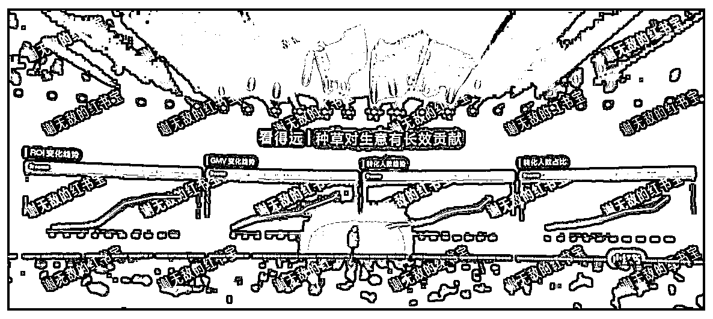

# 拥抱 2025：小红书 Will 大会 10 大重点总结

> 原文：[`www.yuque.com/for_lazy/zhoubao/bkgbbsmgzwklqogm`](https://www.yuque.com/for_lazy/zhoubao/bkgbbsmgzwklqogm)

## (11 赞)拥抱 2025：小红书 Will 大会 10 大重点总结

作者： 谢无敌🐱闪亮猫传媒

日期：2024-12-23

Hi[生财的朋友们大家好] 我是你们的老朋友-谢无敌，闪亮猫传媒创始人。

我想说，小红书是真牛！

在互联网平台业绩不断下滑、大量裁员的大环境下，小红书却犹如一颗新星闪耀，开始逆势增长、赚钱！

上周，小红书一年一度的 WILL 大会明确了**2025 年的 10 大方向。**

接下来，平台不仅会聚焦生活服务行业的线索突破，在商业产品能力也会更注重投放中的优化和投放后的度量，帮助大家实现低成本高变现。

而未来小红书将不断开放与不同行业商家、MCN 机构的连接。

花了一整天的时间，给大家总结出大会透露的 10 大重点，一起来看看吧~

## **一、人群资产模型 AIPS**

小红书人群资产模型 AIPS：**认知、兴趣、深度兴趣、购买和分享。**

是为了更好的打造商业产品，帮助商家看清 SPU 对应人群数量和人群流转情况。

分为三大步：

第一步，通过渗透率打透人群，提升效率，表明了**种草和激发兴趣** 的重要性；

第二步，快速积累兴趣和深度兴趣人群，通过智能直投以最低成本获取到潜在消费人群，让生意最终的转化效率提高；

通过智能直投，让雅诗兰黛白金黑钻面霜这个产品的人群人均成本下降 54%。

第三步，可以通过复投，来降低进店成本，实现生意增量。

## **二、结果度量之两大产品**

**种草联盟：**

打通营销前后链路，帮助品牌商家在小红书上实现更好的转化。

从两个产品能力的提升，做了策略上的调整：

**人群纠偏计划：** 在投放的过程中，通过不断进来的人群数据去判断，进行纠偏，目的就是提升商品的种草力，通过不断积累的数据进行优化，实现增量。

**保浅优深计划：** 确保点击成本的同时，在最大限度优化深度行为，如进店、 成交、转化等，实现站外行为成本下降超 50%。

**一方数据：**

帮助品牌实现精细化的运营和投放，适合渠道较多的品牌/线上和线下生意。

品牌将自己的后链路转化数据，通过 API、数据服务商，或者离线的方式回传，**通过具体数据来度量结果，实现更精细化的运营。**

从不同的数据维度，让种草对生意有长效的增长贡献，如**ROI、GMV 转化人数、转化占比。**

**一方光谱：** 通过制定分层出价策略，来实现品牌的精细化运营，实现成本的下降。

## **三、灵犀平台即将开放给更多商家**

灵犀平台数据度量是看清种草投放对生意影响的手段，通过数据调整投放策略，实现优化。

商家可以利用灵犀工具，挖掘小红书平台热门话题和笔记分析，帮助商家更好的生产出优质内容，降低获客成本。

像松赞，利用内容的深度挖掘，**实现目标人群渗透率增长超 400%** ，被小红书触达过的用户客单提升超 46%。

2025，灵犀将从 1000+商家，开放到 5000+。

## **四、生活服务新经营模式**

在过去的一年里，生意的机会就在小红书。

生活服务行业商家在小红书进行咨询服务的占比达到 98%，形成了天然的营销场。

解决行业经营 5 大难点：**用户触点少、内容产出难、服务效率低、转化链路单一，以及放量空间小** 的问题。

新模式下，生活服务商家从单一的企业号交互升级为多元的**总部企业号、区域企业号和 KOS 员工号** 的矩阵。

通过立体的内容，帮助商家在转化效率上有了更好的提升。

像@圣都家装和@绿城，通过提升与用户的交互效率，绿城**3 个月实现近 2 亿成交额，效率达行业均值 10 倍。**

## **五、高效私信管理**

小红书私信通工具全面升级，实现单账号接待和消息汇总，打通主流第三方私信聊天工具。

像@九匠，在使用后 30s 回复率显著提升 57%，客服人效提升了 50%，夜间获客量也大幅提升达到 70%。

## **六、有效转化链路**

小红书推出新组件，如**企微一键换端、一键复制** 等，帮助大家提升留资和转化效率。

与此同时，在购买链路上即将推出小程序，让小红书生态变得更开放、更包容。

## **七、全新咨询服务评价体系：咨询分诞生**

小红书生活服务不依赖价格折扣，而是**注重提供优质服务。**

推出咨询分这一全新评价体系，以衡量商家经营能力，期待**从 0 到 1 再到 N 的增长。**

## **八、极光指标**

极光指标能从不同象限提升**品牌形象认知、内容积累、人群渗透和口碑激发** 的效果，作为一个营销 IP 的度量衡的指标。

帮助大家在前期投放策略制定的时候，精准的知道营销侧重点，同时在项目完成后进行效果论证。

## **九、站内交易增长**

2024 年小红书购买用户数涨了 4.3 倍，月销 500 万的商家也实现了 3 倍以上增长，数以千计的月销百万单品涌现，数量是去年的三倍。

每天有 600 万求购需求发生，1.2 亿次截屏和图片下载行为，体现了用户在小红书上有着旺盛的求购需求。

平台有 4000 万尝鲜人群，60%在 30 岁以下，95%中高消费力，70%在一二线城市，从人群画像能看出，用户更爱在这里购买新品。

## **十、2025 年小红书营销节日**

不仅如此，这次大会，还透露了**2025 年玩法和营销清单：**

1.  新品营销策略：提供更多的新品参与方式和全链路营销，还将举办海上发布之旅。

2.  重磅发布活动：2025 年将举办 red Gala 盛典、万人节、夜人节、潮人节等活动，并开放“人节系列”的品牌定制合作。

3.  娱乐营销方式：2025 年将制作短剧，搭载娱乐热点，还将放大粉丝人群的影响力，创新明星营销新方式，助力品牌实现生意增长

4.  营销节日：CNY 小红书过大年、214 满分情人节、我就是这样的女孩、满分礼遇季、妈妈的留白、宝贝童乐会、我爸有一套、薯你会买、爱的形状、圆在一起乐在一起、双旦心愿派对。

5.  节点 IP：过年就来小红书、520 满分好礼大作战、618 薯你会买、七夕爱的 N 重形态、双 11 薯你会买。

小红书种草能让生意更进一步，同时也让越来越多的普通人找到自己的商业价值和变现机会。

2025 年，小红书商业化还在持续迭代。

只有把握住机会，才能不断地获得平台带来的惊喜和机遇。

* * *

评论区：

暂无评论