# 短视频出海怎么搞搜索流量？可以试试谷歌 youtube shorts seo 方式

> 原文：[`www.yuque.com/for_lazy/zhoubao/mw3y200ke93p0ab5`](https://www.yuque.com/for_lazy/zhoubao/mw3y200ke93p0ab5)

## (7 赞)短视频出海怎么搞搜索流量？可以试试谷歌 youtube shorts seo 方式

作者： 白杨 SEO

日期：2024-12-27

分享大纲：

1、为什么要做出海搜索流量？怎么做？

2、youtube shorts 是啥？与 google、tiktok 有啥关系？

3、youtube shorts 怎么注册及发布内容？

4、youtube shorts 怎么用来做搜索流量？

**为什么要做出海搜索流量？怎么做？**

白杨 SEO 先简单说下出海是啥？白话说就把自己的业务拓展到国际市场上去。一般传统出海是指像什么 B2B 贸易阿里国际，亚马逊跨境电商等。现在出海，不仅指电商，像短剧，短视频等内容以及各类订阅类网站，APP 工具也可以出海。

出海搜索流量是啥？简单理解就是做搜索引擎（google 等），社交媒体（facebook 等），电商（亚马逊等）平台的上面的潜在客户主动的关键词搜索流量。

为什么要做出海搜索流量呢？因为国内目前各个平台的流量红利几乎没有了，从公域搞流量比以前难太多，而且更重要的是成本也高很多了。现在基本都在拼私域流量，2025 年，私域流量也会更加精细化运营才行。

反观我们看出海内容搜索流量这块，虽然像 tiktok 也已经很多人做了，但像 youtube shorts 确实新推出不久的短视频平台，而且海外的变现生态更完善。

我之所以推荐先用 youtube
shorts 这个先试水，因为这个平台有个天然优势，因为它背靠世界第一的视频平台 youtube，以及世界搜索引擎最大的平台 google。

出海搜索流量怎么做？也可以用我们国内玩法思路，先选定某一类平台，然后吃透。正如我上面所写，你要是做电商的，你重要做好电商站内搜索以及站外搜索和社媒。你要是做内容的，你可以用好社媒平台然后搞搜索流量。你是做工具的，就是做好搜索引擎和社媒。

因为白杨 SEO 至少七年前做过出海流量了，所以现在相当于重新来做，个人实测精力也有限，所以先就以内容方向用社媒做为测试来做。后续工具网站，电商如有，也会慢慢写（当然也可能邀请在做的朋友来分享）。

youtube shorts 是啥？与 google、tiktok 有啥关系？

youtube shorts，简单理解它就是 youtube 上面的一个短视频频道，如图：

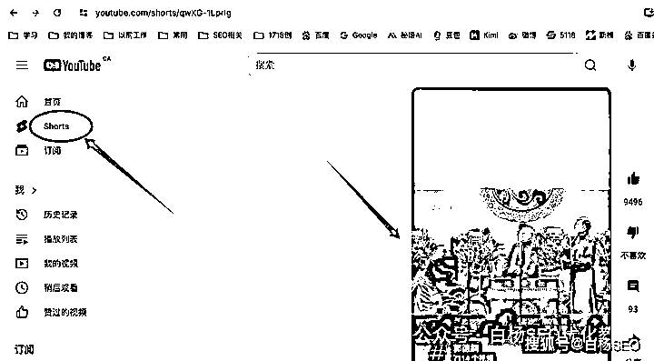

如果你对比国内来说，就相当于微信里的视频号。别说，还真有点像。微信（加了国际版 wechat）月活是 13 亿+，而 youtube 全球一起应该月活有 20 亿+，都算大哥大是不是？哈哈哈。

youtube shorts 跟 google 有啥关系？简单打比方说，很多年前 youtube 被 google 收购了，成了儿子，那么 youtube
shorts 可以简单理解成是 google 的孙子哈哈哈。当然从业务角度来说，它是 google 旗下的一项业务。

youtube
shorts 跟 tiktok 有啥关系？两者啥关系也没有。一个是谷歌的，一个是抖音母公司字节的。如果非要说有关系，那也是竞争关系，因为 tiktok 在短视频领域发展快，所以 youtube 推出了 shorts。

当然也还有相似之外，shorts 跟 tiktok 都是短视频平台，只是 shorts 可以发 10 分钟，tiktok 只有 60 秒。短视频功能和盈利方式也大体相同。

tiktok 的算法更注重个性化推荐，根据用户的兴趣、行为等数据，为用户精准推送感兴趣的视频内容，而 shorts
的推荐算法则会综合考虑视频的热度、相关性、用户历史等因素，还会受到 youtube 整体算法的影响等。

**youtube shorts 怎么注册及发布内容？**

白杨 SEO 在这里先声明：至于怎么才能用上 youtube 的上网环境请你自我解决，上去以后也千万不要干违法相关的事！

youtube shorts 怎么注册？

首先，你需要注册一个 google 的 gmail 邮箱。

注册 gmail 邮箱，你可以下载一个 QQ 邮箱，然后添加邮箱时选 gmail 邮箱，然后按照注册步骤，填写相关资料，填写 86-你的手机号就可以注册成功。

其次，你用你注册好的 gmail 邮箱，然后打开 youtube，然后登录进去。

这样你就注册成了 youtube 用户了，这个时候我们需要做一些基础动作，浏览，查看，点赞看一些 youtube 视频，不要马上去发内容哈。

最后，我们先开通 youtube 频道，然后后面就可以发 shorts 了。

我们在 youtube 官网右上角点 create a channel，然后创建，然后想个名字，至于名字，你可以用品牌，企业，个人名看你，比如我的。

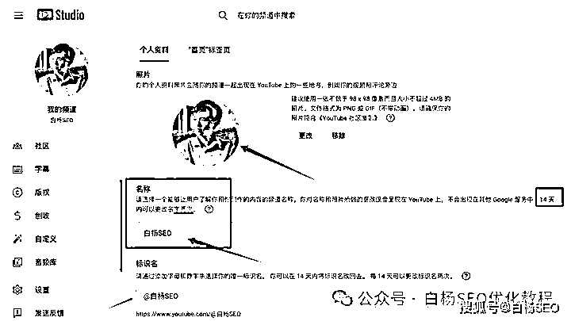

youtube shorts 怎么发布内容？

youtube
shorts 发布内容，有两种方式：一种是在电脑网页端，一种是在手机 APP 上。如果是后者，你的手机里需要下载 youtube 这个 APP。如图，因为我这里是写文章，我就用网页端举例，实际我用 APP 上传的哈（为啥，网页端不能选音乐，APP 上可以）。

youtube shorts 怎么发布内容流程：

1）我们进到 youtube 官网，然后点 shorts

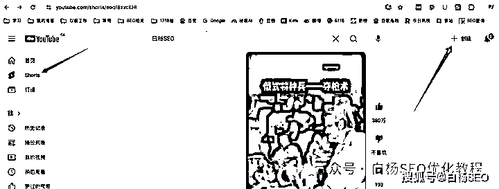

2）我们点右上角的【创建】，然后点上传视频，然后添加文件

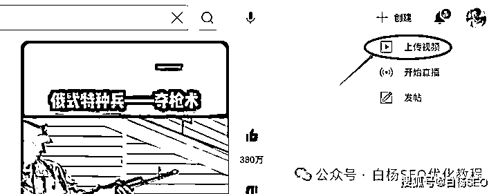

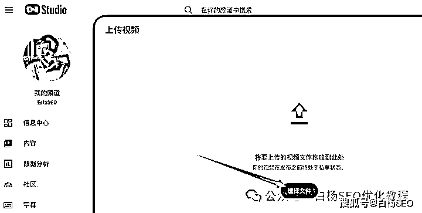

3）我们选择我们做好的视频，然后添加详细信息，以及一些要求，如图。

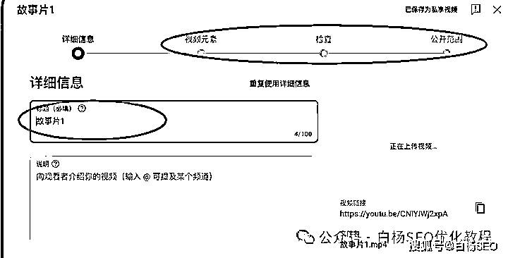

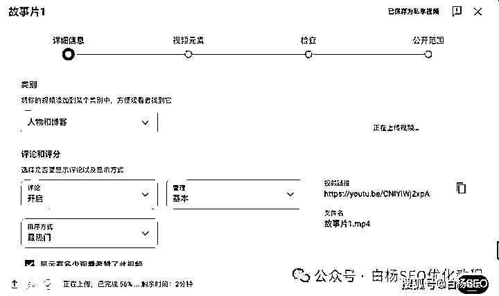

4）全部设置好，点上传发布即可。

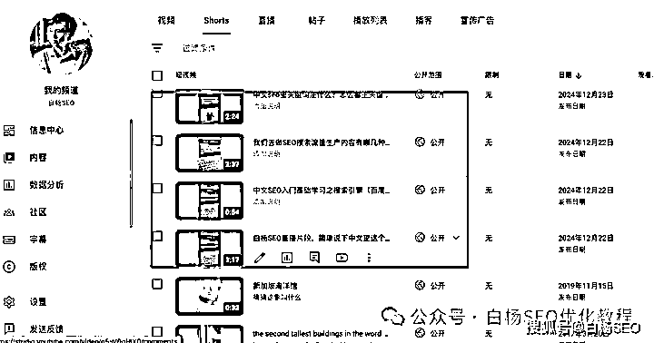

看上去这个是不是很简单？其实就和你在国内发抖音，视频号视频是一样的。核心点是：你要发什么内容，你怎么生产这些内容，以及怎么让这些内容带来流量，怎么变现！

白杨 SEO 在这里再多补充说一下：

**  **

你要发什么内容？这个取决于你的定位。比如我现在用这个发我分享 SEO 的，我我个是为了吸引对 SEO 感兴趣的华人，想做国内流量的。以后我也可能会做别的，暂时保密。

你怎么生产这些内容？你可以自己原创，比如内容出海顶流李子柒。你也可以用 AI 生成视频，国内有很多 AI 视频生成工具即梦，可灵等。你还可以模仿 youtube
shorts 或者 tiktok 上的热门视频做二剪或混剪发。

怎么让这些内容带来流量？白杨 SEO 擅长是搜索流量，所以我主要就做搜索流量，下面还会继续写到。如果你想要 youtube
shorts 推荐流量，你就要去了解它的推荐流量规则，比如热点视频，热点音乐，热点事件，比如娱乐，小动物都是有流量的。

怎么变现？创作者都可以通过平台的广告分成、品牌合作等方式获得收益。例如，youtube
shorts 的创作者可加入 youtube 合作伙伴计划，通过广告收益分成盈利，甚至后面的带货等等。

当然对于白杨 SEO 来说，可能目前还是提供咨询服务或者合作，因为还是有很多想要做中国这个大的搜索市场。当然，比如有人通过 tiktok 帮国外商家买货，有人通过 tiktok 吸引老外来中国旅游，youtube
shorts 可以吗？也可以！

youtube shorts 怎么用来做搜索流量？

youtube shorts 做搜索流量，也就是我们说的 youtube shorts
seo(这也可能是白杨 SEO 第一个提哈哈哈)。这里可以分为 youtube 站内搜索与 google 搜索流量。

youtube shorts 怎么做搜索流量呢？核心还是和我们平常做其它 SEO 搜索流量一样：找到有流量关键词以及流量关键词用户搜索需求长尾词，

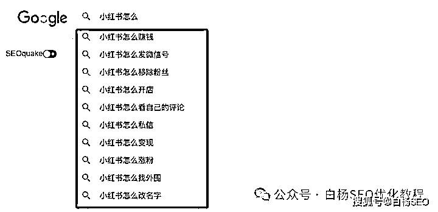

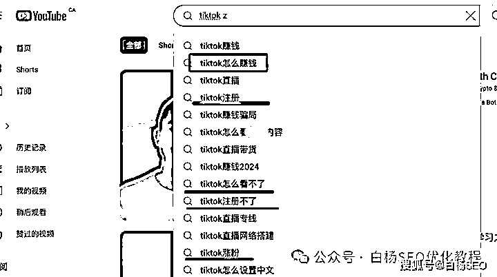

然后根据这个词生产短视频内容，再然后发布时把关键词布局在标题，描述中去。

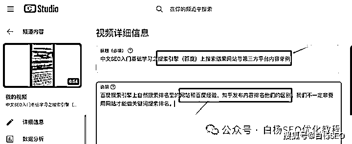

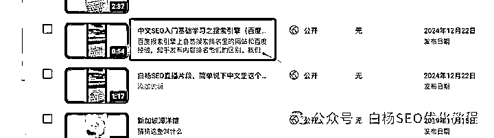

然后我们去看这个 youtube shorts 是否被 youtube 收录，被 google 收录。举例如图，

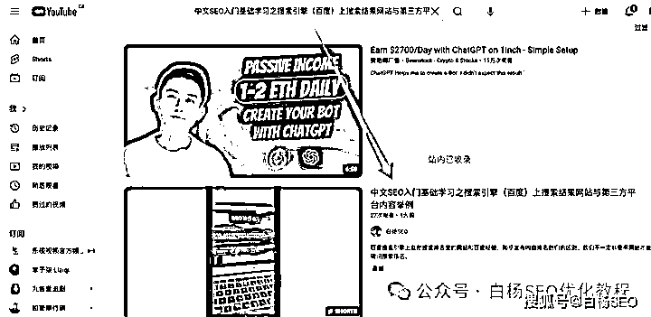

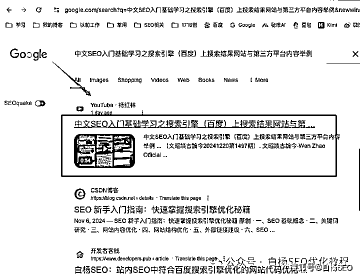

如果被收录，我们再去看我们布局的用户需求长尾关键词是否有排名，然后再缩短流量关键词是不是有排名，

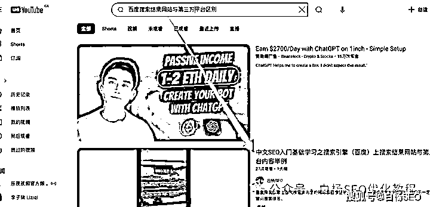

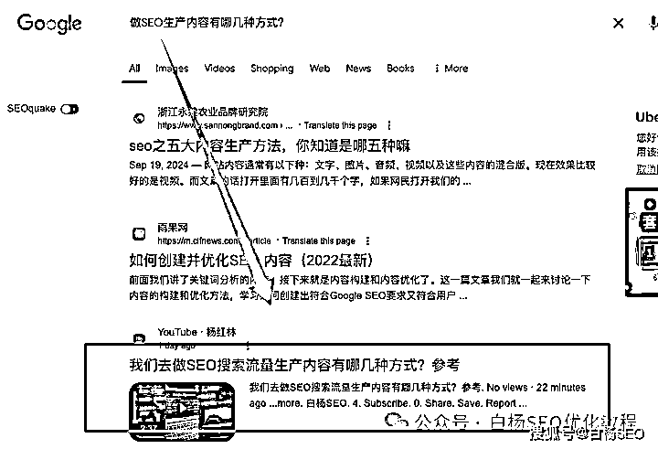

如果在前十，基本完成了。如果还没有排到前十，我们需要做一下 youtube shorts 这个视频的数据。

看 youtube 和 google 排名的因素，除了关键词相关，时效性外，是不是和内容短视频排名一样，搜索点击率以及用户的互动，如果是，朝这个方向做就是了。

你可能还会说：白杨 SEO，你上面举例那个词太长了之类，中文与英文搜索结果又不一样等等，你的播放量那么少等等，你说的没错，即使你换成英文词 youtube 依然有排名。

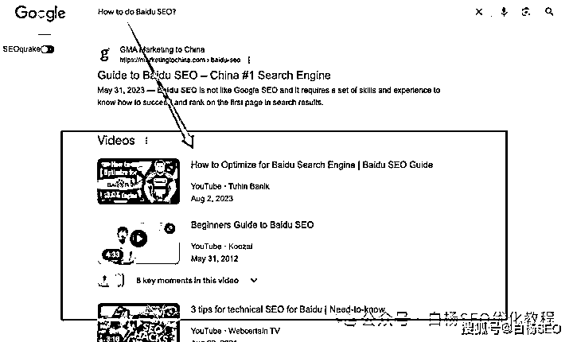

好了，今天就写到这里了，我希望大家是行动派，实战派，而不是什么质疑派，空想派。

我只希望你去思考：你的业务适不适合出海，有没有人会为你的业务付费，有就去做。想都是问题，干才有出路！

对了，你有什么想法，还想看我写什么，可以留言。

白杨 SEO，专注 SEO 十年，全网 SEO 流量实战派，对互联网精准流量有深入研究。全网同名个人品牌：白杨 SEO

* * *

评论区：

星空 : 大佬，可以写一篇 reddit 的吗，它才是谷歌的亲儿子

白杨 SEO : 关注着，以后空了有时间在写哈