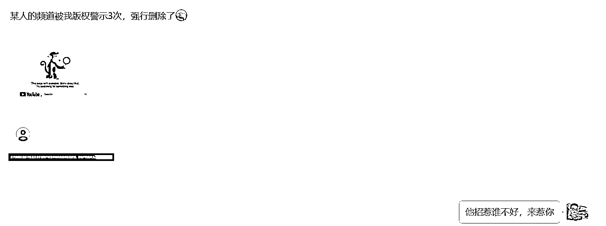
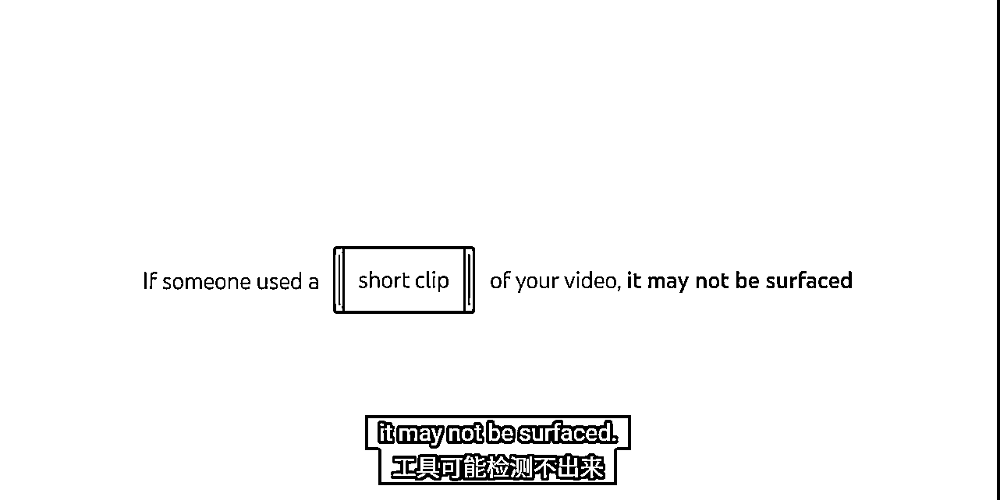

# YouTube 赚钱，视频被人搬运了怎么办？不要慌-版权匹配工具用以来发现和打击盗版和搬运行为

> 原文：[`www.yuque.com/for_lazy/zhoubao/kotgkrupvumk7kqa`](https://www.yuque.com/for_lazy/zhoubao/kotgkrupvumk7kqa)

## (8 赞)YouTube 赚钱，视频被人搬运了怎么办？不要慌-版权匹配工具用以来发现和打击盗版和搬运行为

作者： 书情小跟班

日期：2024-12-24

在【关于搬运遇到版权主张的处理方式】[`wx.zsxq.com/mweb/views/topicdetail/topicdetail.html?topic_id=1525144828284412 这个帖子是搬运者的视角，那我们看看从原创作者的视角是怎样的一个世界，把微信群消息进行打码，个人隐私抹去。`](https://wx.zsxq.com/mweb/views/topicdetail/topicdetail.html?topic_id=1525144828284412 这个帖子是搬运者的视角，那我们看看从原创作者的视角是怎样的一个世界，把微信群消息进行打码，个人隐私抹去。)

群里这哥们，眼里容不得沙子，如下图，目标视频的删除时间有三个选项：

1、已经安排：发送 7 天通知

2、标准：立即请求删除

3、防止此类内容的副本将来出现在 YouTube 上如果您的删除请求有效，YouTube 将尝试阻止新上传的内容出现在平台上。

1、已经安排：发送 7 天通知 在前面的分享，如果你的视频勾了属于混剪，那么会给你带来流量，提醒对方，我知道你，先放着不处理

2、标准：立即请求删除 字面意思，我不想跟你多说废话，如上图这哥们的脾气

3、防止此类内容的副本将来出现在 YouTube 上如果您的删除请求有效，YouTube 将尝试阻止新上传的内容出现在平台上。 不让别人再发

一般情况下，要有容人之雅量，YouTube 推荐算法的特性，别人混剪或搬运是有一定可能给你的频道带来流量的，没必要一上来不给别人活路。

有人搬运你的视频，YouTube 官方会给你提示，如下的图

你知道有人搬运你的视频，你给对方版权警告 3 次，对方的频道就 88 了

这里我做一个说明，如果你想把对方的频道直接干死，那么你应该多次投诉，具体来讲，假设你发现你的四个视频被人搬运了，你需要对这四个视频，每个视频投诉一次

这样就直接把别人的频道干到视频无法盈利，频道也被 YouTube 官方封掉

关于 YouTubeu 判定原创后面再稍微补充下，先跳过

YouTube 官方会告诉处理的一个进度情况

接下来我们聊另一个话题，看图说话

我先给官方的原视频链接，英语好的朋友，可以直接英文原视频

如何使用版权匹配工具 [`www.youtube.com/watch?v=R_zXuVReajA`](http://如何使用版权匹配工具)

下面就说说具体的意思，如果你英文厉害就跳过

说明下这个 Copyright Match Tool 是所有已经被批准加入 YouTube 合作伙伴计划(YPP)的人都可以在后台访问这

个工具。

如果你是刚做，那么就如下图

这里把相关的知识点也多说一嘴

如果你已经想好了做什么赛道，记住一点，同行是最好的老师，你最少准备两个频道

1、生活日常频道

2、你赚钱的频道

为什么说同行是最好的老师呢？

短视频也好，直播也好，写文章也好

就是一个字：抄

如果想要做的更好一点，那就是：杂交

前期就是 1 比 1 的去抄，选中一个领域，搜索领域关键词，关注几百个优秀的同行！

以后就刷关注页，只要刷到这个人的作品，刚发一小时以内，有个几百赞，那可能就有火的可能性，这个时候如果你能复制他的内容，就 1 比 1 的去抄

等抄熟练了之后，你也可以玩玩杂交

什么是杂交？

比如你关注了好几个同行，类型都差不多，有人开头用的好用，别人的开头，有人封面做的好，就用别人的封面，有人中间内容陈述的好，就用别人中间陈述的内容，有人结尾用的好，就用别人的结尾

把优秀的同行好的地方拿出来，杂交成了自己的，这就是杂交，每一点都做得好。那你火的可能性就更大！

我这里给大家看的频道是我生活日常频道，我自己想看啥看啥，想订阅啥订阅啥，我赚钱的频道，我只关注同行，因为我订阅的全部都是我的同行，YouTube 记住了我的喜爱，在我的首页都是我的同行，方便我对标和杂交。

如果你没有达到 YPP，但是你又想有这个工具，那么你应该联系 YouTube 的 YPP 支持团队，要求他们为你开通这个工

具。

比如说，你去官方渠道留言，如下所示

##### YouTube 官方 X 客服

[`x.com/TeamYouTube?ref_src=twsrc^google|twcamp^serp|twgr^author`](https://x.com/TeamYouTube?ref_src=twsrc^google|twcamp^serp|twgr^author)

开个玩笑，视频底下有版权管理工具申请的链接

[`support.google.com/youtube/contact/copyright_management_tools_form`](https://support.google.com/youtube/contact/copyright_management_tools_form) 点击链接，填上相关的信息申请就好

我们还是聊回正题，解读这张图

Matching videos 匹配的视频，视频信息会列出来，如标题

Total views 视频的观看次数 该视频在对方频道中的总观看次数

Subscribers 搬运你视频的频道的订阅数

% match
显示的是匹配内容的占比。它反映了对方的视频使用了多少您的内容。如果数字是 100%，则代表完全匹配。那么对方可能一点都没改，原封不动的对你的视频进行搬运就再次上传了

Date 时间很好理解，匹配视频发布或上传的日期。

补充说明：如果东抄西抄，还真是有可能系统检测不出来

接下来是对这三个行动的说明

**归档：**

你知道对方使用了你的内容，但暂时不采取任何行动。你不采取行动的原因可能有很多

1、该视频的总观看次数很少，不会带来收益，因此你觉得没有必要理会。等到观看次数暴涨视频火了，你可能会考虑采取行动。

2、你认为对方的使用并不过分，虽然不属于合理使用，但他只引用了你视频的占比较少，你可能不介意让他使用，因为这对你没有太大影响。

因此，你选择不采取行动。在这种情况下，你可以将其归档。

归档意味着暂时不采取实质性的行动，观望一段时间，看看这个视频未来是否会有起色，或者这个人是否会继续

盗用你其他的视频。

**请求移除视频：**

这一项是最严厉的，如下图，前面有提到过了

这里的细节说一下

已安排:发送 7 天通知

请求得到验证后，YouTube 会给上传者 7 天时间删除视频，避免受到版权警告。如果他们不这样做，视频将在 7 天后被删除。

限期移除，给对方 7 天时间。如果对方在这 7 天内主动删除视频，就不会收到黄牌警告，这是一种友好的解决方案。对方主动改正错误，你也不再施加进一步惩罚。

标准:立即请求删除这些删除可能会导致版权警告。YouTube 会在验证请求后处理视频删除。

立即删除视频，并给对方一个黄牌警告。

一个建议是如果对方是初犯得饶人处且饶人，选择第一个选项放对方一马。如果对方是惯犯，通过各种方法盗窃和搬运你的视频，那么你就应该选择第二个选项，确保对方不仅删除视频，还得到黄牌警告。就像前面那位哥们一样。

与频道联系：

当你点击这个选项时，你只需填写你的电子邮件地址，注意，这个邮件地址对方是可以看到的。这相当于一个友好的提醒，告诉对方:“某某某，我已经注意到你使用了我的版权内容。”

你操作后，YouTube 团队会直接向对方发送一封标准信函。虽然这封信不是你亲自寄出的，但对方会看到你的

电子邮件地址。他们可以选择私下联系你，比如请求许可，解释特殊情况，或者请求你的原谅，并承诺马上

删除初频

一般不建议这么做，就像前面那位哥们，直接就让官方把侵权视频删了

关于搬运的可行性：理论上是可行的

比如说原创内容的作者在国内某个平台发布，比如说抖音，搬运者把视频搬运到 YouTube 上。注意，他不

是原创作者，只是一个搬运工，但他在第一时间发布在 YouTube 上。那么这个搬运的人就是原创了。

也就是说谁第一个上传，谁就是原创，等那个真正的原创作者上传视频到 YouTube 的时候，李逵变李鬼了，这个就有意思了。

李鬼把李魁的视频三个黄牌直接把李魁的频道干死，当然了这是极端情况下，YouTube 官方也不支持你滥用这个（Copyright Match
Tool）版权匹配工具。

这里补充下李魁的反制措施：

1、可以进行申诉，有可能申诉不起作用,YouTube 官方它不是法院，它只是一个平台，不怕对方耍流氓，就怕对方是有文化的流氓。

你也可以认为是 YouTube 的一个漏洞，平台是这么规定的，万一申诉不了，也没办法，认栽了。

2、将对方反杀 你当作没事人，假装不知道这事，但是你先上传到你的频道

注意：你需要将视频设置为私享，你发是发了，但是其他人看不到，你就攒视频，等到好几个视频私享，像前面那哥们一样，直接就三张黄牌把对方频道干死，这样你就完成反杀了，也很简单。

一般情况下，如果原创作者原来在国内，后面来 YouTube 刚发就被李鬼把频道干死，建议懒得申诉了，直接弄个新频道完事，采用方法 2 把李鬼反杀就好

这个帖子一写出来，有可能有部分人会做有文化的流氓，我保持中立态度，每个人做的任何选择都是他（她）当下最好的选择。

你选择做搬运有你做搬运的理由，那就是拼速度，欺负不能上外网的老实人，别人辛辛苦苦做视频，你一下子把别人的视频为自己谋私利，我不喜欢站在道德的最高处做任何谴责。

还是那句话，同行是最好的老师，前面分享的那段话，再复制粘贴一遍

短视频也好，直播也好，写文章也好

就是一个字：抄

如果想要做的更好一点，那就是：杂交

前期就是 1 比 1 的去抄，选中一个领域，搜索领域关键词，关注几百个优秀的同行！

以后就刷关注页，只要刷到这个人的作品，刚发一小时以内，有个几百赞，那可能就有火的可能性，这个时候如果你能复制他的内容，就 1 比 1 的去抄

等抄熟练了之后，你也可以玩玩杂交

什么是杂交？

比如你关注了好几个同行，类型都差不多，有人开头用的好用，别人的开头，有人封面做的好，就用别人的封面，有人中间内容陈述的好，就用别人中间陈述的内容，有人结尾用的好，就用别人的结尾

把优秀的同行好的地方拿出来，杂交成了自己的，这就是杂交，每一点都做得好。那你火的可能性就更大！

再次提醒：你赚钱的频道不要乱看视频，只关注同行，只看同行视频，这样才好把 YouTube 算法驯化，让你的 YouTube 首页只出现你要对标的同行。

关于抄袭，拥有 642 万粉丝的老高也不是一个乖宝宝，没有百分百自己原创，想想也是，天天原创，哪有那么多内容原创呢？

影片的链接 [`www.youtube.com/watch?v=hKqadBXByFo`](https://www.youtube.com/watch?v=hKqadBXByFo)

自己的路最终都要自己选，是选择投机取巧？还是老老实实做个乖宝宝苦哈哈做视频，自己开心就好

* * *

评论区：

暂无评论