# 视频号直播助力公众号日涨粉 1000+

> 原文：[`www.yuque.com/for_lazy/zhoubao/zzigdfkwzntlo0qb`](https://www.yuque.com/for_lazy/zhoubao/zzigdfkwzntlo0qb)

## (7 赞)视频号直播助力公众号日涨粉 1000+

作者： 郭耀天

日期：2024-12-23

大家好，我是郭耀天，人称郭少，生财六年圈友，一直操作虚拟项目，很久没分享，把最近测试玩法分享给大家

最近几天，一直测试视频号直播，借助视频功能，靠直播，单日给公众号涨粉 1000 粉，测试下来，不管是啥领域，啥账号都可以操作，只要直播就能涨粉，特别是一些垂直领域粉丝，粉丝倒流公众号，价值绝大。

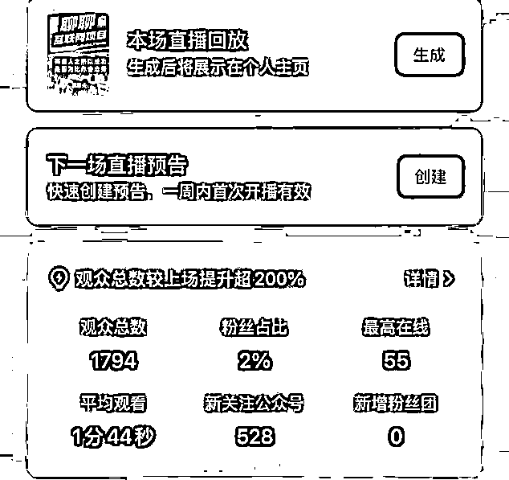

一场直播涨粉 528 人，直播了两场，单日涨粉 1000 人，人人可以复制玩法，我把玩法写出来，帮助需要公众号涨粉，比如引流私域，快速开通流量主，储存粉丝都可以搞起来。

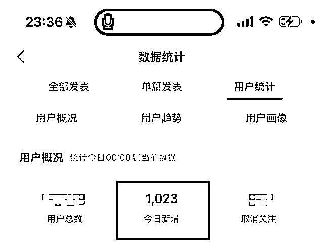

单日能涨粉多少，就看你直播间进的粉丝，目前倒流粉丝三分之一左右。与账号推荐，投流多少有关系，花钱投放，一天涨粉几万几十万都有可能，设置小小门槛，99 元，有需求直接购买直接实操。

原理是这样，视频号与公众号绑定，现在所以公众号与视频号绑定，只要开启展示，直播时候都以公众号身份展示，直播时候，配合直播发福袋，福袋设置关注主播才可以领取，这样粉丝就涨粉到公众号了，下面是具体操作流程，不管是个人号，还是企业号都可以操作。

第一步：把公众号与视频号绑定

公众号与视频号绑定，需要满足一个条件，就是公众号主体与视频号主体一样，不然就算绑定上去，当你去开启展示时候，会提示主体不一样，无法开启，想办法把视频号与公众号主体统一。

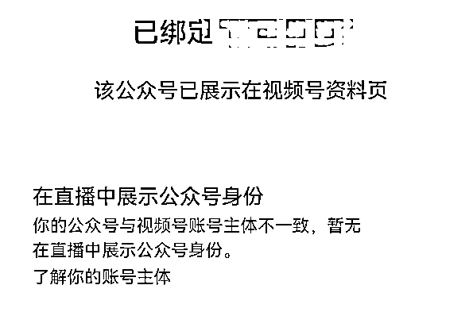

个人注册的公众号，必须使用个人注册的视频号才能绑定，如果你是个人公众号，需要用本人注册的视频号绑定就可以，视频号与公众号的名字可以不一样，只要主体一样就可以，相对麻烦是企业账号。

如果你是企业公众号，想开启开通直播展示公众号功能，首先需要把视频号主体变为企业号，很多不懂的，直接把视频号单独认证，其实视频号可以借助公众号辅助认证，前提是把公众号认证。

这里有会遇到一个问题，很多人是有公众号，但是辅助认证的时候，视频号名字与视频号必须一致，比如我公众号是郭耀天，那么想要辅助认证公众号，视频号需要使用郭耀天。

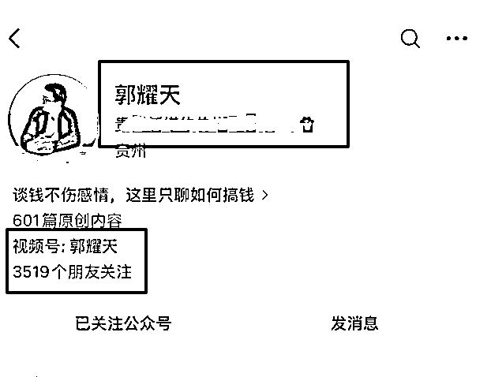

遇到郭耀天被别人注册了怎么办呢？这个时候可以使用郭耀天后面带(±)加减号，或者是点，比如我郭少这个名字，被注册了，最后我只能使用郭少+

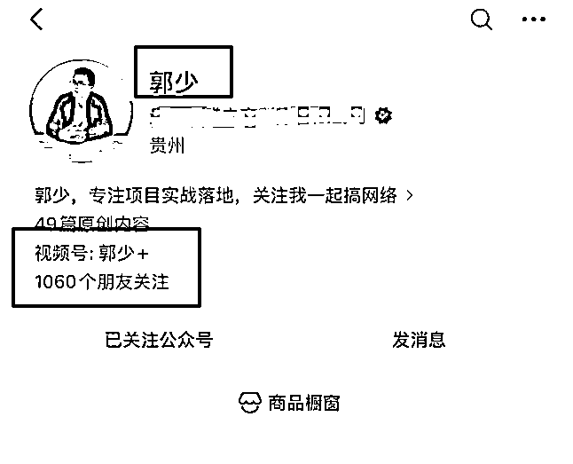

视频号认证也简单，打开视频号创作者中心，点击顶部头像，点击进去点击，机构认证，就可以辅助认证了，根据提示完成认证即可。

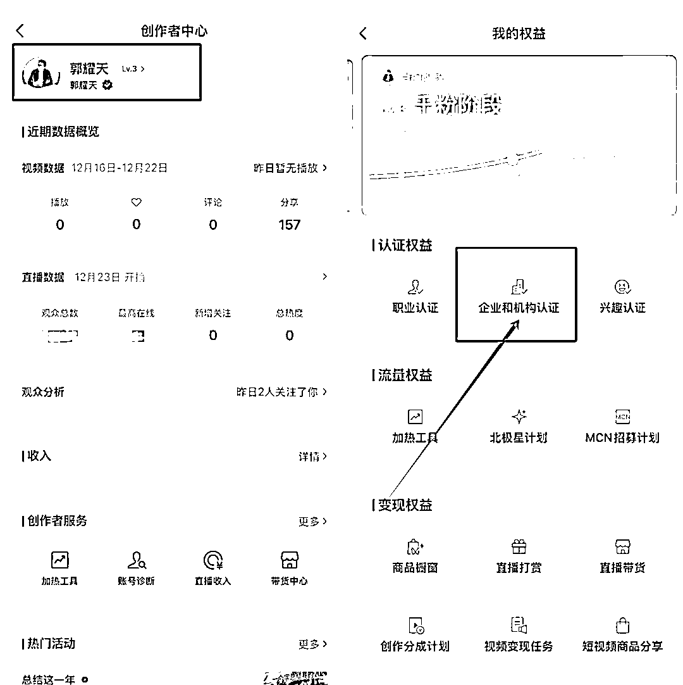

账号认证后，剩下就是把公众号与视频号绑定，可以从视频号上绑定，打开视频号，点击右上角，点击账号安全与绑定，找到公众号，点击搜索需要绑定的公众号，就可以直接绑定。

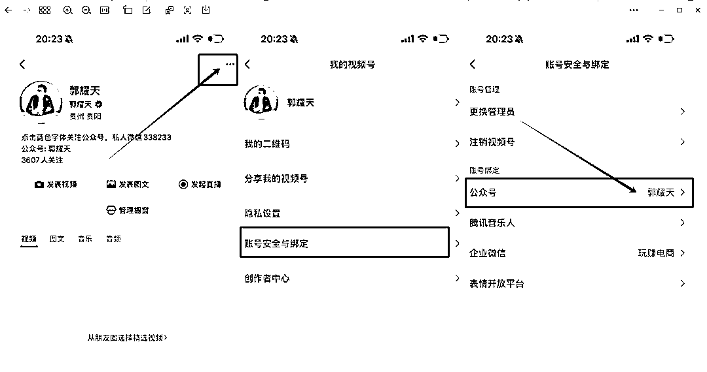

也可以通过公众号绑定，打开公众号，特别是微信号，电话无法接码时候，借助公众号绑定是最快捷的，视频号绑定需要电话验证。

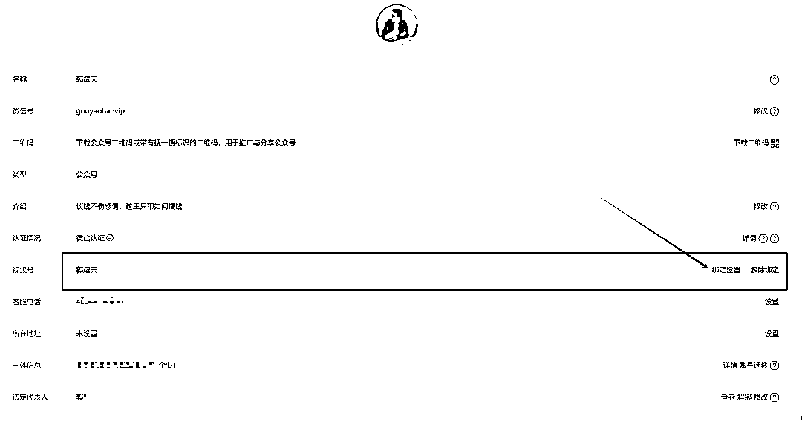

公众号绑定不需要验证，只需要在绑定的视频后，私信里面，收到一条确认绑定信息，点击确认即可，这些都是比较简单的。

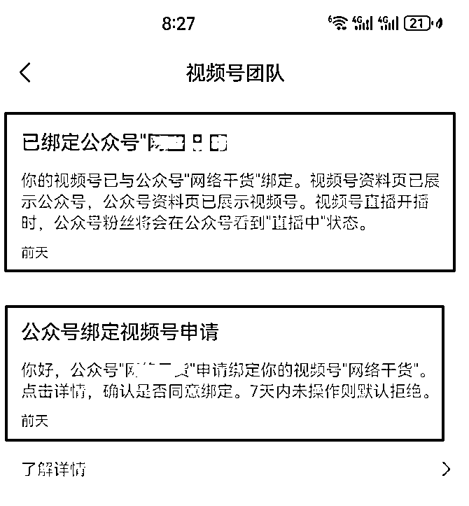

绑定后，前面公众基本就做好，下面就是开启直播，现在所有的账号与公众号绑定，都是都是默认关注公众号的，默认关注按钮是关闭的，开播之前，一定要开启，还是点击视频号右上角，点击账号安全与绑定吗，找到公众号，点击进去，点击开启。

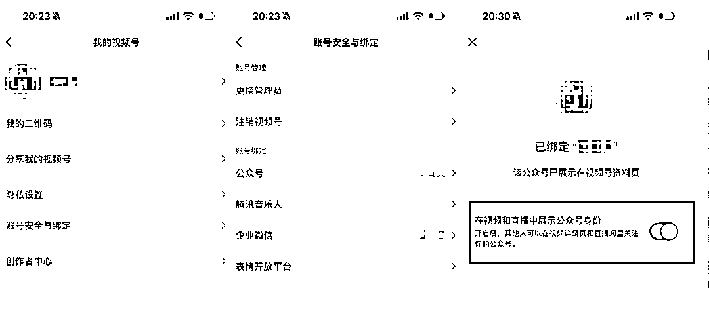

看到这里，很多人估计会看到在直播中展示公众号身份，但是我上面的提示是在视频与直播中展示公众号身份，其实这个是公众号与视频号绑定以前就开放了绑定接口，以前开通的账号不仅直播能展示公众号，发布视频别人也可以关注公众号，目前这样的账号很稀缺，如果你打开你的视频号，显示这样，价值 5000 到一万，还找不到渠道购买。

这里完成后，就可以开启直播，直播这里就不过多的说，大家应该知道，不要违规就好，围观平台不给你推荐流量，你就无法涨粉，正常开启直播，这个时候需要做的一个动作就是发福袋。

直播形式可以选择视频，音频，游戏都可以，不影响

重要是下面的设置，礼物分配可以选择每人相同，也可以设置拼手气，礼物设置多少个，中奖名额就设置多少，这里需要注意是开奖时间，官方默认是三分钟，直接改为 15 分钟，这样时间就比较长，目前是关注领取。

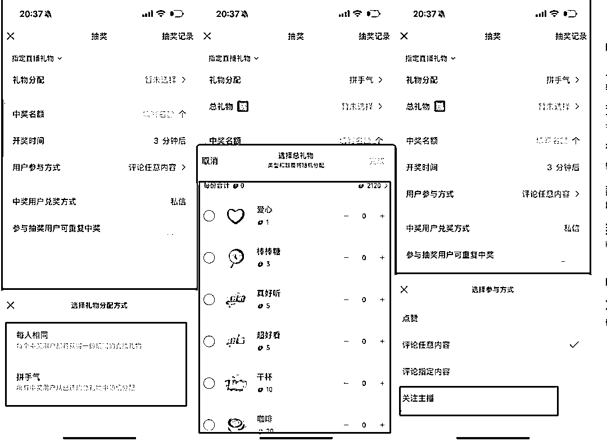

礼物可以选择爱心，棒棒糖，土豪随意，可以选贵一点，你也可以一样选择一点作为活动，都可以，参与方式这里，一定要设置为关注主播，不然不会涨粉，中奖方式可以不管，下面的参与抽奖可重复中奖，开启不开启都无所谓，我是关闭的。

剩下的就是不断的直播，不管的搞流量，流量越大涨粉越快，甚至一些领域，可以直接做投放涨粉，我涨粉 1000 粉，发礼物的成本不到 20 元钱，可以算算成本多低，粉丝会有取消，但是不影响，直接干就对了。遇到有不清楚，不熟悉的地方，评论区打出来

到这里，教程基本就结束了

* * *

评论区：

牛高随笔 : 这种粉丝都是泛粉，说实话没什么价值的。除非是视频号上本来有大量的垂直粉丝，通过直播导流到公众号，这样还有些价值，通过推荐来的抽奖的都是泛粉......

郭耀天 : 是的 这个就看你去做流量了 可以优化很多粉丝进来