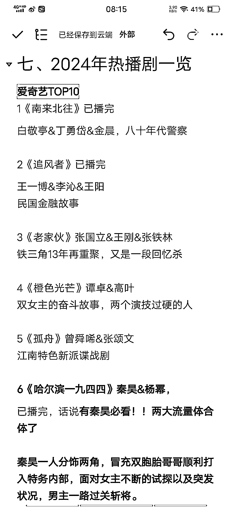

# 互联网造神与毁神：亦仁在生财圈友中的形象变迁

> 原文：[`www.yuque.com/for_lazy/zhoubao/hsno1l5vefkaryr3`](https://www.yuque.com/for_lazy/zhoubao/hsno1l5vefkaryr3)

## (57 赞)互联网造神与毁神：亦仁在生财圈友中的形象变迁

作者： 亦小亮

日期：2024-12-27

昨天看的亦仁发了一个帖子，想让生财圈友送一个圣诞礼物。于是有了这篇文章。

说实话，互联网都有一个在清楚不过的法则，造神然后毁神，当你才进来的时候，把亦仁当神一样看待，觉得他好厉害，他的每个决策都是正确的，他写过的每篇文章，尤其你们看到的小灯塔，正中下怀，觉得他很神奇，不仅仅会赚钱，还能这样提供情绪。

进生财的前期可以说是把亦仁当神 ，一段时间后，在航海遇到了不好的体验，然后就疯狂的 diss 亦仁，什么生财嘛！各种谩骂，随之而来。

对于 2020 年就进来生财的人来说，我说说我的体验，我是受到 V 先生的影响进来，外面都是亦仁的传说，真的进来了，一年拿了 5 篇精华，直接进了龙珠俱乐部，感受着这个男人的魅力，慢慢的，时间来到了一年以后，亦仁推荐了一个圈友的星球，奔着亦仁的推荐进去了，后来非常失望，这个星主很少更新文章，都是助理在运营，第二年果断不续费，开始觉得亦仁不神奇了，开始警惕亦仁的推荐，慢慢觉得亦仁不神奇了，他的一些战略决策也不完美了，他在我心里已经不是神了。

我一段时间的困惑，在不久的将来，这种困惑是积极的，因为才进生财的时候，亦仁是百万级别的神而我只是小白一个，认知还在个位数，一年后，我的认知已经达到 5 位位，与亦仁的差距缩小了，我的认知觉得他不神了，是因为，我跟他的差距缩小了，虽然差距仍然很大，但是相比 418 进来的差距，对我而言，我的进步是非常大了。

我这里说了这么多废话，用一句话来总结，就是你的认知的改变，塑造了亦仁在你心里的地位，每个生财人，特别是我们这些小白，从对亦仁的神，还行、普通，就这样，最后牛逼，一步步的进化，亦仁的变化对我们而言，我们一年都见不上一次面，真真切切的感受不到，但是可以感受到自己的变化。

看了很多人联系鱼丸，送花篮啥的，我才不会送，我就送给亦仁一份 3000 字的航海建议，毕竟现在生财是娘家人了，我真心希望生财一直好下去。

* * *

**进 入 正 题**

首先我的理解，无论是志愿者、领队、教练，都是生财官方的志愿服务人，只是大家把志愿者、领队和教练区分开了而已。

作为已经参与了生财志愿服务的次数已经很多了，这里就聊聊关于航海的志愿服务，并且给生财提一些建议。

# 一、关于打卡问题：

### 1、不同视角看打卡内容

船员：第一视角就是自己的日志，其实，是可以查看别人的日志，尤其领队推荐的精选好事日志，可以去瞄一眼。

志愿者：我觉得在打卡这层面，志愿者是所有视角下，受益最高的，可以学习很多人的东西，这也是我选择志愿者其中一个缘由。

领队，领队会选择志愿者推荐不错的日志，这个视角下看到的只是冰山一角，都是什么好事精选。

教练，教练会看到被领队推荐的日志，日志的内容，大体是一些项目典型问题及好事精选日志。

我拿本次作为 YouTube 志愿者来说。

从数量来看，每个志愿者看到的日志是最多的，受益也是最高的，当然也能发现大家对一个新项目起步阶段，前期都是在账号啊，魔法啊等问题逗留时间最长的，看看前几天的日志就能发现，到中期其实就是频繁换选题来测试，后期都是提高效率上的问题，比如努力提高做出一个视频的时间，一天多做出几个视频等等。

从质量上来看，领队相对省去了，看千篇一律的日志的机会，被推荐到眼里的都是写得不错、获得好事的日志。

教练看到的日志里面是领队进一步筛选，把典型问题留下，好事留下激励其他船员。

### 2、打卡内容

这是现在的打卡内容：

> 今日发布作品数量
> 
> 昨日最高浏览量
> 
> 昨日 GMV
> 
> 今日收获
> 
> 待改进的地方
> 
> 明日计划
> 
> 记录我的航海成就

这个打卡内容就是 7 个问题集中起来的产物。

整个打卡内容偏一味追求收获成就，应该加一些遇到什么困难之类的，因为不是每个航行人都是一帆风顺的，也有不顺的，应该把一些困难、遭遇用共情的方式记录下来。

我列举一些问题，生财团队参考啊。

（1）今天遇到什么困难?是如何解决掉的?没有解决掉的话，可以寻求哪一方面的帮助。

（2）对你而言，你在这个项目看到了哪些机会?

（3）航行一段时间了，说说你打算放弃前行的理由?针对一些 0 次打卡的人而设。

（4）本次航海，你都解决了什么问题？

（5）发现了什么好用的工具?（小程序、网站、app）比如去水印，查看数据。

当然也可以根据不同航行时间，设定不同的问题。

第一周的问题：以基本盘+入门

第二周的问题：以基本盘+深入

第三周的问题：以基本盘+分享

** *不过打卡问题可以根据三个原则来提：有趣、解决实际问题、愿意填写。***

还有一个建议：教练提出一个关于项目的关键问题，大家都可以在下面谈论，类似于圆桌会议。

可以放在这个位置：既醒目又能被重视。 images.zsxq.com/FpwmWxc0lvcky5eInWFZOGOjQF_o)

船员们可以集中回答这个问题，以评论的形式展示出来，这样其实就是非常好的项目素材，也是我下面提到的闭卷的项目开卷的航海，更利于更多人再 21 天拿到正反馈及成果。

### 3、打卡的意义

说实话，自从当了有 7 期公众号爆款航海教练，已经很久没有当航海志愿者了，这次当了 YouTube 航海志愿者，看到有一些船员居然在水卡？

这都已经是生财航行十几期的航海了，当然，估计还是有新上船的船员，不懂生财这个打卡设计的缘由。

** *这里就作为志愿者、领队、教练的角色，来嘴替一下，嘴替的不好，生财团队和其他志愿者补充一下啊。***

为什么要把航海的执行操作、思考、结果写出来？

**一方面，有助于记录执行一个项目的过程** ，如果没有记录，单纯的去完成一个项目，或许在完成一个账号的搭建后，还想在搭建另一个新号，却对之前的步骤遗忘了，这样就需要重新去锊一遍，不如把这些记录下来，回过头来，自己学习，还是整理出来提供给别人，都是非常好的策略。

**一方面，这种形式跟共读一本书有点相似，** 或者更贴切的是大家共同答一份考卷，这里不是比谁答的好，答的快，而是大家都能在这份考卷上拿到自己想要的结果，比如赚到钱，学到东西。

每周一三五教练点评，其实就是在抓典型问题及一些船员还没有经历的错误，或者踩的坑。

**一方面治愈做项目的焦虑。** 心理学研究表明，记录可以帮助减少焦虑和压力，你是选择:将想法保留在脑中，结果是杂乱的心绪，更不利于去做项目。

还是选择写下来，结果是清晰的心绪，帮你完成更好的结果。

仅仅将脑中的想法记录下来就可以帮助减轻心理负担。

它能够帮助我们重新审视和理解自己的经历和情感，通过这种认知加工，可以帮助我们更好地处理和解决心理问题，提高情绪调节能力。

**其实，打卡不是目的，改变才是。**

### 4、如何方便快捷有成长性的打卡呢？

上面说了这么多，那么，到底该如何既有成长性，又能方便快捷的打卡呢？

如果把打卡内容看成是一个操作项目 21 天的 6000 字的复盘的话，就是每天 300 字就足以。

可以用这种思考方式来打卡：

一个项目的开始，注定了问题的开始，问题来了，就要寻找解决方案，

可以说是一段提问-寻找答案-获得答案的过程。

比如，找一个稳定的魔法，询问教练志愿者，在获得几个魔法后，比较性价比及稳定性，选择一个，然后出海看效果。

那么，可以一边走一边列问题清单，或者根据项目特性一次性把问题列出来，常规问题和项目问题。

这样带着问题前行，即命中靶心，也能自下而上检测。

21 天后，你完成的不仅仅是打卡，而是一个项目从 0 到 1 成长历程，同时也能看到别人和自己相同的问题的不同解决方案，丰富项目可持续玩法。

**可谓是闭卷的项目开卷的玩法，就在打卡里。**

如果你觉得这个不是你想要的，还可以看看下面这个，如何不用写流水帐的方式，就能把打卡写好？

（1）任务：

一天聚焦一个任务，也就是一个目标。

列出任务所需的所有步骤，添加与该特定任务相关的注释和资源，跟踪进度，把所有相关信息集中在一个地方。

（2）反思：

这些反思记录的是项目瞬间、想法与经历，帮你梳理项目经历、记录记忆、记录经验教训、捕捉个人成长。

（3）创意：

这个创意，你可以认为是天马行空的，包括商业理念、故事情节还是项目选题。

从核心思想开始，添加相关想法，记录可能的后续步骤，纳入任何相关资源或灵感。

我们就拿我做公众号爆款写作项目来举例：

**选题规划**

类型：任务

（1）清晰列举步骤：我打算选择剧评这个领域，那么我就要找到 2025 年待播剧，看看里面的演员阵容，以及网友的一些评价，来简单推断一下这个剧，是否会爆。

爆怎么去写，不爆怎么去写。

（2）电视剧和电影资源都集中在一处：

这份就是我在 2023 年写的 2024 年剧评清单一览，只是一部分。

（3）优先级和状态

那部剧优先级最高，那部剧现在是什么状态（拍摄中、杀青、上央视）

**公众号排版**

类型：创意

一篇文章分为开头、中间、结尾，每个阶段都可以放一些钩子，用来帮助读者关注公众号、点赞、在看、评论、付费。

每个钩子怎么放，放在什么位置，钩子能使读者做什么动作。

**项目反思（我们还是拿剧评这个领域举例）**

类型：反思

主要经验：关于写剧评的框架，写什么剧就能爆，比如三十而已。

文章数据反馈：入池深度、读者特征、阅读量、完读率等等

未来改进：入池了，最大化把后续文章带动入池，还有标题改进等等。

总之，打卡的内容可以从任务、创意、反思三个主题来写。创意不一定天天有，但是任务和反思肯定天天都有，等你有了反思量和深度，你就会对项目有了更多的认知。

### 5、完成打卡的奖励

打卡可以设定两个奖励，不仅仅是海报，比如打卡满 12 次和 21 次，12 次可以得到续航资格报名，21 次得到一本生财日历或者周边，哈哈，可能数量有点大。

这只是一个引子，不一定奖励这些。

# 二、关于航海手册的修订

应该加一项，按照时间线去更新内容，或者以*号做注释，不然老水手有的重新看一遍以前的内容，虽然亦仁以前提过航海手册减负，不过现在有回到了以前的好长好长，无论是选修还是必修。采取补丁的方式加进航海手册里，过往船员直接奔向新加的就行了。

这个位置直接贴上补充的链接。

你可能会说可以看目录直接点击啊，其实电脑版本的航海手册就得多点一下右上角的三道杠才能显示出来。如果你觉得很方便，就当我没说这一条呗。

# 三、关于对于不同船员的处理

按照冷漠、围观、提醒

1、冷漠分真的假的，真的就那种，从头到尾一句话不回复你，也不拍你，完完全全的冷漠，你就可以选择提醒一次完事，假的话，家里、工作真的忙的不可开交，就确认一下（也许还是得不到回复），可以看看他是否在打卡，打的话，可以一周提醒一次。原则上，无论是否打卡，都应该得到志愿者的关怀。

2、围观，虽然围观，但是也要针对不同情况处理，看一下他的日志，遇到什么困难难题，都可以试着帮助一下。尽量一个周也要沟通一次。无论是提醒打卡还是询问项目进展情况。

3、提醒，这些船员，我们不但好好做好打卡提醒准备，也要去看他们的日志。还有一些真的结了婚的，真的就跟时间赛跑，比如这次，虽然没有完成 12 次打卡，但是也完成了 10 次，已经相当不错了，这位船员的情况是这样的：白天上班，下班去医院照顾生病的母亲，回家后要辅导孩子作业，然后哄睡，最后才是自己可怜巴巴的时间。

这就是我送给亦仁的圣诞礼物，请笑纳！

* * *

评论区：

亦仁 : 感谢小亮的这份礼物，很有价值。 不要把我看成神，我只是在赚钱这件事上比大多数人多走了一些路而已。在大多数事上，我也不懂，也做不好，有很多困惑。
做生财有术，是我第一次做社群，还在努力学习怎么把生财有术做好一点，做的不好的地方，感谢大家的包容，期待大家一起想办法一起共创，做好生财有术。

亦小亮 : 第一次都做得这么好，而且是几万人的社群，我连 33 人的社群都做得不够好。

小黄 : 对于日志这件事，我很有体会，也找鱼丸反馈过，以往的日志会有精选日志这一选项，能够看到比较精华的日志，给一些走得慢的人启发。这次参加了 youtube 航海，没有看到这个功能，只有好事墙，有点可惜。以及以往的航海我都会有一种共同走的感觉，但这次没有，很多时候都是感觉各干各的，没有交流的氛围。这一点我想也不能强求，但对于提出的一些比如关键问题大家可以在底下讨论，或者在日志里提到踩坑这个功能，或者精选日志，我觉得都能够让人体会到大家一起走的感觉，我觉得这才是航海的意义。

哎呀妈 : 谢谢小亮教练的分享，提醒我下次航海打卡一定要更关注自己的成长[抱拳]

胖大魔（AI 提效版） : 很久没当航海志愿者，有几句想吐槽的。把 12 次当打卡退押金。欲求其上得其中，欲求其中得其下。

贤雅 : 大部分都是这样的

旭宏 : 这不愧是“亦家人”[强] 摆烂的没必要考虑怎么拉一把其实，尊重他人命运...... 反而是那些日更 12-21 天的，需要更多鼓励。
你们觉得如果把航海押金设置成自己决定金额，上限 1 万或 5 万怎么样啊？ 我觉得有些圈友会原因交更多押金， 押金交得钱多意味着重视度高、注意力投入就更多。
也给自己一个积极的心理暗示和压力。 同时也可以把我交了一万块决心要完成一件什么事，发朋友圈或好友，做一个做公开承诺，倒逼这类本来就重视的圈友更加投入

亦小亮 : 押金自己设置，也挺有意思的