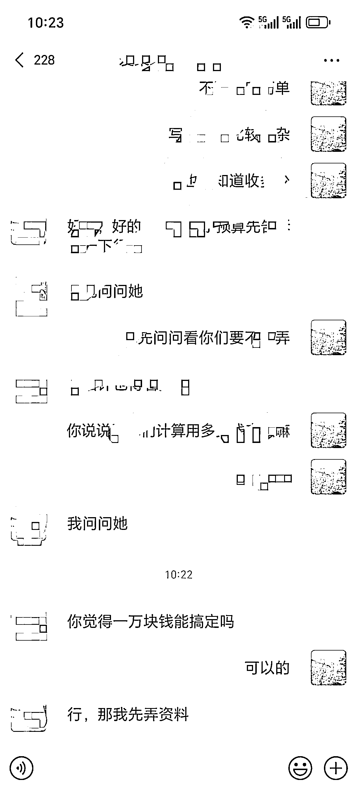

# Cursor 编程就是七天大圣，好不好用就看你会不会念紧箍咒，AI 航海变现 5 位数的一点经验分享

> 原文：[`www.yuque.com/for_lazy/zhoubao/xg6an32gfwya6q4g`](https://www.yuque.com/for_lazy/zhoubao/xg6an32gfwya6q4g)

## (8 赞)Cursor 编程就是七天大圣，好不好用就看你会不会念紧箍咒，AI 航海变现 5 位数的一点经验分享

作者： 泊林家

日期：2024-12-27

[#龙珠悬赏](https://wx.zsxq.com/tags/龙珠悬赏/48824518525858)

今年整个主业发展缓慢，后底的时候，刚好要想明年这个路要怎么走，刚好超级标 3 发布，之前很少关注 AI，结合自已的实际情况，感觉自已可以从 AI 入手，找到变线路径开启另一个搞钱方向。

接着 12 月的航海来了，就毫不犹豫的选了 Cursor
AI 编程。正在想要怎样才能学好 Cursor 编程呢，也正是在这个时候，一个朋友找到我，说她们公司想要做一个样品管理自动化的东西，想用微信小程序来实现。真是想睡觉的时候有递忱头，这不正是最好的练兵场么。要是以前我可能会找一个专门的人来做这个，但现在有
Cursor，我完全可以自已把这个钱挣了

这次航海的一个改进非常棒，就是一报名参加航海就可以看到部分航海手册。所以一报完名就开始学习航海手册，然后再通过网页版的搜索功能，很多 Cursor 的使用经验和方法都出来了，特别是 [如何让吴佳文学会使用 Cursor 完成一个复杂项目](https://scys.com/articleDetail/xq_topic/1525488422112812) 还有风向标 [学习 Cursor ，拥抱 AI 编程 | Cursor 101](https://cursor101.com/zh) 对我帮助比较大。

在整个航海期间我大部分时间都是在用 Cursor 来弄我这个小程序，因为以前也没有写过小程序，从安装微信开发者工具开始，包括云函数，云存储，云数据库，基本上都是通过 Cursor 一步一步指导来完成的。

这个过程中也遇到了很多问题，程序乱了半天达到我想要的结果，就把整个目标删除，重新建一个目录又开始，来来回回不下十次，后面慢慢用的次数多了，对 Cursor 的使用也有一些心得了，Cursor 是非常聪明的，只要我们目标明确，具体的路径就交给 Cursor 来做好了。有时候我就觉得 Cursor
就是七天大圣，对编程无所不能，不管是做为产品经理还是程序员都非常优秀，就看我们怎么使用它，会不会念紧箍咒了。

在航海第 15 天的时候，小程序上线了正式版，客人还是很满意的。

**其实现在回想起来，我还是大意了，对航海手册的重视程度不够，后面小程序发布上线后，再回来看航海手册，我在做这个小程序的过程中遇到的很多问题，在航海手册上都有提及，如果多关注下手册，可以节省不少时间。**

如果说要给自已的这次航海做个总结的话，我觉得

首先，觉得这次航海的改进非常好，
提前开放部分航海手册，可以提前学习，然后再通过生财网页版的搜索功能，可以很好的对接下来要学些什么有个框架的认知，学习起来更得心应手。

其次，我觉得目标明确的去参加航海，可以学到更多，动力也更强，我参加这次航海之前的目标很明确，就是要用 Cursor 写一个微信小程序，帮助别人应用到实际场景给工作提效，虽然在实际操作过程遇到了很多问题，但根据问题去找答案相对来说就比较容易，去干就会遇到问题，然后通再解决问题，这个过程中就可以学到很多有用的东西。

21 天航海虽然靠岸了，感谢教练，自愿者，以及所有小伙伴的陪伴，但 AI 编程这条路会一直走下去，接下来就是找到有价值，可以变现的想法，然后通过 AI 编程来实现

* * *

评论区：

暂无评论