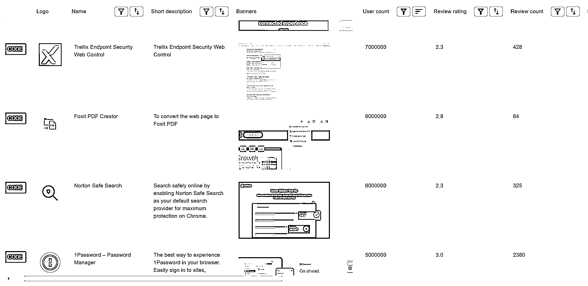
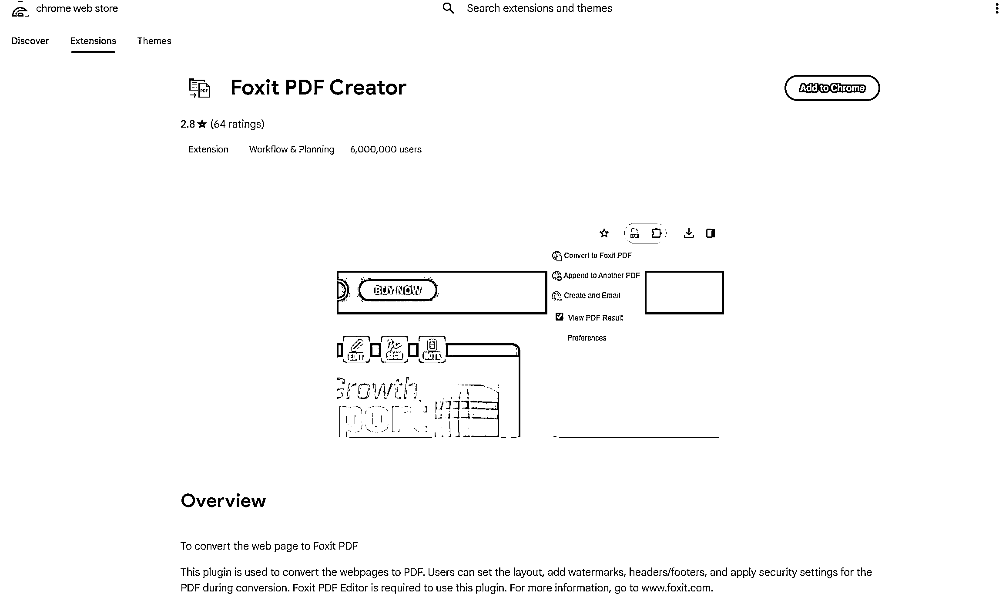
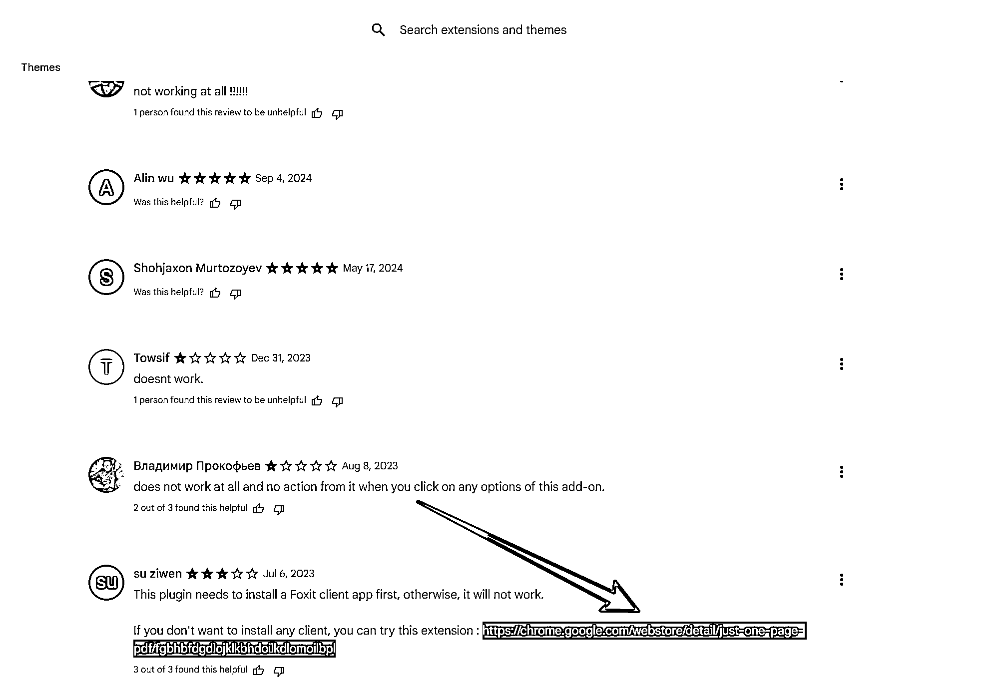
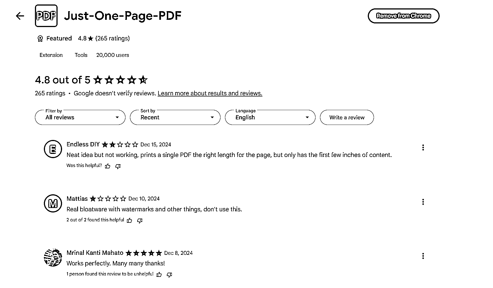
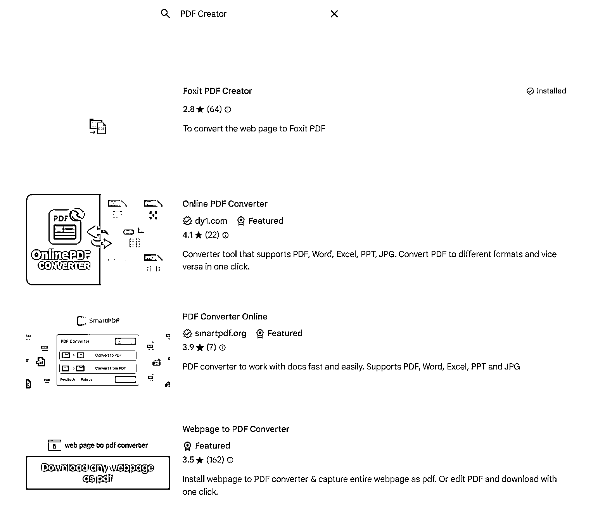
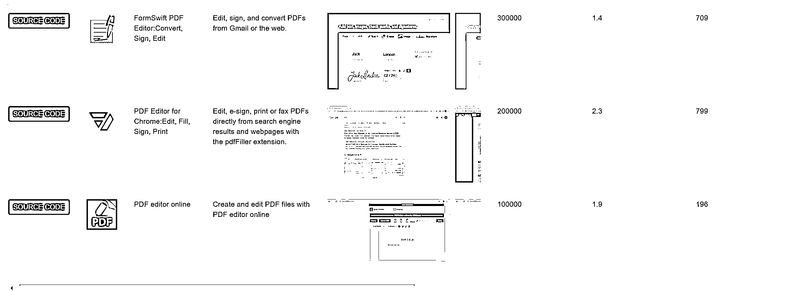
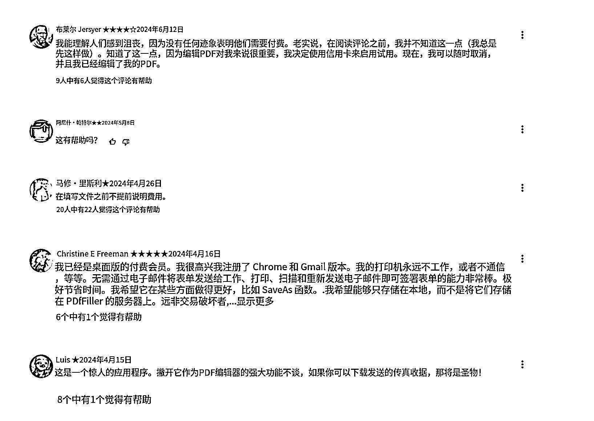

# 找一个能上手有钱赚的对标产品的方法

> 原文：[`www.yuque.com/for_lazy/zhoubao/xd9nxr06c8330i6i`](https://www.yuque.com/for_lazy/zhoubao/xd9nxr06c8330i6i)

## (精华帖)(64 赞)找一个能上手有钱赚的对标产品的方法

作者： 嘟

日期：2024-12-23

看到亦仁的龙珠悬赏，来给大家提供一个思路：

一、 找到一个用户量大，且有付费行为的产品

二、 查看差评，看看金主们还需要什么功能

三、 开发金主们需要的产品，推广变现，赚巨头们顾不上的小钱

* * *

最近在学 AI 编程，我认为比较容易上手的是谷歌插件和网站。

以谷歌插件的数据为例，我筛选了评分低于 3.5 分的插件，按照用户量从高到低排序，可以看到有很多符合筛选条件的工具。

拿这个 pdf 工具来举例，600 万用户，2.8 分的评价。

点进插件评论区，可以看到用户不满的地方是，插件无法使用，没有被维护。

用户量大，有需求没产品，属于很好的开发方向。

而且往下看评论，可以看到，有用户直接放了其他产品的链接，说明这种引流方式是被允许的。

点进这个引流的产品发现，用户不满意的原因是保存的时候有水印。

我去试了一下这个插件，纯免费，默认带水印无法修改，没有给用户提供付费选择。

去谷歌插件市场搜索 PDF Editor ，竞品并不是很多。大多都是只提供 pdf 格式转化，不提供文件编辑功能。

有这个功能的，基本都是付费，而且用户量不小，且评分都不怎么高。

比如这一个，我翻了一些评论，差评最多的原因是，产品描述说免费，但实际不免费，且比较贵，尤其是前面编辑都正常，直到最后一步导出的操作才收费，前期付出沉没成本太多，感觉被欺骗。 images.zsxq.com/FnLWN3nBut7es9PHH8gRNHXhdLWh)

按差评来看，付费是这款产品的唯一缺点，如果一开始就为了收费，那就可能不是一个特别好的模仿对象。

但类似产品下载量都不小，说明需求量很大，且付费用户有很多，只是没有在评论区表达意见，有很多值得学习借鉴的地方。

如果要去对标这款的话，做比已有付费产品更低的价格，预先说明付费标准，可能是个出路。

从技术难度来说，文档处理相关的开源程序很多，让 AI 去写一个，应该也不会太难。

以上举例是我的思考过程，**低分高下载量** 的谷歌插件还有很多，感兴趣的可以去翻一翻，找一个自己认为合适的，去上手练一下。

这是数据网站：

[`cws-database.com/`](https://cws-database.com)

如果你有其他思路，欢迎评论区讨论或发帖分享！

* * *

评论区：

暂无评论