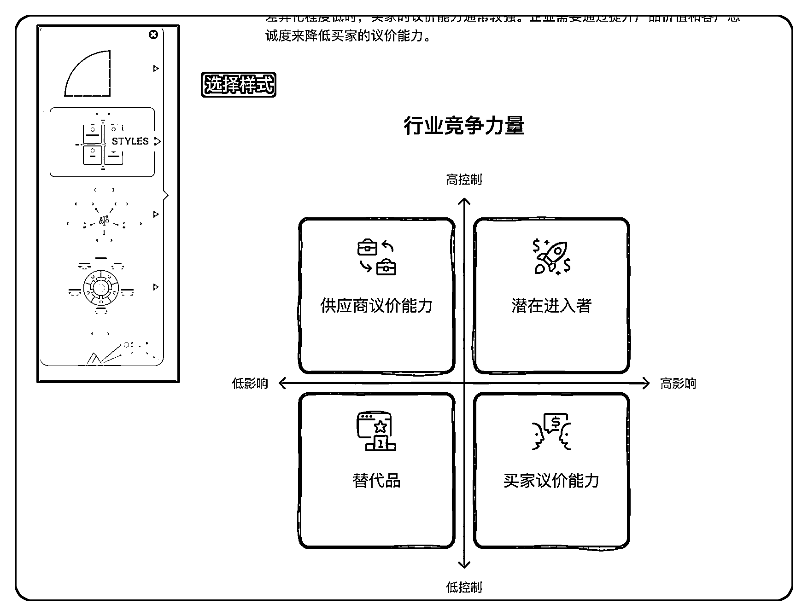
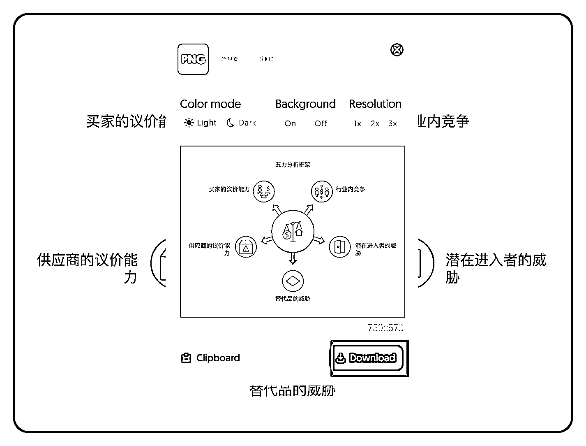

# 年终报告只有文字干巴巴？分享一个 Al 图表神器，助你快速制作高大上的图表！

> 原文：[`www.yuque.com/for_lazy/zhoubao/cr39t1ico8w3i6xl`](https://www.yuque.com/for_lazy/zhoubao/cr39t1ico8w3i6xl)

## (25 赞)年终报告只有文字干巴巴？分享一个 Al 图表神器，助你快速制作高大上的图表！

作者： sky 陈天

日期：2024-12-20

生财圈友们大家好，我是 sky 陈天，一名 Al 企业培训讲师、Al
办公提效顾问，年底要到了，大家都要做年终总结和汇报了对吧？今天给大家分享一个我**压箱底的 AI 图表可视化神器** ！

这周我出差去上海交通大学给企业家讲 AI 课，培训完顺便回了趟老东家，跟一些老同事们叙叙旧。

聊着聊着，他们就问我现在有没有什么好用的 AI 画架构图的工具可以推荐。

毕竟，我们一直做 To B 企业服务业务，尤其是像我之前给大企业做各种解决方案的时候，要**做海量的图表和 PPT** 啊！各种产品架构图，画到你手软！

实测了市面上 10 多款 AI 图表工具，今天我就给大家安利一款我认为市面上**最好用的图表神器——Napkin！**

**Napkin 的核心功能就是能够快速生成各种各样的可视化图形。**

而且，这些图形不仅**专业度非常高，样式也特别丰富** ，用起来那叫一个**丝滑流畅** ！不管你是在职场汇报，还是制作 PPT，这款工具都能让你事半功倍！

相比于 PPT 里边自带的那个智能图表，**Napkin 的表现简直优秀太多了！**

## Napkin 效果演示

我给大家看几个实际的案例！

比如让他生成一个客户拜访的流程图，**清晰明了，逻辑关系一目了然，而且配色也很舒服，是不是效果还不错。**

这是一个用 Napkin 生成的 DIKW 模型，**各个分支清晰，层级分明，重点突出，** 非常专业。

再来看一个 AI 的系统架构图，**它也能轻松搞定！** 各个模块之间的关系清晰明了，而且图形的样式也很专业，**拿出去给客户看，也会觉得非常专业！**

## napkin 怎么用呢？

怎么样？是不是觉得很厉害？**别急，接下来我就手把手教大家怎么用这款神器！**

**第一步：打开 Napkin，注册账号。**

首先，你得先打开 Napkin 的网站：[`www.napkin.ai/`](https://www.napkin.ai)

常规得注册登录一下

**第二步：新建一个画布。**

打开之后，我们先新建一个画布。你可以**直接让 AI 帮你生成文档** ，也可以**上传你自己已有的文档或者想法** ，让 AI 根据你的内容来生成图形。

比如我们可以让它给你生成一个波特五力模型的文档，首先他会给你生成文本，然后你再确认文本后再生成。

**第三步：开始生成图表！**

选中你要生成图形的文本内容，点击“生成图片”按钮（一个闪电的图标），Napkin 就会开始“施展魔法”了！它会根据你的输入，快速生成一个对应的图表。

**第四步：选择样式，精细调整。**

生成图表后，你可以根据自己的喜好，**选择不同的样式，还可以对图表进行精细的调整。**

**第五步：下载图片**

调整好了之后，点击右上角的下载即可下载到本地了，还可以调整图片的背景、格式、清晰度等等。

**整个过程非常简单，大家可以自己去尝试一下，真的很容易上手！** 还有很多更细节的功能，大家就自行去探索吧，图表的可修改性还是很强的。

**而且，重点来了！目前 Napkin 是完全免费的！** 几乎上市面上还没有找到这个工具的平替。

年底刚好需要做年终汇报，就可以用 napkin 做好看的图表来汇报，赶紧去试试吧！保证你用了就再也离不开它了！

* * *

评论区：

凡夫俗子 : 感谢分享，确实很丝滑，能提效

sky 陈天 : 不客气呀，对你有帮助就好嘿嘿

宋先森 : 这个真好！及时雨！

sky 陈天 : 谢谢反馈[爱心]