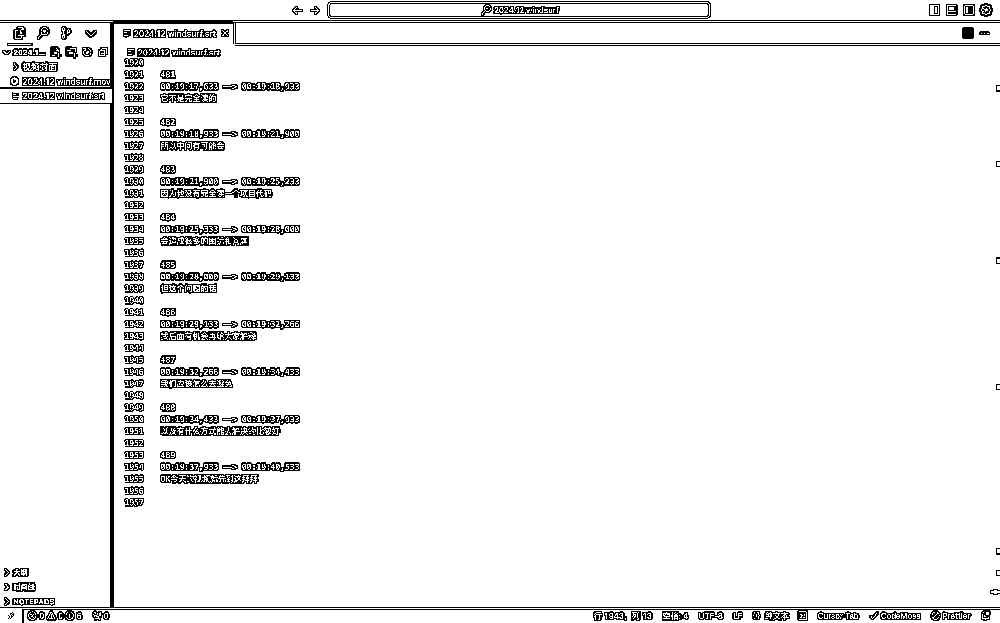
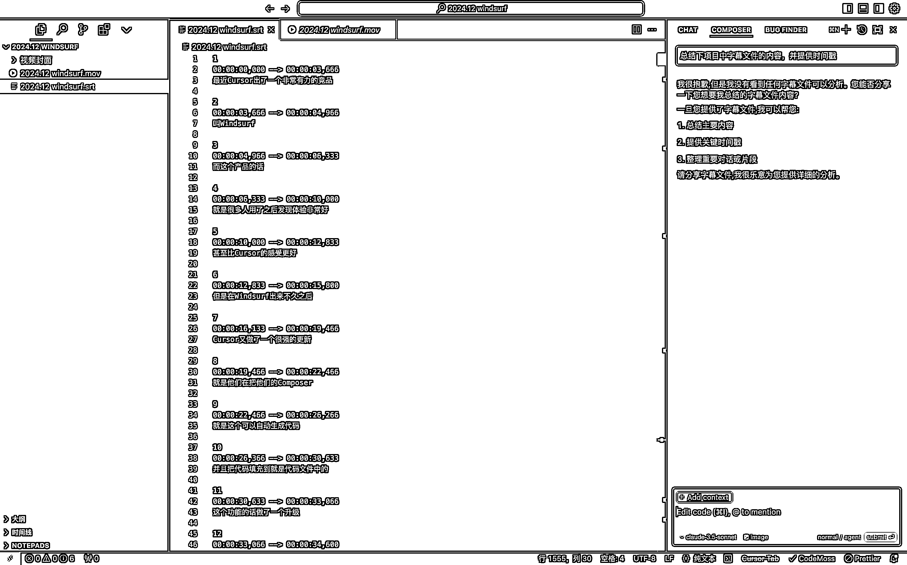
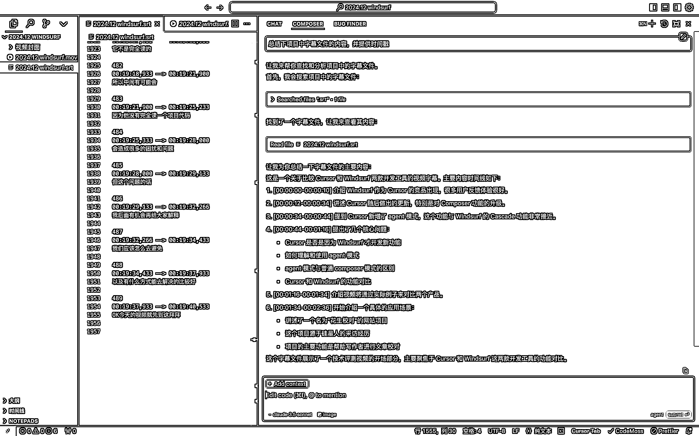
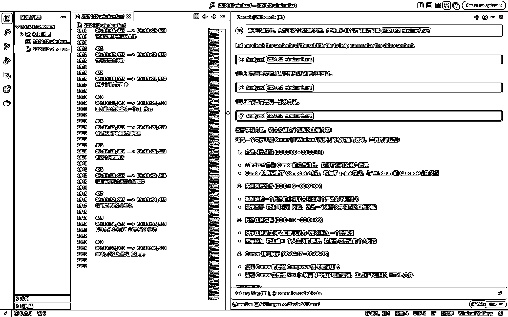
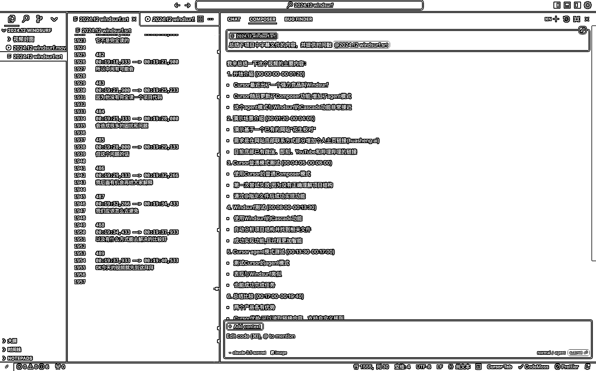
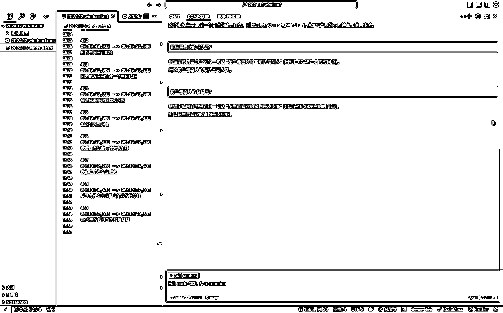
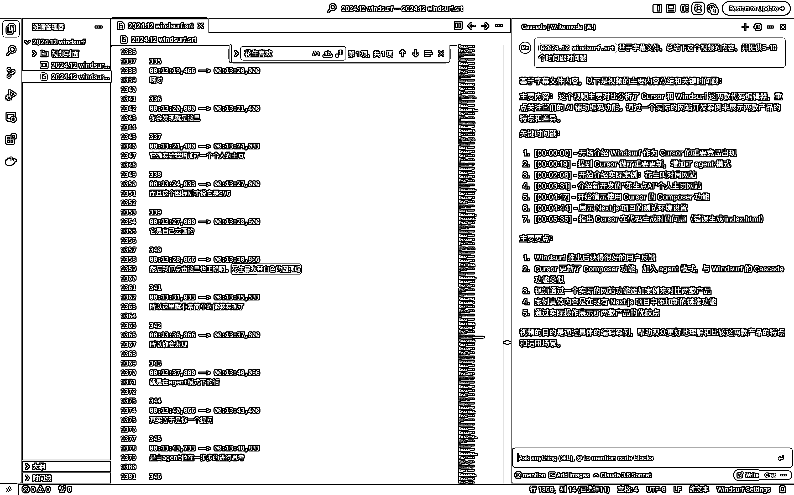

# Cursor 在执行任务时关联代码信息缺失问题的系统性解答

> 原文：[`www.yuque.com/for_lazy/zhoubao/qisezmy6tgpc7f3v`](https://www.yuque.com/for_lazy/zhoubao/qisezmy6tgpc7f3v)

## (33 赞)Cursor 在执行任务时关联代码信息缺失问题的系统性解答

作者： AI 进化论-花生

日期：2024-12-16

大家好，我是花生。自学 AI 编程 3 个月，我在 Cursor 等工具上已经花了 500+小时的时间，开发出了 AppStore 付费榜第一的「小猫补光灯」，做了数十款产品。

也是我们本期生财 Cursor 航海的教练之一。我在航海群内经常看到大家反馈 Cursor 的表现不符合预期，同类型 bug 反复出现等等。其实这些问题有很大程度上由于 Cursor 在执行你的任务时存在部分关联代码信息缺失的问题。而这篇文章就是我对这个问题的一种系统性解答，新手看这篇文章可能还比较难理解，你们可以先关注结论和建议部分。而如果你用得够多，做过几个项目了，我相信这篇文章会给你带去不少启发，让你理解你平时遇到的问题究竟是什么根因导致的。

> Context, not control.
> 
> ——张一鸣

## 一、背景：AI 编程的上下文至关重要

如果说现在让 AI 编程能力实现阶梯式飞跃的大模型本身的「智能」水平——Claude 3.5
Sonnet 跨越了那个边界。那另一个影响 AI 编程实现效果的就是上下文长度。

目前 Claude 3.5 Sonnet 提供最长 200k
token 的上下文长度，这对对话模型来说是非常充足的，一篇 5 万、10 万字的书籍读完都轻松不在话下，但这对于动辄几十、上百个代码文件，每个代码文件长达数百至上千行的编程项目来说，这样的上下文长度仍然远远不足。再加上现在大模型按输入、输出的 token 数收费，边际成本不为 0。

以上两个特性会引来 Cursor、Windsurf 等 AI 编程工具做大量的优化，他们目标如下：

1）尽量准确为你获取任务相关代码，节约上下文长度，以实现多步骤任务的调优，给你提供更好的效果体验；

2）尽量减少读取「不必要」的代码内容，既为了任务调优，也为了节约成本。

在上述的局限和目标条件下，Cursor、Windsurf 采取了不同的调优策略提升自己的产品体验。但是这种「调优」往往也是取舍，只是局部的最优解，各自都会牺牲掉部分用户的体验。

所以这篇文章的目的在于，帮助我自己和你去理解他们「调优」的方式和逻辑是如何的？理解这种「调优」的取舍之后，我们更有机会去利用不同产品的优劣势，在不同场景下知道如何切换工具和使用方式，去为我们的任务实现最优解。

## 二、结论：Windsurf 适合起步，Cursor 适合调优

基于最近的使用经验和 12.15 对 Cursor0.43.6 与 Windsurf1.0.7 版本的实际评测，得出以下结论：

### **1、对新手而言，初始执行基础任务时：Windsurf > Cursor Agent > Cursor Composer normal**

1.  在 agent 模式下，执行初级任务的表现都优于常规的 Cursor Composer 模式，因为 agent 模式会基于任务理解代码库，找代码文件，读代码，再一步步执行操作帮你完成任务

2.  Windsurf 的 agent，在理解任务和执行多步操作的能力上，调优效果优于 Cursor Composer 模式下的 agent

### **2、Agent 模式的主要缺陷是不完整读代码文件，这会导致复杂项目和长代码文件的问题**

1.  Cursor agent 模式下，**默认读一个代码文件的前 250 行** ，如果不够，偶尔会主动续读，增加 250 行；在部分要求明确的情况，Cursor 会执行搜索，每次搜索结果最多为 100 行代码。

2.  **Windsurf 每次读代码文件 200 行** ，如果发现不够，会尝试再次读取，最多尝试 3 次，**共读取 600 行** 。

### **3、Cursor 与 Windsurf @ 单个代码文件时，执行逻辑不同，Cursor 远优于 Windsurf**

1.  Cursor 中如果@ 某个代码文件，cursor 会尽量完整读取（测试临界点 2000 行）

2.  windsurf 的 @代码文件和 cursor 的 @代码文件不是一个逻辑。在 windsurf 中你@某个代码文件仅仅是说你帮助 windsurf 找到了对应的文件。但是他并不会真的认为这个文件很重要而进行完整读取。

### **4、在你能理解项目结构的情况下，Cursor 中 @单一代码文件效果远优于 @codebase**

1.  如前面所说，如果你理解你自己在做什么，你要执行的任何和哪个代码文件有关，那么 Cursor 中 @ 你将获得好得多的效果。如果 @codebase，目前的判断是 cursor 会用自己的小模型执行对每个代码文件的理解并总结，他没有完整将必要的代码都纳入上下文。

## 三、测试过程

以上所有结论来自于我日常高频使用 Cursor、Windsurf 的体感（500+小时），再加上一次针对性的测试。在这次测试中，我用了一个长达 1955 行的视频字幕文件。字幕文件的优势在于有时间戳且内容上下文结偶，我很容易判断 AI 编程工具到底了读了没，已经读了多少内容，他没办法「猜」。

甚至，为了验证是真的「读」，还是通过 RAG 的方式总结的，我在每 500 行中间随机穿插了一些和内容无关的信息，用于事后确认 Cursor、Windsurf 读的程度，包括：

1.  花生最喜欢的运动是网球

2.  花生最喜欢的篮球队是湖人

3.  花生喜欢带白色的圆顶帽

4.  花生最喜欢的食物是皮皮虾

Round1：Cursor Composer Normal 模式不主动去查找字幕文件进行读取，任务直接失败

Round2：Cursor Composer Agent 模式下，找到并读取字幕文件，但只读了 250 行

Round3：Windsurf Cascade，默认 agent 模式，找到并读取字幕文件，读了三次，但也只读了 600 行

Round4：Cursor Compose 模式，主动@
代码文件，Cursor 完整读取全部内容，第一次获得全部正确结果；并且通过了后续陷阱问题大海捞针的确认，它是真读了

Round5：Cursor
Compose 模式，主动@codebase，Cursor 大致总结了视频内容，但是后续陷阱问题全都回答错误，我判断是因为这个模式下 cursor 的多次读取也只是用小模型进行总结，并把总结信息返回到上下文中

 images.zsxq.com/FtSixj7r7pk_wRdIC5XsiuJRXhHT) images.zsxq.com/Fuj-u_96X0cXPS4XbUEDDeAXIPOm)

Round6：Windsurf Cascade，主动@代码文件，获得的总结依然只有 600 行文件内容，说明没有完整读取

## 四、分场景下的 Cursor、Windsurf 使用建议

### **1、每个代码文件最好控制在 500 行以内（cursor agent 读两次的范围）**

### **2、在代码文件的前 100 行写清楚该代码文件的功能和实现逻辑（通过注释的方式，便于 agent 索引）**

### **3、如果你是新手，在项目初始状态下，或者面对比较简单的项目，使用 windsurf 效果更佳**

### **4、如果你的项目复杂，单个文件长度超过 600，你对项目熟悉，知道自己要做的事和哪些代码文件有关，能准确 @对应文件，那最好使用 cursor。**

### **5、频繁的重新开始你的对话（比如每完成一个新功能，或者解决一个 bug 后），带入过长的上下文对项目是个污染。**

**6、频繁的记录你的项目状态和项目结构到特定文档中（比如 readme.md），这样在重启对话时能快速帮助 Cursor/windsurf 了解你的产品状态，且不会那么容易带入过多的上下文。**

* * *

评论区：

暂无评论