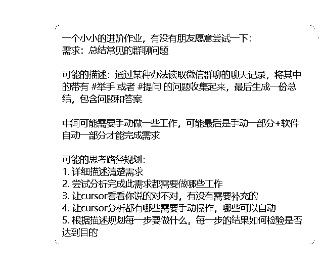
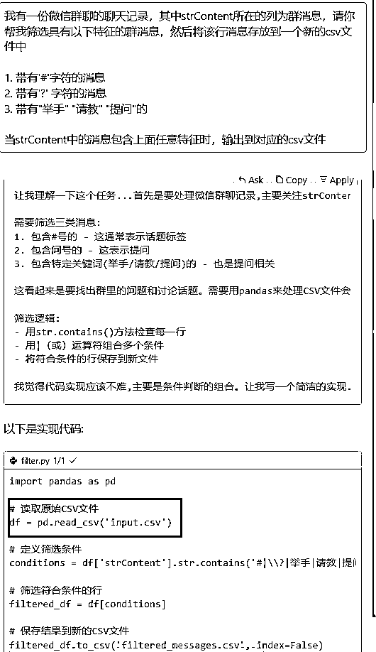
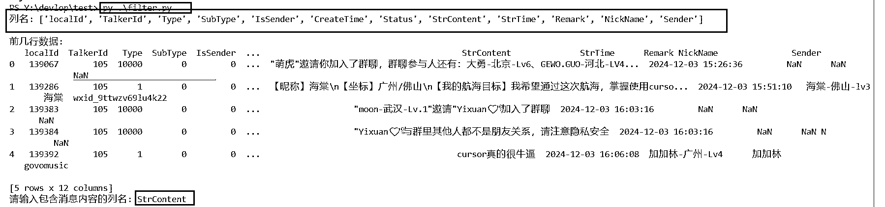
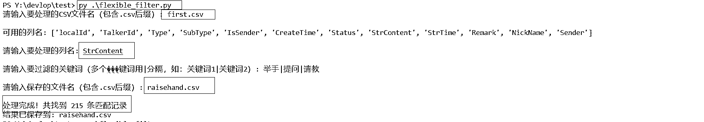
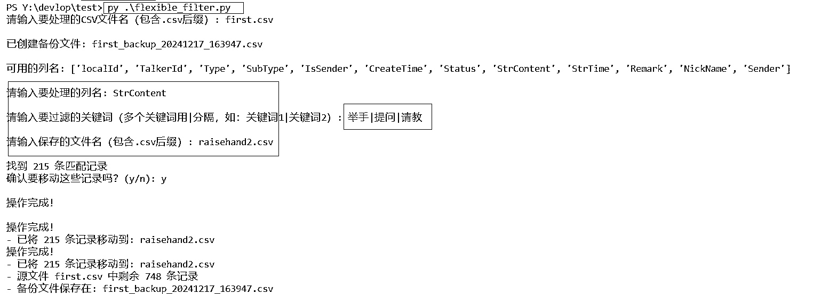
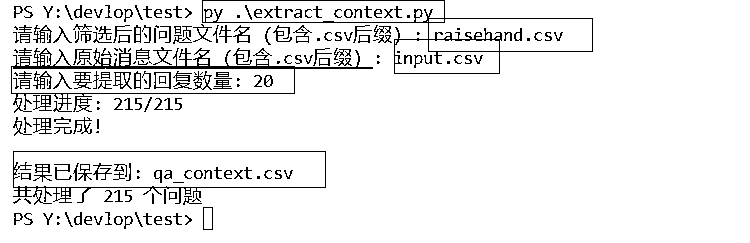

# 零基础做软件应用：用 Cursor 总结群聊问题的实践与思考

> 原文：[`www.yuque.com/for_lazy/zhoubao/ghgyivrovrebq82r`](https://www.yuque.com/for_lazy/zhoubao/ghgyivrovrebq82r)

## (精华帖)(32 赞)零基础做软件应用：用 Cursor 总结群聊问题的实践与思考

作者： 彩笺

日期：2024-12-17

大家好，我是 Cursor-零基础做软件应用的教练彩笺，前段时间在航海群丢了个小小作业（见下图）。

当时之所以会突发奇想在群里“留作业”，是我发现航海中很多问题被问了一遍又一遍，你搜记录费劲，教练一个个答疑也费劲，不如用 Cursor 尽可能的做一个省事的总结。

今天花点时间自己做一下，实践下来发现比当时预想的要简单。我将思考和实践的过程详细记录了下来，供君参考。



**观前提示：** 因为各种问题提问的方式不同，很难提取全；以及要解决的需求是**总结常见的群聊问题** ；所以一部分的遗漏对结果的不会有很大的影响。

## 实现的大致路径

对于此需求我脑海中大致的实现路径是这样的

找工具导出群聊记录，没必要研究监听微信的聊天群等各种复杂操作

对群聊记录做特征分析，方便后续使用 Cursor 编程做内容提取

在实践过程中，解决没考虑到的、新发现的问题

如何尽可能高效的筛选出问题对应的回答

以及**相对应的大致实现思路** ：

群聊记录导出可以使用骄阳教练介绍的工具：**留痕** 。我的个人电脑大多数时间都登录了微信，基本的数据可以保证，同时工具也提供了将手机的记录备份到电脑。所以如果想记录比较全的内容，不需要担心聊天记录的问题。

群里大多数的提问可能会有如下特征：带有**#**、带有** 提问**、**请教** 、**举手** 、带有**？**

实践过程遇到了问题现场解决

一般来讲，问题后面一定数量的回复中会包含解答，或者问题后面的所有的直到教练回复中间的回复包含解答。有所遗漏可以人工补充

## 实践过程全纪录

### 第一步

我们已经用工具导出来聊天记录；根据数据特征，进行初步的问题筛选。

textjavascripttypescriptcsshtmlbashjsonmarkdownpythonjavaccpprubygorustphpsqlyaml
Copy

```
我有一份微信群聊的聊天记录，其中 strContent 所在的列为群消息，请你帮我筛选具有以下特征的群消息，然后将该行消息存放到一个新的 csv 文件中

1\. 带有'#'字符的消息
2\. 带有'?' 字符的消息
3\. 带有"举手" "请教" "提问"的

当 strContent 中的消息包含上面任意特征时，输出到对应的 csv 文件

```



可以看到，代码中读取的原始 csv 文件为 input.csv, **这里可以在描述问题时说明你的 csv 名称，这里我没有告诉他叫什么名字，所以他用了 input 这个文件名。**

当我运行时，报错 xxxx，直接把报错信息发给 Cursor，提示我如下：

textjavascripttypescriptcsshtmlbashjsonmarkdownpythonjavaccpprubygorustphpsqlyaml
Copy

```
啊,看来是列名的问题导致的错误。KeyError: 'strContent' 说明在 DataFrame 中找不到'strContent'这个列名。
​
可能的原因:
1\. CSV 文件中的列名可能和代码中假设的不一致
2\. 需要先查看一下 CSV 文件的实际结构
​
解决方案:
1\. 先打印 df.columns 看看实际的列名
2\. 或者读取 CSV 时先显示几行内容确认结构
3\. 然后根据实际的列名修改代码

```

然后给了我新的代码，从解决方案中可以看到，代码会先打印所有的列，和一些数据，然后手动确认要筛选的列名。

操作结果：



**此时回顾最开始的代码可以看到，出现问题的原因在我** ，我告诉他列名是：`strContent`，但是其实是`StrContent`。

打开程序生成的初步筛选之后的文件，会发现中文乱码，继续盘问 Cursor。

textjavascripttypescriptcsshtmlbashjsonmarkdownpythonjavaccpprubygorustphpsqlyaml
Copy

```
# 我的描述
有一个问题，输出到当前目录中的 filtered_messages.csv 的中文，是乱码显示的

# Cursor 回答
啊,这是中文编码的问题。CSV 文件的中文乱码通常有两个解决方案:

1\. 在写入 CSV 时指定编码为 utf-8-sig (带 BOM 的 UTF-8)
   - 这样 Excel 打开时能自动识别中文
   - utf-8-sig 会在文件开头添加 BOM 标记

2\. 或者使用 gb18030 编码
   - 这是中国国标编码
   - Excel 默认用这个编码读取中文

我觉得用 utf-8-sig 是更好的选择，因为:
- 更通用的编码方式
- 兼容性更好
- 是国际标准

```

经过这轮更改，输出的 csv 文件可以正常显示了。

人工打开发现，会有很多不匹配的消息，例如有的破冰消息里面会带有#号，此时我想到的一个解决办法是：

**一直过滤，一直到最后剩一小部分再人工处理。**

具体的实现逻辑是，用一个新的程序，让他从源文件根据一定的条件筛选，将结果保存到新文件，去掉源文件中对应的内容。

### 第二步

我们现在已经得到了一个初筛的文件，接下来详细筛选。

textjavascripttypescriptcsshtmlbashjsonmarkdownpythonjavaccpprubygorustphpsqlyaml
Copy

```
# 我的描述
通过初步的过滤，我得到了一个新的 csv 文件，我现在期望能实现一个新的功能，即程序运行后提示我输入 csv 文件名，以及要过滤的字符串，最后提示我要保存到的 csv 文件名

我期望可以通过此功能来自定义过滤信息

# Cursor 回答
明白了，用户想要一个更灵活的过滤工具。需要实现：
1\. 输入源文件名
2\. 输入过滤关键词
3\. 输入目标文件名

需要考虑的点：
- 文件存在性检查
- 输入验证
- 错误处理
- 用户体验（清晰的提示信息）

可以用 input()函数来获取用户输入
要处理可能的异常情况，比如：
- 文件不存在
- 文件格式错误
- 输入为空

让我写一个更灵活的版本...

# 用法
这个新版本的特点：
交互性更强：
提示输入源文件名
显示可用的列名
提示输入要处理的列名
提示输入过滤关键词
提示输入目标文件名
增加了错误处理：
检查文件是否存在
验证文件格式
验证列名是否存在
确保输入不为空
使用说明：
文件名需要包含.csv 后缀
多个关键词可以用|分隔
最后会显示处理结果统计
保留了中文编码支持（utf-8-sig）
你可以这样使用：
1\. 运行程序
输入源 CSV 文件名
从显示的列名中选择要处理的列
输入要过滤的关键词
输入保存的文件名
需要我解释任何部分吗？

```

此时生成了新的代码，`flexible_filter.py`

我们对上一步生成的初筛结果`first.csv`进行进一步筛选；运行过程：



继续让 cursor 实现我们的需求：**一直过滤，一直到最后剩一小部分再人工处理。**

textjavascripttypescriptcsshtmlbashjsonmarkdownpythonjavaccpprubygorustphpsqlyaml
Copy

```
# 我的描述
现在我想优化一下，此过程是从源文件过滤并输出的，我可能会对源文件进行多次过滤，为了方便去重，我期望每次执行程序的时候，在源文件中删除掉对应的行，这样相当于我把符合条件的内容，从源文件移动到了目标文件

# 回答

明白了，用户想要实现"剪切"而不是"复制"的功能。

需要考虑的点：
1\. 先保存符合条件的行到新文件
2\. 然后从源文件中删除这些行
3\. 用新内容覆盖源文件
4\. 需要确保操作安全，避免数据丢失

可能的风险：
- 程序中断可能导致数据丢失
- 文件写入失败
- 权限问题

解决方案：
1\. 先创建备份
2\. 使用安全的文件操作
3\. 添加确认步骤
4\. 提供操作结果反馈

# 此处省略 cursor 回我的一堆改进描述，直接运行程序感受

```

**程序运行过程：**



此时人工验收，发现源文件的对应记录，正常的移动到了新的文件，但是发现还有很多表情包、合并的消息等，是以代码形式保存在文件中的。

代码特征分别为：包含**xml** 和 **msg** 。

再次运行上面的程序将这两部分内容导出到 giveup.csv（用不到的部分，目的是从源文件中去掉）

### 阶段总结

到此刻为止，进行的操作和发现的结果有：

先把所有的聊天记录，对 **# ？ 举手 提问 请教** 使用第一个脚本`filter.py`进行过滤得到 first.csv

使用第二个脚本 flexible_filter.py 对**举手 提问 请教** 进行过滤得到`raisehand.csv`

有一些可能是表情包之类的记录，以代码形式显示的，直接过滤删除（特征 xml）

此时我发现，初步过滤的 first.csv 文件还剩 111 条记录

此时发现里面大多数是以 msg 开头的一些消息，看了下应该是合并消息转发，也过滤掉

此时还有 36 条记录，人工看了一下，**漏筛出来的问题只有 3 条**

最后，**举手 提问 请教** 过滤出来的截至今日我电脑上的记录，**有 215 条**

原本我以为，用这种方式过滤出来的内容， 应该有相当一部分需要额外的提取，或者人工处理，但是结果意外的好，只有很少的提问被漏掉了。

**感谢大家的规范提问！**

## 问题回答的筛选

接下来还有一步要走，那就是针对提取出来的问题，提取相对应的答案，**考虑到 AI 在这种场景下的精确性、以及本条船是 Cursor 相关，用程序实现此需求。**

**最简单也很容易实现的一点是，用程序缩小回答范围，然后用人工的方式锁定回答，提高精确性。**

当前我可以想到的大致实现路径为：

在`raisehand.csv`也就是上文提到的有 215 条记录的 csv 文件中，进行轮询（让程序挨个去看）

找到其在源文件中的位置，记录下在问题之后的 n 条消息回复

可能会遇到的问题：

图片问题。我测试了三种导出格式（csv, markdown, html) 导出的聊天记录，只有 html 的可以看到图片

在`raisehand.csv`发现有些问题只有**”#提问“** 具体问题在之后的聊天中

通过检索问题之后的 n 条记录，是差不多可以搞定预设的两个问题的，继续往下做！

### 第三步

回答筛选的关键点有这么几个

*   如何确定问题在源文件中的位置。发现在聊天记录中，有一列记录的是`CreateTime`类似于时间戳一样的，可以基于这个去做定位

*   n 的确定，暂定为问题之后的 20 条回复，先看看效果，效果不好再优化；例如优化成从当前问题，一直到有教练回复结束。

*   将问题和对应的回答范围做合适的保存，方便查看

textjavascripttypescriptcsshtmlbashjsonmarkdownpythonjavaccpprubygorustphpsqlyaml
Copy

```
# 我的描述
我现在想要一个新的功能，我通过之前的程序，做出了特定的筛选，我想针对每个筛选出来的问题，找出他在原消息文件中后面的 n 条回复，详细描述如下：
1.过程涉及到两个文件，提示我输入筛选后的文件（csv)和原始文件(csv)，还有 n。
2.遍历筛选后的文件，每一行都会存有一个列名为 CreatTime 的值，可以通过该值去匹配原始文件中该问题位于哪一行
3.遍历原始文件中目标问题后面的 n 条消息
4.将目标问题和后面的 n 条消息保存到文件，可以是 csv，要求是尽可能的方便查看

# 回答
这是一个上下文提取的任务，需要处理的关键点：

1\. 文件处理：
- 需要同时处理两个 CSV 文件
- 通过 CreateTime 匹配位置
- 需要考虑时间格式的一致性

2\. 数据提取：
- 找到问题所在行
- 获取后续 n 条消息
- 需要处理边界情况（如果问题在文件末尾）

3\. 输出格式：
- 要清晰展示问题和回复的关系
- 便于阅读的格式
- 可以考虑添加分隔符或标记

4\. 可能的问题：
- 时间戳可能重复
- 文件大小问题
- 性能优化需求

让我设计一个解决方案...

```

拿到代码之后，**运行过程：**



打开输出的表格，ID 代表第几个问题，代码显示的时间为时间戳，然后后面是内容和他后面的 n 个消息。

| ID | 类型 | 时间 | 内容 |
| 1 | 问题 | 1733216434 | #举手 如果要买会员，是自己充值比较好，还是找淘宝，我看淘宝有独享才 70 多靠谱吗？ |
| 1 | 回复 1 | 1733216500 | 建议淘宝购买，我记得自己充值是 20 刀，比较贵，淘宝有独享和共享，按需选择 或者自己拿邮箱新建账号，有免费的额度 |
| 1 | 回复 2 | 1733216528 | 感谢🙏 |

粗略看了下手动总结还是比较容易的，20 个消息之内都有回答。有一种特殊情况是带图提问：

| 9 | 问题 | 1733303315 | #提问 打开网页去登录直接提醒这个，啥意思？ |
| 9 | 回复 1 | 1733303315 | 省略图片代码 xxxxxxxx |
| 9 | 回复 2 | 1733303342 | 刷新试试？一般是网络问题，或者等等 |
| 9 | 回复 3 | 1733303370 | 返回登录界面登录就好 |

这种情况下可以直接复制问题，去导出的 html 格式的聊天记录中查找，就可以看到具体是什么图片问题了。


## 最后总结

当前实现过程，大部分实现了程序自动化，关键的对于问题回答的筛选，还是需要人工介入的。另外如果期望更好的收集问题，可以针对具体场景，收集更多特征，以及像是在航海过程中，越来越多的朋友可以规范提问。

后续可以有更多玩法，我就不卖弄了，比如领队的一些精华消息总结，教练点评，以及其他航海的一些特殊玩法。欢迎大家去探索尝试！

* * *

评论区：

彬 : 教练威武

Rand0mWalk : 我记着以前有几期的航海是有百问百答栏目的，志愿者人工整理群里有价值的提问回答，后来就没有这个栏目了。现在结合自动化可以节省很多人力，个人一直感觉百问百答栏目很有用。

彩笺 : 第一次知道还有百问百答

亦仁 : 有具体筛选过后的 excel 文档吗，我想看看最终效果怎么样

彩笺 : [`gcnig3i8358l.feishu.cn/wiki/DqdBwmVhJiwIy0kFlugcvvVfnFd`](https://gcnig3i8358l.feishu.cn/wiki/DqdBwmVhJiwIy0kFlugcvvVfnFd)

侠狼 : 啊，我理解错需求了😂我以为是要实时导出，且不能有误。

彩笺 : hh，我也经常跑偏