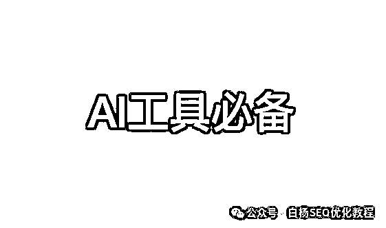
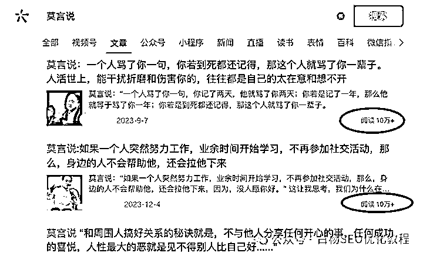
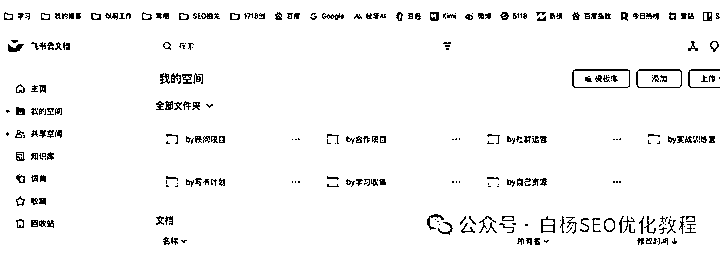
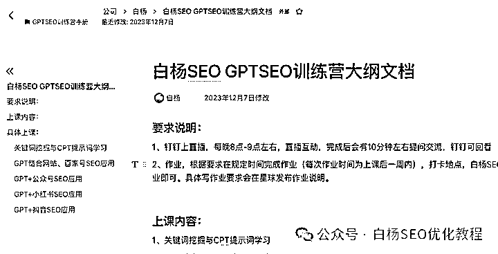
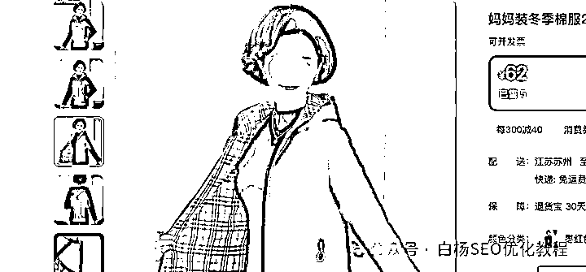
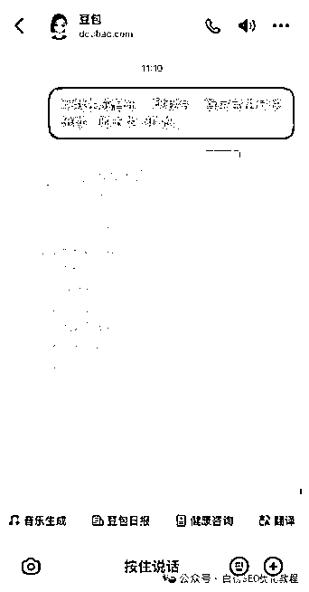
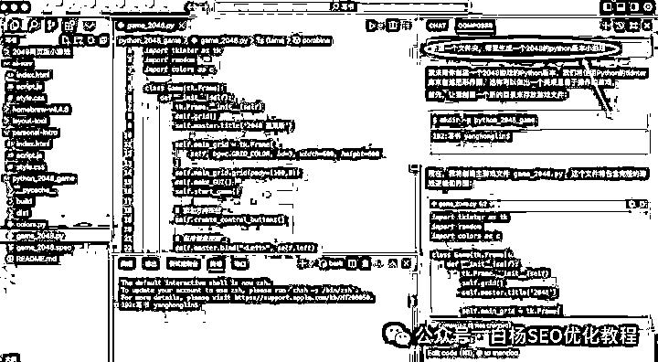
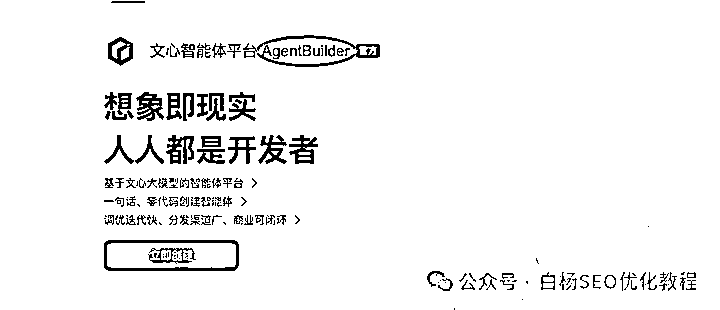
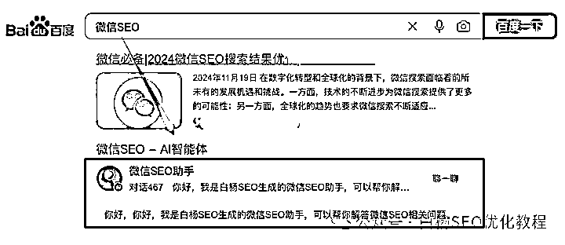
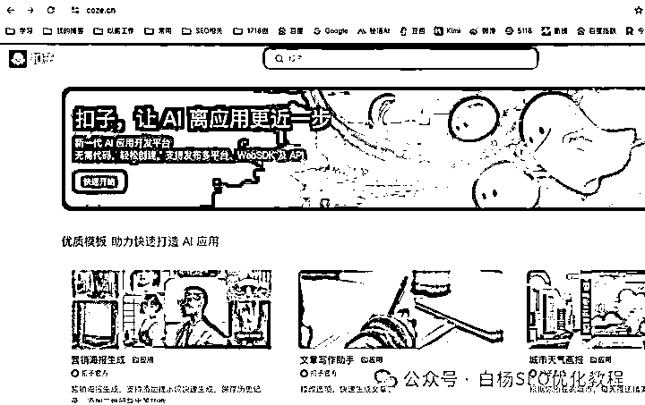

# 字节跳动推出 AI 聊天机器人构建平台 Coze，解析常见英文技术词汇

> 原文：[`www.yuque.com/for_lazy/zhoubao/fxxitpvphwiamqew`](https://www.yuque.com/for_lazy/zhoubao/fxxitpvphwiamqew)

## (18 赞)字节跳动推出 AI 聊天机器人构建平台 Coze，解析常见英文技术词汇

作者： 白杨 SEO

日期：2024-12-17

不管你是做什么样的工作，下面这一连串英文单词，有一些你一定见过！

claude、notion、mj、sd、suno、sora、cursor、agent、coze、rpa、ai、seo

你可能心里会好奇：大部分都没见过，写这些英语单词有啥意思？你这个不是讲 SEO，讲怎么搞流量的吗？但如果我告诉你，上面这一连串英文单词，只有一个单词是来自中国，你能猜到是哪一个吗？

SEO，NO！RPA，NO！

直接告诉你答案，它就是**coze** ，中文叫**扣子** ，由字节跳动推出的 AI 聊天机器人构建平台，你猜对了吗？哈哈哈。

OK，我们继续往下说，今天你看完白杨 SEO 写的这一篇，以后人家说这些你都大概知道是啥，而且你还能找到国内对应相关的 AI 工具，可以收藏哦。

**Claude**

Claude 是一种很厉害的电脑程序，它就像一个很会读书和回答问题的 “大脑”，这个 “大脑” 是靠一种叫 Transformer 架构的东西做出来的。

它可以像我们写作文一样生成文字内容，还能回答你问的问题，甚至能翻译东西呢。在写文章、做客服回答常见问题这些地方能用到，能让人更快地写出东西或者得到答案。

比如，你让它续写一个故事，或者把一段话的主要内容提炼出来，它都可以做。它是通过学习大量的文字内容，知道文字是怎么组织的，这样就能回答得比较有道理。

你以前看到公众号很多所谓 10W+的名人名言爆文，很多都是用 Claude 来训练让 AI 写的，做下排版和优化，哈哈哈。

[白杨 SEO：公众号流量从哪里来？公众号搜索与推荐算法解密【干货】](https://link.zhihu.com/?target=https://mp.weixin.qq.com/s?__biz=MzU2NTQzMzA4Nw==&mid=2247498948&idx=1&sn=8bcbb33187c7891da8f68f21fc7f788c&scene=21#wechat_redirect)

再比如，如果你有一个网站，上面有问答的部分，Claude 可以帮助你回答用户的问题。Claude
可以生成比较准确的答案，让用户觉得你的网站很有用，就会经常来，流量也就增加啦。

这个 Claude，是美国 Anthropic 开发的，国内用不了。如果你要使用，需要上网环境，Claude 需支付每月 20
美元左右，换算成人民币约 160 元，当然也有很多人做了对接，要找很容易的，实在找不到可以找白杨 SEO 我问哈。

国内对应的 AI 写作工具，比如像豆包，kimi，新华妙笔，秘塔写作猫等都可以用。

**Notion**

Notion 它是一个软件，你简单理解，它就像是一个多功能的笔记本。

你可以在这个软件里写笔记、做文档，还能弄数据库、做任务管理的看板。自己用的话，可以记录学习的内容或者工作计划。如果是团队一起用，大家能在同一个地方分享和修改文档，通过看板可以看看任务进行到哪一步了。

如果你是一个博主或者有自己的自媒体账号，你可以用 Notion 来整理你的内容。比如你做美食博主，把你的食谱、做菜心得等都放在 Notion
里，然后分享链接给粉丝，这样粉丝可以更好地了解你的内容，也能吸引新的粉丝，增加流量哈。

国内的话，你可以理解成像飞书，FlowUs 息流等工具。我以前用有道云笔记，现在用飞书。

**MJ（Midjourney 简称）**

Midjourney 是一个能画画的人工智能程序，就像一个很厉害的画家。

你只要跟它说你想要什么样的画，比如
“我想要一幅画，画里是晚上的城市，城市很科幻，有会飞的汽车，还有一闪一闪的霓虹灯”，它就能根据你说的画出这样的画来，画出来的质量还挺高呢，像插画、概念艺术之类的画它都能画。

在互联网上，吸引人的图片很重要。如果你要做一个电商网站，需要好看的产品图片，或者你有一个社交媒体账号，想要发一些吸引人的插画、海报等，这些工具就可以帮你。你跟它们说你想要的图片样子，它们就能生成。

比如你是卖衣服的，你可以让它们生成模特穿着你衣服的时尚图片，放在网站或者社交媒体上，吸引用户的眼球，让更多人来你的网站或者账号，这样就增加了流量。

据说，国内很多电商平台，比如淘宝，京东，拼多多很多模特图片都已经是用 AI 绘画生成的了。

还有，在设计广告、做游戏里的美术部分、画插画这些工作里经常会用到，能给画画的人提供灵感，还能帮他们做一些素材。

国际版基础每月 10 美元，约合人民币 75 元；标准套餐每月 30 美元，约合人民币 225 元；专业套餐每月 60 美元，约合人民币 450 元，当然同样国内有很多工具也是接了这个，赚个中间商差价哈哈哈。

国内 AI 绘画工具，比如像豆包文生图，百度文心一格，智谱清言的 AI 绘画等，我主要用豆包或者智谱。

**SD（Stable Diffusion 简称）**

Stable Diffusion 是一个可以生成图像的东西，而且它的代码是公开的，就像一个大家都可以研究改进的图像生成工具。

它和 Midjourney
有点像，你跟它说想要什么样的图，它就会生成。因为它是开源的，所以有技术的人可以对它进行修改，让它能生成自己想要的风格的图，像动漫风格或者很真实的风格。

**Suno**

Suno 它是一个可以生成音乐的人工智能平台，就像一个会作曲的小机器人。

你可以跟它说你想要什么样的音乐，比如 “我想要一段音乐，要很欢快，是流行音乐，鼓点很强，旋律很明亮”，它就能按照你说的生成一段音乐。

如果你有一个播客或者视频频道，需要背景音乐，Suno 可以帮你。

比如说你做一个知识讲解的视频，用 Suno 生成一段合适的音乐，让你的视频更加吸引人。好听的音乐能让用户更愿意留在你的内容页面，增加流量。

而且，如果你是做音频内容的，像有声书之类的，Suno 可以帮助你生成一些辅助的音乐片段，让你的音频更有吸引力，吸引更多听众。

Suno 提供了多种付费方式，包括 Pro 计划和 Premier 计划，每月订阅费用分别为 10 美元和 30 美元
。免费用户每日获得 50 个积分，每次生成歌曲消耗 5 积分，每日可免费生成 10 首歌曲 。

当然，现在用文字生成音乐也不是什么很神秘的东西。你如果会用豆包 APP，它也可以给你生成音乐，如图。

**Sora**

Sora 是 OpenAI 发布的人工智能视频生成模型，用户可以通过文字、图像或其他视频素材，生成长达 20 秒的视频。

不过这个 Sora 一个月是真贵，哈哈哈。

[白杨 SEO：刚开工，Sora（索拉）就成了赚钱热点流量风向标？](https://link.zhihu.com/?target=https://mp.weixin.qq.com/s?__biz=MzU2NTQzMzA4Nw==&mid=2247499304&idx=1&sn=d2cff3dc9de83df3f4b22b8ac883941f&scene=21#wechat_redirect)

如果你想体验文生视频，完全可以去体验国内的即梦 AI，可灵 AI 等。

**Cursor**

Cursor 是一个可以帮助程序员写代码的工具，就像是程序员的小助手。也就是当下很火的 AI 编程，最近白杨 SEO 迷上了，直接聊天就能写程序。

比如，你跟它说 “帮我写一个 Python
程序，这个程序要能算出两个数的和”，它就能帮你写出这个代码。它还能看看你写的代码有没有错误，要是有错误还能给你建议怎么修改。

再比如，你想让他生成一个小游戏，下面截图圈中那里是你写的，其它都是它自动生成的哈。

当然，你要懂怎么下载，怎么安装，免费只有 14 天，后续你还是要花钱，这个基础有人在做 7 天训练营啥的，你可以自学，也可以去参加啥的。

这个工具，每月价格为 20 美元，约合人民币 160 元 。新用户有 14 天的免费试用期 。

国内有百度文心快码，豆包的 MarsCode AI，阿里的‌Tongyi Lingma 等。

**Agent**

在人工智能里，“Agent” 有好几种意思，一般来说它是一个可以自己做决定、自己行动的小智能东西。

比如说在一种学习方式（强化学习）里，这个智能东西（Agent）可以在一个环境里做事情，环境会给它信号，告诉它做得好不好，它就可以根据这个信号学习怎么才能做得更好。在智能客服系统里，这个智能客服
Agent 可以自己回答客户的问题，根据问题的类型用不同的方法回答。

最近也个也很火，其实你看到那些各个智能体，比如百度智能体，豆包智能体，智普清言智能体等等，都会提到这个词。

如上图，比如你去搜索微信 SEO，会看到一个微信 SEO 助手，这个就是我用文心智能体创建的一个智能体哈。

[白杨 SEO：百度智能体是什么、有什么用、怎么创建及使用？【研究】](https://link.zhihu.com/?target=https://mp.weixin.qq.com/s?__biz=MzU2NTQzMzA4Nw==&mid=2247499844&idx=1&sn=4f9ac513e5093d8b3ac744a9885c8899&scene=21#wechat_redirect)

**Coze**

Coze 它是一个可以让你自己做聊天机器人的平台。

你可以在这个平台上设置聊天机器人要知道的知识，还有对话的流程，这样聊天机器人就能回答用户的问题或者和用户聊天。比如说一个企业可以用它做一个客服聊天机器人，专门回答和产品有关的问题。

应用场景，主要是用来做聊天机器人的，在客服、回答问题的智能系统、语音助手这些地方能用到。

我们一般人能看到都是国内版，[http://](https://link.zhihu.com/?target=http://coze.cn)[coze.cn](https://link.zhihu.com/?target=http://coze.cn)，如图。

我之前有提到过，有朋友已经用 coze 的这个工作流来做他的多个公众号内容生群及群发辅助。感兴趣的可以自己去摸索。

你可以用 Coze 开发一个聊天机器人放在你的网站或者社交媒体账号上。

比如你是一个教育机构，聊天机器人可以回答用户关于课程内容、上课时间、学费等问题。这样能及时和用户互动，让用户更了解你的服务，吸引那些真正对课程感兴趣的精准流量。

**RPA（Robotic Process Automation）**

RPA 是一种技术，就像是有一个软件小机器人，它可以模拟人做事情，把一些工作流程自动化。

它可以做那些很重复、有规则的工作，像把数据输进电脑、整理文件、做报表这些。比如说在财务部门，它可以自己从不同的系统里拿数据，然后做出财务报表，这样工作效率就高多了，还不容易出错。

现在市面上很流行的各种用 RPA 做什么批量文本，图片，视频制作等，也有人说用 Cursor 吊打之类，其实这些都不重要，重要的是你能不能好好用起来。

不管是 RPA，Cursor，还是下面说的 AI，甚至我们说的 SEO，它都只是一个工具而已，任何把它们神话或无限放大的，你都要注意哈。

**AI（Artificial Intelligence）**

人工智能是电脑科学的一部分，就是想让电脑像人一样聪明，能学习、能思考、能解决问题。

AI 技术可以分析用户在互联网上的行为，比如用户在电商网站上看了什么产品、停留了多久等。然后根据这些信息给用户推荐他们可能感兴趣的产品或者内容。这样可以让用户更容易找到自己想要的东西，也能让你的网站或者平台更有吸引力，吸引精准流量。

通过 AI 可以分析用户的兴趣、年龄、地理位置等信息，这样在投放广告的时候，就可以把广告精准地投放到可能感兴趣的用户面前。

比如像现在百度竞价投放，抖音信息流投放，很多都已经用上了这种 AI 分析，自动化投放了。

**SEO（Search Engine Optimization）**

SEO 是一种方法，就是让网站在搜索引擎（像百度、谷歌）里的排名更靠前的方法。现在更多的是指一种思维，全平台都能用它，哈哈哈。

今天这篇虽然非常非常基础，但是对于做 SEO，从事互联网搞流量的你也一要知道。否则，你都不知道他们在聊什么。

关于全网 SEO，AI 工具，可以看我写的一些相关推荐文章，如果你觉得这个写的有用，可以继续关注白杨 SEO 哈。

**作者介绍：**

白杨 SEO，专注 SEO 十年，全网 SEO 流量实战派，对互联网精准流量有深入研究。

* * *

评论区：

暂无评论