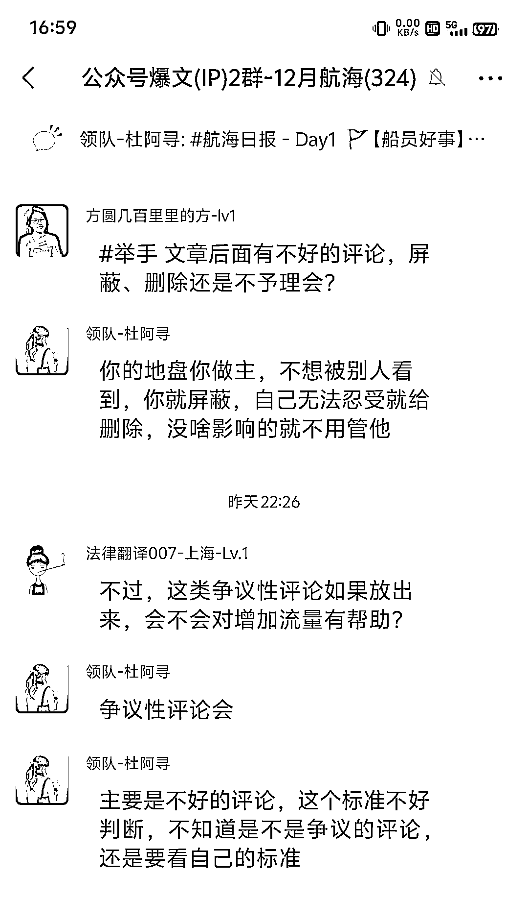
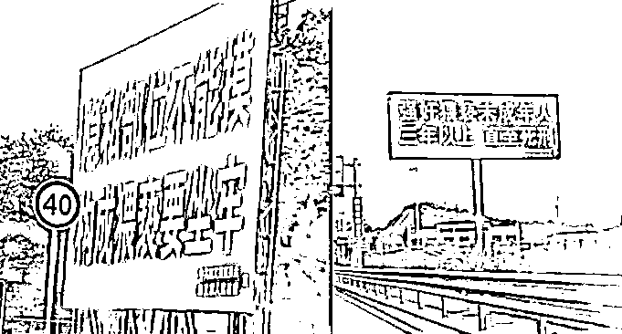
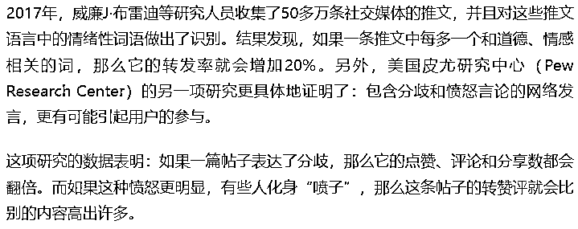
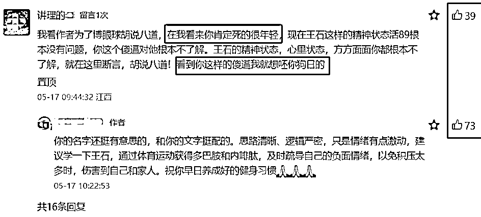
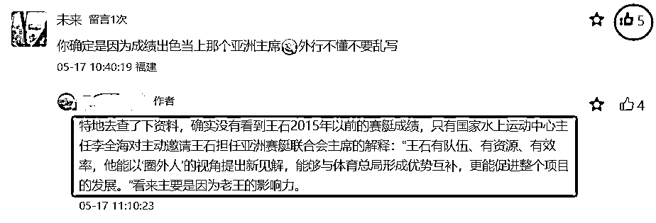
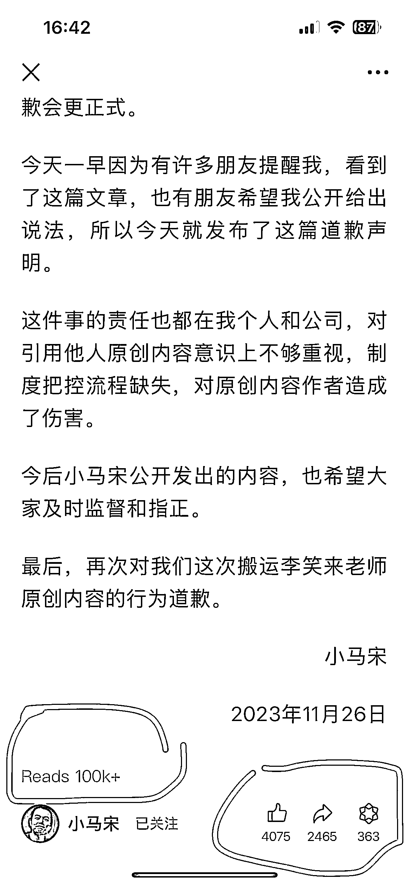

# 没有”差评“，你还写什么公众号？趁早换项目吧！

> 原文：[`www.yuque.com/for_lazy/zhoubao/ogiq79qe28nzpvcb`](https://www.yuque.com/for_lazy/zhoubao/ogiq79qe28nzpvcb)

## (14 赞)没有”差评“，你还写什么公众号？趁早换项目吧！

作者： 旭宏

日期：2024-12-18

**一、差评是有用的**

**  **

今天在公众号爆文航海群看到有童鞋问“**负面评论如何处理** ”，

领队回答得很细致：

刚好我在公众号文章、短视频和直播领域都接触过**”负面评论“** 的处理，就在群里唠叨了几句。

事后，我觉得还可以总结一下，也算是给自己系统地梳理一下，我的看法是：

1.心态上：看到负面评论（差评）应该开心，因为有流量，也因为我认同“闻过则喜”。

2.行动上：主动放出差评，不删除，但不必全部回复，可以选择一些回复。

3.选题上：主动选择有可能产生“差评”的主题，比如争议人物、争议事件。

先说说心态上，我是怎么看待差评的：

首先我知道，有差评说明内容可能写到了”流量密码“，举个极端点的例子：

有段时间网上出现一大批“找骂流”的儿媳抱怨婆婆的视频，吐槽婆婆包饺子居然直接用手包、不戴手套。

这类视频的评论区全都爆了，都在骂博主：谁家包饺子戴手套啊！假讲究、真不孝顺

这类视频播放量都很高，转发量都好几万

也就是流量很大。

当然这种找骂的内容我是绝对不会去创作的，这只是我举的一个反面教材。

但请你先别去考虑是否道德、是否违规，

先请你想一想：为什么这种视频播放量为什么这么高？

思考时间三秒，倒计时开始：

3

2

1

答案是：**用户停留时间长！**

因为看了真的很生气、很想骂人，就会去评论区骂

而观众在评论区打字的时间、看别人评论的时间，

都是你的作品为平台争取到的用户使用时长！

能吸引用户停留的内容，算法喜欢！平台喜欢！

平台之间，都在互相抢用户的停留时间，

用户停留得越久，平台的广告价值就越大。

甚至同一个公司内部，不同的应用之间也在内部抢用户的停留时间，

头条和抖音之间，公众号和视频号之间，

生财有术和其它同类社群之间，

都在比谁的内容更优质，更能留住用户。

抖音是一家年入 4000 亿元的广告公司，

微信也是，而公众号就是它旗下一块巨大的广告牌，

但人们的注意力，并不会因为广告牌大，就停留，

你开车走高速公路时，可以看到很多巨幅广告牌，但你能记住几个？

而下面这两块，一定让你印象深刻：

为啥？

因为**死亡、性、暴力、异常** ，个个都是吸人眼球的流量密码，

圈友@半糖梦呓写的精华帖（[`scys.com/articleDetail/xq_topic/414151884582128）介绍的开幕雷击七种武器中，这两块广告牌的内容使用了 4 种，`](https://scys.com/articleDetail/xq_topic/414151884582128）介绍的开幕雷击七种武器中，这两块广告牌的内容使用了 4 种，)

还有第八种，我自己加的，叫做**”愤怒“。**

**  **

**  **今年年初农夫山泉老板钟晱晱，就被无数网民的愤怒击中了：

就是很多营销号，包括那个著名的博主“一莎”，都在带节奏，

发布大量的带有民族主义的捏造内容，

恶意攻击这位前首富，激起了许多底层网民的”愤怒“，

这些无脑网民用手机打出了无数条攻击钟的评论，并且点赞、转发内容。

这是第二个反面教材。

最近，钟晱晱炮轰张一鸣滥用算法后，周鸿祎特地发了一条视频，

提到愤怒这种情绪在社交媒体传播中的可怕作用：

 images.zsxq.com/FmqNBfoDTRGjYMOQNSVSRrspFgio) images.zsxq.com/Fmzicg5FynIm-4tmCQ4a6dNLndZZ)

我也搜了一下和这个研究相关的报道：

**  **

结论就是，“愤怒”能够显著提高读者的互动意愿，包括点赞、转发和评论。

公众号文章的差评，往往就是**”愤怒“的读者** 写的。

这些案例，看起来都是负面的，难道就没有正面的案例吗？

当然有！

如果你写的是争议性话题，但同时又写出了客观的事实、表达了正确+明确的观点，

你一样能激发某些读者的愤怒。

比如你写江歌妈妈，一定有脑残粉在评论区喷你。

你写中国足球积极向上的一面，一定有许多人喷你，

你写日本官方援助中国 43 年的客观事实，也一定有人喷你。

喷你就有评论，就有流量。

当然，我们不是刻意要去写引人来喷的文字，

而是像咪蒙写《致贱人--我凭什么要帮你》一样，

让你的正确观点带上情绪，或者理性的文字，却激发起读者的情绪：

让亲着快、仇者痛。

金枪大叔写过：“初创品牌要愤怒”，

新手写公众号，也是初创品牌，也可以用愤怒。

文似看山不喜平，语不惊人死不休。

记住：

**做内容，有差评，好过没评论。**

（但注意，我反对黑红也是红的价值观）

**二、差评的分类和应对方法**

理解了差评好处以后，你就可以做到不会对差评太过敏

不会一看到差评就删除。

但这还不够，看到差评的你还是有点不舒服

**怎么让自己舒服地保留差评？**

来，继续往下看：

差评分为几种：

**第一种：读者误会你、误解你**

你要知道，被误会是表达者的宿命。

既然要吃自媒体这碗饭，被误会、被骂是迟早的事，

越早经历，越早免疫。

心态调整法：

记住：骂你的人，骂的不是真实的你，而是他们想象中的你、误解中的你

默念：**既然骂的不是我，我又何必那么激动？**

**  **

**第二种：读者根本不关心事实，只是想骂人发泄**

这种情况的评论又分为两类，

**一类是直接骂脏话的** ，没有任何逻辑，甚至直接带生殖器、问候长辈的，

一般会被系统直接屏蔽，少数漏网的，看到以后直接删掉，拉黑对方

如果不是太过分，我一般会留着，因为支持我的粉丝会怼他，比如这种：

**第二类是，看似很讲道理，实际胡搅蛮缠**

比如前段时间有个圈友赶生财航海的末班车交钱进社群，却因为担心系统 bug 无法报名航海而在星球里发飙，

一堆差评，写了一大堆生财工作人员、系统的不是，还叫嚣着威胁要退款

这种就不要删除，等着明眼人、支持自己的粉丝去怼

可以很好地提高评论、提升文章的推荐流量

比如我这篇写关于王石、田朴珺的文章，就有一个类似的评论：

这位读者不认真看文章，把我客观写的文字，曲解了还骂我。

但是我并不介意，还把他的评论置顶，并理性地回复他。

结果，虽然他的评论有 39 个人点赞，而我的回复获得点赞比他的还多

而且，下面还有十几个陌生人（都不是我的粉丝）帮我说话。

**第三种：的确是我们写错了，读者的批评是对的**

对于这种，我通常是欣然接受的，因为对方让我认识到自己的局限，帮我长见识了，让我变得更好了

比如：

当我认错，并且积极回复时，也获得了其它读者的点赞。

当然，这类差评中也有很多是非常犀利的，不会这么客气。

该怎么办呢？

我的态度是：

我们做自媒体的，**出来写，错了就要认，挨打要立正！**

比如小马宋，对李笑来控诉洗稿抄袭的道歉文章，就很正式，

但很遗憾，他这篇阅读量 10W+的文章居然没开放评论！

要知道，过去一整年，他的阅读量 10W+的文章也才 3 篇而已！

可能是小马宋老师担心太多差评？

但如果是我，我就会放开评论，迎接这破天的富贵......

最后，总结一下我对差评的看法：

1.新手写公众号，别怕差评，就怕没评论（其实拍视频也一样，但直播就不同，这点有机会我再写）；

2.面对差评要建立积极的心态，通过“理解差评对我有利的底层逻辑”，来实现这种心态；

3.选题时，可以优先选择有争议的，能激发读者愤怒情绪的（但要回避政、刑等敏感领域）；

4.的确是自己错了，也要勇敢面对，改善自己。

* * *

评论区：

旭宏 : 自媒体新人，应该积极面对差评，甚至刻意地表明立场、旗帜鲜明地站队，来让自己更加显眼。
不招人妒是庸才，如果我们甘于平庸，那么别人凭什么要关注我们呢？甚至可以策略性地招黑，比如说抖音短视频大 V 大蓝，就是通过批评打工人的一系列视频，被“骂出圈”，视频爆了，从而吸引了大量中、小老板和个人创业的自媒体达人这个会给他付费买课程的群体来关注他。
我们生财优秀圈友花生，在小红书写的分享给程序员群体的快速开发出小猫补光灯 APP 的“炫技”笔记，一开始被很多直男程序员质疑和差评，结果这些评论反而导致流量上来，进而出圈，吸引了 APP 的最终用户
--女性粉，最终笔记的好评量碾压差评量，笔记也成为爆款。 举这两个案例，希望能成为我们看见差评时能想起来的“心理表征”。

旭宏 : 评论量多对提高流量主收益有直接的正面影响，因为文末有广告，而且单价比文中广告要高，这就导致“吸引用户去评论区，顺便看到文末广告”这件事很有价值。
这一点和视频号的创作分成计划类似，我曾写过一篇如何增加评论的精华帖，总结了我的一条通过提高评论量赚了 7200 块钱广告分成的视频，里面的逻辑和公众号评论的逻辑有相似的地方，有兴趣的圈友可以参考。
此外，完全一样的文章，被转载到两个公众号上，评论量显著更多的那个，读者会更有意愿去看。
比如评论量一个是 0，一个是 99，就会有读者有时候更愿意阅读，“想去评论区看一看，大家怎么怎么说”。
所以，用小号搬运一些同类主题文章的“高赞评论”，是一个引发评论的有效技巧。
而把别人爆文的最高赞评论前三条，写进公众号正文里，就成了“爆文因子+爆评因子”=“双爆”潜力文，这是一个“二创”技巧。