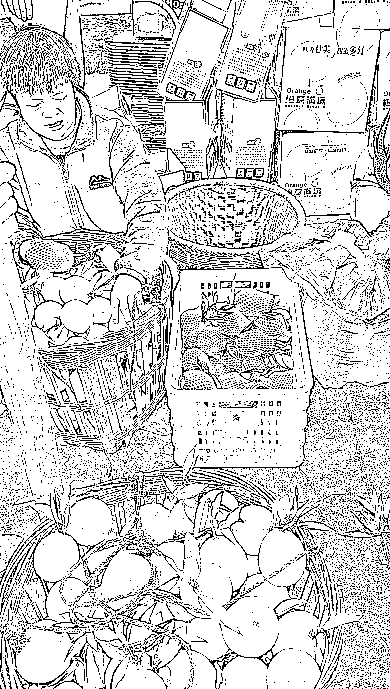
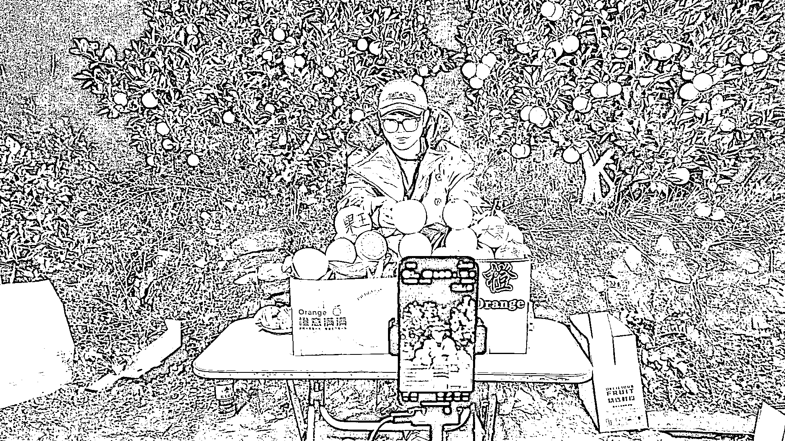

# 从抖音到视频号：探索平台背后的价值观与选择

> 原文：[`www.yuque.com/for_lazy/zhoubao/xhnuys77700icgz6`](https://www.yuque.com/for_lazy/zhoubao/xhnuys77700icgz6)

## (12 赞)从抖音到视频号：探索平台背后的价值观与选择

作者： 雷鸣哥

日期：2024-12-16

hi，大家好，我是雷鸣哥，技术出生的产品总监，产品全网注册用户几千万，目前在创业，也做副业，包括直播带货，AIGC 工具知识分享，职场，商业认知，IP 打造。

我目前已经直播超过了 500 场，之前核心阵地是抖音，直播超过了 80%，GMV 突破了 500w，现在全面开启视频号直播，口播短视频。我也是从口播短视频开始做，然后过渡到直播，单条口播短视频视频播放量超过 250w，涨粉 5000.

本次分享目录：

**一、为什么要从抖音转到视频号直播**

**二、视频号直播的几大要素详解**

**三、直播间搭建和主播话术设计要点**

**如下正文，enjoy:**

**一、为什么要从抖音转到视频号直播**

**从抖音到视频号：探索平台背后的价值观与选择**

在数字营销的浪潮中，抖音和视频号成为了两个不可忽视的平台。最早我们在抖音卖游戏机，还好赚了点钱，但是到后来基本不赚钱了，扣掉平台的投入之后，越来越卷，越来越卷，但今天，我不想站在批评者的角度，而是想和大家分享我眼中的抖音和视频号，以及它们最根本的区别。

**抖音的算法与价值观**

抖音的创始人张一鸣曾说过，今日头条（抖音的底层算法相同）没有价值观，推送什么内容完全由算法决定。这意味着抖音不引导也不迎合人性，它只是根据用户的喜好去推送内容。这种算法的中立性，使得抖音上的内容往往更加抓人眼球，满足了人们追求短期快感的需求。

**视频号的价值观与社交关联**

与抖音不同，视频号是一个有价值观的平台。它不显示粉丝量，点赞超过 10 万后也不显示具体数据，只有创作者本人可以看到直播在线人数，榜单数据不公开。这样的设计保护了创作者的创作动力，避免了无谓的比较和竞争。视频号鼓励创作者专注于内容本身，而不是被外界的数字所左右。

视频号的社交关联性也是一个显著的特点。在视频号上，每一个点赞和转发都能被社交圈里的人看到。这种透明度促使用户分享和点赞更积极、正面的内容，因为谁也不想在朋友面前展示自己内心的阴暗面。

**流量分配与商业化效率**

在抖音，流量和扶持往往集中在头部创作者，这导致了资源分配的不均衡。而视频号则力求流量和财富的平等分配，让每个创作者都能在这个平台上分到一杯羹。这种理念反映了视频号的价值观，即不以追求利益为唯一目标，而是注重长期的、可持续的发展。

**选择视频号的理由**

选择视频号，是因为它的价值观和对创作者的保护。视频号不以短期的流量和利益为导向，而是致力于打造一个健康、平等的内容生态。在这里，创作者可以专注于创作，而不必担心被算法和流量所左右。主要是不投流也给流量，虽然不如抖音早期那么猛，但是你持续播，就持续有流量，几百场观的自然流，还可以出单，也非常舒服了。

**二、视频号直播的几大要素详解**

1. 视频号市场分析

视频号已接触的账号覆盖美妆、服饰、包包、生鲜水果、农副产品、教育培训、家居百货等多个领域。这些类目在下沉市场显示出一定的市场潜力，尽管市场稳定性有所欠缺，但由于竞争较少，自然流量获取相对容易，利润空间较大，起号也相对简单。目前视频号的用户群体以 36 岁以上的用户为主，占比达到 60%，相较于其他平台，视频号在中年妇女这一群体中拥有更大的市场份额。

2. 选品策略

视频号的下单人群以二三四线城市的中年妇女为主，占比约 60%。因此，选品策略应围绕这一核心群体展开，包括老人保健滋补产品、儿童成长相关产品、中年妇女保养产品（如祛斑、补水、修复）、服饰以及家庭日用百货。选品时需考虑粉丝偏好、适合直播间的产品、应季好品以及近期热卖品。我们目前选品的是脐橙，不是我们选的品，是品选的我们，合伙人老家婆婆上山有几万几脐橙希望可以换一种模式销售，他们也能多赚点钱，我们正好转换过程，就去助农了。

3. 起号方式

视频号的起号方式主要包括福利品起号、鱼塘起号和正价产品起号。

**福利品起号** 通过低价商品吸引用户，建立信任后转为正价品销售。我们目前直播间设置了，脐橙的尝鲜装，10.9 元包邮到家的橙子。

**鱼塘起号** 利用已有的私域流量，通过微信群和朋友圈分享直播间信息，快速起号。我们自己每个人都转发自己的私域，公司 7-8 个人，加起来，私域 1 万多人还是没问题的。

**正价产品起号** 则适用于百货直播间，通过阶梯性涨价和付费推广进行，这一块新人目前不推荐。

Tips：目前很多人在玩的放歌挂福袋增粉玩法，其实也可以使用直播间早期。

4. 直播间人货场

视频号对直播场景要求较高，实景直播效果最佳，不支持动态绿幕，但可通过 obs 推流软件实现静态绿幕。主播需具备情感价值的体现，与抖音的慷慨激昂话术不同，视频号用户更偏好有生活阅历、能产生情感共鸣的主播。主播需要懂得转化和利用自然流量，因为视频号自然流量较多。

如上，是我们比较 local 的直播方式之一

当然打包发货的时候，也是直播场景之一，在视频号， 需要的是接地气，社交场景，都是朋友，需要更强的信任，真实感。

5. 视频号推流逻辑与考核数据

视频号的考核数据包括停留、互动、关注和观看成交，与抖音相似但考核度不同。停留 1 分 30 秒为及格线，关注数一般 10%以上，观看成交率 2%及格，点击成交转化率 25%及格。连续几天做好数据后，平台才会推送自然流量。按照以上数据做好之后，需要连续做几天数据平台才会给你推送自然流量，不是当天做好，第二天推送。目前视频号已经没有私域进入一个人，公域给你推送一个人的说法了。

6. 视频号店铺账号

视频号店铺已有浮动保证金和店铺分数，目前店铺分数未影响流量，但未来可能会与流量挂钩。店铺有优选联盟，类似于抖音的精选联盟，允许达人选品带货，目前仅限于企业店。产品上架需要报备，与抖音相似。店铺分为企业店和个体店，一个营业执照限开一个店铺，一个人可注册 5 个微信号，即开五个视频号小店。

目前视频号店铺已经全面升级成了微信小店，这个红利大家需要抓住，微信小店（原视频号小店）的升级和最新动态可以概括为以下几点：

**升级要求** ：微信小店要求所有商家必须从视频号小店升级，以享受更多功能和服务，否则将无法继续经营。自 2024 年 9 月 25 日起，未升级的店铺将影响新增商品上架。微信小店服务商将全面升级至微信服务商平台，享受全新升级的平台能力。微信小店推出了“微信小店成长中心”新站点，包含所有平台公告、规则条款等，以优化服务商体验并提升商家运营效率。

**多场景打通** ：微信小店可以打通微信搜一搜、公众号、视频号、小程序、直播等多个场景，提升小店权重，帮助商家获取更多微信公域流量。微信小店的升级意在依托整个微信生态打造统一且可信赖的交易体验，串联起整个微信的交易生态。

**系统升级** ：微信小店上线了新的客服系统，并逐步替代企微客服系统，提升商家的交易体验。微信小店助手 APP 已正式上线，支持商品管理、订单管理、营销管理、店铺管理、客服消息接待、数据分析等功能，帮助商家更好地管理店铺。

**相关数据增长明显** ：视频号直播带货的销售额同比增长超过 8 倍，GMV 规模增长显著。订单数量增长超 244%，客单价超过 200 元，显示出微信小店的带货能力和用户消费意愿的增强。平台公域购买转化率提升超过 100%，显示出微信小店在转化效率上的提升。女性买家超过 70%，说明微信小店在特定用户群体中的影响力。这些变化和数据点，都是衡量微信小店起号成功的关键指标

7. 视频号视频发布与投流

视频号明确禁止发布 C 类视频，A、B 类视频及人设、故事剧情视频受欢迎。视频挂车需满足 1000 有效粉丝和原创作品审核。短视频和直播有加热功能，可带来公域流量。视频号投流的主流工具就是微信豆，微信豆的投产比较高，可以直投直播间或素材。视频号的人群标签较泛，需要搭配浅层计划共同投放，如评论+商点+成交，以提高投产比，这一块，我们也还在实践中，投流是一门技术活，需要用钱喂出来。

Tips：ABC 类视频的解释：

**A 类视频** ：通常指的是高品质、具有一定专业性和知识性的内容。这类视频往往能够提供实用信息、专业知识或者教育价值，比如科普类视频、教学视频等。通常具有较强的信息价值和教育意义，能够吸引那些寻求知识或技能提升的用户。

**B 类视频** ：可能指的是生活化、日常化的内容，这类视频更加贴近普通人的日常生活，容易引起观众的情感共鸣。例如，生活记录、美食制作、家庭日常等，它们通常具有较强的情感价值和生活实用价值。

**C 类视频** ：可能是指营销性质较强或者内容质量不高的视频。这类视频可能包含过多的商业推广、广告或者被认为是低质量的内容。视频号平台可能会对这类视频进行限制，因为它们可能影响用户体验和平台内容的生态健康。

A 类视频强调的是知识性和专业性，B 类视频强调的是生活化和情感共鸣，而 C 类视频则可能因为营销性质过重而受到平台的限制。这些分类有助于视频号平台对内容进行管理和推荐，也帮助内容创作者根据视频类型优化自己的内容策略。

**三、直播间搭建和主播话术设计要点**

1、直播间搭建：之前已经讲到了，就是一个字，接地气，就是你卖什么的，就搭什么场景就行。不要整高大上的，大多数人也没有必要投入那个费用。

就在自己果园直播，是最节约的方式，就是冬天有点冷。根据你卖的产品，去设计就行，其实还有简单的办法，就是借鉴，去找 10 个同行直播间看看，找他们出单，转化高的，起号的时候借鉴着搭建就行了。当然，早期一定要严格控制成本，特别是我们三农产品，本身利润就很薄了。

2、主播话术设计要点

我们目前设置的话术大概分为 10 分钟一个循环，客单价比较低，50 块以内，用户决策成本也不高，也不会一直停留在直播间听你讲那么多。如果人多，生鲜类的产品展示逼单可能 2-3 分钟就完成了。

核心还是进直播间的观感和内容

第一，用户刷到直播间，看到水果新鲜，场景真实接地气，能立刻在大脑产生信任。

第二，听主播介绍 2-3 个卖点，确实不错。

第三，有一定的优惠和福利，单量比较紧张，有个小逼单设计，基本就下单了。

第四，有从众心理，类似的产品，一直有人直播间下单买也能带动其它人下单，所以有人针对这个专门设计了套路，甚至为了增强互动，还会设置一些套路。

好啦，今天就先写到这里，视频号相关以及视频号直播带货这个我后续我会持续给大家讲案例，讲真实实战细节。三农产品不容易，感谢大家的支持呀~

* * *

评论区：

夏俊虎 : 分享的很棒，👍🏻，补充一点，十月中旬开始视频号绿幕规则修改了，直播间可以放动态绿幕，但是不能占直播场景面积过大。具体的可以搜索看官方的动态绿幕规则指南。

雷鸣哥 : 谢谢～