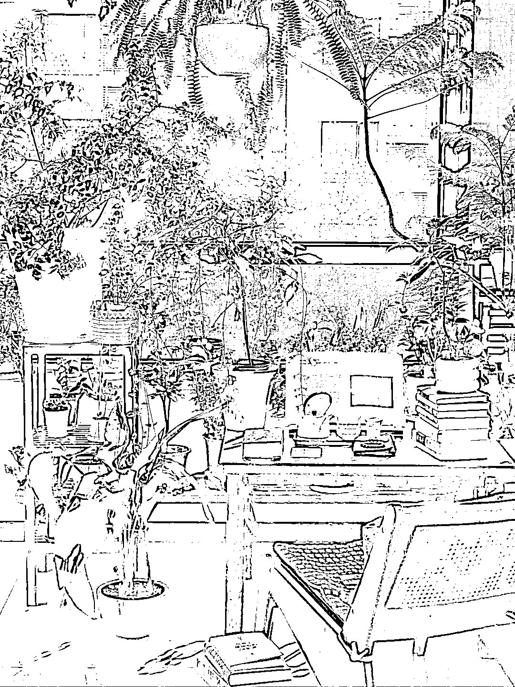

# 小红书 7.6 万粉了，一些掏心窝子的经验分享：

> 原文：[`www.yuque.com/for_lazy/zhoubao/tpccebzts653fes0`](https://www.yuque.com/for_lazy/zhoubao/tpccebzts653fes0)

## (47 赞)小红书 7.6 万粉了，一些掏心窝子的经验分享：

作者： 嘿柠檬

日期：2024-12-18

不知不觉 7.6 万粉了，还记得第一次盼望过万粉是在 3 前年，被封在家里时候，突然爆了一篇笔记。我盯着屏幕的数据跳动，直到 99+，点掉再继续，如此反复了好几次，终于迎来了万粉。

·

这三年多下来，我尝试了三个赛道，并且也都拿到了结果，涨粉 10W+，变现 50W+。一些掏心窝子的经验分享给大家：

·

·

1️⃣去行动，别犹豫

账号 2 万粉前，我给自己定位的就是读书博主，没有书桌，我就对着墙拍，没有书，就去图书馆边看边拍。不要让环境成为你的阻碍，在成为合格的博主前，先打败环境的限制，一切阻止你行动的理由都是“借口”。

·

2️⃣请考虑自己的爱好和擅长

做博主不是让自己从 0 开始，而是把自己可利用的资源和拿得出手的爱好发挥到极致。2 万粉前，我凭借着对读书的喜爱一直为爱发电，直到开始写运营笔记，数据和涨粉都有明显提升。没错，我原本就是运营出身啊，这是我的职业擅长，但之前一直被忽略掉了。

·

所以，做账号请优先考虑自己的职业擅长，爱画画的就去分享画画技巧或日常；爱种花的去做花园场景或绿植养护分享；爱喝茶的就更简单了，布置一个茶桌，边喝茶边带货；爱养生的，分享养生技巧，也可以带货养生产品；爱整理家务的，直接去做家居博主……

做账号的同时，结合自己的爱好的擅长，你会发现这条路顺畅又宽敞，赚得还多。

·

3️⃣把做自媒体当做一件顺便的事情

任何事情，一开始赋予它太大的意义，便会走得艰难而沉重。所以建议大家把做自媒体当做一件顺带的事情。

比如，你刚好要搬家/房子刚装修好，所以顺便做一个家居分享号；你上下班日常很有意思，或者纯属想吐槽，那就做一个职场日常号；你刚好喜欢书法，那就顺便分享书法练字日常；你刚好想赚钱，那就做一个搞钱存钱博主……

抱着顺带的心理去做，不是让你把账号当朋友圈发，而是给自己缓冲和适应的时间，这件事会走得更长远。

·

4️⃣要有自己的商业模式

明确做账号的目的——就是为了赚钱，要想赚钱，就要形成自己的商业模式。有人倒卖一份 29.9 的资料，到手 20 万；有人靠接广，赚了一套首付；有人做自己的线上咨.询，已经成为可以全职在做的事业。

那么你呢？有自己的变现模式吗？

* * *

评论区：

暂无评论