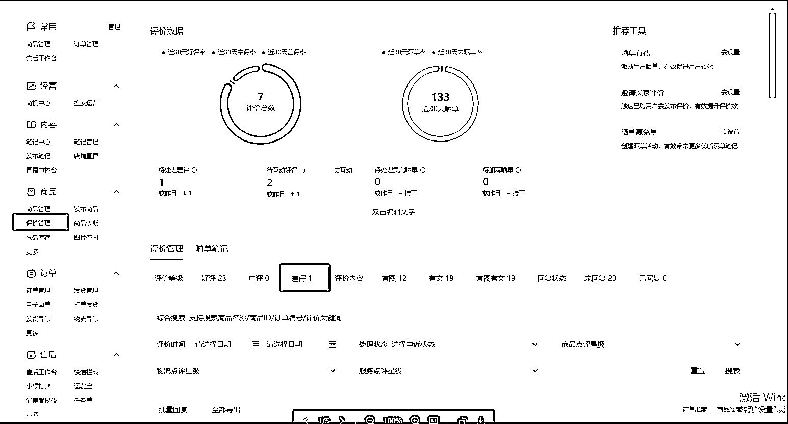
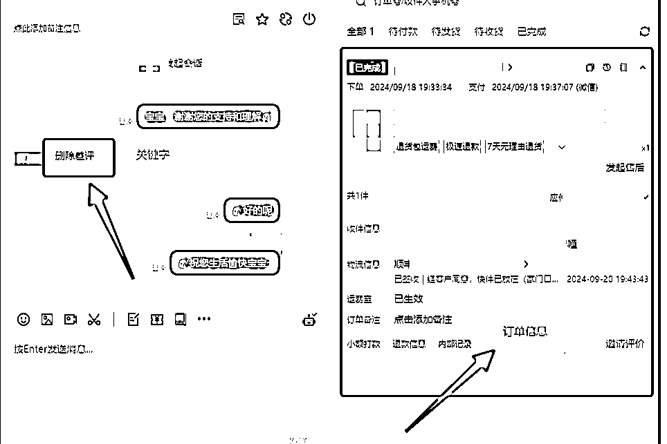
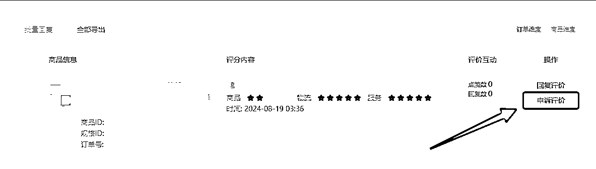
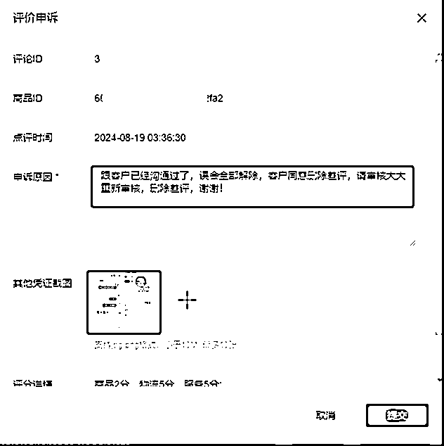
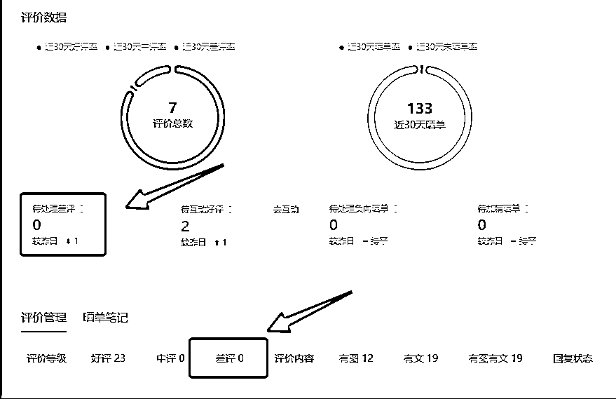

# 小红书商品购后差评处理办法 SOP 以及爆单的小 tips

> 原文：[`www.yuque.com/for_lazy/zhoubao/zocn0p0ig0zhyka5`](https://www.yuque.com/for_lazy/zhoubao/zocn0p0ig0zhyka5)

## (15 赞)小红书商品购后差评处理办法 SOP 以及爆单的小 tips

作者： 书豪

日期：2024-12-20

**大家好，我是在杭州的龙珠圈友书豪，是小红书店铺的航海教练。**

**小红书店铺的商家在爆单的路上，往往容易死在几个品质差评上面。**

**  **

**商品差评处理方法很简单，今天和大家分享一下。**

**  **

商品差评必须要重视，因为会影响单品和整个店铺的整体分数。

单品尤为明显，作为商家，最不愿意看到的就是自己辛辛苦苦经营的店铺被客户一个差评，影响后面的商品转化，轻则降分，重则店铺被判定负反馈限流，所以出现差评时要第一时间进行申诉干预。

中差评都会影响店铺评分（3 星以下含三星）

**一、如何查询差评**

**  **

**  **

**路径：千帆后台--评价管理--评价等级--差评**

**  **

**  **

**二、删除差评流程**

**  **

**  **

**1.电话联系客户沟通删除差评（一定要电话）**

**话术 1：**

**  **

您好，您是 XX 吗？我是 XX 店主，X 月 X 日您在我们小红书店铺买了 XX，我看您给我们了一个差评，很抱歉没能达到您满意，我们是非常看重客户体验的，所以今天给您打这个电话也是想问问您是对于我们哪里不满意呢？当然也想听一听您的建议，我们后面着重完善一下。

**话术 2：**

**  **

**  **

为了表示歉意，我给您补偿 10 元红包，您看可以吗？

为了感谢您的建议，我给您发个 10 元红包作为感谢，交个朋友。

**话术 3：**

**  **

另外还有一件事儿需要您配合我一下，我给您在平台上发个信息，您文字回复“删除差评“可以吗？

如下图（注意千万不要出现好评返现的字眼，正常沟通即可）

2.**点击【申诉差评】**

**  **

**申诉材料准备：** 与客户真实聊天记录（包含“删除差评”和订单信息）+申诉话术

**申诉话术：** 跟客户已经沟通过了，误会全部解除，客户同意删除差评，请审核大大重新审核，删除差评，谢谢！

**三、申诉通过后，差评会在后台隐藏，不会显示在商品评论区，评分可以恢复 5.0**

**  **

**  **

**四、小红书爆单的小技巧**

**  **

**  **

**1、在爆单的路上，你需要重视一下小红书的人工干预，重点去做笔记处于小眼睛增长的笔记评论区维护，可以去同行那里找一些高赞评论区。（朋友的活跃的号或者渠道商的资源都可以做）**

**  **

**2、重视封面的测试，把所有关于你这个品的 10 个点赞以上的封面都去测试一波。**

**  **

**3、关注最新的关于该品的爆款选题和爆款笔记模版去跟进。**

**  **

**4、重视差评的处理，别死在爆单的黎明前夕。**

**  **

**5、功效品多去铺关键词，小红书的搜索流量还是很香的。**

**  **

**  **

**以上，一起抢小红书年前的带货流量！一起生财有术！**

* * *

评论区：

景歌 : 引导用户主动删除差评也可以吧

更绪 : 申诉差评，P 图也可以，亲测 8 成通过率

书豪 : 是的，打电话

书豪 : 哈哈哈，还是你会玩